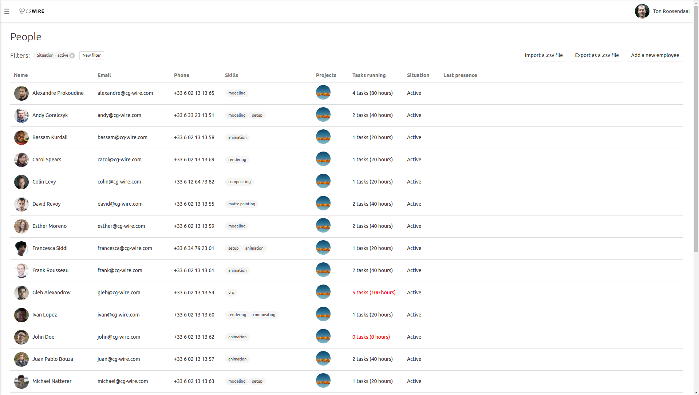
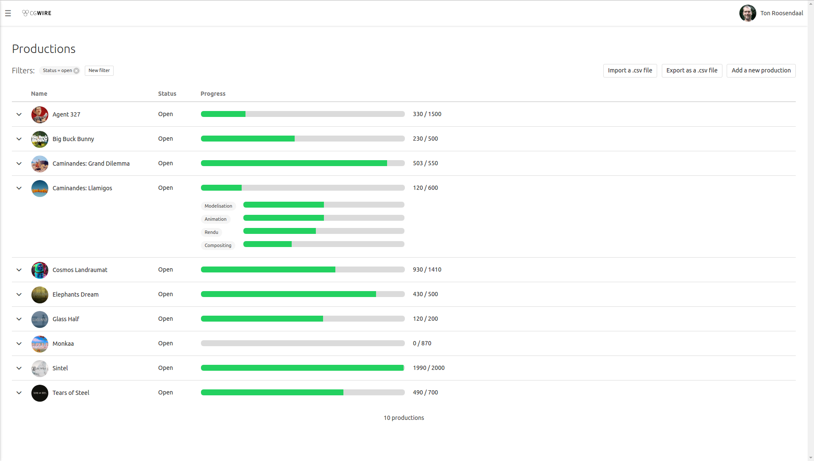
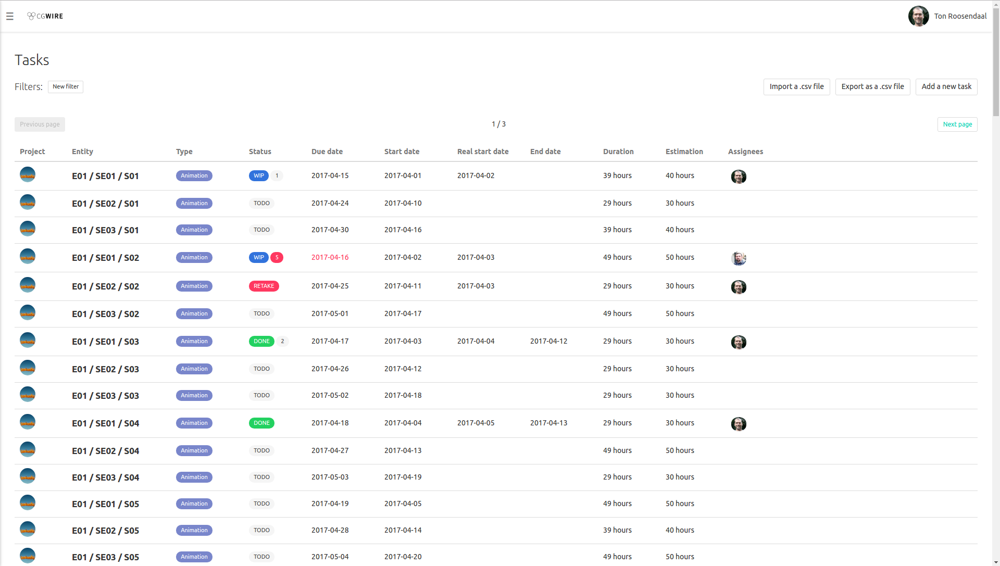
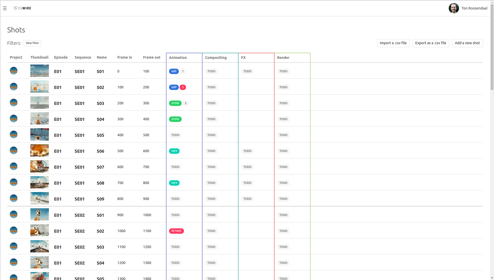

# Kitsu, CG Production Manager

Kitsu is a web tool to improve validation tracking in CG productions. By
offering a clean UI and a shared database, it allows you to communicate
efficiently with all the shareholders of the production: graphic designers,
TDs, supervisors and clients.

This application is still a work in progress. To be kept up to date of incoming
releases follow our [blog](https://medium.com/@cgwire).

## Main modules

We already have mockups of the user interfaces. We share them in this section.
Feel free to drop us [an email](mailto:contact@cg-wire.com) to tell us what you
think about it. 

### People

This is the list of the people involved in the studio.

### Productions

You will find an overview of your production in this module.

### Task List

The list of all the tasks to assign.

### Shot overview

A screen to quickly know the state of all your shots.

### Validation

The history of all discussions about the validation of a task.

## Source code

Kitsu is free and open source. All the code is available on
[Github](https://github.com/cgwire/kitsu).

## About authors

Kitsu is written by CG Wire, a company based in France. We help small to
midsize CG studios to manage their production and build pipeline efficiently.

We apply software craftmanship principles as much as possible. We love coding
and consider that strong quality and good developer experience matter a lot.
Our extensive experience allows studios to get better at doing software and
focus more on the artistic work.

Visit [cg-wire.com](https://cg-wire.com) for more information.

