# Getting Started With Kitsu

With Kitsu, users can track various production projects, encompassing 2D and 3D production, VFX, video games, and other related endeavors.

The content tracked by Kitsu can be as simple as still-frame advertisements, to extensive 3-hour feature films, accommodating projects with varying numbers of elements

But before jumping into our production, we must first configure our **Studio Workflow**.

## Studio Workflows

### Understanding Studio Workflows

::: warning Definition
A workflow is defined as the structured coordination of tasks constituting the operational processes within a production.
:::

For example, within a CGI production, tasks such as modeling, rigging, and shading are undertaken to finalize an asset.

::: warning Definition
- Processes such as modeling, shading, etc., are referred to as a **Task Type**.
- An individual objects such as asset, shot, etc., are called **Entities**.
- A **task** can be defined as a specific action or activity that needs to be done. Tasks can be attributed to **entities** and will usually be categorized with a **task type**.

:::

Entities with corresponding tasks form foundation of your asset workflow. Each task will then be assigned to an artist. Once you have determined your assets workflow, you will do the same for the shots, sequences, etc.

Once the workflow for tasks is defined, the next step involves establishing an **Approval Workflow**, which entails defining all the statuses utilized for communication within the team. Statuses will also be useful for tracking the progress of your production.

The **Workflow** of your production is the sum of your Tasks and Status.

### Global Library VS Production Library

In Kitsu, you have two kinds of **libraries**:
- The first is the **Global Library** at the studio level.
Only the Studio manager has access to it.

- The second is the **Production Library**, where you will pick elements created in the global library to fill out.

The idea is to keep each production separated with a specific workflow.


Your **Global Library** is where you can create and modify departments, task types, task statuses, asset types, and status automation. You can create as many elements as needed, name them as you wish, and select the best colors and options to suit your needs.

Once your **Global Library** is populated, you can fill out the **Production Library** with the newly created elements from the **Global Library**.

## Departments

### Creating Departments

Departments are designed to help supervisors and artists focus on their tasks. Once a user is linked to one or more departments, supervisors and artists gain direct access to a filtered view of all tasks associated with that task type. Departments are also used to define what metadata columns appear for users within that department.

If a metadata column is linked to a department, then they will only show up for users in that department. If a metadata column is not associated with a department, they will show up for everyone.

::: tip
By default, Kitsu provides some example departments to help you get started.
:::

Defining your studio's Departments is typically the first step in setup, as multiple objects such as people and task types are linked to a department.

On the main menu  select the
**Department** page under the **Admin** section.

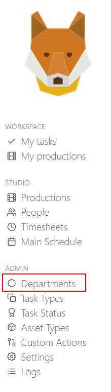


If you need to create more departments, you can click on the 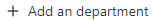 button.

When adding a department, you need to define:

- The name of the department
- A color (it will be displayed as a small round circle next to a column task type or a custom column)

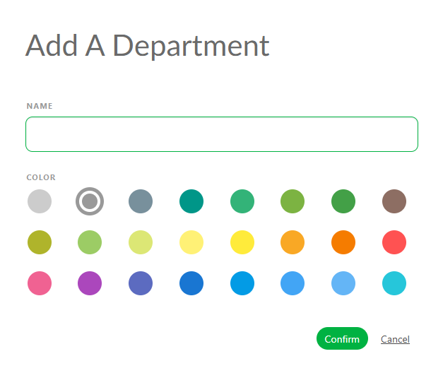

Click on **Confirm** to save your changes.

Once you finish creating the department, your page should look like this. Whereby each department has a unique name and corresponding color.

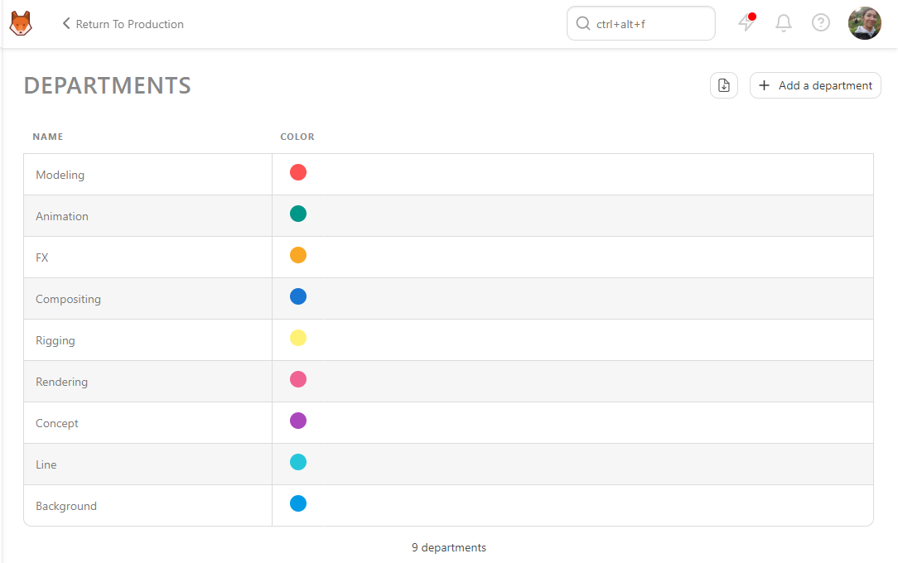


## Task Types

### Creating a New Task Type

Next, let's create all the **Task Types** needed to manage and track our production. Task types could be associated with multiple entities such as assets, shots, sequences, episodes, or edits.


From the main menu  select
the **Task Types** page under the **Admin** section.

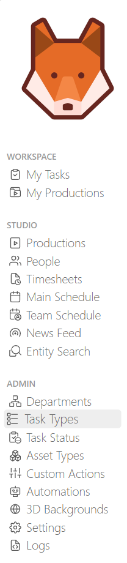

::: tip
By default, Kitsu provides some example task types that can be used for a CGI production. You can rename or remove any that are not relevant to your production.
:::

You will notice that these **Task Types** are already linked to a department.

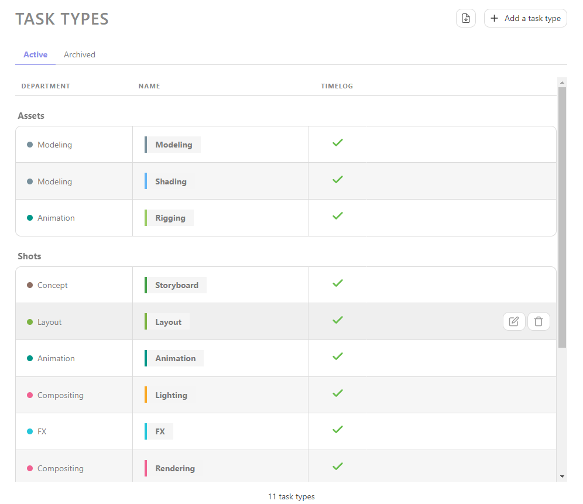

You can click on the 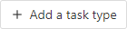
button to create new **Task Type**.

Next, you will need to supply some information about your task type, including:

- The name of the task type
- If team members need to time log their work for tasks with this task type
- For which entity it will be used
- To which department it should be linked
- The color (this will be reflect in the background color on the main spreadsheet page)

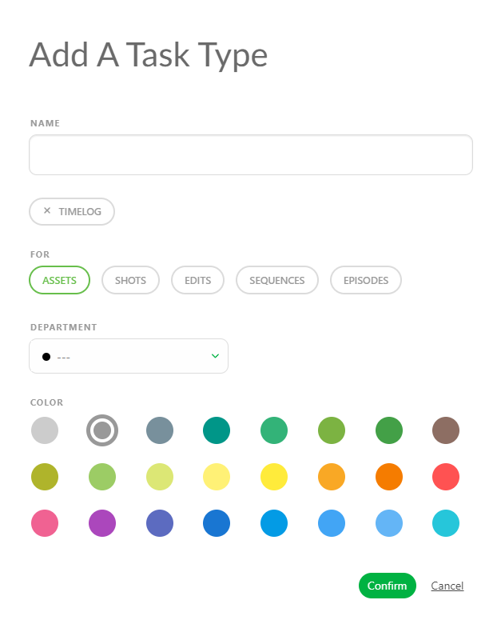

You'll notice that the **Departments** we created previously are available as an option to link task types to. Connecting a department to a specific task type can help your team stay organized.

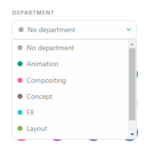

Click on **Confirm** to save your changes.

::: warning
Newly created task types will appear at the bottom of the list
:::

To adjust the order, simply click on the **Task Type** and drag it to its appropriate position in the list.


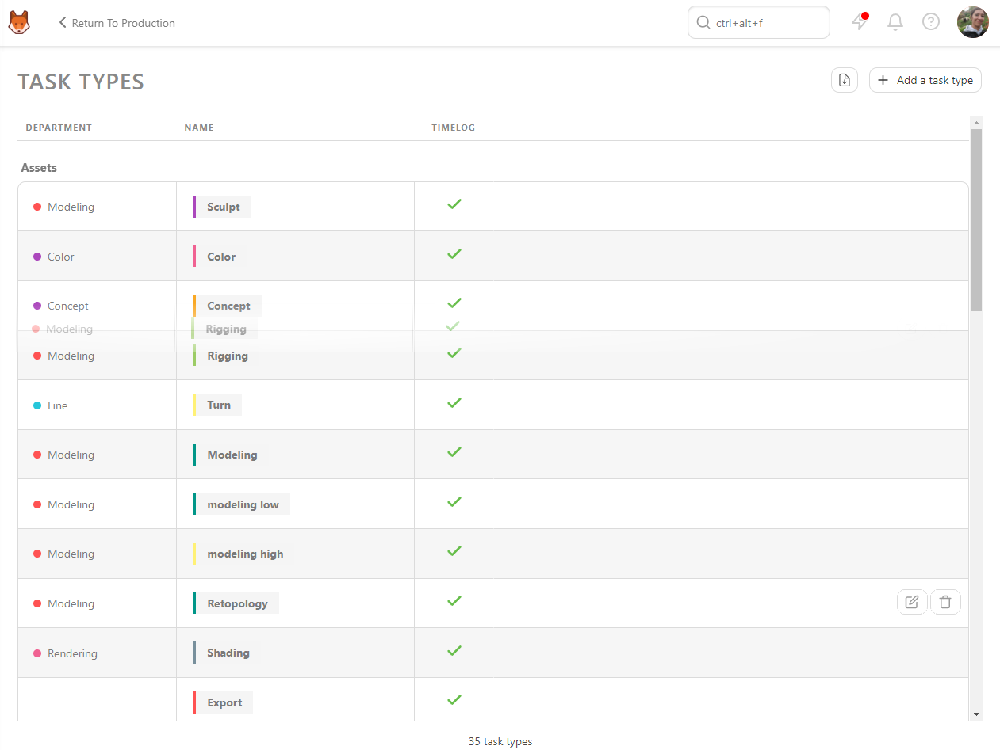

Congratulations, your task type has now be created in your **Global Library**.

::: warning
Once you have created your production, you need to add the **Sequence**, **Episode**, and **Edit** task types to your **Production Library**.
:::

::: tip
At any point during production, you can revisit this section to create additional **Task Types** as necessary and add them into your workflow.
:::

## Asset Types

### Define Your Asset Workflow

Once you have created your global Workflow, you can then define your **Asset Types**

Much like how shots can be organized by a sequence, an asset can be organised by it's **Asset Type**. Think of it as using folders to organize all your assets by category.

On the main menu  select the
**Asset Type** page under the **Admin** section.

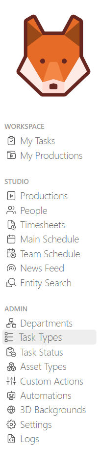

::: tip
By default, Kitsu provides some example asset types that can be used for a CGI production.
:::

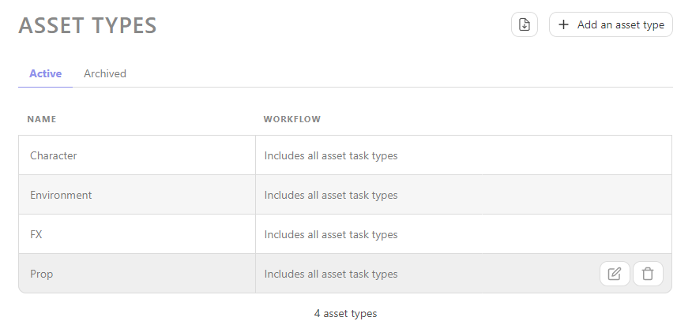

To create new **Asset Type**, click on the 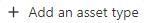 button.

Next, you will need to supply some information about your **Asset Type**, including:

- The name of the asset type
- A workflow for the specific asset type

Different Asset Types will have distinct workflows. For instance, you might have fewer tasks for an Environment compared to a Character, as Environment assets typically don't require Rigging tasks.

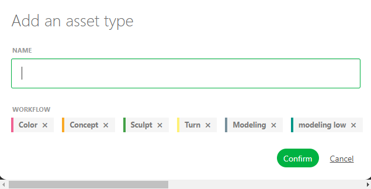

When you **create** or **edit** an **Asset Type**, you can add a specific **task type**; if you don't select a specific workflow for this asset type, your production asset workflow will be applied.

However, if you choose specific Task types for this Asset type, only these will be applied to production.

Click on **Confirm** to save your changes.

Your new **Asset Type** is now created in your **Global Library**. It will be available to use when you create your production.

::: tip
At any point during production, you can revisit this section to create additional **Asset Types** as necessary and add them into your workflow.
:::

## Task Statuses

### Define Your Approval Workflow

Next, let's create the statuses we intend to use during our **Approval Workflow**.

On the main menu  select the
**Task Status** page under the **Admin** section.

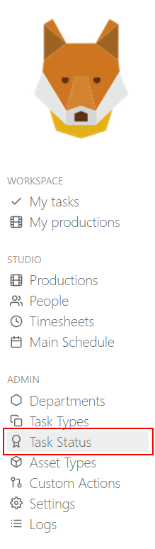

::: tip
By default, Kitsu already provides some examples Statuses.
:::

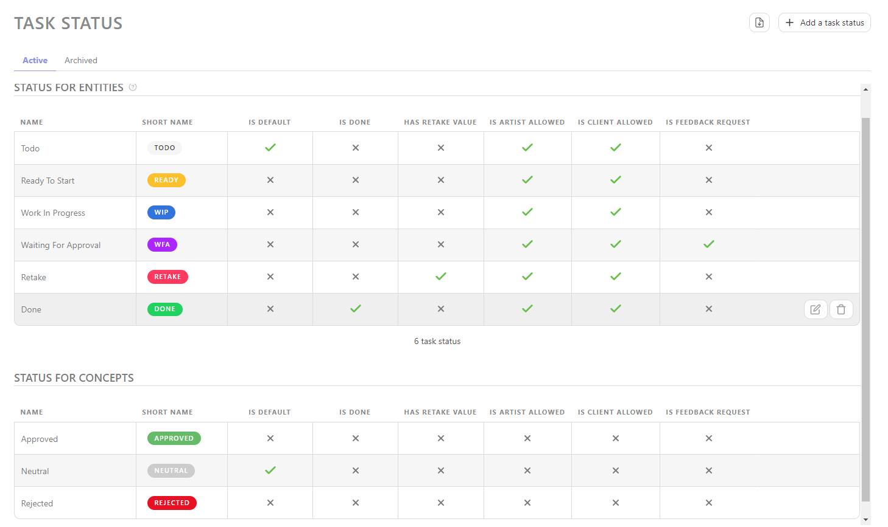

A status represents a specific stage or condition that a task or must pass through as part of the review and approval process.

For example, the **Ready**  status indicates that the artists have everything they need to start working and should not begin their tasks without reaching this status.

**WIP** : The **Work in Progress** status is used by artists to inform their team that they are actively working on the task, indicating that there is no need to assign it to someone else.

**WFA**: The **Waiting-For-Approval** status is used by artists to notify their supervisors that they have completed their work and are awaiting review. Supervisors can also use a similar status to inform directors that work is ready for review.

**Done** : The **Done** status indicates that all work has been completed & approved. This indicates that the current task is complete and the next step in the process can commence.

**Retake** : The **Retake** status indicates that a comment has been made, prompting the artists to continue working on their task and publish a new version until validation is achieved.

These **statuses** are just examples of what is achievable in Kitsu. You are free to create your own as needed.

To do this, from the main page, click on the 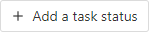 button.

You'll then need to define some details about you **Task Status**, including:

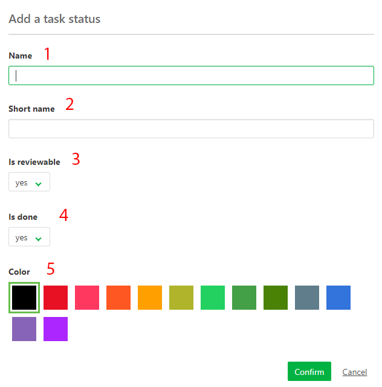

- **NAME**, the explicit name of the status that will be displayed when you hover your mouse over it in the.
- **SHORT NAME**, what will be displayed in Kitsu.
- **IS DEFAULT**, the first status that Kitsu will display by default on all tasks. You can only have **ONE** default status in Kitsu.
- **IS DONE**, if this status is utilized to validate a task (which is beneficial for quota management, organizing the to-do list, and updating episode statistics).
- **HAS RETAKE VALUE**, if this status is used for commenting on a task (helpful for tracking the back-and-forth discussions on the task type page and for the episode stats page).
- **IS ARTIST ALLOWED**, are artists allowed to set tasks to this status? If **No**, the artist won't see this status in their list of available statuses. However, they can still post comments on it.
- **IS CLIENT ALLOWED**, Can the client use this Status? If **No**, the client won't see this status in their list of available statuses.
- **IS FEEDBACK REQUEST**, if this status is used to request a review (helpful for quota tracking if you don't use a timesheet, it will appear in the Pending tab of the to-do list, and all these statuses will be grouped on the **My Check** page. Kitsu will prompt you to **publish a preview** each time you use this status).
- Finally, choose a background **color** you prefer for this status.

Click on **Confirm** to save your changes.

Your **Status** is now created in your **Global Library** and will be available to use in your production.

::: tip
At any point during the production, you can return here and create more **Task Status** if needed,
and then add them to your production.
:::

::: warning
You'll notice a few tasks statuses listed under the category of *Concept Status*. These are used by the system and while you can modify them here, you cannot create new ones.
:::

## Automation

### Create a New Status Automation

A **Status Automation** defines rules or conditions that automatically trigger changes in the status of tasks based on predefined criteria. You can set up **Status Automation** for both asset and shot tasks.

For assets, you can establish **Status Automations** between tasks. For example, when the concept task status is set to `done`, the downstream modelling task status is automatically changed to `ready`.

Additionally, you can create **Status Automations** that update the **Asset Status** based on task statuses. For example, when the concept task is set to `done` , then the linked asset status is set to ``layout``.

::: tip
You can also ask Kitsu to **copy the latest preview** with the Automation.
:::

Go to the main menu   and select **Automation**.

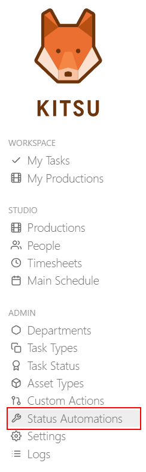

From this page, you can create **Status Automations** by clicking the **+Add status automation** button.

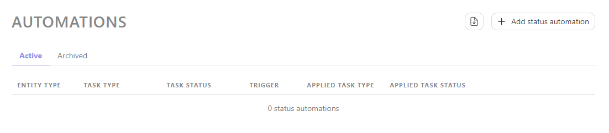

You have the option to create **Status Automation** for either the **asset** or the **shot**.

Next, you can select the **task type** and the **status** that will trigger the Automation.

You can specify which **Task Type** will respond to the Automation and select the **Status** that will be changed.

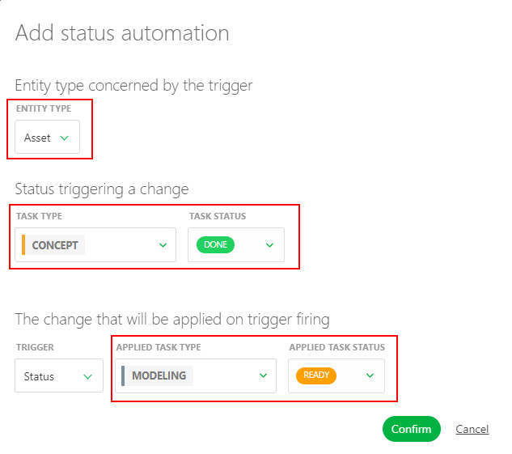

You need to change the trigger from "Status" to **Ready For** in order to initiate the change in **Ready For** status.

You will notice the **Applied Task Type** will now display **Shot task type**.

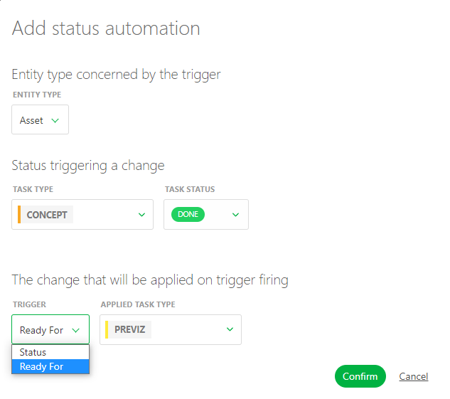

To create a **Status Automation** for shots, you must change the **Entity Type** to shots.

Your new **Status Automation** is now created in your **Global Library**.

::: warning
You must add status automations to your **Production Library** once you have created your production.
:::

::: tip
At any point during the production, you can return here and create more **Status Automations** if needed, and then add them to your production.
:::

## 3D Backgrounds

### Create a Global Library of HDR Files

The 3D Backgrounds feature enhances your review of 3D files (`.GLB`) by incorporating an `.HDR` background to make things easier to review.

The `.GLB` file format is a binary container that encompasses various 3D assets and resources. These assets may comprise 3D models, textures, materials, and animations.

::: warning Definition
It means you can review your 3D files with lighting information.
:::

In this section, you can create your own. `.HDR` files library that you can use in your production.

Go to the main menu , and select **3D Backgrounds**.

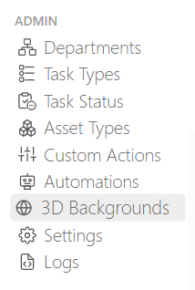


From here, you can add a `.HDR` Background by clicking the **+Add a new background** button.

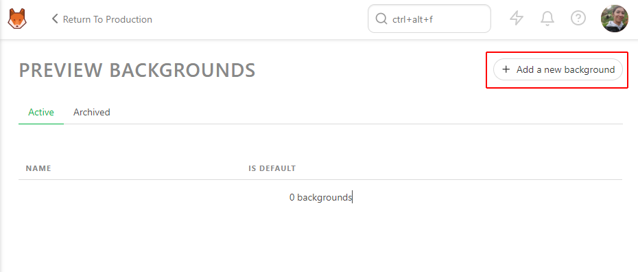


From this point, you'll need to select your `.HDR` background, provide a name for it, and decide whether you want this `.HDR` to serve as the default background.

::: tip
Checking the `Is Default` option means this HDR will be applied across your entire production instead of the default grey background.
:::

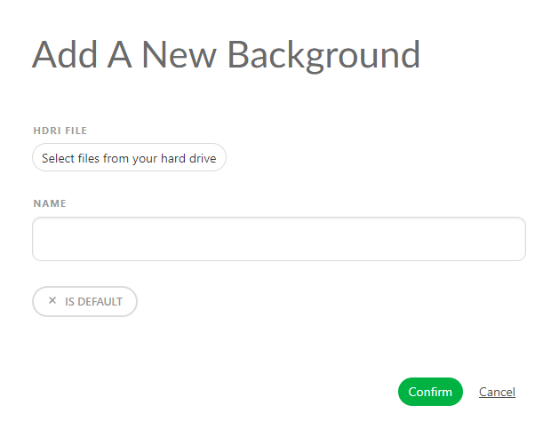

Once you have uploaded all your `.HDR` files, Kitsu will display them as a list.

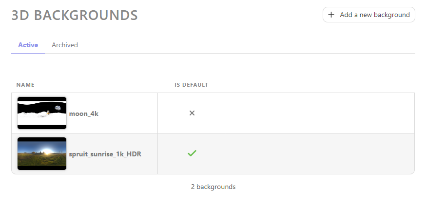


Your new **3D Background** is now created in your **Global Library**.

::: warning
You must add them to your **Production Library** once you have created your production.
:::

## Asset Library

### What is the Asset Library?
The Asset Library serves as a centralized repository for all assets used within Kitsu. Teams can import assets from any project into a shared library, making them accessible for future productions. With this functionality, assets like character models, props, environments, and more can be managed in one place and repurposed seamlessly in new projects.

### How to Use the Asset Library

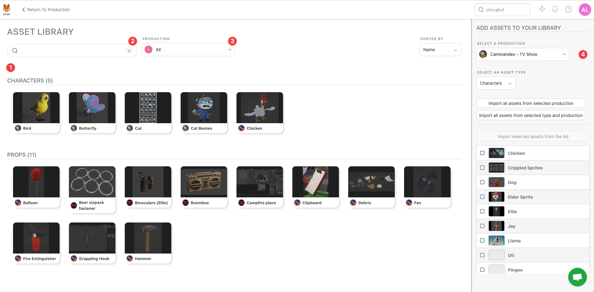

- You can access the Asset Library from the **Studio** section of the main Kitsu menu.
- The main Asset Library window displays all assets currently available in the library (1). Use the search (2) and filter (3) options to quickly find specific assets within the library.
- On the right-hand pane (4), you’ll find the import option for bringing in assets from other productions into the Asset Library.

### Adding Assets to the Library

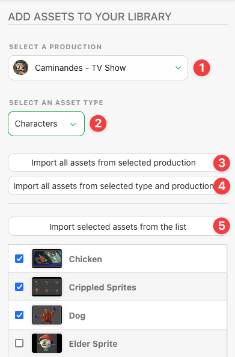

The right-hand pane is where you can add existing assets from other productions into the library. This action does not create a copy but simply references the original asset, allowing it to be used in other productions.

To import an asset:
- Select the production you wish to import the asset from (1).
- Choose the asset type you’d like to import (2).

There are three main ways to import assets:
- Import all assets from a specific production (3).
- Import assets by type from the selected production (4).
- Select individual assets for import (5).

Once imported, the asset will be available for use in breakdowns for other productions, allowing for efficient asset reuse across projects.

::: tip
There are specific rules around who can import assets into the asset library, depending on the user’s permission group:

- **Studio Manager**: Can import any assets from any production.
- **Production Manager**: Can import assets only if they are part of the team.
- **Supervisor** and **Artist**: Cannot import assets into the library.
:::

## Settings

### Configuring Kitsu

Several global settings can be configured that apply to your studio, such as replacing the default Kitsu logo with your studio's logo.

To do this, click on the main menu button
, then under the **Admin** section, click on the **Settings**.

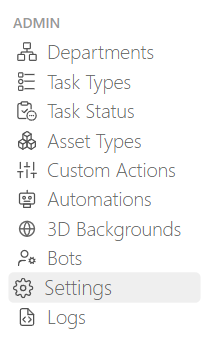

### Studio Settings

Click on the **Set studio logo** and select an image to use. This will replace the Kitsu logo on your site and in various places across the app. You can also change the **Studio Name** to be used in your Kitsu instance.


The remaining settings on this page are global settings that affect every production. Some of these include:

- How many hours per day should your team be working.
- You can opt to use original file names for downloads.
- Display images in HD quality by default. Use this option only if you have a very fast internet connection.
- Regarding the timesheet, you can also restrict artists from modifying timesheets older than one week.

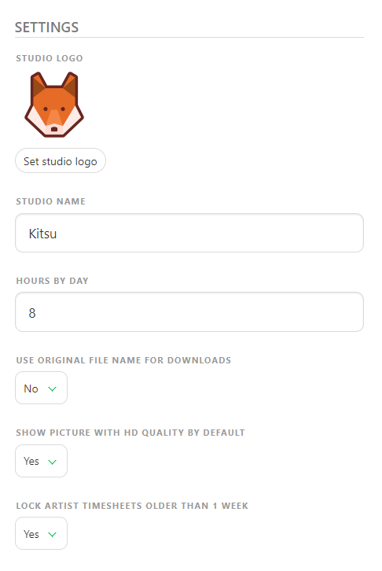

Finally, you will also find settings relating to various chat integrations. Please refer to [Chat Integration](../chat-integration/README.md) section for more information on how to configure this.

::: warning
Remember to **Save Settings** at the end once you are finished.
:::

# Preparing Your Team

Now that you have defined your workflow, it's time to organize your team so you have people to assign tasks to.

We will learn how to add users to Kitsu, link them to departments, grant them permissions, and finally, add them to a production team so that they can begin working.

## Creating Users

### Creating Users and Linking Them to Departments

To assign tasks to people, you first need to create an account for them in Kitsu.


::: warning Definition
As with other aspects in Kitsu, there are two libraries for users:
- The **People Page** (Global Library) is used to determine users' permissions, contracts, and departments they belong to.
- The **Team Page** (Production Library) is used to define who is working on a project and provide access to the production.
:::


Go to the **Main Menu** , and under the **STUDIO**
section, choose **People** page.

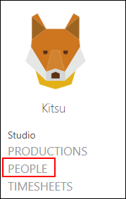

Then, click on the 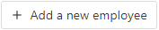 button.

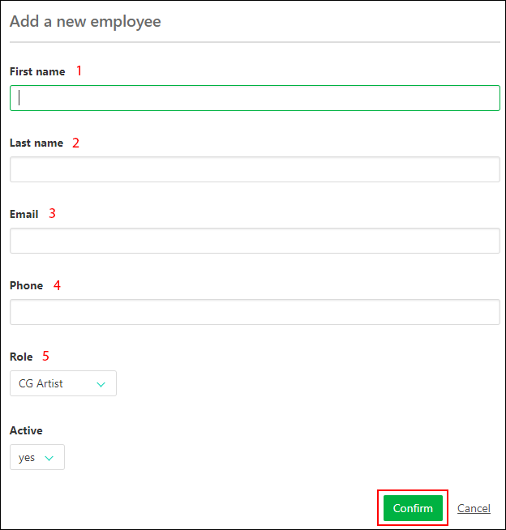

You will then be prompted to enter the following information: (please note from of the fields are required in order to create the user)
- 1) First Name (**MANDATORY**)
- 2) Last Name
- 3) Email (**MANDATORY**)
- 4) Phone Number

::: danger Important!
An email address is **mandatory** and must be unique in order to create an account.
:::

- 5) You can specify one or multiple **Departments** to link a user to.

Being assigned to a Departments will also affect what shows up on the **My Checks** page, displaying only tasks related to your department.

Finally, the timesheet page will be filtered to only tasks within your department as well.

::: details Some more details about Departements
Once a user is linked to a department, various options will become available to them. For example, they will have direct access to their department's view on the global homepage.

The department supervisor will be able to comment on all tasks within their department and assign tasks only to people from the same department(s).

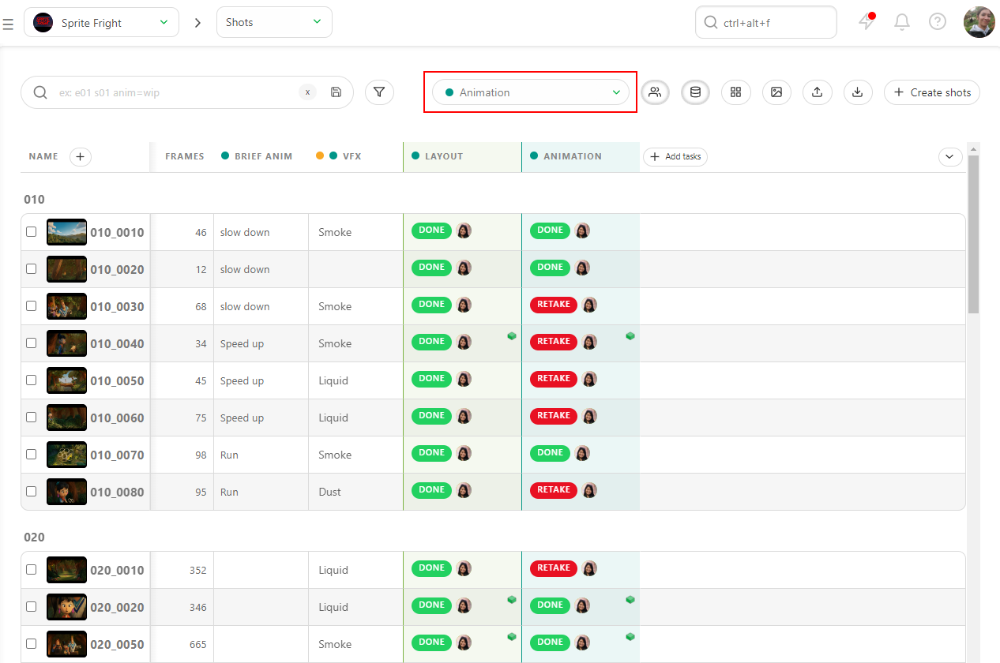
:::

- 6) Role: This is where you will define the permission role of the user (this will be explained below).

- 7) Active

This section lets you choose whether to activate users immediately. If the user needs immediate access to Kitsu, set this to **yes**. However, there might be instances where you want to create a user but are not ready to give them access to Kitsu (for example, if you want to schedule tasks for an artist who is due to start work in two weeks). In this case, you can create and schedule the user, then simply enable them once they start.

::: danger Important!
Each user requires an individual account to log in to Kitsu.
:::

## Permission Roles

### Understanding Permission Roles

::: warning Definition
A permission role defines a set of access rights and privileges granted to a user within a system or application, dictating what actions they can perform and what resources they can access.
:::

Roles are very important, so it's useful to understand what each of them does and which ones might be relevant to specific team members. Click into each of the sections below to learn more about each permission role.

- **Artist**
::: details Artist Permissions
Artists can only access the productions they are part of. They can comment on tasks, upload media, and change statuses only on tasks that have been assigned to them. Their access is limited to a predefined set of statuses as determined by the Studio Manager.

**They can:**
* Create personal filters on the global page and Task Type page.
* Edit their own comments.
* Check the checklist on their assigned tasks.
* Create playlists-on-the-fly for shots or assets, but won't be able to save these playlists.

**They cannot:**
* See client comments.
* Access anything inside of projects that they haven't been assigned to.

When an artist logs in to Kitsu, the first page they will see is their **My Tasks** page.

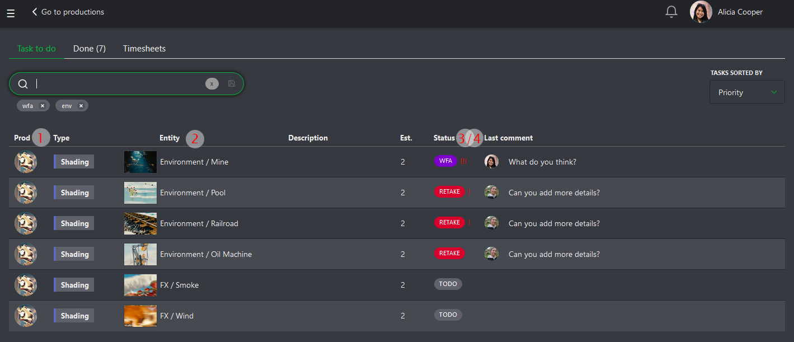
:::

- **Supervisor**
::: details Supervisor Permissions
Department supervisors inherit Artist permissions.

Department supervisors have read and write access to their department(s) they work on:
assets, shots, tasks, assignments, statistics, breakdown, and playlists.

**They can:**
* Assign tasks to their team artists (same department).
* Post comments on all tasks or their department(s).
* Check a checklist in their own department.
* Pin a comment.
* Edit their own comments.
* Add/edit a playlist for the studio or the client.
* See client comments and validations.
* See comments from other departments.
* View the timesheets of their team department(s).

**They cannot:**
* Access the studio team, the main timesheets, and the production list
* Define task types, task statuses, and asset types.
* Comment on other departments than theirs; they can't assign artists from other departments.
:::

- **Production Manager**
::: details Production Manager Permissions
Production managers inherit Department supervisor permissions.

Production managers have read and write access to the productions they are assigned to, including
assets, shots, tasks, assignments, statistics, breakdowns, and playlists.

**They can:**

* Create assets and shots, either manually or through a CSV batch import.
* Post comments on any tasks within the production.
* Edit any comment within the production.
* Check any checklist within the production.
* Pin any comment within the production.
* Add a task column.
* Delete or add a task.
* Add/edit a playlist for the studio or the client.
* See client comments and validations.

**They cannot:**

* Access the studio page, the main timesheets, and the production list.
* Define task types, task statuses, and asset types.
:::

- **Studio Manager**
::: details Studio Manager / Administrator Permissions
A Studio Manager acts in the same way as an Administrator, having read and write access to all productions and settings within Kitsu. Some of their privileges include:

#### Create and edit a production

The Studio Manager can create a new production, define its type, FPS, ratio, and resolution, and add a cover picture. They can also edit and delete any production.

#### Manage the studio

The Studio Manager has access to everything in the studio, including:

* Read / write access across all the productions
* Access to the global timesheets page
* The ability to view all people in the studio
* Access to the main schedule

In the People page, The Studio Manager **defines the permission role of each user**.

They can also:

* Customize global aspects of Kitsu: for example adding and modifying task types, task statuses, and asset types.
* Set permission roles
* Customize high-level studio information, such as customizing the studio name adding the company logo, and defining the number of hours per day of work etc.
* Choose to use the original filename for downloading media.

#### Manage productions

They have full access to all productions on your Kitsu site. Additionally:

* They have the same permissions as the supervisor.
* They can add / delete a task column.
* They are allowed to create custom metadata columns.
:::


- **Vendor**
::: details Vendor Permissions
Vendors have similar permissions to artists. The main difference is that while an artist can still see tasks in their production (though they can only edit tasks assigned to them), a vendor can only see and edit tasks that they are specifically assigned to. Everything else that is not assigned is hidden.
:::

- **Client**
::: details Clients Permissions
The client can only see the production of which they are part of.

**They can:**

* Access the global page of the assets/shots.
* Access the stats pages.
* Access Client playlists with limited access to task status when they post a comment

**Note**
* Only Supervisors and the Studio Manager can see the Client retake or validation status.


**They cannot:**

* See task assignments
* See comments that they didn't write
:::


::: details Add Employees from a CSV Spreadsheet File

You may already have your employee list ready in a spreadsheet file. With Kitsu, you have two ways to import them: importing a `.csv` file directly or copy-pasting your data directly into Kitsu.

First, save your spreadsheet as a `.csv` file.

Then, go back to the People page on Kitsu and click on the **Import** icon.


A pop-up window **Import data from a CSV** will open. Click on **Browse** to pick your `.csv` file.

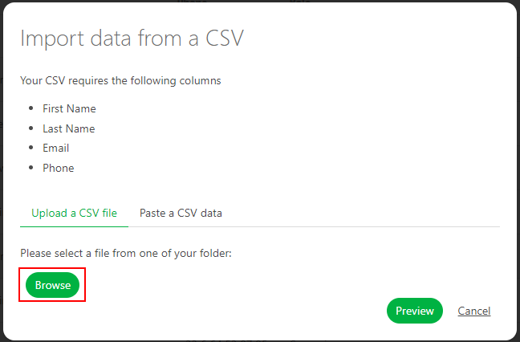

To see the result, click on the **Preview** button.

You can check and adjust the column names using the preview of your data.

**Note:** The **Role** column is not mandatory.

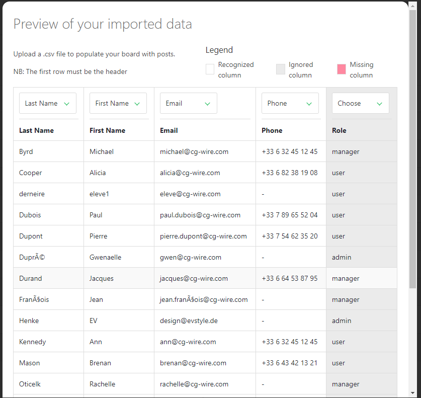

Once everything looks good, click on the **Confirm** button to import your data into Kitsu.

Now, you have all your people imported into Kitsu.

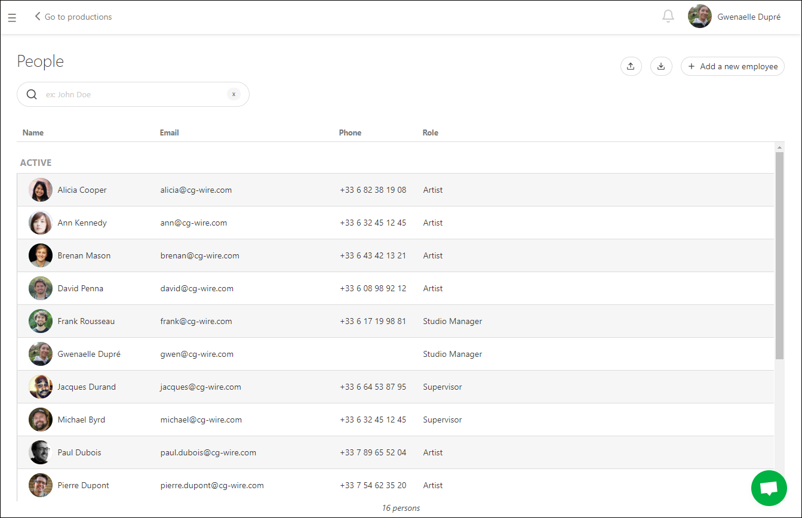

:::

## Two-Factor Authentication

### Add Additional Security to Your Studio

**Two-Factor Authentication** provides an additional layer for security for users logging in to Kitsu. It can be enabled on a per-user basis, so you can decide for which users it is enforced.

To enable this, click on their avatar at the top right of the screen, then select **Profile**.
At the bottom of the page, they will find various **Two-Factor Authentication** options.

### Available Two-Factor Authentication Methods

- **TOTP**: This lets you use a Two-Factors Authentication app as a secondary password for your account. Selecting this option will present you with a QR, that once scanned into your 2FA app of choice, will prompt you for a one-time code each time you login.
- **OTP Via Email** Similar to TOTP, but instead of using an app the 2FA code is sent to your email address
- **FIDO Device** A FIDO device refers to a hardware security key that supports the FIDO (Fast IDentity Online) standard for two-factor authentication (2FA). If you own one of these devices, you can input it's name here to be used for Two-Factor-Authentication

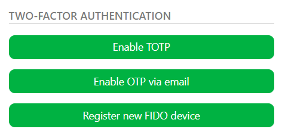

## Adding Users to the Team

Once you have created your production, you need to add users to the production's team to allow them access. Being part of a team also allows tasks to be assigned to you.

::: tip
You don't need to add the Studio Manager role to a team to give them read permission (since this role will have access to it anyways). However, if you want to assign them tasks, they will need to be added to the team.
:::

To add users to a team:

1. On a production, use the **navigation** dropdown menu at the top of the page and select the **TEAM** page.

   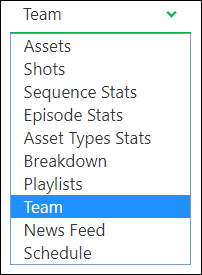

2. On the **Team** page, you can see all the assignees for a specific project. Switch to the top of the page if you want to check another project team.

   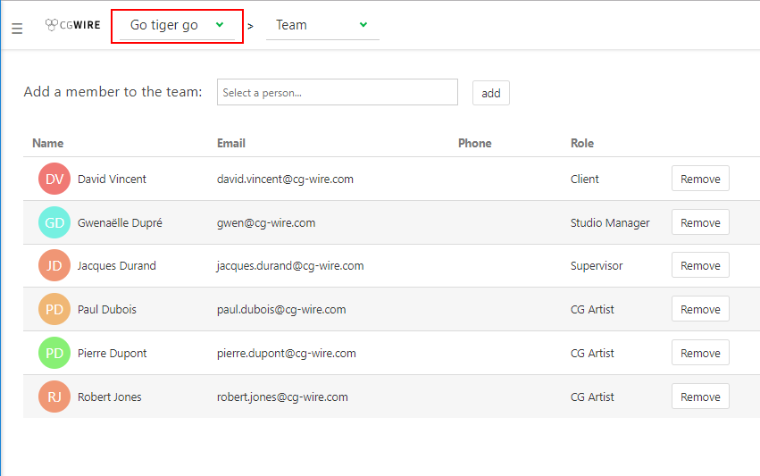

# Create Your Production

# Create a TV Show Production

Now that you have designed your workflow in Kitsu and invited additional team members, it's time to create your production.

Click on the **Create a New Production** button.

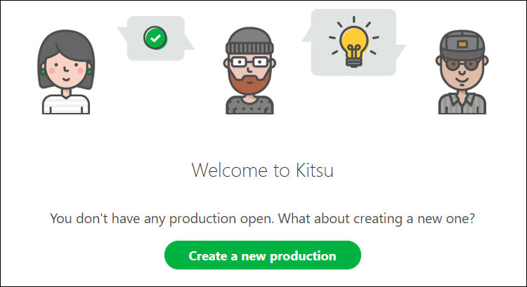

Enter your production name, choose **TV Show** as the **type**, and select the style of your production (2D, 3D).

Next, fill in the technical information, such as the number of FPS, the aspect ratio, and the resolution.

::: warning
All this data will be used when Kitsu re-encodes the video previews you upload.
:::

Next, define the start and end dates for your production.

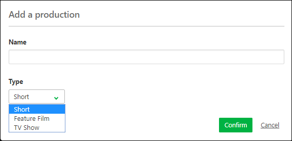

You can define your production workflow in the next part, 3 to 6.

You need to select your asset task type (3), shot task type (4), task status (5), and asset types (6).

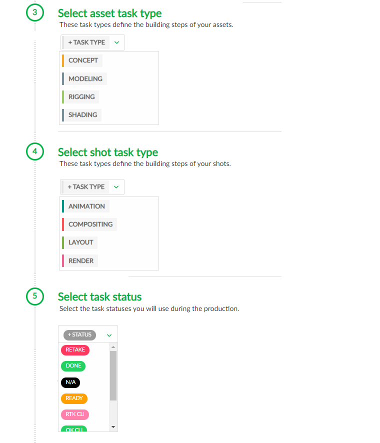

::: tip
To create your **Production Workflow**, select Task Types from the Global Library.

If you realize you missed some Task Types, you can create them later.

[See Getting Started With Kitsu](../configure-kitsu/README.md)
:::

Then, steps 7 and 8 are optional. If you already have a spreadsheet with your assets or shots, refer to the **import CSV** section for more details.

Validate everything with the  button.

## Introduction to Kitsu's Global Page

Welcome to Kitsu's global asset page. Let's take a look around.

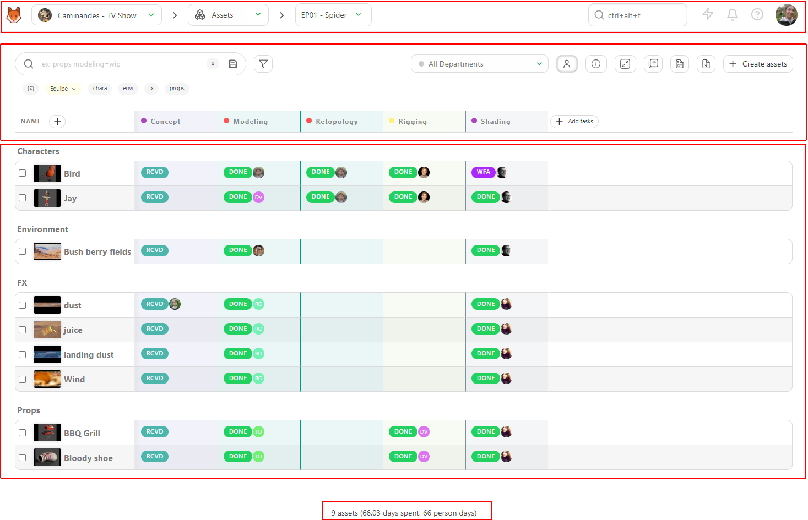

At the top, you’ll find the **global navigation**, which remains visible across all production pages.

**From left to right:**

### Main Menu

By clicking on the top left button, Kitsu  (or your Studio logo), you will open the Main Menu.

In the Main Menu, you’ll have direct access to your assigned tasks, productions, global and team schedules, the workflow customization page, and Kitsu settings.

::: details Main Menu Details
**WORKSPACE**
- **My Tasks:** Your assigned tasks.
- **My Checks:** All tasks with the status **Is Feedback Request**, depending on your department(s).
- **My Productions:** Return to the production selection page.

**STUDIO**
- **Productions:** List of all productions (opened or closed) with details.
- **People:** List of all the people (active or not) in your studio with information.
- **Timesheets:** Details of the time entered by the team across productions.
- **Main Schedule:** All your productions in one schedule.
- **Team Schedule:** Schedule of all the people in your studio and their tasks.
- **All Tasks:** Access all tasks across all productions at once.
- **News Feed:** Stay updated on what happened.
- **Entity Search:** Find any assets or shots across productions.

**ADMIN**
- **Departments:** Create and edit departments.
- **Task Types:** Create and edit task types.
- **Asset Types:** Create and edit asset types.
- **Custom Actions:** Create and edit custom actions.
- **Automation:** Create and edit automation.
- **3D Backgrounds:** Add HDR backgrounds.
- **Bots:** Create and edit bots.
- **Settings:** Set up your studio.
- **Logs**

::: warning Permission Visibility
The WORKSPACE section is enabled for all permissions except My Checks, which artists do not see.

Artists (and above) can also see their own **Timesheets** and have access to the **Entity Search**.
:::

### Navigation

You will see the navigation dropdown menu to the right of the main menu icon.

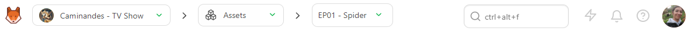

You can choose between different productions. The name of the current production and the current page are always displayed.

Use the dropdown menu to navigate from one production to another if you have several. Once you have selected a production, the next dropdown menu will help you navigate through the different pages of that production.

::: details Navigation Details
The first section is about tracking your tasks:
- **Assets**
- **Shots**
- **Sequence**
- **Episodes**
- **Edits** (If you have created specific tasks)

The second section focuses more on the production side:
- **Concepts**
- **Breakdown**
- **Playlists**
- **News Feed**

The third section is about statistics:
- **Sequence Stats**
- **Episodes Stats**
- **Asset Type Stats**

The fourth section is related to team management:
- **Schedule**
- **Quotas**
- **Team**

The fifth section is about the settings of your production:
- **Settings**

::: tip
You start with the asset page, but you can change your production homepage to other entities (see settings page).
:::

::: warning
If you realize you don't need an extra level of navigation, such as **Episodes**, you need to change your production type to **Short**.
:::

### Global Search, News, Notification, and Documentation

To the right of the navigation dropdown menu, you’ll find the global search. This quick-access feature shows the first four results. For more results and filtering options, visit the **Entity Search** page in the Main Menu.

The next icon  is a direct link to our news and feedback page. Here, you can view all the new features, complete with animated GIFs, and also submit suggestions for the next feature you’d like to see in Kitsu.

Next, the bell icon  displays your notifications (assignments, comments, tags). The number of unread notifications will be shown on the bell icon. There are various filters to help you stay on top of updates and revisit important ones when needed. You can easily mark notifications as read or unread or quickly filter by watching/non-watching to focus on what matters most and declutter your feed.

The last icon before your avatar is the documentation button , which you are reading right now!


### Personal Settings
You can click on your avatar to open your profile menu (Profile, Color Theme, Video tutorials, etc.).

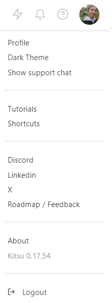

## The Tasks Spreadsheet

### Entity Spreadsheet

The second part of the screen is common to all entities (Asset, Shot, Sequence, Edit). This is the global tasks spreadsheet.

Here, you can see the status, assignment, priority, and other details for each task.

::: tip
The first row and column header of the spreadsheet always remain at the top of the page, even when you scroll down.

You can also **stick** other columns to keep them visible at all times.
:::

### Filters

The first element on the left is the filter box. You can type anything you want for simple filtering, such as sequence, asset type, etc.

For more advanced filtering, please use the filter builder button.

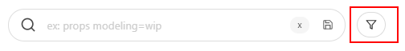

You can save all the filters and use them as your pages.

### Simplify the Display

On the right part of the screen, there are some buttons (from left to right) to hide or display the assignment, hide or display the extra column, enlarge or reduce the thumbnail.

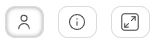

### Import / Export

Here we have the Batch import thumbnail , and finally import  or export  data.

### Metadata Column

Below, you have the name of the column. The (+) next to **Name** 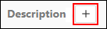 is here to create a new metadata column. Then, you have the name of the task type column.

### Customize the View

On the far right of the screen, next to the scroll bar, is the option to hide and display an extra column (everything but the task type).

.

### Sum-up of your view

The last part (4), at the bottom of the screen, is the sum-up of your displayed page. It means the sum-up will update if you filter the page.

You can see the number of elements (assets or shots), the total number of estimated days, and the total number of days already spent.


## Create an Asset

### Create Your First Asset

Now that we have created our production and have a general grasp of the Kitsu interface, it's time to create our very first asset.

On the asset page, click on **Add Assets**.


::: warning
When you create an asset, your task workflow will be applied, and **all tasks will be created simultaneously**.
:::

A pop-up window opens:

- It asks you to choose the **Asset Type** (1). If you haven't added a new asset type, Kitsu will provide examples such as Characters, Environment, FX, Props. Let's start with a character.

::: tip
You can also customize the asset type list and the task pipeline. [See Asset Types Workflow](../configure-kitsu/README.md#specific-asset-types-workflow)
:::

Link this asset to an Episode (Kitsu provides the **Main Pack** by default, which is not editable or removable) and select a first episode to help you get started **E01**. You can rename or delete E01.

- Give it a **Name** (3) and enter a description to help the artist know what to do and quickly identify the asset.

- Click on **Confirm and Stay** if you have multiple assets to create.


You can change the asset type and continue adding assets.

::: tip
The newly created asset appears in the background whenever you click on **Confirm and Stay**.
:::

After adding your last asset, click on **Confirm**. It will create the asset and close the window.

::: tip
If you click on **Confirm and Stay** but realize you don't have more assets to add, click on **Close**, and the window is canceled.
:::


You will also see that the tasks selected for your asset's workflow are created at the same time.

If you need to add more **Assets**, click the **+ Create Assets** button.

::: details Create Assets from a CSV Spreadsheet File
You may already have your asset list ready in a spreadsheet file.
With Kitsu, you have two ways to import them: the first is to import a `.csv` file and copy-paste your data directly into Kitsu.

First, save your spreadsheet as a `.csv` file.

Then, go back to the asset page on Kitsu and click on the **Import** icon.


A pop-up window **Import Data from a CSV** opens. Click on **Browse** to pick your `.csv` file.


To see the result, click on the **Preview** button.

You can check and adjust the column names by previewing your data.

Note: the **Episode** column is only mandatory for a **TV Show** production.

Once everything is correct, click the **Confirm** button to import your data into Kitsu.

Now, you have imported all your assets into Kitsu and created the tasks according to your settings.


:::

::: details Create Assets by Copying / Pasting a Spreadsheet File

Open your spreadsheet, select your data, and copy them.


Then, go back to the asset page on Kitsu and click on the **Import** icon.


A pop-up window **Import Data from a CSV** opens; click on the **Paste a CSV Data** tab.


You can paste your previously selected data and see the result with the **Preview** button.


You can check and adjust the column names by previewing your data.

Note: the **Episode** column is only mandatory for a **TV Show** production.

Once everything is correct, click the **Confirm** button to import your data into Kitsu.

Now, you have imported all your assets into Kitsu and created the tasks according to your settings.


:::

### Viewing Details of an Asset

To see the details of an asset, click on its name.


A new page opens with the list of tasks, assignments, and status updates on the right.


You can click on the status of each task to open the comment panel and view the history of comments and different versions.


You can also access the following:

- **Casting**


- **Concepts** linked to this asset


- The **Schedule** is available if you have previously filled out the task type page data. If the data has already been filled out, you will be able to modify them directly here.


- The **Preview Files** uploaded at various task types


- And the **Timelog** if people have filled out their timesheets on the tasks of this asset.


## Update Your Assets

You can update your assets at any point, change their name and asset type, modify their description, and add any custom information you added to the global page.

To edit assets, go to the asset page, hover over the asset you want to modify, and then click on the **Edit** button  (1) on the right side of the line.


To view the full description on the main asset page, click on the first words (2), and a pop-up with the full description will open.

::: details Update Assets with the CSV Import
You can use the CSV import to update your data quickly.

You can update the **type** of an asset, the **Assignment**, the **Status** of tasks, and add a **Comment**.

You need to switch on the option **Update existing data**. Then, the lines that will be updated will be highlighted in blue.


:::

::: details Update Assets by Copying / Pasting a Spreadsheet File

Open your spreadsheet, select your data, and copy them.


Then, go back to the asset page on Kitsu and click on the **Import** icon .

A pop-up window **Import Data from a CSV** opens; click on the **Paste a CSV Data** tab.


You can paste your previously selected data and see the result with the **Preview** button.


You can check and adjust the name of the columns by previewing your data.

You need to switch on the option **Update existing data**. Then, the lines that will be updated will be highlighted in blue.


Now, you have imported all your assets into Kitsu and updated the tasks according to your settings.


:::

## Add More Tasks After Creating the Assets

If you realize **after** creating the assets that tasks are missing, you can still add them.

First, ensure that the missing task type is added in the settings page under the task type tab (otherwise, [See Getting Started with Kitsu](../configure-kitsu/README.md)).

Then, go back to the asset page and click on **+ Add Tasks**.

## Create a Concept

### Upload a Concept

To create a **Concept**, navigate to the **Concepts** page using the navigation menu.


To upload a concept, click the **Add a new reference to concepts** button.

You can upload one or several concepts at the same time.


Once you upload your previews, the concept page will look like this.


You can interact with the concept in two ways: click on the picture to see an enlarged view. The second is to click on the status part to open the **Comment Panel** on the right.

On the comment panel, you have two options: link a concept to an existing asset or delete it. You can also comment and change the status of the asset.

The idea is to have one version per **Concept**. If it's not approved, you need to upload a new concept, not to have multiple versions of the same concept.

One concept is one task.


### Link a Concept to an Asset

Once concepts are uploaded, you can link them to the assets.

You can see the links on the status part of the assets.

Click on the status part of the concept; it will open the comment panel on the right.


On the comment panel, you have two options at the top: Link a concept to an asset and delete the concept.

To link an asset, click on the **Link**  button.

Kitsu will display all the **Assets** available to link with the concept uploaded.

Kitsu will list the linked assets at the top of the comment panel. For now, there are No Links.


To link an asset, click on it. The linked assets' names will appear at the top of the screen under the preview of the concept.


Once a concept is linked to an asset, it can be seen on the asset's detail page.

Return to the asset page, and click on the asset name you want to see the concept.


Per default, the casting detail is displayed on the second part of the screen.
Use the dropdown menu to choose the concept.


Once in the concept section, you will see all the concepts created for this asset. You can filter them per status.


## Create a Shot

### Create Your First Shot

It's time to create **shots** for your production.

::: warning
**Shots** are linked to a **Sequence** which is also linked to an **Episode** in Kitsu.
This means you must create an episode, then a sequence, and populate this sequence with shots.
:::

Navigate to the **Shots** page using the dropdown menu and click on **SHOTS**.


Click on the **Add Shots** button to start with shot creation.


::: warning
When you create a shot, the task workflow you have designed will be applied, and all the tasks will be created at the same time as the shot.

[See Getting Started With Kitsu](../configure-kitsu/README.md)
:::

A new pop-up opens for the creation of the shots.
You can now create Episodes, sequences, and shots.

Kitsu provides a first episode as an example **E01**; you can select it and add to it your first sequence, for instance, sq01,
then click **Add**.

Now, you can see your sequence has been created. To add shots to this sequence, you need to select it and create your shots.

For example, type sh0010 in the shots column, then click **Add**.
You can also define padding for your shots.

::: tip
If you want to name your shots ten on ten as SH0010, SH0020, SH0030, etc, set the **Shot Padding** as 10
:::


You can now see that new shots are listed and linked by their sequence, and the shelves are linked to the Episode.
You have created the first shot of the first sequence of the first Episode.

Now, let's add more shots than just one! As you can see, the box already contains your name
code but incremented, so you have to continue to click on **Add** to
create more shots.


To add more sequences, go to the left part, type the name of your new sequence, and then click on **Add**.
Your second sequence is selected, and you can now add shots.

You can follow the same process to add more episodes.

Once you create a new episode, it will be selected and created sequentially.
Once the sequence is created, it will be selected, and you can create shots on this sequence.

::: tip
If a shot is misplaced on a sequence, you have to edit the shot
, and change the
sequence.

**But you can't change the Episode of a shot.**


:::

## Create Shots from an EDL File

You may already have your shots list ready in an **EDL** file. With Kitsu, you can directly import your **EDL** file to create the sequence, shot, number of frames, and Frame in and out.

On the **Global Shot Page**, you will see an **Import EDL** button.


You can select the naming convention of the video file used during the editing on the pop-up.


It means the video clip on the editing is named as project_sequence_shot.extension.

Here is an example of an EDL for the LGC production.


The video files are named  LGC_100-000.mov, which means LGC is the production name, 100 is the sequence name, and 000 is the shot name.

You can import the EDL file once you are set with the naming convention.

Then click on **Upload EDL**.

Then Kitsu will create the shots.


::: details Create Shots from a CSV Spreadsheet File
You may already have your shots list ready in a spreadsheet file. With Kitsu, you have two ways to import them; the first is to import a `.csv` file directly, and the second is to copy-paste your data directly into Kitsu.

First, save your spreadsheet as a `.csv` file.

Then, return to the shot page on Kitsu and click the **Import** icon.


A pop-up window **Import data from a CSV** opens. Click on **Browse** to pick your `.csv` file.


To see the result, click on the **Preview** button.

You can check and adjust the name of the columns by previewing your data.

NB: the **Episode** column is mandatory for a **TV Show** production.


Once everything is good, click the **Confirm** button to import your data into Kitsu.

Now, all your shots are imported into Kitsu, and the task is created according to your **Settings**.


:::

::: details Create Shots by Copying / Pasting a Spreadsheet File
Open your spreadsheet, select your data, and copy them.


Then, go back to the shot page on Kitsu and click on the **Import** icon
.

A pop-up window **Import data from a CSV** opens; click on the **Paste a CSV data** tab.


You can paste your previously selected data and see the result with the **Preview** button.


You can check and adjust the name of the columns by previewing your data.

NB: the **Episode** column is only mandatory for a **TV Show** production.


Once everything is good, click the **Confirm** button to import your data into Kitsu.

Now, all your shots are imported into Kitsu, and the task is created according to your **Settings**.


:::

### See the Details of a Shot

If you want to see the details of a shot, click on its name.


A new page opens with the list of the tasks, the assignation, and the status newsfeed on the right.
You can navigate through each by clicking on the name of the tabs.


You can click on the status of each task to open the comment panel and see the history of the comments and the different versions.


You can also access the **Casting**,


The **Schedule** is available if you have previously filled out the task type page data. If the data have already been filled out, you will be able to modify them directly here.


the **Preview Files** uploaded at various task types,


And the **Timelog** if people have filled out their timesheet on the tasks of this asset.


## Update your shots

You can update your shots at any point, change their names and sequences, modify their descriptions, and add any custom information you added to the global page.

You can edit shots by going to the shot page, hovering over the shot you want to modify, and then clicking on the **edit** button
 (1) on the right side of the line.


To extend the description on the main shot page, click on the first words (2), and a pop-up with the full description will open.


::: details Update Shots Information with CSV Import
You can use the **CSV Import** to update your data as the **NB Frames**, **Frame IN**, **Frame Out**, or any custom **Metadata column**.

You can update the **Assignation**and the **Status** of tasks and add a **Comment**.

Open your spreadsheet, select your data, and copy them.


Then, go back to the shot page on Kitsu and click on the **Import** icon
.

A pop-up window **Import data from a CSV** opens; click on the **Paste a CSV data** tab.


 
You can paste your previously selected data and see the result with the **Preview** button.
 

 
You need to switch on the **Option: Update existing data**.
The updated shots will be in blue.

 
NB: the **Episode** column is only mandatory for a **TV Show** production.
 


Once everything is good, click the **Confirm** button to import your data into Kitsu.

Now, all your shots are imported into Kitsu, and the task is created according to your **Settings**.


:::

## Add more tasks after creating the shots

If you realize after creating the shots that the task is missing, you can still add them.

First, ensure the missing task type is added to the settings page under the task type tab (otherwise, http://localhost:8080/tvshow/#update-your-shots)).

Then go back to the shot page and click on + Add tasks.

## Adding Frame Numbers and Ranges to Shots

At this stage of production, the animatic should be complete. This means you have the duration (number of frames) and the frame range (Frame In and Frame Out) for each shot. You can input this information into the spreadsheet to ensure accurate frame calculation without any missing or redundant frames.

::: warning
If you've manually created your shots and sequences, the Frame column might be hidden. To reveal it, you need to edit at least one shot and input the number of frames. Alternatively, if you've imported the number of frames via CSV/spreadsheet, the Frame column will be visible.
:::

To add frame range information to shots, follow these steps:

1. **Edit Shots:** Click on the edit button () located on the right side of the shot line.

   

2. **Input Frame Range:** In the editing window, enter the In and Out frames for the shot, then save by clicking the Confirm button.

   

   The frame range will now be displayed on the general spreadsheet of the shot page.

   

3. **Fill Frame Information:** Once the Frames, In, and Out columns are unlocked, you can directly input data from the global shot page. Simply click on the case you want to fill in and add the data.

   ::: tip
   If you input Frame In and Frame Out, Kitsu will automatically calculate the Number of Frames.
   :::

   

4. **CSV Import:** You can also utilize CSV Import to swiftly update your frame ranges. [Update Shots information with CSV Import](README.md#update-your-shots)

5. **Access Shot History:** You can view the history of shot values, including frame ranges.

   

   

## Creating Custom Metadata Columns

To include additional information on the general spreadsheet pages, you'll need to create a custom **metadata column**.

You might have extra details to add, such as **level of difficulty**, **weather**, **tags**, etc. All textual or numerical information can be stored in the custom metadata column.

::: warning
Any Custom Metadata Column created in one episode will be applied to all episodes.
:::

Follow these steps to create a custom metadata column:

1. **Add Column:** Click on the **+** near the Name column.

   

2. **Choose Type:** With the Type option, select how you want to store your information:
   - **Text**
   - **Number**
   - **Checkbox**
   - **List of Values**
   - **List of Tags**
   - **Checklist**

   

   ::: warning
   - **Text**, **Number**, and **Checkbox** allow you to add different information for each entity without prior planning.
   - **List of Values**, **List of Tags**, and **Checklist** offer the same options for each entity and must be filled in advance.

   
   Type the list elements below Available values and confirm them by clicking on Add value.
   :::

3. **Link to Departments:** Optionally, you can link the metadata column to one or several departments. This allows artists/supervisors to view it on their to-do page and in department-filtered views.

   ::: tip
   To link a metadata column to a department, click on the department from the list and then click on **add** to apply it.

   Here, the VFX column is linked to two departments.

   
   :::

   ::: details Edit Metadata Column
   On the global page of the asset or the shot, click on the arrow to the right of your metadata column and select **Edit**.

   
   :::

4. **Fill Information:** You can input information directly on the global spreadsheet page. The cases are editable.

   

   ::: tip
   You can batch-modify the metadata column by selecting several entities on the left and then modifying your metadata column.
   :::

   ::: details Edit Manually
   You can also modify the information manually by clicking the edit button ().

   You'll see a new line on the edit pop-up where you can select the information from the list, enter free text or a number, check a box, or use a checklist, depending on your previous choice.

   Remember to press the Confirm button when you're done.

   
   :::

5. **Edit or Delete:** To edit or delete the metadata column, go to the general spreadsheet page. Next to the name of your metadata column, click on the arrow.

   ::: tip
   You can also sort your global page with this new column by clicking the arrow on the right of the column name to open its menu and then selecting Sort By.

   You can also Stick the metadata column to the left.
   :::

## Create a Sequence

In Kitsu, you can also track tasks at the **Sequence** Level.
It's especially useful when
you have macro tasks to track, like Story and color Board, Color Grading, etc.

Use the navigation menu to go to the **Sequences** page.


::: warning
This new page behaves like the asset and shot global page.

To use this page, You first need to create dedicated task types on your **Global Library**
 with the **Sequence** attribute.

 [See How to Create a New Task Type](../configure-kitsu/README.md#studio-workflow-create-a-new-task-type)

Once you have created your **Task Types**  on your **Global Library**, add them to your
**Production Library** (setting page).
:::

Once your task types are ready on the settings page, you need to create a sequence (the same as the assets or shots).

This new page behaves like the asset and shot global page. You can add your edits with the **+ New Sequence** button.

You can assign tasks, do the review, change status, etc.

You can add a metadata column, fill in the description, etc.

::: tip
You can create a sequence directly from here (**+New sequence** button) or create a sequence linked to your shots from the global shot page.
:::

You can **Rename** and **Delete** the Sequence entity on this page, as for the asset and shot entity.

If you click on the name of a sequence, you will see the detail page of this sequence.


On the detailed page, you have access to the sequence casting.
You can see all the assets used in the whole sequence.

You can also access the schedule, Preview Files, Activity, and Timelog of the sequence **tasks**.

## Create an Edit

You can track tasks at the **Edit** level in Kitsu.

It's especially useful when you have several edits to track through several validation steps. For example, you can track your whole movie, several trailers, and the First Edit, Fine Edit, Mix, etc.

::: warning
By default, the **Edit** page will not be displayed until you have task types for it in your **production library** (setting page).

[See How to Create a New Task Type](../configure-kitsu/README.md#studio-workflow-create-a-new-task-type)
:::

To use this page, you need to first create a dedicated task type in your **Global Library** with the **Edit** attribute.

Once you have created your **Task Types** in your **Global Library**, add them to your **Production Library**. After this, you will see the **Edit** option displayed in the navigation drop-down menu.


This new page behaves like the asset and shot global page. You can add your edits with the **+ New edit** button.

You can assign tasks, conduct reviews, change status, etc.

You can also add a metadata column, fill in the description, etc.

::: tip
Depending on your deliveries, you can also change the resolution per **Edit**.
:::

::: warning
The detail page is different from the other entities.

As **Edit** focuses on a specific long video, the detail page resembles the comment detail page more closely.
:::

You can **Rename** and **Delete** the Edit entity on this page, similar to the asset and shot entity.

## Create a Breakdown List

Filling out the breakdown helps you with the assembly of the shots. With the
breakdown, you have all the details of the assets you need to add to create your
shot, and we are sure to omit nothing.

On the dropdown menu, choose **BREAKDOWN**.


On the left of the breakdown page is the episode/sequence/shot menu (1); you can choose between those you created. They are the right part of
the screen; all the assets created are available for this production (main pack and episodes) (3). Moreover, in
the middle section, it is your selection for the shot (2).


So now you have to select the shot you want to cast.

You can display the assets as text if you don't have thumbnails yet or enlarge the
thumbnails size.


You may also realize an asset needs to be added to the list during your breakdown.

You can create a new asset directly from the breakdown page. Click the **+** on the right of the **All available assets**.


You can also choose multiple shots at once. Click on the first shot, hold the **shift** key, and click on the last shot of your selection.


Then click on the assets you want
to assign: characters, backgrounds, ... from the right part (3).
If you have selected multiple shots, your selection is applied to the numerous shots.

Copy a shot filled with assets and paste this asset selection into another shot.

You can see a **+1** or **+10** when you pass over the asset. It's the number
of times you add this asset, and you can click on it as many times as you need.


You can also link all your assets to episodes on a TV show without specifying a sequence or shot.


This way, you can link all your assets to one or several episodes before the storyboard/animatic stage.

You can now see the asset in the middle of the screen (2). Next
to the asset's name is the number of times it has been added. In this
example, we have added the character asset Llama two times.


If you add an asset twice by mistake, you must go to the screen's middle part to select assets for this shot (2). From there, click on
**-1**. When you finish this shot, go on with the other shots.
Your selection is automatically saved.


If a new asset is created during the storyboard, return to the asset
page (using the dropdown menu) and create the needed assets. The tasks previously created are applied immediately to these new
assets. However, you have to do the assignment, and then you can
continue with the breakdown.

Now, your **Breakdown** page should look like this.


You can also make a breakdown list for your assets if you need to assemble them and keep track of the separate parts.

On the top left corner of the screen, choose **asset** in the dropdown menu below **FOR**.


You can now access a second dropdown menu to choose your asset type: **Character**, **Environment**, **Props**, **FX**, ...


You can complete the asset breakdown page the same way you did the shots. First, select one or more assets on the left part and then add the right part's elements.

::: details Create a Breakdown List from a CSV File

You may already have your breakdown list ready in a spreadsheet file. With Kitsu, you have two ways to import it: the first is to import a .csv file directly, and the second is to copy-paste your data directly into Kitsu.

First, save your spreadsheet as a `.csv` file following Kitsu's recommendation.

Click on the **import** button 

A pop-up window **Import data from a CSV** opens. Click on **Browse** to pick your `.csv` file.


To see the result, click on the **Preview** button.

You can check and adjust the name of the columns by previewing your data.

NB: the **Episode** column is only mandatory for a **TV Show** production.


Once everything is good, click the **Confirm** button to import your data into Kitsu.

Now, you have your breakdown imported into Kitsu.


:::

::: details Create a Breakdown List by Copying / Pasting a Spreadsheet File

Open your spreadsheet, select your data, and copy them.


Then, go back to the breakdown page on Kitsu and click on the **Import** icon
.

A pop-up window **Import data from a CSV** opens; click on the **Paste a CSV data** tab.


 
You can paste your previously selected data and see the result with the **Preview** button.
 

 
You can check and adjust the name of the columns by previewing your data.
 
NB: the **Episode** column is mandatory for a **TV Show** production.


Once everything is good, click the **Confirm** button to import your data into Kitsu.

Now, all your assets have been imported into Kitsu.


:::

## Casting from the Asset Library

It is also possible to cast assets from the global **Asset Library** into your production. This allows you to cast an already existing asset, without the need to re-create it for each production.


To see assets outside of your production from the asset library, click the **Display Library** Button (1)

Assets from the global asset library will appear, and will be highlighted with a yellow boarder (2). They can then be cast in your breakdown exactly the same as other assets.


Back on your productions asset page, you can choose to display global assets that have been cast in your production by toggling the **Display Library** button (1). These assets will be highlighted in yellow, indicating that they originate from the global asset library, and not your current production. (2).

## Introduction to Asset State: Ready For

Most of the time, you don't need to wait for an asset's tasks to be approved to use it on a shot task.

For example, when an asset is approved at the **Concept** stage, it can be used for the **Storyboard** stage.
Then, when it's approved at the **Modeling** stage, you can use it for the **Layout** stage and so on.

That's exactly what the asset state **Ready For** is doing: it lets you know the state of an asset's tasks and compares its usability for the shot tasks.

Now that we have filled out our breakdown, we know exactly which asset is used on every shot.

First, we need to define an asset's state relative to its task status. You can modify the **Ready for** by clicking on a cell. You will see a dropdown menu with the shot task.


::: tip
You can use the **automations** to do the heavy lifting for you.

You can set automation with the **ready for** trigger.

[See How to Create Status Automation](../configure-kitsu/README.md#automation)

:::

Now that we have changed some asset states to **Ready for**, we can see the result on the shot page.

You can notice that some white boxes are now **Green**: all the assets cast in this shot are ready for this specific task.


If you see the white box, Kitsu will display how many assets are ready for this task.


::: tip
No assets are cast for this shot if you don't see any boxes.
:::
 
Then, you can click on the shot's name to go to its detail page.
Then, you will see all the assets cast in this shot and their status.


It's the fastest way to know if you can start a shot for a specific task.

# Create a Feature Film Production

Now that you have designed your workflow in Kitsu and invited more people, it's time to create your production.

Click on the **Create a new
production** button.


Enter your production name, and choose **Feature Film** as the **type**, then select the style of your production (2D, 3D).


Then, you must fill in technical information, such as the number of FPS, the Ration, and the Resolution.

All these data will be used when Kitsu re-encodes the video previews uploaded.

Then, you need to define your production's start and end dates.


You can define your production workflow in the next part, 3 to 6.

You need to select your asset task type (3), shot task type (4), task status (5), and asset types (6).


::: tip
To create your **Production Workflow**, you will select Task Types from the Global Library.

If you realize you missed some Task Types, you can create them later.

See the [Studio Workflow](../configure-kitsu/README.md#studio) section.
:::

Then, 7 and 8 are the option parts. If you already have a spreadsheet with your asset/shot.

See the **import CSV** section for more details.

[Import asset](../feature/README.md#create-an-asset)

[Import shot](../feature/README.md#create-shots-from-an-edl-file)

Validate everything with the  button.

## Introduction to the Kitsu Global Page

Welcome to Kitsu's global asset page.

Let's take a look around.


On the top part (1), you have the **global navigation**, which is always visible throughout all the production pages.

**From left to right:**

### Main Menu

You will open the main menu by clicking on the top left button, Kitsu (or your Studio logo).

On the main menu, you will find direct access to your assigned tasks, productions, global and team schedules, the workflow customization page, and the Kitsu settings.

::: details Main Menu Details
**WORKSPACE**
- My Tasks: your assigned tasks
- My Checks: All the tasks with status **Is Feedback Request** depending on your department(s)
- My Productions: Get back to the selection on the production page.


**STUDIO**
- Productions
- People
- Timesheets
- Main Schedule
- Team Schedule
- All tasks
- News Feed
- Entity Search


**ADMIN**
- Departments
- Task Types
- Asset Types
- Custom Actions
- Automation
- 3D Backgrounds
- Bots
- Settings
- Logs

::: warning Permission Visibility
The WORKSPACE section is enabled for all permissions except My Checks, which artists do not see.

Artist (and above) can also see their own **Timesheets**, and have access to the **Entity Search**
:::

### Navigation

You will see the navigation dropdown menu on the right of the main menu icon.


You can choose between production. The name of the actual production and actual page are always displayed.

You can use the dropdown menu to navigate from production to production (if you have several).

Once you have selected a production, the next dropdown menu will help you navigate through the different pages of this production.


::: details Navigation details
The first section is about the tracking of your tasks
- Assets
- Shots
- Sequence
- Edits (If you have created specific tasks)

The second section is more about the side of the production
- Concepts
- Breakdown
- Playlists
- News feed

The third section is about statistics
- Sequence Stats
- Asset Type Stats

The fourth section is related to Team Management
- Schedule
- Quotas
- Team

The fifth section is about the settings of your production
- Settings

::: tip
You start with the asset page, but you can change your production homepage to other entities (see setting page)
:::

### Global Search, News, Notification and Documentation
You have the global search on the right of the navigation dropdown menu. It's a quick access search that will display the four first results. If you need more results and filtering options, see the **Entity Search** page.


The next icon  is a direct link to our news and feedback page.

You can see all the new features with an animated gif and also add suggestions about the next feature you want to see in Kitsu.

Next, the bell icon  displays your notifications (assignments, comments, tags). The number of unread notifications will be shown on the bell icon. There are various filters to help you stay on top of updates and revisit important ones when needed. You can easily mark notifications as read or unread or quickly filter by watching/non-watching to focus on what matters most and declutter your feed.

The last icon before your avatar is the documentation button.
, that you are reading right now!

### Personal Settings
You can click on your avatar to open your menu (setting, documentation, etc.).

.

## The Tasks Spreadsheet

### Entity spreadsheet

The second part of the screen is common to all the entities (asset, shot, sequence, Edit). This is the global tasks spreadsheet.

Here, you see the status, assignation, priority, etc, for each task.

::: tip
The spreadsheet's first line and column header always appear at the top of the page, even if you scroll down.

You can also **Stick** other columns to keep them visible at all times.
:::

### Filters

The first element on the left is the filter box. You can type anything you want for simple filtering, sequence, asset type, etc.

If you need more advanced filtering, please use the filter builder button.


You can then save all the filters and use them as your pages.

::: warning
You must press **Enter** on your keyboard to launch the filters on a feature film.
:::

### Simplify the display

On the right part of the screen, there are some buttons (from left to right) to hide or display the assignation, hide or display the extra column, enlarge or reduce the thumbnail,


### Import / Export

batch import thumbnail , and finally import  or export  data.

### Metadata column

Below, you have the name of the column. the (+) next to **Name**  is here to create a new metadata column. Then, you have the name of the task type column.

### Customize the view

On the far right of the screen, next to the scroll bar, is the option to hide and display a text column

.

### Sum-up of your view

The last part (4), at the bottom of the screen, is the sum-up of your displayed page. It means the sum-up will update if you filter the page.

You can see the number of elements (assets or shots), the total number of estimated days, and the total number of days already spent.

## Create an Asset

### Create your first asset

So, now that we have created our production and have a general grasp of the Kitsu interface, it's time to create our first asset.

On the asset page, click on **Add assets**.


::: warning
When you create an asset, your task workflow will be applied, and **all the tasks will be created simultaneously as the asset**.
:::

A pop-up window opens:

It asks you to choose the **Asset Type** (1).
If you didn't add a new asset type, Kitsu will provide examples such as Characters, Environment, FX, Props, etc.
Let's start with a character.

::: tip
You can also customize the asset type list and the tasks pipeline. See the guide (
[Customization of the workflow](../configure-kitsu/README.md#asset-types)) for more details
:::

We give it a **Name** (2) and enter a description that helps the Artist know what to do and quickly identify the asset.

Click on **Confirm and stay** if you have multiple assets to create.


You can change the asset type and keep adding assets.

::: tip
The newly created asset appears in the background whenever you click on **Confirm and stay**.
:::

After adding your last asset, click
on **Confirm**. It will create the asset and close the window.

::: tip
If you click on **Confirm and stay** but realize you don't have more assets to add, click on **Close**, and the window will be canceled.
:::


You will also see the tasks that are selected for your assets workflow are created at the same time.


If you need to add more **Assets**, click the **+ Create assets** button.

::: details Create Assets from a CSV Spreadsheet File
You may already have your asset list ready in a spreadsheet file.
With Kitsu, you have two ways to import them; the first is to import a `.csv` file and copy-paste your data directly into Kitsu.

First, save your spreadsheet as a `.csv` file.

Then, go back to the asset page on Kitsu and click on the **Import** icon.


A pop-up window **Import data from a CSV** opens. Click on **Browse** to pick your `.csv` file.


To see the result, click on the **Preview** button.
 
You can check and adjust the name of the columns by previewing your data.
 
NB: the **Episode** column is only mandatory for a **TV Show** production.
 


Once everything is good, click the **Confirm** button to import your data into Kitsu.

You have imported all your assets into Kitsu and created the task according to your Settings.


:::

::: details Create Assets by Copying / Pasting a Spreadsheet File

Open your spreadsheet, select your data, and copy them.


Then, go back to the asset page on Kitsu and click on the **Import** icon
.

A pop-up window **Import data from a CSV** opens; click on the **Paste a CSV data** tab.


 
You can paste your previously selected data and see the result with the **Preview** button.
 

 
You can check and adjust the name of the columns by previewing your data.
 
NB: the **Episode** column is only mandatory for a **TV Show** production.
 


Once everything is good, click the **Confirm** button to import your data into Kitsu.

You have imported all your assets into Kitsu and created the task according to your Settings.


:::

### See the Details of an Asset

To see an asset's detail, click on its name.


A new page opens with the list of the tasks, the assignation, and the status newsfeed on the right.


You can click on the status of each task to open the comment panel and see the history of the comments and the different versions.


You can also access the **Casting**,


**concept** linked to this asset,


The **Schedule** is available if you have previously filled out the task type page data. If you have already filled out the data, you can modify them directly here.


the **Preview Files** uploaded at various task types,


And the **Timelog** if people have filled out their timesheet on the tasks of this asset.


## Add more tasks after creating the assets

If you realize **after** creating the assets that the task is missing, you can still add them.

First, ensure the missing task type is added to the settings page under the task type tab.

Then go back to the asset page and click on **+ Add tasks**

### Update your assets

You can update your assets at any point, change their name and asset type, modify their description, and add any custom information you added to the global page.

You can edit assets by going to the asset page, hovering over the asset you want to modify, and then clicking on the **edit** button
 (1) on the right side of
the line.


To extend the description on the main asset page, click on the first words (2), and a pop-up with the full description will open.


::: details Update Assets with the CSV Import
You can use the CSV import to update your data quickly.

You can update the **type** of an asset, the **Assignation**, the **Status** of tasks, and add a **Comment**.

You need to switch on the option **Update existing data**. Then, the lines that will be updated
will be highlighted in blue.


:::


::: details Update Assets by Copying / Pasting a Spreadsheet File

Open your spreadsheet, select your data, and copy them.


Then, go back to the asset page on Kitsu and click on the **Import** icon
.

A pop-up window **Import data from a CSV** opens; click on the **Paste a CSV data** tab.


 
You can paste your previously selected data and see the result with the **Preview** button.
 

 
You can check and adjust the name of the columns by previewing your data.

NB: the **Episode** column is only mandatory for a **TV Show** production.
 
You need to switch on the option **Update existing data**. Then, the lines that will be updated
will be highlighted in blue.


You have imported all your assets into Kitsu and created the task according to your Settings.


:::

## Create a Concept

### Upload a Concept

To create a **Concept**, go to the **Concept** page with the navigation menu.


To upload a concept, click the **Add a new reference to concepts** button.

You can upload one or several concepts at the same time.


Once you upload your previews, the concept page will look like this.


You can interact with the concept in two ways: click on the picture to see an enlarged view.
The second is to click on the status part to open the **Comment Panel** on the right.

On the comment panel, you have two options: link a concept to an existing asset or delete it.
You can also comment and change the status of the asset.

The idea is to have one version per **Concept**. If it's not approved, you need to upload a new concept, not to have multiple versions of the same concept.

One concept is one task.


### Link a Concept to an Asset

Once concepts are uploaded, you can link them to the assets.

You can see the links on the status part of the assets.

Click on the status part of the concept; it will open the comment panel on the right.


At the top of the comment panel, you have two options: Link a concept to an asset and delete the concept.

To link an asset, click on the **Link**  button.

Kitsu will display all the **Assets** available to link with the concept uploaded.

Kitsu will list the linked assets at the top of the comment panel. For now, there are No Links.


To link an asset, click on it. The names of the linked assets will appear at the top of the screen under the preview of the concept.


Once a concept is linked to an asset, it can be seen on the asset's detail page.

Return to the asset page, and click on the asset name you want to see the concept.


Per default, the casting detail is displayed on the second part of the screen.
Use the dropdown menu to choose the concept.


Once in the concept section, you will see all the concepts created for this asset. You can filter them per status.


## Create a Shot

### Create your first shot

It's time to create **shots** for your production.

::: warning
Shots are linked to Sequences in Kitsu.
This means you must create a sequence and then populate this sequence with shots.
:::

You need to go to the **Shots** page: you can use the
dropdown menu and click on the **SHOTS**.


Click on the **Add shots** button to start with the shot creation.


::: warning
When you create a shot, the task workflow you have designed will be applied, and all the tasks will be created at the same time as the shot.
:::

A new pop-up opens for the creation of the shots.
You can now create the sequences and the shots.

Enter the first sequence, for instance, sq01,
then **add**.

Now, you can see your sequence has been created. To add shots to this sequence, select it and create your shots.

For example, type sh0010 on the shots column, then again **add**.
You can also define padding for your shots.

::: tip
If you want to name your shots ten on ten as SH0010, SH0020, SH0030, etc, set the **Shot Padding** as 10
:::


You can now see that new shots are listed and linked by their sequence.
You have created the first shot of the first sequence.

Now, let's add more shots than just one! As you can see, the box already contains your name
code but incremented, so you have to continue to click on **add** to
create more shots.


To add more sequences, go to the left part, type the name of your new sequence, and then click on **add**.
Your second sequence is selected, and you can now add shots.

::: tip
If a shot is misplaced on a sequence, you have to edit the shot
, and change the
sequence.


:::

## Create Shots from an EDL File

You may already have your shots list ready in an **EDL** file.
With Kitsu, you can directly import your **EDL** file to create the sequence, shot, number of frames, and Frame in and out.

On the **Global Shot Page**, you will see an **Import EDL** button.


You can select the naming convention of the video file used during the editing on the pop-up.


It means the video clip on the editing is named as project_sequence_shot.extension.

Here is an example of an EDL for the LGC production.


The video files are named  LGC_100-000.mov, which means LGC is the production name, 100 is the sequence name, and 000 is the shot name.

You can import the EDL file once you have the naming convention.

Then click on **Upload EDL**

Then Kitsu will create the shots.


:::

::: details Create Shots from a CSV Spreadsheet File
You may already have your shots list ready in a spreadsheet file.
With Kitsu, you have two ways to import them; the first is to import a `.csv` file directly, and the second is to copy-paste your data directly into Kitsu.

First, save your spreadsheet as a `.csv` file.

Then, return to the shot page on Kitsu and click the **Import** icon.


A pop-up window **Import data from a CSV** opens. Click on **Browse** to pick your `.csv` file.


To see the result, click on the **Preview** button.
 
You can check and adjust the name of the columns by previewing your data.
 
NB: the **Episode** column is only mandatory for a **TV Show** production.
 


Once everything is good, click the **Confirm** button to import your data into Kitsu.

All your shots are imported into Kitsu, and the task is created according to your **Settings**.


:::


::: details Create Shots by Copying / Pasting a Spreadsheet File
Open your spreadsheet, select your data, and copy them.


Then, go back to the shot page on Kitsu and click on the **Import** icon
.

A pop-up window **Import data from a CSV** opens; click on the **Paste a CSV data** tab.


 
You can paste your previously selected data and see the result with the **Preview** button.
 

 
You can check and adjust the name of the columns by previewing your data.
 
NB: the **Episode** column is only mandatory for a **TV Show** production.
 


Once everything is good, click the **Confirm** button to import your data into Kitsu.

All your shots are imported into Kitsu, and the task is created according to your **Settings**.


:::

### See the Details of a Shot

If you want to see the details of a shot, click on its name.


A new page opens with the list of the tasks, the assignation, and the status newsfeed on the right.
You can navigate through each by clicking on the name of the tabs.


You can click on the status of each task to open the comment panel and see the history of the comments and the different versions.


You can also access the **Casting**,


The **Schedule** is available if you have previously filled out the task type page data. If you have already filled out the data, you can modify them directly here.


the **Preview Files** uploaded at various task types,


And the **Timelog** if people have filled out their timesheet on the tasks of this asset.


## Add more tasks after creating the shots
If you realize after creating the shots that the task is missing, you can still add them.

First, ensure the missing task type is added to the settings page under the task type tab.

Then go back to the shot page and click on + Add tasks.

### Update your shots

You can update your shots at any point, change their names and sequences, modify their descriptions, and add any custom information you added to the global page.

You can edit shots by going to the shot page, hovering over the shot you want to modify, and then clicking on the **edit** button
 (1) on the right side of the line.


To extend the description on the main shot page, click on the first words (2), and a pop-up with the full description will open.


::: details Update Shots Information with CSV Import
You can use the **CSV Import** to update your data as the **NB Frames**, **Frame IN**, **Frame Out**, or any custom **Metadata column**.

You can update the **Assignation**, and the **Status** of tasks and add a **Comment**.

Open your spreadsheet, select your data, and copy them.


Then, go back to the shot page on Kitsu and click on the **Import** icon
.

A pop-up window **Import data from a CSV** opens; click on the **Paste a CSV data** tab.


 
You can paste your previously selected data and see the result with the **Preview** button.
 

 
You need to switch on the **Option: Update existing data**.
The updated shots will be in blue.

 
NB: the **Episode** column is only mandatory for a **TV Show** production.
 


Once everything is good, click the **Confirm** button to import your data into Kitsu.

All your shots are imported into Kitsu, and the task is created according to your **Settings**.


:::

## Add the number of Frames and Frame ranges to the shots

At this stage of the production, the animatic should be done. This means you have
the length (**number of frames**, **Frame range In**, and **Frame range Out**) for each shot. You can
add this information to the spreadsheet. This way, you are sure that all
the frames are calculated and none are missing or over-computed.

::: warning
If you have created your shots and sequence by hand,
the **Frame** column will be hidden. You must edit at least one shot and fill in the number of frames to display the **Frame** column.
The column will be displayed if you have created your shots and imported the number of frames with a CSV/spreadsheet.
:::


You need to edit the shots to fill in the frame range information. Click on the
edit button  on the right
side of the shot line.


You can enter the shots **In** and **Out ** in the new window. Then, save by clicking the **Confirm** button.


Now, the frame range appears on the general spreadsheet of the shot page.


Now that you have unlocked the **Frames**, **In**, and **Out** columns, you can fill them
directly from the global shot page.

Click on the case you want to fill in and add the data.

::: tip
If you enter the **Frame In** and **Frame Out**, Kitsu automatically calculates the **Number of Frame**.
:::


You can also use the **CSV Import** to update your frame range quickly.
 [Update Shots information with CSV Import](../feature/README.md#update-your-shots)

You can also access the history of shot values.


## Create Custom Metadata Columns

To add more information on the general spreadsheet pages, you must create a custom **metadata column**.

You may have extra information to add to your pages, such as the **level of difficulties**, **Weather**, **Tag**, etc. You can store all text (or number) information in the custom metadata column.


Click on the **+** near the Name column.


With the **Type** option, you can choose how you want to store your information:
- a free **Text**,
- a **Number**,
- a **Checkbox**,
- a **List of value**,
- a **List of tags**,
- a **Checklist**.


::: warning
The **Text**, **Number**, and **Checkbox** allow you to add different information for each entity. You don't have to plan it first.

The **List of value**, **List of tags**, and **Checklist** give you the same choice for each entity. Moreover, it has to be filled now.


Type the list elements below **Available values**, and confirm them by clicking on **Add value**.
:::

You can also link the **metadata column** to one or several **departments**.

::: tip
Link a metadata column to a department. The artists/supervisors will see it on their to-do page and in the department-filtered view.

You can link the metadata column to one or more departments. Click on the department from the list and then click on **add** to be effective.

Here, the VFX column is linked to two departments.


:::

::: details Edit meta column
On the global page of the asset or the shot, click on the arrow on the direct right of your metadata column and click on **Edit**.


:::


You can fill in this information directly on the global spreadsheets page.
The cases are editable.


::: tip
You can batch-modify the metadata column by selecting several entities on the left and then modifying your metadata column.
:::

::: details Edit by hand
You can also modify the information with the edit button .

You now see a new line on the edit pop-up. You can select the information from the list,
alternatively, enter the free text or number, check a box, or use the checklist, depending on your previous choice.

Remember to press the **Confirm** button when you are done.


:::

Go to the general spreadsheet page to edit or delete the metadata column.
Nearby the name of your metadata column, click on the arrow .

::: tip
You can **sort** your global page with this new column. Click the arrow on the right of the column name to open his menu. Then click on **Sort By**.

You can also **Stick** the metadata column to the left.
:::

## Create a Sequence

In Kitsu, you can also track tasks at the **Sequence** Level.
It's especially useful when
you have macro tasks to track, like Story and color Board, Color Grading, etc.

Use the navigation menu to go to the **Sequences** page.


::: warning
This new page behaves like the asset and shot global page.

To use this page, You first need to create dedicated task types on your **Global Library**
 with the **Sequence** attribute.

See the **Creating a New Task Type** Section to create a new **Task Type**.

[Creating a New Task Type](../configure-kitsu/README.md#task-types)

Once you have created your **Task Types**  on your **Global Library**, add them to your
**Production Library** (setting page).
:::

Once your task types are ready on the settings page, you must create a sequence (the same as the assets or shots).


This new page behaves like the asset and shot global page. You can add your edits with the **+ New Sequence** button.

You can assign tasks, do the review, change status, etc.

You can add a metadata column, fill in the description, etc.


::: tip
You can create a sequence directly from here (+New sequence button) or a sequence linked to your shots from the global shot page.
:::


You can **Rename** and **Delete** the Sequence entity on this page, as for the asset and shot entity.

If you click on the name of a sequence, you will see the detail page of this sequence.


On the detailed page, you have access to the sequence casting.
You can see all the assets used in the whole sequence.

You can also access the schedule, Preview Files, Activity, and Timelog of the sequence **tasks**.

## Create an Edit

You can track tasks at the **Edit** Level in Kitsu.

It's especially useful when
You have several edits to track through several validation steps.
For example, you can track your whole movie, several trailers, the First Edit, Fine Edit, mix, etc.

::: warning
Per default, the **Edit** page will not be displayed until you have task types for it on your **production library** (setting page)
:::


To use this page, you need to first create a dedicated task type on your **Global Library**
 with the **Edit** attribute.

See the **Creating a New Task Type** Section to create a new **Task Type**.

[Creating a New Task Type](../configure-kitsu/README.md#task-types)


Once you have created your **Task Types**  on your **Global Library**, add them to your
**Production Library**, you will see the **Edit** displayed on the navigation drop-down menu.


This new page behaves like the asset and shot global page. You can add your edits with the **+ New edit** button.

You can assign tasks, do the review, change status, etc.

You can add a metadata column, fill in the description, etc.

::: tip
Depending on your deliveries, you can also change the resolution per **Edit**.
:::

::: warning
The detail page is different from the other entities.

As **Edit** focuses on a specific long video, the detail page looks more like the comment detail page.
:::

You can **Rename** and **Delete** the Edit entity on this page for the asset and shot entity.

## Create a Breakdown List

Filling out the breakdown helps you with the assembly of the shots. With the
breakdown, you have all the details of the assets you need to add to create your
shot, and we are sure to omit nothing.

On the dropdown menu, choose **BREAKDOWN**.


On the left of the breakdown page is the episode/sequence/shot menu (1); you can choose between those you created. They are the right part of
the screen; all the assets created are available for this production (main pack and episodes) (3). Moreover, in
the middle section, it is your selection for the shot (2).


So now you have to select the shot you want to cast.

You can display the assets as text if you don't have thumbnails yet or enlarge the
thumbnails size.


You may also realize an asset needs to be added to the list during your breakdown.

You can create a new asset directly from the breakdown page. Click the **+** on the right of the **All available assets**.


You can also choose multiple shots at once. Click on the first shot, hold the **shift** key, and click on the last shot of your selection.


Then click on the assets you want
to assign: characters, backgrounds, ... from the right part (3).
If you have selected multiple shots, your selection is applied to the numerous shots.

Copy a shot filled with assets and paste this asset selection into another shot.

You can see a **+1** or **+10** when you pass over the asset. It's the number
of times you add this asset, and you can click on it as many times as you need.


You can also link all your assets to episodes on a TV show without specifying a sequence or shot.


This way, you can link all your assets to one or several episodes before the storyboard/animatic stage.

You can now see the asset in the middle of the screen (2). Next
to the asset's name is the number of times it has been added. In this
example, we have added the character asset Llama two times.


If you add an asset twice by mistake, you must go to the screen's middle part to select assets for this shot (2). From there, click on
**-1**. When you finish this shot, go on with the other shots.
Your selection is automatically saved.


If a new asset is created during the storyboard, return to the asset
page (using the dropdown menu) and create the needed assets. The tasks previously created are applied immediately to these new
assets. However, you have to do the assignment, and then you can
continue with the breakdown.

Now, your **Breakdown** page should look like this.


You can also make a breakdown list for your assets if you need to assemble them and keep track of the separate parts.

On the top left corner of the screen, choose **asset** in the dropdown menu below **FOR**.


You can now access a second dropdown menu to choose your asset type: **Character**, **Environment**, **Props**, **FX**, ...


You can complete the asset breakdown page the same way you did the shots. First, select one or more assets on the left part and then add the right part's elements.

::: details Create a Breakdown List from a CSV File

You may already have your breakdown list ready in a spreadsheet file. With Kitsu, you have two ways to import it: the first is to import a .csv file directly, and the second is to copy-paste your data directly into Kitsu.

First, save your spreadsheet as a `.csv` file following Kitsu's recommendation.

Click on the **import** button 

A pop-up window **Import data from a CSV** opens. Click on **Browse** to pick your `.csv` file.


To see the result, click on the **Preview** button.

You can check and adjust the name of the columns by previewing your data.

NB: the **Episode** column is only mandatory for a **TV Show** production.


Once everything is good, click the **Confirm** button to import your data into Kitsu.

Now, you have your breakdown imported into Kitsu.


:::

::: details Create a Breakdown List by Copying / Pasting a Spreadsheet File

Open your spreadsheet, select your data, and copy them.


Then, go back to the breakdown page on Kitsu and click on the **Import** icon
.

A pop-up window **Import data from a CSV** opens; click on the **Paste a CSV data** tab.


 
You can paste your previously selected data and see the result with the **Preview** button.
 

 
You can check and adjust the name of the columns by previewing your data.
 
NB: the **Episode** column is only mandatory for a **TV Show** production.
 


Once everything is good, click the **Confirm** button to import your data into Kitsu.

Now, all your assets have been imported into Kitsu.


:::

## Casting from the Asset Library

It is also possible to cast assets from the global **Asset Library** into your production. This allows you to cast an already existing asset, without the need to re-create it for each production.


To see assets outside of your production from the asset library, click the **Display Library** Button (1)

Assets from the global asset library will appear, and will be highlighted with a yellow boarder (2). They can then be cast in your breakdown exactly the same as other assets.


Back on your productions asset page, you can choose to display global assets that have been cast in your production by toggling the **Display Library** button (1). These assets will be highlighted in yellow, indicating that they originate from the global asset library, and not your current production. (2).

## Introduction to Asset State: Ready For

Most of the time, you don't need to wait for an asset's tasks to be approved to use it on a shot task.

For example, when an asset is approved at the **Concept** stage, it can be used for the **Storyboard** stage.
Then, when it's approved at the **Modeling** stage, you can use it for the **Layout** stage and so on.

That's exactly what the asset state **Ready For** is doing: it lets you know the state of an asset's tasks and compares its usability for the shot tasks.

Now that we have filled out our breakdown, we know exactly which asset is used on every shot.

First, we need to define an asset's state relative to its task status. You can modify the **Ready for** by clicking on a cell. You will see a dropdown menu with the shot task.


::: tip
You can use the **automations** to do the heavy lifting.

You can set automation with the **ready for** trigger.
:::

Now that we have changed some asset states to **Ready for**, we can see the result on the shot page.

You can notice that some white boxes are now **Green**: all the assets cast in this shot are ready for this specific task.


If you see the white box, Kitsu will display how many assets are ready for this task.


::: tip
If you don't see any boxes, no assets are cast for this shot.
:::
 
Then, you can click on the shot's name to go to its detail page.
Then, you will see all the assets cast in this shot and their status.


It's the fastest way to know if you can start a shot for a specific task.

# Create a Short Production (assets and shots)

Now that you have designed your workflow in Kitsu and invited more people, it's time to create your production.

Click on the **Create a new
production** button.


Enter your production name, choose **short** as the **type**, and select your production style (2D, 3D).


Then, you must fill in technical information, such as the number of FPS, the Ration, and the Resolution.

All these data will be used when Kitsu re-encodes the video previews uploaded.

Then, you need to define your production's start and end dates.


You can define your production workflow in the next part, 3 to 6.


You need to select your asset task type (3), shot task type (4), task status (5), and asset types (6).


::: tip
To create your **Production Workflow**, you will select Task Types from the Global Library.

If you realize you missed some Task Types, you can create them later.

See the [Studio Workflow](../configure-kitsu/README.md#studio-workflows) section.
:::

Then, 7 and 8 are the option parts. If you already have a spreadsheet with your asset/shot.

See the **import CSV** section for more details.

[Import asset](../short/README.md#create-an-asset)

[Import shot](../short/README.md#create-shots-from-an-edl-file)

Validate everything with the  button.

## Introduction to the Kitsu Global Page

Welcome to Kitsu's global asset page.

Let's take a look around.


On the top part (1), you have the **global navigation**, which is always visible throughout all the production pages.

**From left to right:**

### Main Menu

You will open the main menu by clicking on the top left button, Kitsu (or your Studio logo).

You will find direct access to your assigned tasks, productions, global and team schedules, the workflow customization page, and the Kitsu settings on the main menu.

::: details Main Menu Details
**WORKSPACE**
- My Tasks: your assigned tasks
- My Checks: All the tasks with status **Is Feedback Request** depending on your department(s)
- My Productions: Get back to the selection on the production page.


**STUDIO**
- Productions
- People
- Timesheets
- Main Schedule
- Team Schedule
- All tasks
- News Feed
- Entity Search


**ADMIN**
- Departments
- Task Types
- Asset Types
- Custom Actions
- Automation
- 3D Backgrounds
- Bots
- Settings
- Logs

::: warning Permission Visibility
The WORKSPACE section is enabled for all permissions except My Checks, which artists do not see.

Artist (and above) can also see their own **Timesheets**, and have access to the **Entity Search**
:::

### Navigation

You will see the navigation dropdown menu on the right of the main menu icon.


You can choose between production. The name of the actual production and actual page are always displayed.

You can use the dropdown menu to navigate from production to production (if you have several).

Once you have selected a production, the next dropdown menu will help you navigate through the different pages of this production.


::: details Navigation details
The first section is about the tracking of your tasks
- Assets
- Shots
- Sequence
- Edits (If you have created specific tasks)

The second section is more about the side of the production
- Concepts
- Breakdown
- Playlists
- News feed

The third section is about statistics
- Sequence Stats
- Asset Type Stats

The fourth section is related to Team Management
- Schedule
- Quotas
- Team

The fifth section is about the settings of your production
- Settings

::: tip
You start with the asset page, but you can change your production homepage to other entities (see setting page)
:::

::: warning
If you realize you need an extra level of navigation, such as Episodes, you need to change your production Type to a TV Show.

If, on the contrary, you realize you don't need the **assets** or the **shots**, you also need to switch your production type to **Only Assets** or **Only Shots**.
:::

### Global Search, News, Notification and Documentation

You have the global search on the right of the navigation dropdown menu. It's a quick access search that will display the four first results. If you need more results and filtering options, see the **Entity Search** page.


The next icon  is a direct link to our news and feedback page.

You can see all the new features with an animated gif and also add suggestions about the next feature you want to see in Kitsu.

Next, the bell icon  displays your notifications (assignments, comments, tags). The number of unread notifications will be shown on the bell icon. There are various filters to help you stay on top of updates and revisit important ones when needed. You can easily mark notifications as read or unread or quickly filter by watching/non-watching to focus on what matters most and declutter your feed.

The last icon before your avatar is the documentation button.
, that you are reading right now!


### Personal Settings

You can click on your avatar to open your menu (setting, documentation, etc.).

.

## The Tasks Spreadsheet

### Entity spreadsheet

The second part of the screen is common to all the entities (asset, shot, sequence, Edit). This is the global tasks spreadsheet.

Here, you see the status, assignation, priority, etc, for each task.

::: tip
The spreadsheet's first line and column header always appear at the top of the page, even if you scroll down.

You can also **Stick** other columns to keep them visible at all times.
:::

### Filters

The first element on the left is the filter box. You can type anything you want for simple filtering, sequence, asset type, etc.

If you need more advanced filtering, please use the filter builder button.


You can then save all the filters and use them as your pages.

### Simplify the display

On the right part of the screen, there are some buttons (from left to right) to hide or display the assignation, hide or display the extra column, enlarge or reduce the thumbnail,


### Import / Export

batch import thumbnail , and finally import  or export  data.

### Metadata column

Below, you have the name of the column. the (+) next to **Name**  is here to create a new metadata column. Then, you have the name of the task type column.

### Customize the view

On the far right of the screen, next to the scroll bar, is the option to hide and display a text column

.

### Sum-up of your view

The last part (4), at the bottom of the screen, is the sum-up of your displayed page. It means the sum-up will update if you filter the page.

You can see the number of elements (assets or shots), the total number of estimated days, and the total number of days already spent.

## Create an Asset

### Create your first asset

So, now that we have created our production and have a general grasp of the Kitsu interface, it's time to create our first asset.

On the asset page, click on **Add assets**.


::: warning
When you create an asset, your task workflow will be applied, and **all the tasks will be created simultaneously as the asset**.
:::

A pop-up window opens:

It asks you to choose the **Asset Type** (1).
If you didn't add a new asset type, Kitsu will provide examples such as Characters, Environment, FX, Props, etc.
Let's start with a character.

::: tip
You can also customize the asset type list and the tasks pipeline. See the guide (
[Customization of the workflow](../configure-kitsu/README.md#asset-types)) for more details
:::

We give it a **Name** (2) and enter a description that helps the Artist know what to do and quickly identify the asset.

Click on **Confirm and stay** if you have multiple assets to create.


You can change the asset type and keep adding assets.

::: tip
The newly created asset appears in the background whenever you click on **Confirm and stay**.
:::

After adding your last asset, click
on **Confirm**. It will create the asset and close the window.

::: tip
If you click on **Confirm and stay, ** realize you don't have more assets to add, and click on **Close, ** the window will be canceled.
:::


You will also see the tasks that are selected for your assets workflow are created at the same time.


If you need to add more **Assets**, click the **+ Create assets** button.

::: details Create Assets from a CSV Spreadsheet File
You may already have your asset list ready in a spreadsheet file.
With Kitsu, you have two ways to import them; the first is to import a `.csv` file and copy-paste your data directly into Kitsu.

First, save your spreadsheet as a `.csv` file.

Then, go back to the asset page on Kitsu and click on the **Import** icon.


A pop-up window **Import data from a CSV** opens. Click on **Browse** to pick your `.csv` file.


To see the result, click on the **Preview** button.
 
You can check and adjust the name of the columns by previewing your data.
 
NB: the **Episode** column is only mandatory for a **TV Show** production.
 


Once everything is good, click the **Confirm** button to import your data into Kitsu.

You have imported all your assets into Kitsu and created the task according to your Settings.


:::

::: details Create Assets by Copying / Pasting a Spreadsheet File

Open your spreadsheet, select your data, and copy them.


Then, go back to the asset page on Kitsu and click on the **Import** icon
.

A pop-up window **Import data from a CSV** opens; click on the **Paste a CSV data** tab.


 
You can paste your previously selected data and see the result with the **Preview** button.
 

 
You can check and adjust the name of the columns by previewing your data.
 
NB: the **Episode** column is only mandatory for a **TV Show** production.
 


Once everything is good, click the **Confirm** button to import your data into Kitsu.

You have imported all your assets into Kitsu and created the task according to your Settings.


:::

### See the Details of an Asset

To see an asset's detail, click on its name.


A new page opens with the list of the tasks, the assignation, and the status newsfeed on the right.


You can click on the status of each task to open the comment panel and see the history of the comments and the different versions.


You can also access the **Casting**,


**concept** linked to this asset,


The **Schedule** is available if you have previously filled out the task type page data. If you have already filled out the data, you can modify them directly here.


the **Preview Files** uploaded at various task types,


And the **Timelog** if people have filled out their timesheet on the tasks of this asset.


## Add more tasks after creating the assets

If you realize **after** creating the assets that the task is missing, you can still add them.

First, ensure the missing task type is added to the settings page under the task type tab.

Then go back to the asset page and click on **+ Add tasks**

### Update your assets

You can update your assets at any point, change their name and asset type, modify their description, and add any custom information you added to the global page.

You can edit assets by going to the asset page, hovering over the asset you want to modify, and then clicking on the **edit** button
 (1) on the right side of
the line.


To extend the description on the main asset page, click on the first words (2), and a pop-up with the full description will open.


::: details Update Assets with the CSV Import
You can use the CSV import to update your data quickly.

You can update the **type** of an asset, the **Assignation**, the **Status** of tasks, and add a **Comment**.

You need to switch on the option **Update existing data**. Then, the lines that will be updated
will be highlighted in blue.


:::


::: details Update Assets by Copying / Pasting a Spreadsheet File

Open your spreadsheet, select your data, and copy them.


Then, go back to the asset page on Kitsu and click on the **Import** icon
.

A pop-up window **Import data from a CSV** opens; click on the **Paste a CSV data** tab.


 
You can paste your previously selected data and see the result with the **Preview** button.
 

 
You can check and adjust the name of the columns by previewing your data.

NB: the **Episode** column is only mandatory for a **TV Show** production.
 
You need to switch on the option **Update existing data**. Then, the lines that will be updated
will be highlighted in blue.


You have imported all your assets into Kitsu and created the task according to your Settings.


:::

## Create a Concept

### Upload a concept

To create a **Concept**, go to the **Concept** page with the navigation menu.


To upload a concept, click the **Add a new reference to concepts** button.

You can upload one or several concepts at the same time.


Once you upload your previews, the concept page will look like this.


You can interact with the concept in two ways: click on the picture to see an enlarged view.
The second is to click on the status part to open the **Comment Panel** on the right.

On the comment panel, you have two options: link a concept to an existing asset or delete it.
You can also comment and change the status of the asset.

The idea is to have one version per **Concept**. If it's not approved, you need to upload a new concept, not to have multiple versions of the same concept.

One concept is one task.


### Link a Concept to an Asset

Once concepts are uploaded, you can link them to the assets.

You can see the links on the status part of the assets.

Click on the status part of the concept; it will open the comment panel on the right.


At the top of the comment panel, you have two options: Link a concept to an asset and delete the concept.

To link an asset, click on the **Link**  button.

Kitsu will display all the **Assets** available to link with the concept uploaded.

Kitsu will list the linked assets at the top of the comment panel. For now, there are No Links.


To link an asset, click on it. The names of the linked assets will appear at the top of the screen under the preview of the concept.


Once a concept is linked to an asset, it can be seen on the asset's detail page.

Return to the asset page, and click on the asset name you want to see the concept.


Per default, the casting detail is displayed on the second part of the screen.
Use the dropdown menu to choose the concept.


Once in the concept section, you will see all the concepts created for this asset. You can filter them per status.


## Create a Shot

### Create your first shot

It's time to create **shots** for your production.

::: warning
Shots are linked to Sequences in Kitsu.
This means you must create a sequence and then populate this sequence with shots.
:::

You need to go to the **Shots** page: you can use the
dropdown menu and click on the **SHOTS**.


Click on the **Add shots** button to start with the shot creation.


::: warning
When you create a shot, the task workflow you have designed will be applied, and all the tasks will be created at the same time as the shot.
:::

A new pop-up opens for the creation of the shots.
You can now create the sequences and the shots.

Enter the first sequence, for instance, sq01,
then **add**.

Now, you can see your sequence has been created. To add shots to this sequence, select it and create your shots.

For example, type sh0010 on the shots column, then again **add**.
You can also define padding for your shots.

::: tip
If you want to name your shots ten on ten as SH0010, SH0020, SH0030, etc, set the **Shot Padding** as 10
:::


You can now see that new shots are listed and linked by their sequence.
You have created the first shot of the first sequence.

Now, let's add more shots than just one! As you can see, the box already contains your name
code but incremented, so you have to continue to click on **add** to
create more shots.


To add more sequences, go to the left part, type the name of your new sequence, and then click on **add**.
Your second sequence is selected, and you can now add shots.

::: tip
If a shot is misplaced on a sequence, you have to edit the shot
, and change the
sequence.


:::

## Create Shots from an EDL File

You may already have your shots list ready in an **EDL** file.
With Kitsu, you can directly import your **EDL** file to create the sequence, shot, number of frames, Frame in and out, and more.

On the **Global Shot Page**, you will see an **Import EDL** button.


You can select the naming convention of the video file used during the editing on the pop-up.


It means the video clip on the editing is named as project_sequence_shot.extension.

Here is an example of an EDL for the LGC production.


The video files are named  LGC_100-000.mov, which means LGC is the production name, 100 is the sequence name, and 000 is the shot name.

You can import the EDL file once you have the naming convention.

Then click on **Upload EDL**

Then Kitsu will create the shots.


:::

::: details Create Shots from a CSV Spreadsheet File
You may already have your shots list ready in a spreadsheet file.
With Kitsu, you have two ways to import them; the first is to import a `.csv` file directly, and the second is to copy-paste your data directly into Kitsu.

First, save your spreadsheet as a `.csv` file.

Then, return to the shot page on Kitsu and click the **Import** icon.


A pop-up window **Import data from a CSV** opens. Click on **Browse** to pick your `.csv` file.


To see the result, click on the **Preview** button.
 
You can check and adjust the name of the columns by previewing your data.
 
NB: the **Episode** column is only mandatory for a **TV Show** production.
 


Once everything is good, click the **Confirm** button to import your data into Kitsu.

All your shots are imported into Kitsu, and the task is created according to your **Settings**.


:::


::: details Create Shots by Copying / Pasting a Spreadsheet File
Open your spreadsheet, select your data, and copy them.


Then, go back to the shot page on Kitsu and click on the **Import** icon
.

A pop-up window **Import data from a CSV** opens; click on the **Paste a CSV data** tab.


 
You can paste your previously selected data and see the result with the **Preview** button.
 

 
You can check and adjust the name of the columns by previewing your data.
 
NB: the **Episode** column is only mandatory for a **TV Show** production.
 


Once everything is good, click the **Confirm** button to import your data into Kitsu.

All your shots are imported into Kitsu, and the task is created according to your **Settings**.


:::

### See the Details of a Shot

If you want to see the details of a shot, click on its name.


A new page opens with the list of the tasks, the assignation, and the status newsfeed on the right.
You can navigate through each by clicking on the name of the tabs.


You can click on the status of each task to open the comment panel and see the history of the comments and the different versions.


You can also access the **Casting**,


The **Schedule** is available if you have previously filled out the task type page data. If you have already filled out the data, you can modify them directly here.


the **Preview Files** uploaded at various task types,


And the **Timelog** if people have filled out their timesheet on the tasks of this asset.


## Add more tasks after creating the shots

If you realize after creating the shots that the task is missing, you can still add them.

First, ensure the missing task type is added to the settings page under the task type tab.

Then go back to the shot page and click on + Add tasks.

### Update your shots

You can update your shots at any point, change their names and sequences, modify their descriptions, and add any custom information you added to the global page.

You can edit shots by going to the shot page, hovering over the shot you want to modify, and then clicking on the **edit** button
 (1) on the right side of the line.


To extend the description on the main shot page, click on the first words (2), and a pop-up with the full description will open.


::: details Update Shots Information with CSV Import
You can use the **CSV Import** to update your data as the **NB Frames**, **Frame IN**, **Frame Out**, or any custom **Metadata column**.

You can update the **Assignation**the **Status** of tasks and add a **Comment**.

Open your spreadsheet, select your data, and copy them.


Then, go back to the shot page on Kitsu and click on the **Import** icon
.

A pop-up window **Import data from a CSV** opens; click on the **Paste a CSV data** tab.


 
You can paste your previously selected data and see the result with the **Preview** button.
 

 
You need to switch on the **Option: Update existing data**.
The updated shots will be in blue.

 
NB: the **Episode** column is only mandatory for a **TV Show** production.
 


Once everything is good, click the **Confirm** button to import your data into Kitsu.

All your shots are imported into Kitsu, and the task is created according to your **Settings**.


:::

## Add the number of Frames and Frame ranges to the shots

At this stage of the production, the animatic should be done. This means you have
the length (**number of frames**, **Frame range In**, and **Frame range Out**) for each shot. You can
add this information to the spreadsheet. This way, you are sure that all
the frames are calculated and none are missing or over-computed.

::: warning
If you have created your shots and sequence by hand,
the **Frame** column will be hidden. You must edit at least one shot and fill in the number of frames to display the **Frame** column.
The column will be displayed if you have created your shots and imported the number of frames with a CSV/spreadsheet.
:::

You need to edit the shots to fill in the frame range information. Click on the
edit button  on the right
side of the shot line.


You can enter the shots **In** and **Out ** in the new window. Then, save by clicking the **Confirm** button.


Now, the frame range appears on the general spreadsheet of the shot page.


Now that you have unlocked the **Frames**, **In**, and **Out** columns, you can fill them
directly from the global shot page.

Click on the case you want to fill in and add the data.

::: tip
If you enter the **Frame In** and **Frame Out**, Kitsu automatically calculates the **Number of Frame**.
:::


You can also use the **CSV Import** to update your frame range quickly.
 [Update Shots information with CSV Import](../short/README.md#update-your-shots)

You can also access the history of shot values.


## Create Custom Metadata Columns

To add more information on the general spreadsheet pages, you must create a custom **metadata column**.

You may have extra information to add to your pages, such as the **level of difficulties**, **Weather**, **Tag**, etc. You can store all text (or number) information in the custom metadata column.

Click on the **+** near the Name column.


With the **Type** option, you can choose how you want to store your information:
- a free **Text**,
- a **Number**,
- a **Checkbox**,
- a **List of value**,
- a **List of tags**,
- a **Checklist**.


::: warning
The **Text**, **Number**, and **Checkbox** allow you to add different information for each entity. You don't have to plan it first.

The **List of value**, **List of tags**, and **Checklist** give you the same choice for each entity. Moreover, it has to be filled now.


Type the list elements below **Available values**, and confirm them by clicking on **Add value**.
:::

You can also link the **metadata column** to one or several **departments**.

::: tip
Link a metadata column to a department. The artists/supervisors will see it on their to-do page and in the department-filtered view.

You can link the metadata column to one or more departments. Click on the department from the list and then click on **add** to be effective.

Here, the VFX column is linked to two departments.


:::

::: details Edit meta column
On the global page of the asset or the shot, click on the arrow on the direct right of your metadata column and click on **Edit**.


:::

You can fill in this information directly on the global spreadsheets page.
The cases are editable.


::: tip
You can batch-modify the metadata column by selecting several entities on the left and then modifying your metadata column.
:::

::: details Edit by hand
You can also modify the information with the edit button .

You now see a new line on the edit pop-up. You can select the information from the list,
alternatively, enter the free text or number, check a box, or use the checklist, depending on your previous choice.

Remember to press the **Confirm** button when you are done.


:::

Go to the general spreadsheet page if you need to edit or delete the metadata column.
Nearby the name of your metadata column, click on the arrow .

::: tip
You can **sort** your global page with this new column. Click the arrow on the right of the column name to open his menu. Then click on **Sort By**.

You can also **Stick** the metadata column to the left.
:::

## Create a Sequence

In Kitsu, you can also track tasks at the **Sequence** Level.
It's especially useful when
you have macro tasks to track, like Story and color Board, Color Grading, etc.

Use the navigation menu to go to the **Sequences** page.


::: warning
This new page behaves like the asset and shot global page.

To use this page, You first need to create dedicated task types on your **Global Library**
 with the **Sequence** attribute.

See the **Creating a New Task Type** Section to create a new **Task Type**.

[Creating a New Task Type](../configure-kitsu/README.md#task-types)

Once you have created your **Task Types**  on your **Global Library**, add them to your
**Production Library** (setting page).
:::

Once you have your task types ready on the settings page, you need to create a sequence (the same as the assets or shots).

This new page behaves like the asset and shot global page. You can add your edits with the **+ New Sequence** button.

You can assign tasks, do the review, change status, etc.

You can add a metadata column, fill in the description, etc.


::: tip
You can create a sequence directly from here (+New sequence button) or create a sequence linked to your shots from the global shot page.
:::

You can **Rename** and **Delete** the Sequence entity on this page, as for the asset and shot entity.

If you click on the name of a sequence, you will see the detail page of this sequence.


On the detailed page, you have access to the sequence casting.
You can see all the assets used in the whole sequence.

You can also access the schedule, Preview Files, Activity, and Timelog of the sequence **tasks**.

## Create an Edit

You can track tasks at the **Edit** Level in Kitsu.

It's especially useful when
You have several edits to track through several validation steps. For example, you can track your whole movie, several trailers, and the First Edit, Fine Edit, Mix, etc.

::: warning
Per default, the **Edit** page will not be displayed until you have task types for it on your **production library** (setting page)
:::

To use this page, you need to first create a dedicated task type on your **Global Library**
 with the **Edit** attribute.

See the **Creating a New Task Type** Section to create a new **Task Type**.

[Creating a New Task Type](../configure-kitsu/README.md#task-types)

Once you have created your **Task Types**  on your **Global Library**, add them to your
**Production Library**, you will see the **Edit** displayed on the navigation drop-down menu.


This new page behaves like the asset and shot global page. You can add your edits with the **+ New edit** button.

You can assign tasks, do the review, change status, etc.

You can add a metadata column, fill in the description, etc.

::: tip
Depending on your deliveries, you can also change the resolution per **Edit**.
:::

::: warning
The detail page is different from the other entities.

As **Edit** focuses on a specific long video, the detail page looks more like the comment detail page.
:::

You can **Rename** and **Delete** the Edit entity on this page for the asset and shot entity.

## Create a Breakdown List

Filling out the breakdown helps you with the assembly of the shots. With the
breakdown, you have all the details of the assets you need to add to create your
shot, and we are sure to omit nothing.

On the dropdown menu, choose **BREAKDOWN**.


On the left of the breakdown page is the episode/sequence/shot menu (1); you can choose between those you created. They are the right part of
the screen; all the assets created are available for this production (main pack and episodes) (3). Moreover, in
the middle section, it is your selection for the shot (2).


So now you have to select the shot you want to cast.

You can display the assets as text if you don't have thumbnails yet or enlarge the
thumbnails size.


You may also realize an asset needs to be added to the list during your breakdown.

You can create a new asset directly from the breakdown page. Click the **+** on the right of the **All available assets**.


You can also choose multiple shots at once. Click on the first shot, hold the **shift** key, and click on the last shot of your selection.


Then click on the assets you want
to assign: characters, backgrounds, ... from the right part (3).
If you have selected multiple shots, your selection is applied to the numerous shots.

Copy a shot filled with assets and paste this asset selection into another shot.

You can see a **+1** or **+10** when you pass over the asset. It's the number
of times you add this asset, and you can click on it as many times as you need.


You can also link all your assets to episodes on a TV show without specifying a sequence or shot.


This way, you can link all your assets to one or several episodes before the storyboard/animatic stage.

You can now see the asset in the middle of the screen (2). Next
to the asset's name is the number of times it has been added. In this
example, we have added the character asset Llama two times.


If you add an asset twice by mistake, you must go to the screen's middle part to select assets for this shot (2). From there, click on
**-1**. When you finish this shot, go on with the other shots.
Your selection is automatically saved.


If a new asset is created during the storyboard, return to the asset
page (using the dropdown menu) and create the needed assets. The tasks previously created are applied immediately to these new
assets. However, you have to do the assignment, and then you can
continue with the breakdown.

Now, your **Breakdown** page should look like this.


You can also make a breakdown list for your assets if you need to assemble them and keep track of the separate parts.

On the top left corner of the screen, choose **asset** in the dropdown menu below **FOR**.


You can now access a second dropdown menu to choose your asset type: **Character**, **Environment**, **Props**, **FX**, ...


You can complete the asset breakdown page the same way you did the shots. First, select one or more assets on the left part and then add the right part's elements.

::: details Create a Breakdown List from a CSV File

You may already have your breakdown list ready in a spreadsheet file. With Kitsu, you have two ways to import it: the first is to import a .csv file directly, and the second is to copy-paste your data directly into Kitsu.

First, save your spreadsheet as a `.csv` file following Kitsu's recommendation.

Click on the **import** button 

A pop-up window **Import data from a CSV** opens. Click on **Browse** to pick your `.csv` file.


To see the result, click on the **Preview** button.

You can check and adjust the name of the columns by previewing your data.

NB: the **Episode** column is only mandatory for a **TV Show** production.


Once everything is good, click the **Confirm** button to import your data into Kitsu.

Now, you have your breakdown imported into Kitsu.


:::

::: details Create a Breakdown List by Copying / Pasting a Spreadsheet File

Open your spreadsheet, select your data, and copy them.


Then, go back to the breakdown page on Kitsu and click on the **Import** icon
.

A pop-up window **Import data from a CSV** opens; click on the **Paste a CSV data** tab.


 
You can paste your previously selected data and see the result with the **Preview** button.
 

 
You can check and adjust the name of the columns by previewing your data.
 
NB: the **Episode** column is only mandatory for a **TV Show** production.
 


Once everything is good, click on the **Confirm** button to import your data into Kitsu.

Now, all your assets have been imported into Kitsu.


:::

## Casting from the Asset Library

It is also possible to cast assets from the global **Asset Library** into your production. This allows you to cast an already existing asset, without the need to re-create it for each production.


To see assets outside of your production from the asset library, click the **Display Library** Button (1)

Assets from the global asset library will appear, and will be highlighted with a yellow boarder (2). They can then be cast in your breakdown exactly the same as other assets.


Back on your productions asset page, you can choose to display global assets that have been cast in your production by toggling the **Display Library** button (1). These assets will be highlighted in yellow, indicating that they originate from the global asset library, and not your current production. (2).

## Introduction to Asset State: Ready For

Most of the time, you don't need to wait for an asset's tasks to be approved to use it on a shot task.

For example, when an asset is approved at the **Concept** stage, it can be used for the **Storyboard** stage.
Then, when it's approved at the **Modeling** stage, you can use it for the **Layout** stage and so on.

That's exactly what the asset state **Ready For** is doing: it lets you know the state of an asset's tasks and compares its usability for the shot tasks.

Now that we have filled out our breakdown, we know exactly which asset is used on every shot.

First, we need to define an asset's state relative to its task status. You can modify the **Ready for** by clicking on a cell. You will see a dropdown menu with the shot task.


::: tip
You can use the **automations** to do the heavy lifting.

You can set automation with the **ready for** trigger.
:::

We can see the result in the shot page now that we have changed some asset states **Ready for**.

You can notice that some white boxes are now **Green**: all the assets cast in this shot are ready for this specific task.


If you see the white box, Kitsu will display how many assets are ready for this task.


::: tip
If you don't see any boxes, no assets are cast for this shot.
:::
 
Then, you can click on the shot's name to go to its detail page.
Then, you will see all the assets cast in this shot and their status.


It's the fastest way to know if you can start a shot for a specific task.

# Create a SHOTS-only Production

Now that you have designed your workflow in Kitsu and invited more people, it's time to create your Production.

Click on the **Create a new
production** button.


Enter your production name, select **only shots** as the **type**, and select the style that best suits your Production.


Then, you must fill in technical information, such as the number of FPS, the Ration, and the Resolution.

All these data will be used when Kitsu re-encodes the video previews uploaded.

Then, you need to define your Production's start and end dates.


You need to select your shots workflow (Task Type) (3) and your validation process (Task Status) (4),


::: tip
To create your **Production Workflow**, you will select Task Types from the Global Library.

If you realize you missed some Task Types, you can create them later.

See the [Studio Workflow](../configure-kitsu/README.md#studio-workflows) section.
:::

Then, 5 is the option parts. If you already have a spreadsheet with your shot.

See the **import CSV** section for more details.

[Import shot](../short-shot/README.md#create-shots-from-an-edl-file

Validate everything with the  button.

## Introduction to the Kitsu Global Page

Welcome to Kitsu's global asset page.

Let's take a look around.


On the top part (1), you have the **global navigation**, which is always visible throughout all the production pages.

**From left to right:**

### Main Menu

By clicking on the top left button, Kitsu (or your Studio logo), you will open the **Main Menu**.

On the Main Menu, you will find direct access to your assigned tasks, productions, global and team schedules, the workflow customization page, and the Kitsu settings.

::: details Main Menu Details
**WORKSPACE**
- My Tasks: your assigned tasks
- My Checks: All the tasks with status **Is Feedback Request** depending on your department(s)
- My Productions: Get back to the selection on the production page.


**STUDIO**
- Productions
- People
- Timesheets
- Main Schedule
- Team Schedule
- All tasks
- News Feed
- Entity Search


**ADMIN**
- Departments
- Task Types
- Asset Types
- Custom Actions
- Automation
- 3D Backgrounds
- Bots
- Settings
- Logs

::: warning Permission Visibility
The WORKSPACE section is enabled for all permissions except My Checks, which artists do not see.

Artist (and above) can also see their own **Timesheets**, and have access to the **Entity Search**
:::

### Navigation

You will see the navigation dropdown menu on the right of the main menu icon.


You can choose between Production. The name of the actual Production and page are always displayed.

You can use the dropdown menu to navigate from Production to Production (if you have several).

Once you have selected a production, the next dropdown menu will help you navigate through the different pages of this Production.


::: details Navigation details
The first section is about the tracking of your tasks
- Shots
- Sequence
- Edits (If you have created specific tasks)

The second section is more about the side of the Production
- Concepts
- Playlists
- News feed

The third section is about statistics
- Sequence Stats


The fourth section is related to Team Management
- Schedule
- Quotas
- Team

The fifth section is about the settings of your Production
- Settings

::: tip
You start with the asset page, but you can change your production homepage to other entities (see setting page)
:::

::: warning
If you realize you need an extra level of navigation, such as **Episodes**, you need to change your production Type to a **TV Show**.

If, on the contrary, you realize you need the assets instead of the Only Shots, you need to switch your production type from Only Shots to Short.
:::

### Global Search, News, Notification and Documentation

You have the global search on the right of the navigation dropdown menu. It's a quick access search that will display the four first results. If you need more results and filtering options, see the **Entity Search** page.


The next icon  is a direct link to our news and feedback page.

You can see all the new features with an animated gif and also add suggestions about the next feature you want to see in Kitsu.

Next, the bell icon  displays your notifications (assignments, comments, tags). The number of unread notifications will be shown on the bell icon. There are various filters to help you stay on top of updates and revisit important ones when needed. You can easily mark notifications as read or unread or quickly filter by watching/non-watching to focus on what matters most and declutter your feed.

The last icon before your avatar is the documentation button.
, that you are reading right now!

### Personal Settings

You can click on your avatar to open your menu (setting, documentation, etc.).

.

## The Tasks Spreadsheet

### Entity spreadsheet

The second part of the screen is common to all the entities (asset, shot, sequence, Edit). This is the global tasks spreadsheet.

Here, you see the status, assignation, priority, etc, for each task.

::: tip
The first line and column header of the spreadsheet always appear at the top of the page, even if you scroll down.

You can also **Stick** other columns to keep them visible at all times.
:::

### Filters

The first element on the left is the filter box. You can type anything you want for simple filtering, sequence, asset type, etc.

If you need more advanced filtering, please use the filter builder button.


You can then save all the filters and use them as your pages.

### Simplify the display

On the right part of the screen, there are some buttons (from left to right) to hide or display the assignation, hide or display the extra column, enlarge or reduce the thumbnail,


### Import / Export

batch import thumbnail , and finally import  or export  data.


### Metadata column

Below, you have the name of the column. the (+) next to **Name**  is here to create a new metadata column. Then, you have the name of the task type column.

### Customize the view

On the far right of the screen, next to the scroll bar, is the option to hide and display a text column

.

### Sum-up of your view

The last part (4), at the bottom of the screen, is the sum-up of your displayed page. It means the sum-up will update if you filter the page.

You can see the number of elements (assets or shots), the total number of estimated days, and the total number of days already spent.

## Create a Shot

### Create your first shot

It's time to create **shots** for your Production.

::: warning
Shots are linked to Sequences in Kitsu.
This means you need to first create a sequence and then populate this sequence with shots.
:::

You need to go to the **Shots** page: you can use the
dropdown menu and click on the **SHOTS**.


Click on the **Add shots** button to start with the shot creation.


::: warning
When you create a shot, the task workflow you have designed will be applied, and all the tasks will be created at the same time as the shot.
:::

A new pop-up opens for the creation of the shots.
You can now create the sequences and the shots.

Enter the first sequence, for instance, sq01,
then **add**.

Now, you can see your sequence has been created. To add shots to this sequence, you need to select it and create your shots.

For example, type sh0010 on the shots column, then again **add**.
You can also define padding for your shots.

::: tip
If you want to name your shots ten on ten as SH0010, SH0020, SH0030, etc, set the **Shot Padding** as 10
:::


You can now see that new shots are listed and linked by their sequence.
You have created the first shot of the first sequence.

Now, let's add more shots than just one! As you can see, the box already contains your name
code but incremented, so you have to continue to click on **add** to
create more shots.


To add more sequences, go to the left part, type the name of your new sequence, and then click on **add**.
Your second sequence is selected, and you can now add shots.

::: tip
If a shot is misplaced on a sequence, you have to edit the shot
, and change the
sequence.


:::

## Create Shots from an EDL File

You may already have your shots list ready in an **EDL** file.
With Kitsu, you can import your **EDL** file directly to create the sequence, shot, number of frames, Frame in and frame out, and more.

On the **Global Shot Page**, you will see an **Import EDL** button.


You can select the naming convention of the video file used during the editing on the pop-up.


It means the video clip on the editing is named as project_sequence_shot.extension.

Here is an example of an EDL for the LGC production.


The video files are named  LGC_100-000.mov, which means LGC is the production name, 100 is the sequence name, and 000 is the shot name.

You can import the EDL file once you are set with the naming convention.

Then click on **Upload EDL**

Then Kitsu will create the shots.


:::

::: details Create Shots from a CSV Spreadsheet File
You may already have your shots list ready in a spreadsheet file.
With Kitsu, you have two ways to import them; the first is to import a `.csv` file directly, and the second is to copy-paste your data directly into Kitsu.

First, save your spreadsheet as a `.csv` file.

Then, return to the shot page on Kitsu and click the **Import** icon.


A pop-up window **Import data from a CSV** opens. Click on **Browse** to pick your `.csv` file.


To see the result, click on the **Preview** button.
 
You can check and adjust the name of the columns by previewing your data.
 
NB: the **Episode** column is only mandatory for a **TV Show** production.
 


Once everything is good, click the **Confirm** button to import your data into Kitsu.

Now, all your shots are imported into Kitsu, and the task is created according to your **Settings**.


:::


::: details Create Shots by Copying / Pasting a Spreadsheet File
Open your spreadsheet, select your data, and copy them.


Then, go back to the shot page on Kitsu and click on the **Import** icon
.

A pop-up window **Import data from a CSV** opens; click on the **Paste a CSV data** tab.


 
You can paste your previously selected data and see the result with the **Preview** button.
 

 
You can check and adjust the name of the columns by previewing your data.
 
NB: the **Episode** column is only mandatory for a **TV Show** production.
 


Once everything is good, click the **Confirm** button to import your data into Kitsu.

Now, all your shots are imported into Kitsu, and the task is created according to your **Settings**.


:::

### See the Details of a Shot

If you want to see the details of a shot, click on its name.


A new page opens with the list of the tasks, the assignation, and the status newsfeed on the right.
You can navigate through each by clicking on the name of the tabs.


You can click on the status of each task to open the comment panel and see the history of the comments and the different versions.


You can also access the **Casting**,


The **Schedule** is available if you have previously filled out the task type page data. If the data have already been filled out, you will be able to modify them directly here.


the **Preview Files** uploaded at various task types,


And the **Timelog** if people have filled out their timesheet on the tasks of this asset.


## Add more tasks after creating the shots

If you realize after creating the shots that the task is missing, you can still add them.

First, be sure that the missing task type is added to the settings page under the task type tab.

Then go back to the shot page and click on + Add tasks.

### Update your shots

You can update your shots at any point, change their names and sequences, modify their descriptions, and add any custom information you added to the global page.

You can edit shots by going to the shot page, hovering over the shot you want to modify, and then clicking on the **edit** button
 (1) on the right side of the line.


To extend the description on the main shot page, click on the first words (2), and a pop-up with the full description will open.


::: details Update Shots Information with CSV Import
You can use the **CSV Import** to update your data as the **NB Frames**, **Frame IN**, **Frame Out**, or any custom **Metadata column**.

You can update the **Assignation** , and the **Status** of tasks and add a **Comment**.

Open your spreadsheet, select your data, and copy them.


Then, go back to the shot page on Kitsu and click on the **Import** icon
.

A pop-up window **Import data from a CSV** opens; click on the **Paste a CSV data** tab.


 
You can paste your previously selected data and see the result with the **Preview** button.
 

 
You need to switch on the **Option: Update existing data**.
The updated shots will be in blue

 
NB: the **Episode** column is only mandatory for a **TV Show** production.
 


Once everything is good, click the **Confirm** button to import your data into Kitsu.

Now, all your shots are imported into Kitsu, and the task is created according to your **Settings**.


:::

## Add the number of Frames and Frame ranges to the shots

At this stage of the Production, the animatic should be done. This means you have
the length (**number of frames**, **Frame range In**, and **Frame range Out**) for each shot. You can
add this information to the spreadsheet. This way, you are sure that all
the frames are calculated and none are missing or over-computed.

::: warning
If you have created your shots and sequence by hand,
the **Frame** column will be hidden. You must edit at least one shot and fill in the number of frames to display the **Frame** column.
The column will be displayed if you have created your shots and imported the number of frames with a CSV/spreadsheet.
:::

You need to edit the shots to fill in the frame range information. Click on the
edit button  on the right
side of the shot line.


On the new window, you can enter the shots **In** and **Out**. Then, save by clicking the **Confirm** button.


Now, the frame range appears on the general spreadsheet of the shot page.


Now that you have unlocked the **Frames**, **In**, and **Out** columns, you can fill them
directly from the global shot page.

Click on the case you want to fill in and add the data.

::: tip
If you enter the **Frame In** and **Frame Out**, Kitsu automatically calculates the **Number of Frame**.
:::


You can also use the **CSV Import** to update your frame range quickly.
 [Update Shots information with CSV Import](../short-shot/README.md#update-your-shots)

You can also access the history of shot values.


## Create Custom Metadata Columns

To add more information on the general spreadsheet pages, you must create a custom **metadata column**.

You may have extra information to add to your pages, such as the **level of difficulties**, **Weather**, **Tag**, etc. You can store all text (or number) information in the custom metadata column.


Click on the **+** near the Name column.


With the **Type** option, you can choose how you want to store your information:
- a free **Text**,
- a **Number**,
- a **Checkbox**,
- a **List of value**,
- a **List of tags**,
- a **Checklist**.


::: warning
The **Text**, **Number**, and **Checkbox** allow you to add different information for each entity. You don't have to plan it first.

The **List of value**, **List of tags**, and **Checklist** give you the same choice for each entity. Moreover, it has to be filled now.


Type the list elements below **Available values**, and confirm them by clicking on **Add value**.
:::

You can also link the **metadata column** to one or several **departments**.

::: tip
Link a metadata column to a department. The artists/supervisors will see it on their to-do page and in the department-filtered view.

You can link the metadata column to one or more departments. Click on the department from the list and then click on **add** to be effective.

Here, the VFX column is linked to two departments.


:::

::: details Edit meta column
On the global page of the asset or the shot, click on the arrow on the direct right of your metadata column and click on **Edit**.


:::

You can fill in this information directly on the global spreadsheets page.
The cases are editable.


::: tip
You can batch-modify the metadata column by selecting several entities on the left and then modifying your metadata column.
:::

::: details Edit by hand
You can also modify the information with the edit button .

You now see a new line on the edit pop-up. You can select the information from the list,
alternatively, enter the free text or number, check a box, or use the checklist, depending on your previous choice.

Remember to press the **Confirm** button when you are done.


:::

Go to the general spreadsheet page if you need to edit or delete the metadata column.
Nearby the name of your metadata column, click on the arrow .

::: tip
You can **sort** your global page with this new column. Click the arrow on the right of the column name to open his menu. Then click on **Sort By**.

You can also **Stick** the metadata column to the left.
:::

## Create a Sequence

In Kitsu, you can also track tasks at the **Sequence** Level.
It's especially useful when
you have macro tasks to track, like Story and color Board, Color Grading, etc.

Use the navigation menu to go to the **Sequences** page.


::: warning
This new page behaves like the asset and shot global page.

To use this page, You first need to create dedicated task types on your **Global Library**
 with the **Sequence** attribute.

See the **Creating a New Task Type** Section to create a new **Task Type**.

[Creating a New Task Type](../configure-kitsu/README.md#task-types)

Once you have created your **Task Types**  on your **Global Library**, add them to your
**Production Library** (setting page).
:::

Once your task types are ready on the settings page, you need to create a sequence (the same as the assets or shots).

This new page behaves like the asset and shot global page. You can add your edits with the **+ New Sequence** button.

You can assign tasks, do the review, change status, etc.

You can add a metadata column, fill in the description, etc.


::: tip
You can create a sequence directly from here (+New sequence button) or create a sequence linked to your shots from the global shot page.
:::


You can **Rename** and **Delete** the Sequence entity on this page, as for the asset and shot entity.

If you click on the name of a sequence, you will see the detail page of this sequence.


On the detailed page, you have access to the sequence casting.
You can see all the assets used in the whole sequence.

You can also access the schedule, Preview Files, Activity, and Timelog of the sequence **tasks**.

## Create an Edit

You can track tasks at the **Edit** Level in Kitsu.

It's especially useful when
You have several edits to track through several validation steps. For example, you can track your whole movie, several trailers, and the First Edit, Fine Edit, Mix, etc.

::: warning
Per default, the **Edit** page will not be displayed until you have task types for it on your **production library** (setting page)
:::

To use this page, you need to first create a dedicated task type on your **Global Library**
 with the **Edit** attribute.

See the **Creating a New Task Type** Section to create a new **Task Type**.

[Creating a New Task Type](../configure-kitsu/README.md#task-types)

Once you have created your **Task Types**  on your **Global Library**, add them to your
**Production Library**, you will see the **Edit** displayed on the navigation drop-down menu.


This new page behaves like the asset and shot global page. You can add your edits with the **+ New edit** button.

You can assign tasks, do the review, change status, etc.

You can add a metadata column, fill in the description, etc.

::: tip
Depending on your deliveries, you can also change the resolution per **Edit**.
:::

::: warning
The detail page is different from the other entities.

As **Edit** focuses on a specific long video, the detail page looks more like the comment detail page.
:::

You can **Rename** and **Delete** the Edit entity on this page for the asset and shot entity.

# Create an ASSET-only Production

Now that you have designed your workflow in Kitsu and invited more people, it's time to create your production.

Click on the **Create a new
production** button.


Enter your production name, and choose **only Asset** as the **type**, then select the style of your production (2D, 3D).


Then, you must fill in technical information, such as the number of FPS, the Ration, and the Resolution.

All these data will be used when Kitsu re-encodes the video previews uploaded.

Then, you need to define your production's start and end dates.


You can define your production workflow in the next part, 3 to 6.


You need to select your asset task type (3), task status (4), and asset types (5).


::: tip
To create your **Production Workflow**, you will select Task Types from the Global Library.

If you realize you missed some Task Types, you will be able to create them later.

See the [Studio Workflow](../configure-kitsu/README.md#studio-workflows) section.
:::

Then, 6 is the option part. If you already have a spreadsheet with your Asset.

See the **import CSV** section for more details.

[Import asset](../short-asset/README.md#create-an-asset)

Validate everything with the  button.

## Introduction to the Kitsu Global Page

Welcome to Kitsu's global asset page.

Let's take a look around.


On the top part (1), you have the **global navigation**, which is always visible throughout all the production pages.

**From left to right:**

### Main Menu

By clicking on the top left button, Kitsu (or your Studio logo), you will open the Main Menu.

On the Main Menu, you will find direct access to your assigned tasks, productions, global and team schedules, the workflow customization page, and the Kitsu settings.

::: details Main Menu Details
**WORKSPACE**
- My Tasks: your assigned tasks
- My Checks: All the tasks with status **Is Feedback Request** depending on your department(s)
- My Productions: Get back to the selection on the production page.


**STUDIO**
- Productions
- People
- Timesheets
- Main Schedule
- Team Schedule
- All tasks
- News Feed
- Entity Search


**ADMIN**
- Departments
- Task Types
- Asset Types
- Custom Actions
- Automation
- 3D Backgrounds
- Bots
- Settings
- Logs

::: warning Permission Visibility
The WORKSPACE section is enabled for all permissions except My Checks, which artists do not see.

Artist (and above) can also see their own **Timesheets**, and have access to the **Entity Search**
:::

### Navigation

You will see the navigation dropdown menu on the right of the main menu icon.


You can choose between production. The name of the actual production and actual page are always displayed.

You can use the dropdown menu to navigate from production to production (if you have several).

Once you have selected a production, the next dropdown menu will help you navigate through the different pages of this production.


::: details Navigation details
The first section is about the tracking of your tasks
- Assets
- Edits (If you have created specific tasks)

The second section is more about the side of the production
- Concepts
- Breakdown
- Playlists
- News feed

The third section is about statistics
- Asset Type Stats

The fourth section is related to Team Management
- Schedule
- Quotas
- Team

The fifth section is about the settings of your production
- Settings

::: tip
You start with the asset page, but you can change your production homepage to other entities (see setting page)
:::

::: warning
If you realize you need an extra level of navigation, such as **Episodes**, you need to change your production Type to a **TV Show**.

If, on the contrary, you realize you need the **shots**, you also need to switch your production type from **Only Assets** to **Short**.
:::

### Global Search, News, Notification and Documentation

You have the global search on the right of the navigation dropdown menu. It's a quick access search that will display the four first results. If you need more results and filtering options, see the **Entity Search** page.


The next icon  is a direct link to our news and feedback page.

You can see all the new features with an animated gif and also add suggestions about the next feature you want to see in Kitsu.

Next, the bell icon  displays your notifications (assignments, comments, tags). The number of unread notifications will be shown on the bell icon. There are various filters to help you stay on top of updates and revisit important ones when needed. You can easily mark notifications as read or unread or quickly filter by watching/non-watching to focus on what matters most and declutter your feed.

The last icon before your avatar is the documentation button.
, that you are reading right now!

### Personal Settings
You can click on your avatar to open your menu (setting, documentation, etc.).

.

## The Tasks Spreadsheet

### Entity spreadsheet

The second part of the screen is common to all the entities (Asset, shot, sequence, Edit). This is the global tasks spreadsheet.

Here, you see the status, assignation, priority, etc, for each task.

::: tip
The first line and column header of the spreadsheet always appear at the top of the page, even if you scroll down.

You can also **Stick** other columns to keep them visible at all times.
:::

### Filters

The first element on the left is the filter box. You can type anything you want for simple filtering, sequence, asset type, etc.

If you need more advanced filtering, please use the filter builder button.


You can then save all the filters and use them as your pages.

### Simplify the display

On the right part of the screen, there are some buttons (from left to right) to hide or display the assignation, hide or display the extra column, enlarge or reduce the thumbnail,


### Import / Export

batch import thumbnail , and finally import  or export  data.

### Metadata column

Below, you have the name of the column. the (+) next to **Name**  is here to create a new metadata column. Then, you have the name of the task type column.

### Customize the view

On the far right of the screen, next to the scroll bar, is the option to hide and display a text column

.

### Sum-up of your view

The last part (4), at the bottom of the screen, is the sum-up of your displayed page. It means the sum-up will update if you filter the page.

You can see the number of elements (assets or shots), the total number of estimated days, and the total number of days already spent.

## Create an Asset

### Create your first Asset

So, now that we have created our production and have a general grasp of the Kitsu interface, it's time to create our very first Asset.

On the asset page, click on **Add assets**.


::: warning
When you create an asset, your task workflow will be applied, and **all the tasks will be created simultaneously as the Asset**.
:::

A pop-up window opens:

It asks you to choose the **Asset Type** (1).
If you didn't add a new asset type, Kitsu will provide you with examples such as Characters, Environment, FX, Props, etc.
Let's start with a character.

::: tip
You can also customize the asset type list and the tasks pipeline. See the guide (
[Customization of the workflow](../configure-kitsu/README.md#asset-types)) for more details
:::

We give it a **Name** (2) and enter a description that helps the Artist know what to do and quickly identify the Asset.

Click on **Confirm and stay** if you have multiple assets to create.


You can change the asset type and keep adding assets.

::: tip
The newly created Asset appears in the background whenever you click on **Confirm and stay**.
:::

After adding your last Asset, click
on **Confirm**. It will create the Asset and close the window.

::: tip
If you click on **Confirm and stay ** but realize you don't have more assets to add, click on **Close**, and the winwill bew is canceled.
:::


You will also see the tasks that are selected for your assets workflow are created at the same time.


If you need to add more **Assets**, click the **+ Create assets** button.

::: details Create Assets from a CSV Spreadsheet File
You may already have your asset list ready in a spreadsheet file.
With Kitsu, you have two ways to import them; the first is to import a `.csv` file and copy-paste your data directly into Kitsu.

First, save your spreadsheet as a `.csv` file.

Then, go back to the asset page on Kitsu and click on the **Import** icon.


A pop-up window **Import data from a CSV** opens. Click on **Browse** to pick your `.csv` file.


To see the result, click on the **Preview** button.
 
You can check and adjust the name of the columns by previewing your data.
 
NB: the **Episode** column is only mandatory for a **TV Show** production.
 


Once everything is good, click the **Confirm** button to import your data into Kitsu.

Now, you have imported all your assets into Kitsu and created the task according to your Settings.


:::

::: details Create Assets by Copying / Pasting a Spreadsheet File

Open your spreadsheet, select your data, and copy them.


Then, go back to the asset page on Kitsu and click on the **Import** icon
.

A pop-up window **Import data from a CSV** opens; click on the **Paste a CSV data** tab.


 
You can paste your previously selected data and see the result with the **Preview** button.
 

 
You can check and adjust the name of the columns by previewing your data.
 
NB: the **Episode** column is only mandatory for a **TV Show** production.
 


Once everything is good, click the **Confirm** button to import your data into Kitsu.

Now, you have imported all your assets into Kitsu and created the task according to your Settings.


:::

### See the Details of an Asset

To see an asset's detail, click on its name.


A new page opens with the list of the tasks, the assignation, and the status newsfeed on the right.


You can click on the status of each task to open the comment panel and see the history of the comments and the different versions.


You can also access the **Casting**,


**concept** linked to this Asset,


The **Schedule** is available if you have previously filled out the task type page data. If the data have already been filled out, you will be able to modify them directly here.


the **Preview Files** uploaded at various task types,


And the **Timelog** if people have filled out their timesheet on the tasks of this Asset.


## Add more tasks after creating the assets

If you realize **after** creating the assets that the task is missing, you can still add them.

First, be sure that the missing task type is added to the settings page under the task type tab.

Then go back to the asset page and click on **+ Add tasks**

### Update your assets

At any point, you can update your assets, change their name and asset type, modify their description, and any custom information you added to the global page.

You can edit assets by going to the asset page, hovering over the Asset you want to modify, and then clicking on the **edit** button
 (1) on the right side of
the line.


To extend the description on the main asset page, click on the first words (2), and a pop-up with the full description will open.


::: details Update Assets with the CSV Import
You can use the CSV import to update your data quickly.

You can update the **type** of an asset, the **Assignation**, the **Status** of tasks, and add a **Comment**.

You need to switch on the option **Update existing data**. Then the lines that will be updated
will be highlighted in blue.


:::


::: details Update Assets by Copying / Pasting a Spreadsheet File

Open your spreadsheet, select your data, and copy them.


Then, go back to the asset page on Kitsu and click on the **Import** icon
.

A pop-up window **Import data from a CSV** opens; click on the **Paste a CSV data** tab.


 
You can paste your previously selected data and see the result with the **Preview** button.
 

 
You can check and adjust the name of the columns by previewing your data.

NB: the **Episode** column is only mandatory for a **TV Show** production.
 
You need to switch on the option **Update existing data**. Then, the lines that will be updated
will be highlighted in blue.


Now, you have imported all your assets into Kitsu and created the task according to your Settings.


:::

## Create a Concept

### Upload a Concept

To create a **Concept**, go to the **Concept** page with the navigation menu.


To upload a concept, click the **Add a new reference to concepts** button.

You can upload one or several concepts at the same time.


Once you upload your previews, the concept page will look like this.


You can interact with the concept in two ways: click on the picture to see an enlarged view.
The second is to click on the status part to open the **Comment Panel** on the right.

On the comment panel, you have two options: link a concept to an existing asset or delete it.
You can also comment and change the status of the Asset.

The idea is to have one version per **Concept**. If it's not approved, you need to upload a new concept, not to have multiple versions of the same concept.

One concept is one task.


### Link a Concept to an Asset

Once concepts are uploaded, you can link them to the assets.

You can see the links on the status part of the assets.

Click on the status part of the concept; it will open the comment panel on the right.


On the comment panel, you have two options at the top: Link a concept to an asset and delete the concept.

To link an asset, click on the **Link**  button.

Kitsu will display all the **Assets** available to link with the concept uploaded.

Kitsu will list the linked assets at the top of the comment panel. For now, there are No Links.


To link an asset, you have to click on it. The linked assets' names will appear at the top of the screen and under the preview of the concept.


Once a concept is linked to an asset, it can be seen on the asset's detail page.

Return to the asset page, and click on the asset name you want to see the concept.


Per default, the casting detail is displayed on the second part of the screen.
Use the dropdown menu to choose the concept.


Once in the concept section, you will see all the concepts created for this Asset. You can filter them per status.


## Create Custom Metadata Columns

To add more information on the general spreadsheet pages, you must create a custom **metadata column**.

You may have extra information to add to your pages, such as the **level of difficulties**, **Weather**, **Tag**, etc. You can store all text (or number) information in the custom metadata column.


Click on the **+** near the Name column.


With the **Type** option, you can choose how you want to store your information:
- a free **Text**,
- a **Number**,
- a **Checkbox**,
- a **List of value**,
- a **List of tags**,
- a **Checklist**.


::: warning
The **Text**, **Number**, and **Checkbox** allow you to add different information for each entity. You don't have to plan it first.

The **List of value**, **List of tags**, and **Checklist** give you the same choice for each entity. Moreover, it has to be filled now.


Type the list elements below **Available values**, and confirm them by clicking on **Add value**.
:::

You can also link the **metadata column** to one or several **departments**.

::: tip
Link a metadata column to a department. The artists/supervisors will see it on their to-do page and in the department-filtered view.

You can link the metadata column to one or more departments. Click on the department from the list and then click on **add** to be effective.

Here, the VFX column is linked to two departments.


:::

::: details Edit meta column
On the global page of the Asset or the shot, click on the arrow to the right of your metadata column and click on **Edit**.


:::


You can fill in this information directly on the global spreadsheets page.
The cases are editable.


::: tip
You can batch-modify the metadata column by selecting several entities on the left and then modifying your metadata column.
:::

::: details Edit by hand
You can also modify the information with the edit button .

You now see a new line on the edit pop-up. You can select the information from the list,
alternatively, enter the free text or number, check a box, or use the checklist, depending on your previous choice.

Remember to press the **Confirm** button when you are done.


:::

Go to the general spreadsheet page if you need to edit or delete the metadata column.
Nearby the name of your metadata column, click on the arrow .

::: tip
You can **sort** your global page with this new column. Click the arrow on the right of the column name to open his menu. Then click on **Sort By**.

You can also **Stick** the metadata column to the left.
:::

## Create an Edit

You can track tasks at the **Edit** Level in Kitsu.

It's especially useful when
You have several edits to track through several validation steps. For example, you can track your whole movie, several trailers, and the First Edit, Fine Edit, Mix, etc.

::: warning
Per default, the **Edit** page will not be displayed until you have task types for it on your **production library** (setting page)
:::

To use this page, you need to first create a dedicated task type on your **Global Library**
 with the **Edit** attribute.

See the **Creating a New Task Type** Section to create a new **Task Type**.

[Creating a New Task Type](../configure-kitsu/README.md#task-types)


Once you have created your **Task Types**  on your **Global Library**, add them to your
**Production Library**, you will see the **Edit** displayed on the navigation drop-down menu.


This new page behaves like the Asset and Shot global page. You can add your edits with the **+ New edit** button.

You can assign tasks, do the review, change status, etc.

You can add a metadata column, fill in the description, etc.

::: tip
Depending on your deliveries, you can also change the resolution per **Edit**.
:::

::: warning
The detail page is different from the other entities.

As **Edit** focuses on a specific long video, the detail page looks more like the comment detail page.
:::

You can **Rename** and **Delete** the Edit entity on this page, as you can for the Asset and shot entities.

## Create a Breakdown List

Filling out the breakdown helps you with the assembly of the Asset. With the
breakdown, you have all the details of the assets you need to add to create your
main Asset and we are sure we will omit nothing.

On the dropdown menu, choose **BREAKDOWN**.


On the left of the breakdown page is the asset menu (1); you can choose between those you created. They are the right part of
the screen; all the assets created are available for this production (3). Moreover, in
the middle section, your selection for the Asset (2).


So now you have to select the Asset you want to cast.

You can display the assets as text if you don't have thumbnails yet or enlarge the
thumbnails size.


You may also realize an asset needs to be added to the list during your breakdown.

You can create a new asset directly from the breakdown page. Click the **+** on the right of the **All available assets**.


You can also select multiple assets at once. Click on the first Asset, hold the **shift** key, and click on the last Asset of your selection.


Then click on the assets you want
to assign: characters, backgrounds, ... from the right part (3).
If you have selected multiple assets, your selection is applied to the numerous assets.

Copy an asset filled with assets and paste this asset selection into another asset.

You can see a **+1** or **+10** when you pass over the Asset. It's the number
of times you add this Asset, and you can click on it as many times as you need.


You can now see the Asset in the middle of the screen (2). Next
to the Asset's name is the number of times it has been added. In this
example, we have added the character asset Llama two times.

If you add an asset twice by mistake, you must go to the screen's middle part to select assets for this shot (2). From there, click on
**-1**. When you finish this shot, go on with the other shots.
Your selection is automatically saved.


If a new asset is created during the task, return to the asset
page (using the dropdown menu) and create the needed assets. The tasks previously created are applied immediately to these new
assets. However, you have to do the assignment, and then you can
continue with the breakdown.

Now, your **Breakdown** page should look like this.


::: details Create a Breakdown List from a CSV File

You may already have your breakdown list ready in a spreadsheet file. With Kitsu, you have two ways to import it: the first is to import a .csv file directly, and the second is to copy-paste your data directly into Kitsu.

First, save your spreadsheet as a `.csv` file following Kitsu's recommendation.

Click on the **import** button 

A pop-up window **Import data from a CSV** opens. Click on **Browse** to pick your `.csv` file.


To see the result, click on the **Preview** button.

You can check and adjust the name of the columns by previewing your data.

NB: the **Episode** column is only mandatory for a **TV Show** production.


Once everything is good, click the **Confirm** button to import your data into Kitsu.

Now, you have your breakdown imported into Kitsu.


:::

::: details Create a Breakdown List by Copying / Pasting a Spreadsheet File

Open your spreadsheet, select your data, and copy them.


Then, go back to the breakdown page on Kitsu, and click on the **Import** icon
.

A pop-up window **Import data from a CSV** opens; click on the **Paste a CSV data** tab.


 
You can paste your previously selected data and see the result with the **Preview** button.
 

 
You can check and adjust the name of the columns by previewing your data.
 
NB: the **Episode** column is only mandatory for a **TV Show** production.
 


Once everything is good, click the **Confirm** button to import your data into Kitsu.

Now, all your assets have been imported into Kitsu.


:::

## Casting from the Asset Library

It is also possible to cast assets from the global **Asset Library** into your production. This allows you to cast an already existing asset, without the need to re-create it for each production.


To see assets outside of your production from the asset library, click the **Display Library** Button (1)

Assets from the global asset library will appear, and will be highlighted with a yellow boarder (2). They can then be cast in your breakdown exactly the same as other assets.


Back on your productions asset page, you can choose to display global assets that have been cast in your production by toggling the **Display Library** button (1). These assets will be highlighted in yellow, indicating that they originate from the global asset library, and not your current production. (2).

# Create a Video Game Production

Now that you have designed your workflow in Kitsu and invited more people, it's time to create your production.

Click on the **Create a new
production** button.


Enter your production name, choose **short** as the **type**, and then select your production style (2D, 3D).


Then, you must fill in technical information, such as the number of FPS, the Ration, and the Resolution.

All these data will be used when Kitsu re-encodes the video previews uploaded.

Then, you need to define your production's start and end dates.


You can define your production workflow in the next part, 3 to 6.

You need to select your asset task type (3), map task type (4), task status (5), and asset types (6).


::: tip
To create your **Production Workflow**, you will select Task Types from the Global Library.

If you realize you missed some Task Types, you can create them later.

See the [Studio Workflow](../configure-kitsu/README.md#studio-workflows) section.
:::

Then, 7 and 8 are the option parts. If you already have a spreadsheet with your asset/map.

See the **import CSV** section for more details.

[Import asset](../videogame/README.md#create-an-asset)

[Import map](../videogame/README.md#create-maps-from-an-edl-file)

Validate everything with the  button.

## Introduction to the Kitsu Global Page

Welcome to Kitsu's global asset page.

Let's take a look around.


On the top part (1), you have the **global navigation**, which is always visible throughout all the production pages.

**From left to right:**

### Main Menu

By clicking on the top left button, Kitsu (or your Studio logo), you will open the Main Menu.

On the Main Menu, you will find direct access to your assigned tasks, productions, global and team schedules, the workflow customization page, and the Kitsu settings.

::: details Main Menu Details
**WORKSPACE**
- My Tasks: your assigned tasks
- My Checks: All the tasks with status **Is Feedback Request** depending on your department(s)
- My Productions: Get back to the selection on the production page.


**STUDIO**
- Productions
- People
- Timesheets
- Main Schedule
- Team Schedule
- All tasks
- News Feed
- Entity Search


**ADMIN**
- Departments
- Task Types
- Asset Types
- Custom Actions
- Automation
- 3D Backgrounds
- Bots
- Settings
- Logs

::: warning Permission Visibility
The WORKSPACE section is enabled for all permissions except My Checks, which artists do not see.

Artist (and above) can also see their own **Timesheets**, and have access to the **Entity Search**
:::

### Navigation

You will see the navigation dropdown menu on the right of the main menu icon.


You can choose between production. The name of the actual production and actual page are always displayed.

You can use the dropdown menu to navigate from production to production (if you have several).

Once you have selected a production, the next dropdown menu will help you navigate through the different pages of this production.


::: details Navigation details
The first section is about the tracking of your tasks
- Assets
- maps
- level
- Edits (If you have created specific tasks)

The second section is more about the side of the production
- Concepts
- Breakdown
- Playlists
- News feed

The third section is about statistics
- level Stats
- Asset Type Stats

The fourth section is related to Team Management
- Schedule
- Quotas
- Team

The fifth section is about the settings of your production
- Settings

::: tip
You start with the asset page, but you can change your production homepage to other entities (see setting page)
:::

::: warning
If you realize you need an extra level of navigation as **chapters**, You need to change your production Type to a **TV Show**.

If, on the contrary, you realize you don't need the **assets** or the **maps**, you need to switch your production type to **Only Assets** or **Only Maps**.
:::

### Global Search, News, Notification and Documentation

You have the global search on the right of the navigation dropdown menu. It's a quick access search that will display the four first results. If you need more results and filtering options, see the **Entity Search** page.


The next icon  is a direct link to our news and feedback page.

You can see all the new features with an animated gif and also add suggestions about the next feature you want to see in Kitsu.

Next, the bell icon  displays your notifications (assignments, comments, tags). The number of unread notifications will be shown on the bell icon. There are various filters to help you stay on top of updates and revisit important ones when needed. You can easily mark notifications as read or unread or quickly filter by watching/non-watching to focus on what matters most and declutter your feed.

The last icon before your avatar is the documentation button.
, that you are reading right now!

### Personal Settings

You can click on your avatar to open your menu (setting, documentation, etc.).

.

## The Tasks Spreadsheet

### Entity spreadsheet

The second part of the screen is common to all the entities (asset, map, level, Edit). This is the global tasks spreadsheet.

Here, you see the status, assignation, priority, etc, for each task.

::: tip
The first line and column header of the spreadsheet always appear at the top of the page, even if you scroll down.

You can also **Stick** other columns to keep them visible at all times.
:::

### Filters

The first element on the left is the filter box. For simple filtering, you can type anything you want, such as level, asset type, etc.

If you need more advanced filtering, please use the filter builder button.


You can then save all the filters and use them as your pages.

### Simplify the display

On the right part of the screen, there are some buttons (from left to right) to hide or display the assignation, hide or display the extra column, enlarge or reduce the thumbnail,


### Import / Export

batch import thumbnail , and finally import  or export  data.

### Metadata column

Below, you have the name of the column. the (+) next to **Name**  is here to create a new metadata column. Then, you have the name of the task type column.

### Customize the view

On the far right of the screen, next to the scroll bar, is the option to hide and display a text column

.

### Sum-up of your view

The last part (4), at the bottom of the screen, is the sum-up of your displayed page. It means the sum-up will update if you filter the page.

You can see the number of elements (assets or maps), the total number of estimated days, and the total number of days already spent.

## Create an Asset

### Create your first asset

So, now that we have created our production and have a general grasp of the Kitsu interface, it's time to create our very first asset.

On the asset page, click on **Add assets**.


::: warning
When you create an asset, your task workflow will be applied, and **all the tasks will be created simultaneously as the asset**.
:::

A pop-up window opens:

It asks you to choose the **Asset Type** (1).
If you didn't add a new asset type, Kitsu will provide you with examples such as Characters, Environment, FX, Props, etc.
Let's start with a character.

::: tip
You can also customize the asset type list and the tasks pipeline. See the guide (
[Customization of the workflow](../configure-kitsu/README.md#asset-types)) for more details
:::

We give it a **Name** (2) and enter a description that helps the Artist know what to do and quickly identify the asset.

Click on **Confirm and stay** if you have multiple assets to create.


You can change the asset type and keep adding assets.

::: tip
The newly created asset appears in the background whenever you click on **Confirm and stay**.
:::

After adding your last asset, click
on **Confirm**. It will create the asset and close the window.

::: tip
If you click on **Confirm and stay, ** realize you don't have more assets to add, and click on **Close, ** the window will be canceled.
:::


You will also see the tasks that are selected for your assets workflow are created at the same time.


If you need to add more **Assets**, click the **+ Create assets** button.

::: details Create Assets from a CSV Spreadsheet File
You may already have your asset list ready in a spreadsheet file.
With Kitsu, you have two ways to import them; the first is to import a `.csv` file and copy-paste your data directly into Kitsu.

First, save your spreadsheet as a `.csv` file.

Then, go back to the asset page on Kitsu and click on the **Import** icon.


A pop-up window **Import data from a CSV** opens. Click on **Browse** to pick your `.csv` file.


To see the result, click on the **Preview** button.
 
You can check and adjust the name of the columns by previewing your data.
 
NB: the **chapter** column is only mandatory for a **TV Show** production.
 


Once everything is good, click the **Confirm** button to import your data into Kitsu.

Now, you have imported all your assets into Kitsu and created the task according to your Settings.


:::

::: details Create Assets by Copying / Pasting a Spreadsheet File

Open your spreadsheet, select your data, and copy them.


Then, go back to the asset page on Kitsu and click on the **Import** icon
.

A pop-up window **Import data from a CSV** opens; click on the **Paste a CSV data** tab.


 
You can paste your previously selected data and see the result with the **Preview** button.
 

 
You can check and adjust the name of the columns by previewing your data.
 
NB: the **chapter** column is only mandatory for a **TV Show** production.
 


Once everything is good, click the **Confirm** button to import your data into Kitsu.

Now, you have imported all your assets into Kitsu and created the task according to your Settings.


:::

### See the Details of an Asset

To see an asset's detail, click on its name.


A new page opens with the list of the tasks, the assignation, and the status newsfeed on the right.


You can click on the status of each task to open the comment panel and see the history of the comments and the different versions.


You can also access the **Casting**,


**concept** linked to this asset,


The **Schedule** is available if you have previously filled out the task type page data. If the data have already been filled out, you will be able to modify them directly here.


the **Preview Files** uploaded at various task types,


And the **Timelog** if people have filled out their timesheet on the tasks of this asset.


## Add more tasks after creating the assets

If you realize **after** creating the assets that the task is missing, you can still add them.

First, be sure that the missing task type is added to the settings page under the task type tab.

Then go back to the asset page and click on **+ Add tasks**

### Update your assets

You can update your assets at any point, change their name and asset type, modify their description, and add any custom information you added to the global page.

You can edit assets by going to the asset page, hovering over the asset you want to modify, and then clicking on the **edit** button
 (1) on the right side of
the line.


To extend the description on the main asset page, click on the first words (2), and a pop-up with the full description will open.


::: details Update Assets with the CSV Import
You can use the CSV import to update your data quickly.

You can update the **type** of an asset, the **Assignation**, the **Status** of tasks, and add a **Comment**.

You need to switch on the option **Update existing data**. Then the lines that will be updated
will be highlighted in blue.


:::


::: details Update Assets by Copying / Pasting a Spreadsheet. File

Open your spreadsheet, select your data, and copy them.


Then, go back to the asset page on Kitsu and click on the **Import** icon
.

A pop-up window **Import data from a CSV** opens; click on the **Paste a CSV data** tab.


 
You can paste your previously selected data and see the result with the **Preview** button.
 

 
You can check and adjust the name of the columns by previewing your data.

NB: the **chapter** column is only mandatory for a **TV Show** production.
 
You need to switch on the option **Update existing data**. Then, the lines that will be updated
will be highlighted in blue.


Now, you have imported all your assets into Kitsu and created the task according to your Settings.


:::

## Create a Concept

### Upload a Concept

To create a **Concept**, go to the **Concept** page with the navigation menu.


To upload a concept, click the **Add a new reference to concepts** button.

You can upload one or several concepts at the same time.


Once you upload your previews, the concept page will look like this.


You can interact with the concept in two ways: click on the picture to see an enlarged view.
The second is to click on the status part to open the **Comment Panel** on the right.

On the comment panel, you have two options: link a concept to an existing asset or delete it.
You can also comment and change the status of the asset.

The idea is to have one version per **Concept**. If it's not approved, you need to upload a new concept, not to have multiple versions of the same concept.

One concept is one task.


### Link a Concept to an Asset

Once concepts are uploaded, you can link them to the assets.

You can see the links on the status part of the assets.

Click on the status part of the concept; it will open the comment panel on the right.


On the comment panel, you have two options at the top: Link a concept to an asset and delete the concept.

To link an asset, click on the **Link**  button.

Kitsu will display all the **Assets** available to link with the concept uploaded.

Kitsu will list the linked assets at the top of the comment panel. For now, there are No Links.


To link an asset, you have to click on it. The name of the linked assets will appear at the top of the screen but also under the preview of the concept.


Once a concept is linked to an asset, it can be seen on the asset's detail page.

Return to the asset page, and click on the asset name you want to see the concept.


Per default, the casting detail is displayed on the second part of the screen.
Use the dropdown menu to choose the concept.


Once in the concept section, you will see all the concepts created for this asset. You can filter them per status.


## Create a map

### Create your first map

It's time to create **maps** for your production.

::: Warning
maps are linked to levels in Kitsu.
This means you need to first create a level and then populate this level with maps.
:::

You need to go to the **maps** page: you can use the
dropdown menu and click on the **mapS**.


Click on the **Add maps** button to start with the map creation.


::: warning
When you create a map, the task workflow you have designed will be applied, and all the tasks will be created at the same time as the map.
:::

A new pop-up opens for the creation of the maps.
You can now create the levels and the maps.

Enter the first level, for instance, sq01,
then **add**.

Now, you can see your level has been created. You need to select the maps you want to add to this level and create them.

For example, type sh0010 on the maps column, then again **add**.
You can also define Padding for your maps.

::: tip
If you want to name your maps ten on ten as SH0010, SH0020, SH0030, etc, set the **map Padding** as 10
:::


You can now see that new maps are listed and linked by their level.
You have created the first map of the first level.

Now, let's add more maps than just one! As you can see, the box already contains your name
code but incremented, so you have to continue to click on **add** to
create more maps.


To add more levels, go to the left part, type the name of your new level, and then click on **add**.
Your second level is selected, and you can now add maps.

::: tip
If a map is misplaced on a level, you have to edit the map
, and change the
level.


:::

## Create maps from an EDL File

You may already have your maps list ready in an **EDL** file.
With Kitsu, you can directly import your **EDL** file to create the level, map, and several frames, Frame in and frame out.

On the **Global map Page**, you will see an **Import EDL** button.


You can select the naming convention of the video file used during the editing on the pop-up.


It means the video clip on the editing is named as project_level_map.extension.

Here is an example of an EDL for the LGC production.


The video files are named  LGC_100-000.mov, which means LGC is the production name, 100 is the level name, and 000 is the map name.

Once you are set with the naming convention, you can import the EDL file.

Then click on **Upload EDL**

Then, Kitsu will create the maps.


:::

::: details Create maps from a CSV Spreadsheet File
You may already have your maps list ready in a spreadsheet file.
With Kitsu, you have two ways to import them; the first is to import a `.csv` file directly, and the second is to copy-paste your data directly into Kitsu.

First, save your spreadsheet as a `.csv` file.

Then, go back to the map page on Kitsu and click on the **Import** icon.


A pop-up window **Import data from a CSV** opens. Click on **Browse** to pick your `.csv` file.


To see the result, click on the **Preview** button.
 
You can check and adjust the name of the columns by previewing your data.
 
NB: the **chapter** column is only mandatory for a **TV Show** production.
 


Once everything is good, click the **Confirm** button to import your data into Kitsu.

Now, all your maps are imported into Kitsu, and the task is created according to your **Settings**.


:::

::: details Create maps by Copying / Pasting a Spreadsheet File
Open your spreadsheet, select your data, and copy them.


Then, go back to the map page on Kitsu and click on the **Import** icon
.

A pop-up window **Import data from a CSV** opens; click on the **Paste a CSV data** tab.


 
You can paste your previously selected data and see the result with the **Preview** button.
 

 
You can check and adjust the name of the columns by previewing your data.
 
NB: the **chapter** column is only mandatory for a **TV Show** production.
 


Once everything is good, click the **Confirm** button to import your data into Kitsu.

Now, all your maps are imported into Kitsu, and the task is created according to your **Settings**.


:::

### See the Details of a map

If you want to see the details of a map, click on its name.


A new page opens with the list of the tasks, the assignation, and the status newsfeed on the right.
You can navigate through each by clicking on the name of the tabs.


You can click on the status of each task to open the comment panel and see the history of the comments and the different versions.


You can also access the **Casting**,


The **Schedule** is available if you have previously filled out the task type page data. If the data have already been filled out, you will be able to modify them directly here.


the **Preview Files** uploaded at various task types,


And the **Timelog** if people have filled out their timesheet on the tasks of this asset.


## Add more tasks after creating the maps

If you realize after creating the maps that tasks are missing, you can still add them.

First, be sure that the missing task type is added to the settings page under the task type tab.

Then go back to the map page and click on + Add tasks.

### Update your maps

You can update your maps at any point, change their name and level, modify their description, and add any custom information you added to the global page.

You can edit maps by going to the map page, hovering over the map you want to modify, and then clicking on the **edit** button
 (1) on the right side of the line.


To extend the description on the main map page, click on the first words (2), and a pop-up with the full description will open.


::: details Update maps Information with CSV Import
You can use the **CSV Import** to update your data as the **NB Frames**, **Frame IN**, **Frame Out**, or any custom **Metadata column**.

You can update the **Assignation**, and the **Status** of tasks and add a **Comment**.

Open your spreadsheet, select your data, and copy them.


Then, go back to the map page on Kitsu and click on the **Import** icon
.

A pop-up window **Import data from a CSV** opens; click on the **Paste a CSV data** tab.


 
You can paste your previously selected data and see the result with the **Preview** button.
 

 
You need to switch on the **Option: Update existing data**.
The updated maps will be in blue.

 
NB: the **chapter** column is only mandatory for a **TV Show** production.
 


Once everything is good, click the **Confirm** button to import your data into Kitsu.

Now, all your maps are imported into Kitsu, and the task is created according to your **Settings**.


:::

## Add the number of Frames and Frame ranges to the maps

At this stage of the production, the animatic should be done. This means you have
the length (**number of frames**, **Frame range In**, and **Frame range Out**) for each map. You can
add this information to the spreadsheet. This way, you are sure that all
the frames are calculated and none are missing or over-computed.

::: warning
If you have created your maps and level by hand,
the **Frame** column will be hidden. You must edit at least one map and fill in the number of frames to display the **Frame** column.
The column will be displayed if you have created your maps and imported the number of frames with a CSV/spreadsheet.
:::


You need to edit the maps to fill in the frame range information. Click on the
edit button  on the right
side of the map line.


On the new window, you can enter the maps **In** and **Out**. Then, save by clicking the **Confirm** button.


Now, the frame range appears on the map page's general spreadsheet.


Now that you have unlocked the **Frames**, **In**, and **Out** columns, you can fill them
directly from the global map page.

Click on the case you want to fill in and add the data.

::: tip
If you enter the **Frame In** and **Frame Out**, Kitsu automatically calculates the **Number of Frame**.
:::


You can also use the **CSV Import** to update your frame range quickly.

 [Update maps information with CSV Import](../videogame/README.md#update-your-maps)

You can also access the map values history.


## Create Custom Metadata Columns

To add more information on the general spreadsheet pages, you must create a custom **metadata column**.

You may have extra information to add to your pages, such as the **level of difficulties**, **Weather**, **Tag**, etc. You can store all text (or number) information in the custom metadata column.


Click on the **+** near the Name column.


With the **Type** option, you can choose how you want to store your information:
- a free **Text**,
- a **Number**,
- a **Checkbox**,
- a **List of value**,
- a **List of tags**,
- a **Checklist**.


::: warning
The **Text**, **Number**, and **Checkbox** allow you to add different information for each entity. You don't have to plan it first.

The **List of value**, **List of tags**, and **Checklist** give you the same choice for each entity. Moreover, it has to be filled now.


Type the list elements below **Available values**, and confirm them by clicking on **Add value**.
:::

You can also link the **metadata column** to one or several **departments**.

::: tip
Link a metadata column to a department. The artists/supervisors will see it on their to-do page and in the department-filtered view.

You can link the metadata column to one or more departments. Click on the department from the list and then click on **add** to be effective.

Here, the VFX column is linked to two departments.


:::

::: details Edit meta column
On the asset's global page or the map, click on the arrow to the right of your metadata column and click on **Edit**.


:::


You can fill in this information directly on the global spreadsheets page.
The cases are editable.


::: tip
You can batch-modify the metadata column by selecting several entities on the left and then modifying your metadata column.
:::

::: details Edit by hand
You can also modify the information with the edit button .

You now see a new line on the edit pop-up. You can select the information from the list,
alternatively, enter the free text or number, check a box, or use the checklist, depending on your previous choice.

Remember to press the **Confirm** button when you are done.


:::

Go to the general spreadsheet page if you need to edit or delete the metadata column.
Nearby the name of your metadata column, click on the arrow .

::: tip
You can **sort** your global page with this new column. Click the arrow on the right of the column name to open his menu. Then click on **Sort By**.

You can also **Stick** the metadata column to the left.
:::

## Create a level

In Kitsu, you can also track tasks at the **level** Level.
It's especially useful when
you have macro tasks to track, like Story and color Board, Color Grading, etc.

Use the navigation menu to go to the **levels** page.


::: warning
This new page behaves like the asset and map global page.

To use this page, You first need to create dedicated task types on your **Global Library**
 with the **level** attribute.

See the **Creating a New Task Type** Section to create a new **Task Type**.

[Creating a New Task Type](../configure-kitsu/README.md#task-types)

Once you have created your **Task Types**  on your **Global Library**, add them to your
**Production Library** (setting page).
:::

Once your task types are ready on the settings page, you need to create a level (the same as the assets or maps).

This new page behaves like the asset and map global page. You can add your edits with the **+ New level** button.

You can assign tasks, do the review, change status, etc.

You can add a metadata column, fill in the description, etc.


::: tip
You can create a level directly from here (+New level button) or create a level linked to your maps from the global map page.
:::

On this page, you can **Rename** and **Delete** the level entity, as well as the asset and map entity.

If you click on the name of a level, you will see the details page for this level.


On the detailed page, you can access the casting of the level.
You can see all the assets used at the entire level.

You can also access the schedule, Preview Files, Activity, and Timelog of the level **tasks**.

## Create an Edit

You can track tasks at the **Edit** Level in Kitsu.

It's especially useful when
You have several edits to track through several validation steps. For example, you can track your whole movie, several trailers, and the First Edit, Fine Edit, Mix, etc.

::: warning
Per default, the **Edit** page will not be displayed until you have task types for it on your **production library** (setting page)
:::


To use this page, you need to first create a dedicated task type on your **Global Library**
 with the **Edit** attribute.

See the **Creating a New Task Type** Section to create a new **Task Type**.

[Creating a New Task Type](../configure-kitsu/README.md#task-types)


Once you have created your **Task Types**  on your **Global Library**, add them to your
**Production Library**, you will see the **Edit** displayed on the navigation drop-down menu.


This new page behaves like the asset and map global page. You can add your edits with the **+ New edit** button.

You can assign tasks, do the review, change status, etc.

You can add a metadata column, fill in the description, etc.

::: tip
Depending on your deliveries, you can also change the resolution per **Edit**.
:::

::: warning
The detail page is different from the other entities.

As **Edit** focuses on a specific long video, the detail page looks more like the comment detail page.
:::

You can **Rename** and **Delete** the Edit entity on this page, as you can for the asset and map entities.

## Create a Breakdown List

Filling out the breakdown helps you with the assembly of the maps. With the
breakdown, you have all the details of the assets you need to add to create your
map, and we are sure to omit nothing.

On the dropdown menu, choose **BREAKDOWN**.


On the left of the breakdown page is the chapter/level/map menu (1); you can choose between those you created. They are the right part of
the screen; all the assets created are available for this production (main pack and chapters) (3). Moreover, in
the middle section, it is your selection for the map (2).


So now you have to select the map you want to cast.

You can display the assets as text if you don't have thumbnails yet or enlarge the
thumbnails size.


You may also realize an asset needs to be added to the list during your breakdown.

You can create a new asset directly from the breakdown page. Click the **+** on the right of the **All available assets**.


You can also select multiple maps at once. Click on the first map, hold the **shift** key, and click on the last map of your selection.


Then click on the assets you want
to assign: characters, backgrounds, ... from the right part (3).
If you have selected multiple maps, your selection is applied to the numerous maps.

Copy a map filled with assets and paste this asset selection into another map.

You can see a **+1** or **+10** when you pass over the asset. It's the number
of times you add this asset, and you can click on it as many times as you need.


You can also link all your assets to chapters on a TV show without specifying a level or map.


This way, you can link all your assets to one or several chapters before the storyboard/animatic stage.

You can now see the asset in the middle of the screen (2). Next
to the asset's name is the number of times it has been added. In this
example, we have added the character asset Llama two times.


If you add an asset twice by mistake, you must go to the screen's middle part to select assets for this map (2). From there, click on
**-1**. When you finish this map, go on with the other maps.
Your selection is automatically saved.


If a new asset is created during the storyboard, return to the asset
page (using the dropdown menu) and create the needed assets. The tasks previously created are applied immediately to these new
assets. However, you have to do the assignment, and then you can
continue with the breakdown.

Now, your **Breakdown** page should look like this.


You can also make a breakdown list for your assets if you need to assemble them and keep track of the separate parts.

On the top left corner of the screen, choose **asset** in the dropdown menu below **FOR**.


You can now access a second dropdown menu to choose your asset type: **Character**, **Environment**, **Props**, **FX**, ...


You can complete the asset breakdown page the same way you would the maps. First, select one or more assets on the left part and then add the right part's elements.

::: details Create a Breakdown List from a CSV File

You may already have your breakdown list ready in a spreadsheet file. With Kitsu, you have two ways to import it: the first is to import a .csv file directly, and the second is to copy-paste your data directly into Kitsu.

First, save your spreadsheet as a `.csv` file following Kitsu's recommendation.

Click on the **import** button 

A pop-up window **Import data from a CSV** opens. Click on **Browse** to pick your `.csv` file.


To see the result, click on the **Preview** button.

You can check and adjust the name of the columns by previewing your data.

NB: the **chapter** column is only mandatory for a **TV Show** production.


Once everything is good, click the **Confirm** button to import your data into Kitsu.

Now, you have your breakdown imported into Kitsu.


:::

::: details Create a Breakdown List by Copying / Pasting a Spreadsheet File

Open your spreadsheet, select your data, and copy them.


Then, go back to the breakdown page on Kitsu and click on the **Import** icon
.

A pop-up window **Import data from a CSV** opens; click on the **Paste a CSV data** tab.


 
You can paste your previously selected data and see the result with the **Preview** button.
 

 
You can check and adjust the name of the columns by previewing your data.
 
NB: the **chapter** column is only mandatory for a **TV Show** production.
 


Once everything is good, click the **Confirm** button to import your data into Kitsu.

Now, all your assets have been imported into Kitsu.


:::

## Casting from the Asset Library

It is also possible to cast assets from the global **Asset Library** into your production. This allows you to cast an already existing asset, without the need to re-create it for each production.


To see assets outside of your production from the asset library, click the **Display Library** Button (1)

Assets from the global asset library will appear, and will be highlighted with a yellow boarder (2). They can then be cast in your breakdown exactly the same as other assets.


Back on your productions asset page, you can choose to display global assets that have been cast in your production by toggling the **Display Library** button (1). These assets will be highlighted in yellow, indicating that they originate from the global asset library, and not your current production. (2).

## Introduction to Asset State: Ready For

Most of the time, you don't need to wait for an asset's tasks to be approved to use it on a map task.

For example, when an asset is approved at the **Concept** stage, it can be used for the **Storyboard** stage.
Then, when it's approved at the **Modeling** stage, you can use it for the **Layout** stage and so on.

That's exactly what the asset state **Ready For** is doing: let you know the state of the tasks of an asset and compare its usability for the map tasks.

Now that we have filled out our breakdown, we know exactly which asset is used on every map.

First, we need to define an asset's state relative to its task status. You can modify the **Ready for** by clicking on a cell. You will see a dropdown menu with the map task.


::: tip
You can use the **automations** to do the heavy lifting.

You can set automation with the **ready for** trigger.
:::

Now that we have changed some asset states to **Ready for**, we can see the result on the map page.

You can notice that some white boxes are now **Green**: all the assets in this map are ready for this specific task.


If you see the white box, Kitsu will display how many assets are ready for this task.


::: tip
If you don't see any boxes, no assets are cast for this map.
:::
 
Then, you can click on the map's name to go to its detail page.
Then, you will see all the assets cast in this map and their status.


It's the fastest way to know if you can start a map for a specific task.

# Create a NFT Collection

Now that you have designed your workflow in Kitsu and invited more people, it's time to create your production.

Click on the **Create a new
production** button.


Enter your production name, choose **short** as the **type**, and then select your production style (2D, 3D).

Then, you must fill in technical information, such as the number of FPS, the Ration, and the Resolution.

All these data will be used when Kitsu re-encodes the video previews uploaded.

Then, you need to define your production's start and end dates.


You can define your production workflow in the next part, 3 to 6.


You need to select your asset task type (3), NFT Collection task type (4), task status (5), and asset types (6).


::: tip
To create your **Production Workflow**, you will select Task Types from the Global Library.

If you realize you missed some Task Types, you can create them later.

See the [Studio Workflow](../configure-kitsu/README.md#studio-workflows) section.
:::

Then, 7 and 8 are the option parts. If you already have a spreadsheet with your asset/NFT Collection.

See the **import CSV** section for more details.

[Import asset](../nft/README.md#create-an-asset)

[Import NFT Collection](../nft/README.md#create-a-nft-collection)

Validate everything with the  button.

## Introduction to the Kitsu Global Page

Welcome to Kitsu's global asset page.

Let's take a look around.


On the top part (1), you have the **global navigation**, which is always visible throughout all the production pages.

**From left to right:**

### Main Menu

By clicking on the top left button, Kitsu (or your Studio logo), you will open the Main Menu.

On the Main Menu, you will find direct access to your assigned tasks, productions, global and team schedules, the workflow customization page, and the Kitsu settings.

::: details Main Menu Details
**WORKSPACE**
- My Tasks: your assigned tasks
- My Checks: All the tasks with status **Is Feedback Request** depending on your department(s)
- My Productions: Get back to the selection on the production page.


**STUDIO**
- Productions
- People
- Timesheets
- Main Schedule
- Team Schedule
- All tasks
- News Feed
- Entity Search


**ADMIN**
- Departments
- Task Types
- Asset Types
- Custom Actions
- Automation
- 3D Backgrounds
- Bots
- Settings
- Logs

::: warning Permission Visibility
The WORKSPACE section is enabled for all permissions except My Checks, which artists do not see.

Artist (and above) can also see their own **Timesheets**, and have access to the **Entity Search**
:::

### Navigation

You will see the navigation dropdown menu on the right of the main menu icon.


You can choose between production. The name of the actual production and actual page are always displayed.

You can use the dropdown menu to navigate from production to production (if you have several).

Once you have selected a production, the next dropdown menu will help you navigate through the different pages of this production.


::: details Navigation details
The first section is about the tracking of your tasks
- Assets
- NFT Collections
- Sequence
- Edits (If you have created specific tasks)

The second section is more about the side of the production
- Concepts
- Breakdown
- Playlists
- News feed

The third section is about statistics
- Sequence Stats
- Asset Type Stats

The fourth section is related to Team Management
- Schedule
- Quotas
- Team

The fifth section is about the settings of your production
- Settings

::: tip
You start with the asset page, but you can change your production homepage to other entities (see setting page)
:::

::: warning
If you realize you need an extra level of navigation, such as **Episodes**, you need to change your production Type to a **TV Show**.

If, on the contrary, you realize you don't need the **assets** or the **NFT Collections**, you also need to switch your production type to **Only Assets** or **Only NFT Collections**.
:::

### Global Search, News, Notification and Documentation

You have the global search on the right of the navigation dropdown menu. It's a quick access search that will display the four first results. If you need more results and filtering options, see the **Entity Search** page.


The next icon  is a direct link to our news and feedback page.

You can see all the new features with an animated gif and also add suggestions about the next feature you want to see in Kitsu.

Next, the bell icon  displays your notifications (assignments, comments, tags). The number of unread notifications will be shown on the bell icon. There are various filters to help you stay on top of updates and revisit important ones when needed. You can easily mark notifications as read or unread or quickly filter by watching/non-watching to focus on what matters most and declutter your feed.

The last icon before your avatar is the documentation button.
, that you are reading right now!


### Personal Settings

You can click on your avatar to open your menu (setting, documentation, etc.).

.

## The Tasks Spreadsheet

### Entity spreadsheet

The second part of the screen is common to all the entities (asset, NFT Collection, sequence, Edit). This is the global tasks spreadsheet.

Here, you see the status, assignation, priority, etc, for each task.

::: tip
The first line and column header of the spreadsheet always appear at the top of the page, even if you scroll down.

You can also **Stick** other columns to keep them visible at all times.
:::

### Filters

The first element on the left is the filter box. You can type anything you want for simple filtering, sequence, asset type, etc.

If you need more advanced filtering, please use the filter builder button.


You can then save all the filters and use them as your pages.

### Simplify the display

On the right part of the screen, there are some buttons (from left to right) to hide or display the assignation, hide or display the extra column, enlarge or reduce the thumbnail,


### Import / Export

batch import thumbnail , and finally import  or export  data.

### Metadata column

Below, you have the name of the column. the (+) next to **Name**  is here to create a new metadata column. Then, you have the name of the task type column.

### Customize the view

On the far right of the screen, next to the scroll bar, is the option to hide and display a text column

.


### Sum-up of your view
The last part (4), at the bottom of the screen, is the sum-up of your displayed page. It means the sum-up will update if you filter the page.

You can see the number of elements (assets or NFT Collections), the total number of estimated days, and the total number of days already spent.

## Create an Asset

### Create your first asset

So, now that we have created our production and have a general grasp of the Kitsu interface, it's time to create our very first asset.

On the asset page, click on **Add assets**.


::: warning
When you create an asset, your task workflow will be applied, and **all the tasks will be created simultaneously as the asset**.
:::

A pop-up window opens:

It asks you to choose the **Asset Type** (1).
If you didn't add a new asset type, Kitsu will provide you with examples such as Characters, Environment, FX, Props, etc.
Let's start with a character.

::: tip
You can also customize the asset type list and the tasks pipeline. See the guide (
[Customization of the workflow](../configure-kitsu/README.md#asset-types)) for more details
:::

We give it a **Name** (2) and enter a description that helps the Artist know what to do and quickly identify the asset.

Click on **Confirm and stay** if you have multiple assets to create.


You can change the asset type and keep adding assets.

::: tip
The newly created asset appears in the background whenever you click on **Confirm and stay**.
:::

After adding your last asset, click
on **Confirm**. It will create the asset and close the window.

::: tip
If you click on **Confirm and stay, ** realize you don't have more assets to add, and click on **Close, ** the window will be canceled.
:::


You will also see the tasks that are selected for your assets workflow are created at the same time.


If you need to add more **Assets**, click the **+ Create assets** button.

::: details Create Assets from a CSV Spreadsheet File
You may already have your asset list ready in a spreadsheet file.
With Kitsu, you have two ways to import them; the first is to import a `.csv` file and copy-paste your data directly into Kitsu.

First, save your spreadsheet as a `.csv` file.

Then, go back to the asset page on Kitsu and click on the **Import** icon.


A pop-up window **Import data from a CSV** opens. Click on **Browse** to pick your `.csv` file.


To see the result, click on the **Preview** button.
 
You can check and adjust the name of the columns by previewing your data.
 
NB: the **Episode** column is only mandatory for a **TV Show** production.
 


Once everything is good, click the **Confirm** button to import your data into Kitsu.

Now, you have imported all your assets into Kitsu and created the task according to your Settings.


:::

::: details Create Assets by Copying / Pasting a Spreadsheet File

Open your spreadsheet, select your data, and copy them.


Then, go back to the asset page on Kitsu and click on the **Import** icon
.

A pop-up window **Import data from a CSV** opens; click on the **Paste a CSV data** tab.


 
You can paste your previously selected data and see the result with the **Preview** button.
 

 
You can check and adjust the name of the columns by previewing your data.
 
NB: the **Episode** column is only mandatory for a **TV Show** production.
 


Once everything is good, click the **Confirm** button to import your data into Kitsu.

Now, you have imported all your assets into Kitsu and created the task according to your Settings.


:::

### See the Details of an Asset

To see an asset's detail, click on its name.


A new page opens with the list of the tasks, the assignation, and the status newsfeed on the right.


You can click on the status of each task to open the comment panel and see the history of the comments and the different versions.


You can also access the **Casting**,


**concept** linked to this asset,


The **Schedule** is available if you have previously filled out the task type page data. If the data have already been filled out, you will be able to modify them directly here.


the **Preview Files** uploaded at various task types,


And the **Timelog** if people have filled out their timesheet on the tasks of this asset.


## Add more tasks after creating the assets

If you realize **after** creating the assets that the task is missing, you can still add them.

First, be sure that the missing task type is added to the settings page under the task type tab.

Then go back to the asset page and click on **+ Add tasks**

### Update your assets

You can update your assets at any point, change their name and asset type, modify their description, and add any custom information you added to the global page.

You can edit assets by going to the asset page, hovering over the asset you want to modify, and then clicking on the **edit** button
 (1) on the right side of
the line.


To extend the description on the main asset page, click on the first words (2), and a pop-up with the full description will open.


::: details Update Assets with the CSV Import
You can use the CSV import to update your data quickly.

You can update the **type** of an asset, the **Assignation**, the **Status** of tasks, and add a **Comment**.

You need to switch on the option **Update existing data**. Then, the lines that will be updated
will be highlighted in blue.


:::


::: details Update Assets by Copying / Pasting a Spreadsheet File

Open your spreadsheet, select your data, and copy them.


Then, go back to the asset page on Kitsu and click on the **Import** icon
.

A pop-up window **Import data from a CSV** opens; click on the **Paste a CSV data** tab.


 
You can paste your previously selected data and see the result with the **Preview** button.
 

 
You can check and adjust the name of the columns by previewing your data.

NB: the **Episode** column is only mandatory for a **TV Show** production.
 
You need to switch on the option **Update existing data**. Then, the lines that will be updated
will be highlighted in blue.


Now, you have imported all your assets into Kitsu and created the task according to your Settings.


:::

## Create a Concept

### Upload a Concept

To create a **Concept**, go to the **Concept** page with the navigation menu.


To upload a concept, click the **Add a new reference to concepts** button.

You can upload one or several concepts at the same time.


Once you upload your previews, the concept page will look like this.


You can interact with the concept in two ways: click on the picture to see an enlarged view.
The second is to click on the status part to open the **Comment Panel** on the right.

On the comment panel, you have two options: link a concept to an existing asset or delete it.
You can also comment and change the status of the asset.

The idea is to have one version per **Concept**. If it's not validated, you need to upload a new concept, not to have multiple versions of the same concept.

One concept is one task.


### Link a Concept to an Asset

Once concepts are uploaded, you can link them to the assets.

You can see the links on the status part of the assets.

Click on the status part of the concept; it will open the comment panel on the right.


On the comment panel, you have two options at the top: Link a concept to an asset and delete the concept.

To link an asset, click on the **Link**  button.

Kitsu will display all the **Assets** available to link with the concept uploaded.

Kitsu will list the linked assets at the top of the comment panel. For now, there are No Links.


To link an asset, click on it. The linked assets' names will appear at the top of the screen under the preview of the concept.


Once a concept is linked to an asset, it can be seen on the asset's detail page.

Return to the asset page, and click on the asset name you want to see the concept.


Per default, the casting detail is displayed on the second part of the screen.
Use the dropdown menu to choose the concept.


Once in the concept section, you will see all the concepts created for this asset. You can filter them per status.


## Create a NFT Collection

### Create your first NFT Collection

It's time to create **NFT Collections** for your production.

::: warning
NFT Collections are linked to Sequences in Kitsu.
You must create a sequence and then populate it with NFT Collections.
:::

You need to go to the **NFT Collections** page: you can use the
dropdown menu and click on the **NFT CollectionS**.


Click on the **Add NFT Collections** button to start with the NFT Collection creation.


::: warning
When you create an NFT Collection, the task workflow you have designed will be applied, and all the tasks will be created at the same time as the NFT Collection.
:::

A new pop-up opens for the creation of the NFT Collections.
You can now create the sequences and the NFT Collections.

Enter the first sequence, for instance, sq01,
then **add**.

Now, you can see your sequence has been created. To add NFT Collections to this sequence, you need to select it and create your NFT Collections.

For example, type sh0010 on the NFT Collections column, then again **add**.
You can also define padding for your NFT Collections.

::: tip
If you want to name your NFT Collections 10 on ten as SH0010, SH0020, SH0030, etc, set the **NFT Collection Padding** as 10
:::


You can now see that new NFT Collections are listed and linked by their sequence.
You have created the first NFT Collection of the first sequence.

Now, let's add more NFT Collections than just one! As you can see, the box already contains your name
code but incremented, so you have to continue to click on **add** to
create more NFT Collections.


To add more sequences, go to the left part, type the name of your new sequence, and then click on **add**.
Your second sequence is selected, and you can now add NFT Collections.

::: tip
If a NFT Collection is misplaced on a sequence, you have to edit the NFT Collection
, and change the
sequence.


:::

### See the Details of an NFT Collection

If you want to see the details of an NFT Collection, click on its name.


A new page opens with the list of the tasks, the assignation, and the status newsfeed on the right.
You can navigate through each by clicking on the name of the tabs.


You can click on the status of each task to open the comment panel and see the history of the comments and the different versions.


You can also access the **Casting**,


The **Schedule** is available if you have previously filled out the task type page data. If the data have already been filled out, you will be able to modify them directly here.


the **Preview Files** uploaded at various task types,


And the **Timelog** if people have filled out their timesheet on the tasks of this asset.


## Add more tasks after creating the NFT Collections
If you realize after creating the NFT Collections that tasks are missing, you can still add them.

First, be sure that the missing task type is added to the settings page under the task type tab.

Then go to the NFT Collection page and click + Add tasks.

### Update your NFT Collections

At any point, you can update your NFT Collections, change their name and sequence, modify their description, and any custom information you added to the global page.

You can edit NFT Collections by going to the NFT Collection page, hovering over the NFT Collection you want to modify, and then clicking on the **edit** button
 (1) on the right side of the line.


To extend the description on the main NFT Collection page, click on the first words (2), and a pop-up with the full description will open.


::: details Update NFT Collections Information with CSV Import
You can use the **CSV Import** to update your data as the **NB Frames**, **Frame IN**, **Frame Out**, or any custom **Metadata column**.

You can update the **Assignation**, and the **Status** of tasks and add a **Comment**.

Open your spreadsheet, select your data, and copy them.


Then, go back to the NFT Collection page on Kitsu and click on the **Import** icon
.

A pop-up window **Import data from a CSV** opens; click on the **Paste a CSV data** tab.


 
You can paste your previously selected data and see the result with the **Preview** button.
 

 
You need to switch on the **Option: Update existing data**.
The updated NFT Collections will be in blue

 
NB: the **Episode** column is only mandatory for a **TV Show** production.
 


Once everything is good, click the **Confirm** button to import your data into Kitsu.

Now, you have imported all your NFT Collections into Kitsu and created the task according to your Settings.


:::

## Create Custom Metadata Columns

To add more information on the general spreadsheet pages, you must create a custom **metadata column**.

You may have extra information to add to your pages, such as the **level of difficulties**, **Weather**, **Tag**, etc. You can store all text (or number) information in the custom metadata column.


Click on the **+** near the Name column.


With the **Type** option, you can choose how you want to store your information:
- a free **Text**,
- a **Number**,
- a **Checkbox**,
- a **List of value**,
- a **List of tags**,
- a **Checklist**.


::: warning
The **Text**, **Number**, and **Checkbox** allow you to add different information for each entity. You don't have to plan it first.

The **List of value**, **List of tags**, and **Checklist** give you the same choice for each entity. Moreover, it has to be filled now.


Type the list elements below **Available values**, and confirm them by clicking on **Add value**.
:::

You can also link the **metadata column** to one or several **departments**.

::: tip
Link a metadata column to a department. The artists/supervisors will see it on their to-do page and in the department-filtered view.

You can link the metadata column to one or more departments. Click on the department from the list and then click on **add** to be effective.

Here, the VFX column is linked to two departments.


:::

::: details Edit meta column
On the asset's global page or the NFT Collection's global page, click on the arrow to the right of your metadata column and click on **Edit**.


:::


You can fill in this information directly on the global spreadsheets page.
The cases are editable.


::: tip
You can batch-modify the metadata column by selecting several entities on the left and then modifying your metadata column.
:::

::: details Edit by hand
You can also modify the information with the edit button .

You now see a new line on the edit pop-up. You can select the information from the list,
alternatively, enter the free text or number, check a box, or use the checklist, depending on your previous choice.

Remember to press the **Confirm** button when you are done.


:::

Go to the general spreadsheet page if you need to edit or delete the metadata column.
Nearby the name of your metadata column, click on the arrow .

::: tip
You can **sort** your global page with this new column. Click the arrow on the right of the column name to open his menu. Then click on **Sort By**.

You can also **Stick** the metadata column to the left.
:::

## Create a Breakdown List

Filling out the breakdown helps you with the assembly of the NFT Collections. With the
breakdown, you have all the details of the assets you need to add to create your
NFT Collection and we are sure we will omit nothing.

On the dropdown menu, choose **BREAKDOWN**.


On the left of the breakdown page is the episode/sequence/NFT Collection menu (1); you can choose between those you created. They are the right part of
the screen; all the assets created are available for this production (main pack and episodes) (3). Moreover, in
the middle section, your selection for the NFT Collection (2).


So now you have to select the NFT Collection you want to cast.

You can display the assets as text if you don't have thumbnails yet or enlarge the
thumbnails size.


You may also realize an asset needs to be added to the list during your breakdown.

You can create a new asset directly from the breakdown page. Click the **+** on the right of the **All available assets**.


You can also select multiple NFT Collections at once. Click on the first NFT Collection, hold the **shift** key, and click on the last NFT Collection of your selection.


Then click on the assets you want
to assign: characters, backgrounds, ... from the right part (3).
If you have selected multiple NFT Collections, your selection is applied to the numerous NFT Collections.

Copy an NFT Collection filled with assets and paste this asset selection into another NFT Collection.

You can see a **+1** or **+10** when you pass over the asset. It's the number
of times you add this asset, and you can click on it as many times as you need.


You can also link all your assets to episodes on a TV show without specifying a sequence or NFT Collection.


This way, you can link all your assets to one or several episodes before the storyboard/animatic stage.

You can now see the asset in the middle of the screen (2). Next
to the asset's name is the number of times it has been added. In this
example, we have added the character asset Llama two times.


If you add an asset twice by mistake, you must go to the screen's middle part to select assets for this NFT Collection (2). From there, click on
**-1**. When you finish this NFT Collection, continue with the other NFT Collections.
Your selection is automatically saved.


If a new asset is created during the storyboard, return to the asset
page (using the dropdown menu) and create the needed assets. The tasks previously created are applied immediately to these new
assets. However, you have to do the assignment, and then you can
continue with the breakdown.

Now, your **Breakdown** page should look like this.


You can also make a breakdown list for your assets if you need to assemble them and keep track of the separate parts.

On the top left corner of the screen, choose **asset** in the dropdown menu below **FOR**.


You can now access a second dropdown menu to choose your asset type: **Character**, **Environment**, **Props**, **FX**, ...


You can complete the asset breakdown page the same way you did the NFT Collections. First, select one or more assets on the left and then add the elements on the right.

::: details Create a Breakdown List from a CSV File

You may already have your breakdown list ready in a spreadsheet file. With Kitsu, you have two ways to import it: the first is to import a .csv file directly, and the second is to copy-paste your data directly into Kitsu.

First, save your spreadsheet as a `.csv` file following Kitsu's recommendation.

Click on the **import** button 

A pop-up window **Import data from a CSV** opens. Click on **Browse** to pick your `.csv` file.


To see the result, click on the **Preview** button.

You can check and adjust the name of the columns by previewing your data.

NB: the **Episode** column is only mandatory for a **TV Show** production.


Once everything is good, click the **Confirm** button to import your data into Kitsu.

Now, you have your breakdown imported into Kitsu.


:::

::: details Create a Breakdown List by Copying / Pasting a Spreadsheet File

Open your spreadsheet, select your data, and copy them.


Then, go back to the breakdown page on Kitsu and click on the **Import** icon
.

A pop-up window **Import data from a CSV** opens; click on the **Paste a CSV data** tab.


 
You can paste your previously selected data and see the result with the **Preview** button.
 

 
You can check and adjust the name of the columns by previewing your data.
 
NB: the **Episode** column is only mandatory for a **TV Show** production.
 


Once everything is good, click the **Confirm** button to import your data into Kitsu.

Now, all your assets have been imported into Kitsu.


:::

## Casting from the Asset Library

It is also possible to cast assets from the global **Asset Library** into your production. This allows you to cast an already existing asset, without the need to re-create it for each production.


To see assets outside of your production from the asset library, click the **Display Library** Button (1)

Assets from the global asset library will appear, and will be highlighted with a yellow boarder (2). They can then be cast in your breakdown exactly the same as other assets.


Back on your productions asset page, you can choose to display global assets that have been cast in your production by toggling the **Display Library** button (1). These assets will be highlighted in yellow, indicating that they originate from the global asset library, and not your current production. (2).

## Introduction to Asset State: Ready For

Most of the time, you don't need to wait for an asset's tasks to be approved to use it on an NFT Collection task.

For example, when an asset is approved at the **Concept** stage, it can be used for the **Storyboard** stage.
Then, when it's approved at the **Modeling** stage, you can use it for the **Layout** stage and so on.

That's exactly what the asset state **Ready For** is doing: let you know the state of the tasks of an asset and compare its usability for the NFT collection tasks.

Now that we have filled out our breakdown, we know which asset is used on every NFT Collection.

First, we need to define an asset's state relative to its task status. You can modify the **Ready for** by clicking on a cell. You will see a dropdown menu with the NFT Collection task.


::: tip
You can use the **automations** to do the heavy lifting for you.

You can set automation with the **ready for** trigger.
:::

Now that we have changed some asset states to **Ready for**, we can see the result on the NFT Collection page.

You can notice that some white boxes are now **Green**: all the assets cast in this NFT Collection are ready for this specific task.


If you see the white box, Kitsu will display how many assets are ready for this task.


::: tip
If you don't see any boxes, no assets are casted for this NFT Collection.
:::
 
Then, you can click on the NFT Collection's name to go to its detail page.
Then, you will see all the assets cast in this NFT Collection and their status.


It's the fastest way to know if you can start an NFT Collection for a specific task.

# Meta Columns, Filters and Production Settings

# Meta Columns
To add more information on the general spreadsheet pages, you can create a **Metadata Column**.

Metadata columns alow you to track additional information related to your production. Some examples could include a metadata colum to track the percieved difficulty of a task, or a column to try custom tags that help you identify certain aspects of a task. Custom metadata columns can store data in a veriety of formats for easier data entry, filtering and validation.

## Create Metadata Columns

To add a new custom metadata column, click on the **+** icon next to the Name column.


First, choose the name you prefer for your field. Then, select the appropriate **Type** based on your needs:

- **Text**:
  - This type accommodates text based input, including both letters and numbers. It offers flexibility in storing information such as descriptions, comments, or textual content.

- **Number**:
  - Reserved solely for numerical data. It's recommended for tracking information exclusively comprised of numerical values, such as framerates, dates, or times.

- **Checkbox**:
  - This option allows you to mark items as either on or off. It's suitable for tracking data with only two possible states, like indicating shots intended for a trailer cut.

- **List of values**:
  - With this type, you define a list of options from which only one unique element can be selected. It's ideal when you need to track data with a limited number of choices. For instance, for tracking camera movements, options like "Static," "Pan," "Tilt," or "Zoom" could be included.

- **List of tags**:
  - Here, you can define multiple tags. Unlike a list of values, which allows selecting only one item, this type enables selecting multiple entries from the list.

- **Checklist**:
  - This type presents a list of options, each accompanied by its own checkbox. It's useful for tracking minor sub-tasks associated with a shot or asset, which don't warrant their own task in the production pipeline.


:::warning
When creating **Text** and **Number** metadata types, a default value is not required upon creation.

However, when using the **List of value**, **List of tags**, and **Checklist**, you have to specify which values you want to include at the point of creation.


Type the list elements below **Available values**, and confirm them by clicking on **Add value**.
:::

### Linking Metadata Columns to Departments

You can also link the **metadata column** to one or several **departments**. The artists/supervisors will see it on their to-do page and in the department-filtered view.

To create more departments, see [Create Departments](../configure-kitsu/README.md#create-departments).

You can link the metadata column to one or more departments. Click on the department from the list and then click on **add** to confirm.

Here, the VFX column is linked to two departments.


::: details How to edit your metadata column
On the global page of the asset or the shot, click on the arrow on the direct right of your metadata column and click on **Edit**.


:::


Congratulations, your newly created metadata column should now be available from your global page.


::: tip Batch Updates
If you want update multiple items with the same values, first check the items you want to include as shown below, and then update the value. The value you entered will then be updated across all items.


:::

::: details Editing Entities
While you can make updates to entities in the spreadsheet directly, you can also use the edit button  to update multiple metadata columns.

Once selected, you can fill out or adjust values for all metadata columns for that specific entity. Remember to press the **Confirm** button when you are done.


:::

If you need to edit or delete the metadata column from the general spreadsheet page next to the name of your metadata column, click on the arrow .

::: tip
In additional to editing or deleting metadata columns, from here you can also **sort** your global page with this new column by clicking on **Sort By**.

Additionally you can also **Stick** the metadata column, meaning that it will stay locked to the left and remain visible while scrolling through a large dataset.
:::


## Organizing Metadata Columns

### Display or Hide All Metadata Columns

To keep your global spreadsheet tidy, you can choose to hide any non-essential columns. Note that this action does not delete the column; it simply hides it from view but retains it in other areas where it is used.


To do this, click on the **Hide Additional Information**
 button on the top right of the page.


To make the information reappear, click on the same button,
 it won't be highlighted in grey.


### Display or Hide a single Metadata Column

You may need to hide or display a specific **Metadata Column** on a global page.

To hide your metadata column, click on the arrow on the right border of the global page.


You can choose which column you want to **hide** or **display**.

## Sticky Columns

If a piece of information is frequently referred to, you can **Stick** this column next to the shot name.

Click on the arrow to the right of the column to open the column menu, then choose **Stick**.


# Filters

Filtering involves selectively retrieving data based on specific criteria or conditions. It enables users to easily hone in information they want to focus on, or extract relevant subsets of data for analysis.

Kitsu provides a series of features that allow you to easily find what you are looking for.

## The Search Bar

### Using the Search Bar to Create Filters

In **Kitsu**, filters are set through the **search bar**. It allows you to
**save** your search query. Once done, you can rerun your query with a
simple click.


You can find the **Search Bar**, **Filter Builder** and the **Save** option  in the following pages:

* Assets
* Shots
* Sequences
* Edits
* Episodes

NB: The **Search Bar** only and pre-build filters are available on the following page
* My Production
* My Tasks
* People
* Sequence Stats
* Episodes Stats
* Asset Types Stats
* Quotas
* Team
* Detailed Task Type page

::: tip
On the other pages of Kitsu, you will find pre-build filters.
:::

The **search bar** query is applied every time a new character is typed. You don't need to type everything to get a quick result.

::: warning
The filter is instant except for the **Feature Film** type of production.
Kitsu expects to have thousands of elements, so to speed up the process, you must type your Search and press **enter** to apply it.
:::

### Example Filters

For example, on the assets page, type the letter `Ot`, and you get the
result of all the assets starting with an `Ot`.


You can also search for some specific **type of asset**: `Props`, `Character`,
`Environment`, `Fx` ... The result displays all the assets of this type.

For example, let's search all the **FX** assets.


Another example gets **shots page** of a specific **sequence**.
For example, you can only see the shots of the second sequence of the first episode.

Select the first episode on the dropdown menu, then search `sq002`; the result
 gets all the shots of all the episodes from sequence SQ002.


In the same way, you can search **specific status** link to the task.

::: tip
You can create **filters** about **entities** on all the pages:

* **Sequences** : `se01`, `se02` etc. or exclude : `-se01`, `-se02` etc.
* **Asset Type**: `characters`, `environment`, `fx` etc., or exclude `-characters`, `-fx`, etc.

You can also create **filters** about **task status** by following this syntax:
**task=status** on the global entities page

Examples:

* Layout is a work in progress (wip): `layout=wip.`
* Concept is waiting for approval (wfa) only for the fx: `concept=wfa fx.`
* On sequence 2, Layout is wip: `se02 layout=wip`
* Animation is retaken, and Render is waiting for approval (wfa) `animation=retake render=wfa`.

For the **Detailed task type page**, you can filter by typing only
- Status: `wip` or exclude `-done`, several status `[wfa] [retake].`
- Name of an artist: `Alicia` or exclude `-Paul`

You can do a mix of all the filters:

`[wfa] [retake] -alicia 020.`
:::

## Creating Filters

### Utilising the Filter Builder

The easiest way to achieve more advanced filtering is to use the filter builder. Click on the **Filter Builder** icon show below to get started.


You can then use the interactive filter builder dialogue to create your desired filter criteria.


::: warning
The first option, **Match all the following filters**, will use all the options you select on the filter builder for the filtering:

- Task Status
- Metadata
- Assignment
- Thumbnail Presence
- Priority
- Ready for / Assets are Ready

The second option, **Match one of the following filters**, will skip the unavailable filter option.
:::

### Task Status Filtering

**Task Status** helps you filter a task type by status.

- **Equal** will report all the tasks with this status on this task type
- **Not Equal** will report all the task **except** this status
- **In** report all the tasks with all the statuses you've selected


You can use the **-** button to remove one of the statuses selected.

You can use the **+** below the status to add more status.


::: tip
If you want to filter the status of several task types, click on the **+** below the task status option on the left part of the screen.


:::

### Metadata Filtering

The **Metadata** filter allows you to filter your page based on the information of the extra columns.

- **Equal** will report all the tasks with this information on this Metadata column
- **Not Equal** will report all the task **except** this information
- **In** report all the tasks with all the information you've selected


::: tip
If you want to filter elements on several Metadata, you can click on the **+** below the Metadata option on the left part of the screen.


:::

### Assignment Filtering

This option is related to people and assignments.

- No filter: you don't look for people
- Assigned to: allows you to search for the task assigned to someone on a specific task type
- Not assigned to: allows you to search for the task not assigned to someone on a specific task type
- Assignments exist for: will report all the tasks of a specific task type with an assignation
- No assignment exists for: will report all the tasks of a specific task type with no assignation

::: warning
You can only filter assignation on **ONE** Task type for **ONE** person.

You can not add several assignment filters.
:::

### Thumbnail Filtering

By default, this filter is set to **No filter**, meaning Kitsu won't check whether a thumbnail is present.

Then you have the choice between:
- With thumbnail: display all the entities with a thumbnail
- Without thumbnail: display all the entities without a thumbnail

### Priority Filtering

You can filter a task type with a specific level of priority.

::: tip
To learn more about priorities, see
[Change Priorities](../estimation/README.md#change-priorities)
:::

First, select your task type, then you can choose between
- **Normal** (the default level of priority)
- **High**
- **Very High**
- **Emergency**

::: warning
You can only filter priority on **ONE** Task type for **ONE** level of priority.

You can not add several priority filters.
:::


### Using the "Ready For" status

Depending on whether you are filtering on the asset or shot global page, you can filter on the **Ready For** status.

- On the asset page, you will search for the **Ready for** column.

On the shot page, you will check whether all the assets for these tasks are ready (see Create your production).

::: warning
You can only filter **Ready for**** on **ONE** Task type

You can not add several **Ready For** filters.
:::


## Managing Saved Filters

Kitsu allows you to save any filter queries to be re-used later. You can save them by pressing the
**Enter**, or click on the **Save** button
.

Now, under the **search bar**, you can see your saved queries as buttons.


::: tip
Notice the first icon on the left and the colored buttons.

It allows you to Create a Filter Group. This way, you can keep your saved filters organized under a colored Group.


:::

The buttons are there every time you return to this page. They help you run common queries faster.


Once you have created your filter and saved it, it will appear as a button under the search bar.

You can rename the filter with a more explicit choice of words.


The saved filter is quite long and hard to read. Hover your mouse over the saved filter. You will see two icons, one to edit and the other to delete.


You can now change the name displayed in the **Name** section in the pop-up window.


You can choose if you want to keep your saved queries in or out of a **Filtered Group**


### Deleting a Filter

If you have created a **filter button** by mistake, click on the cross next to
it .

The result of the filter is displayed, but the button is not. Just
cancel your research by deleting the text or use the cross next to the Search
bar 


### Pre-built Filters

You can find pre-built Filters on the following page:

- My Checks
- Timesheets
- Team Schedule
- All Tasks
- Newsfeeds
- Concepts
- Quotas
- Task Type detailed page (+search bar)

On this specific page, you can select the option we have created for you.

You can select the option you want on the dropdown menu.

# Production Specific Workflow Settings

## Configure Production-Specific Settings

From the **Navigation Menu**, choose on the dropdown menu the **Setting**.


The first tab, **Parameters** allows you to change the **Technical information** of the production.

::: warning
If you change the **FPS** or **Resolution** after uploading previews, the changes won't be applied; you must reupload the first previews.
:::


Here, you can enable specific options for the production as

- Isolate Client Comments (Not Visible To Each Other)

- Allow Artists To Download Previews

- Set New Preview As Entity Thumbnail Automatically

You can also specify the **Maximum Number of Retakes** for this production.

::: tip
You can also change the avatar of the production on the **Parameters** tab.
:::

## Task Statuses

### Configuring Specific Task Types for a Production

On the **Navigation Menu**, choose on the dropdown menu the **Setting**.


Per default, Kitsu will load the **Task Status** you have defined when creating the production.

However, you can add or remove specific statuses during production if they are created on the Global Library first.


On the **Task Status** tab, you can choose which **status** you want to add or remove on this production,
validate your choice with the **add** button.


## Task Types

### Enabling Specific Task Types for a Production

On the **Navigation Menu**, choose on the dropdown menu the **Setting**.


By default, Kitsu will add the **Task Types** you have chosen when creating the production.


However, you can add or remove specific **Task Types** if they are created on the Global Library first.

For example, you can import the task workflow from another production in your library.


On the **Task Types** tab, you can choose which production or task type you want to import  or remove on this production,
validate your choice with the **Import** button.


::: warning
If you had a new task type **AFTER** creating an asset or shot, here is the **DELIVERY** task type.


You need to **add this task type** on the global page.


A pop-in will appear, and you must select the new task type on the dropdown menu.


Validate with **Confirm**.


:::

## Asset Types

### Enabling Specific Asset Types for a Production

On the **Navigation Menu**, choose on the dropdown menu the **Setting**.


Per default, Kitsu will load the **Asset Types** you have defined when creating the production.

However, you can add or remove specific Asset Types if they are created on the Global Library first.


On the **Asset Types** tab, you can choose which **Asset Types** you want to add or remove on this production,
validate your choice with the **add** button.


## Status Automation

### Configuring Status Automation for a Production

On the **Navigation Menu**, choose on the dropdown menu the **Setting**.


Per default, Kitsu will load no **status automation** of your
status automation **Global Library** into your **Production Library**.


But you can use only specific **Status Automation**, depending on your production type.


On the **Status Automation** tab, you can choose which automation you want to use on this production,
validate your choice with the **add** button.


## Preview Backgrounds

### Select Specific Preview Background for a Production

On the **Navigation Menu**, choose on the dropdown menu the **Setting**.


On the **Preview Backgrounds** tab, you can choose which HDR file you want to add or remove on this production,


Validate your choice with the **add** button.


You can review your 3D file with an HDR background.


## Artist Board

### Artist Board Status Configuration

On the **Navigation Menu**, choose on the dropdown menu the **Setting**.

On the **Task Status** tab, you can reorder the status for the **Board** view.


Once it's done, go to the **Board Status** tab.


Here, you can choose who can see which status on the **Board view**

If you don't select the status properly, it can be overwhelming for the artists if they have too much choice.


Selecting the **Status** properly will make it easier for the artists.


# Assignments, Estimates and Scheduling

# Tasks Assignments

In Kitsu, a task is a fundamental element used for planning, organizing, and tracking various aspects of your production.

Assigning a task to a user offers several benefits:
- You have a clear understanding of who is responsible for each task.
- Users are aware of their assigned tasks.
- Users can log time spent on each task.
- You can monitor individual workloads.
- Task groups by user are visible on the detailed task type page.
- The team schedule provides an overview of your studio.
- You can forecast team productivity.
- You can track the actual performance of your team.

## Add Users to the Team

In the [section on preparing your team](../team/README.md), we cover how to add people to Kitsu, set their permission levels, and link them to a department.

::: tip
In order for a user to be assigned to a task, they must first be added to a production. Please note that you cannot assign tasks to users outside of the production.
:::

First, lets add some users to our production. Within your project, from the dropdown menu at the top of the page, select the **Team** page.


On the this page, you can see all the users who have been assigned to this project. If you've just created a brand new project, this page will be empty. for a specific project. You can also quickly navigate to the team page for a different project, by selecting the project name in the drop down menu.


::: warning
Permissions and departments are set at the **Studio Level**. You can't adjust these at the production level.
:::

## How to Assign Tasks

### Assign Tasks From the Global Page

Once you've added all your users to the production, it's now time to assign your first task!

::: tip Definition
In Kitsu, tasks from each task type are visually represented by the Status of the task cell, as shown below.
:::


Click the status on the task that you want to assign.

You'll then see the **comment panel** appear on the right side of the screen, containing various options for configuring that task.


Then, click on the assignee button to open the assignment dialogue


This is where you can assign users to the task. Click into the box to reveal a popup with available users. Alternatively you can start typing the users name to quickly narrow a specific user. Select the user you want to assign, and click on the **assign to selected task** button to complete the assignment.

::: tip Note
You can assign more than 1 user to a single task
:::

You can also assign a user to multiple tasks simultaneously. First, you'll need to select the tasks you want to assign. You can do this by holding **Ctrl / Cmd** on your keyboard and clicking on the tasks you want to select. Alternatively, you can use the **Shift** key to select a range of tasks. You'll notice that the selected tasks are highlighted in blue.


Once you have your tasks highlighted, select a user to assign and confirm your selection by clicking the **Confirm** button. Similarly, you can use the **unassign from selection** option to remove these assignments.

Now, you can see the artist's avatar next to each of the task's status.


You can toggle the visibility of task assignments on or off by using the **Show/Hide Assignments** button located at the top of the spreadsheet .

Keep in mind that task assignments can determine what a user sees, depending on their role (for instance, vendors need to be assigned to a task before they can view anything).

With your assignments completed, everyone knows their tasks and responsibilities!

### Assign Tasks From the Detailed Task Type Page

You also have the option to assign tasks from the detailed task type page. To access this, click on the column header of the task type.

Next simply click on a status to open the comment panel. From there, you'll have the same options available as on the global page. You can select one or multiple tasks simultaneously to assign a user.

# Estimates & Team Quotas

Estimating the time for each task can feel overwhelming, but the benefits far outweigh the effort. By filling out task estimations, you can:

- Clearly see the estimated days for any task in your production.
- Easily compare task estimates with actual time taken, allowing you to more accurately forcast tasks in the future.
- Adjust tasks from the entity schedule or team schedule once they have estimations, start, and due dates.
- Help your artists stay organized and be aware of the time they should spend on each task.
- Improve forecasting for your current and future productions.

Kitsu offers various features to help you easily track, review, and forecast task estimates. Let's look at some of the features that enable you to do this.


## Add an Estimate for a Task

To get started, click on the name of a task type.


You'll then be taken to the Detailed Task Type view. Here you can see a list of of every task of that specific task type, along with additional details.


To add an estimate to a task, click on the **Estimate (Est.)** field and input the number of days. You can select multiple tasks with **ctrl / cmd** or **shift** and apply the same estimate across all selected tasks.

::: tip
The duration represents how long your task actually took and is calculated automatically from logged time. We will cover this in more detail later.
:::

You can also define a **Start date** by clicking into the field, and choosing a data from the pop-up calendar.

The **Due date** is automatically calculated based on **Estimate** and **Start Date** provided.


### Detailed Task Type View Features:

Here is a summary of the cases and features you can leverage from the detailed task type view.

- See and change the status of tasks
- Assign people to tasks
- Add an estimate for the task (in days)
- View the cumulative sum of logged time from an artists timesheet
- Track the number of back-and-forths with the retake status
- Add a start date for the task using the calendar picker
- View the auto-generated due date based on the start date and estimate
- See the WIP and Feedback dates automatically filled in
- Monitor the latest comment section to keep an eye on the latest activity for this task type

## Forecasting Team Speed

### Forecast Your Team's Speed Using Estimated Quotas

To help you set accurate estimates, you can use the **Estimation** tab.


The left half lists the tasks with their assignments and the number of frames (1). Based on the **FPS** you have set for the production, the number of **seconds** will be automatically calculated (2).

::: tip Definition
**Quotas** visualize your **team speed**.

You can see on average how many shots, frames, or seconds the artist needs to complete daily to finish all tasks within the **estimated number of days**.
:::

The right half shows the entire department team (based on the assignments you made), the number of shots they need to complete, the number of frames and seconds, and the average quota. You will also see the **Remaining** line, which gives you the current status of your team.

The last column is the **Estimation**. To modify the estimate, hover over the row with your mouse and click the editable area.

You can also select multiple tasks simultaneously to edit them all at once.


Every time you change the **Estimation** (in the number of days) on the right side, you will see that the **Average Quota** updates in real time.

For more information about the **Schedule** tab, refer to [Task Type Schedule](../schedules/README.md#Set-a-Task-Estimation).

## Quotas

### Using Quotas to Understand Your Teams Speed

Kitsu has two ways to calculate quotas per **task type**.

### Quotas Based on Timesheets

The first method is linked to the timesheet:
Shots are considered complete when the first feedback request is made. Quotas are then weighted according to the time spent on the task, as recorded in the timesheet by the artist.


In this example, Kitsu weights the daily quota based on the timesheet entries.


### Quotas Based on Status Changes

If no timesheet is filled out, Kitsu uses status changes to estimate the duration:
- The task is considered started when the first status change to WIP occurs.
- The task is considered completed on the day the feedback request is made.

Kitsu then distributes the completed frames across all business days between the start and end dates. It calculates the number of frames (or seconds, or tasks) completed per day/week/month per artist.


You can click on a number at any time to see its details in the right panel.

## Changing Priorities

Priorities are often changing during a production, and you may want to easily highlight this change in priority to your team.

To do this, click on the space near a task's status (1).


The action box will appear.


Click on the icon in the action menu to choose **Change Priority**.


There are four levels of priority: **Normal**, which is the default value for all tasks, **High**, **Very High**, and **Emergency**. Save the changes with the **Confirm** button.

As with changing statuses or assignments, you can change the priority across multiple tasks at the same time by selecting the tasks, and choosing **Change priority of the selected tasks**.


You will now see exclamation marks next to the task status. The more exclamation marks there are, the more urgent the task is.

* (1) is **Normal**
* (2) is **High**
* (3) is **Very High**
* (4) is **Emergency**


# Schedules

## Production Schedule

As the Studio Manager, you can use the global schedule as a reference for your production. The main purpose of this schedule is to track the milestones linked to your contract. This is referred to as your **Reference Schedule**.

In order to start filling out your global schedule, you need to populate the production with assets and shots and define your task types.

In the drop-down menu, choose **SCHEDULE**.


### The Production Schedule Gantt Chart

At the top of the schedule, you can see the project's start date (1) and the end date (2), which was defined when creating the production. You can modify these dates by clicking on the box to open the calendar and pick a date.


You can modify the start and end dates for each of your task types on the Gantt schedule in one of two ways: the first is by moving the bar directly, and the second is by entering the date on the settings page under the task type section.

For the former, place your cursor on the start or end date; the cursor changes to a double arrow. Then, drag and slide to the desired date.


After setting the start and end dates for your task types, you should be able to see at a glance the flow of your production.

::: tip
You can select all the Gantt chart bars and move them simultaneously with **CTRL / CMD** + **Left Click**.
:::


With that complete, the next step is to unfold each task type to reveal the associated shots sequences / assets types.


You can set the start and end dates the same way you would for the task type. You can also define the work period for all asset types.


You can do the same for the shot task types and determine the start and end dates for the sequences.


### Milestones

A milestone is a significant point in a project that marks the completion of a major phase or task and serves as a checkpoint to assess progress. When hovering over a date in the schedule, you'll see  appears.


When you click, you'll be prompted to give a name to your newly created milestone.


Milestones are represented by a small black dot on the date and a vertical line on your schedule. If you hover over the little black dot, the milestone's name appears.

This is a great way to quickly reference important upcoming dates or deliverables in your production against your productions schedule.


To edit a milestone, click on the  or anywhere on the milestone name. From there, you can rename or delete the milestone.


Everyone assigned to the production can access the global schedule page, but only the **Studio Manager** can modify it.

To view specific tasks in more detail, click on the task type's name. This will lead you to the **Schedule** tab of the task type page.

## Task Type Schedule

Whereas the **Global Schedule** is used to references task types across the entire production, the **Task Type** page is used to drill down into the details for tasks in a specific task type.


There are 3 tabs on this page: **Tasks**, **Schedule**, and **Estimation**.


There are two ways to set the artist's Schedule.

The first method is via the **Tasks** tab, where you will set **Estimated Time** and the **Start Date**. As we saw previously, setting both of these will automatically fill out the  **Due Date**. Once those details are filled out, the Gantt chart on the **Schedule** tab will be automatically generated.

::: tip
Remember that on the Gantt you can click and drag to modify the start / end date, but the duration of the task will always be auto-calculated using the end date and duration
:::

The second method is to set the length directly (**Estimate**), **Start Date**, and **Due Date** from the Gantt chart.


Put your cursor on the start date, and the cursor will change to a double arrow. Then, drag and slide to adjust the start date. Define your **Due date** by filling in the **MD**.

You can use the search bar (1) to narrow down a specific set of tasks. For example, you can search by **status**, **asset type**, **sequence**, **asset name**, **shot name** and **artist name**. (Note that you do not need to add the name of the task type as you are already on a specific task type page)

You can also expand or collapse each Artist (2) section to make the schedule easier to read.

You can change the bar's color in the Gantt chart (3). By default, the coloring is set to Status Color.


**Status color** changes the bar's color based on its status. For example, blue is for **WIP**, red is for **RETAKE**,
purple for **WAITING FOR APPROVAL**, and green for **DONE**.


You can quickly assess the status of your elements and team. From this view, you may want to visually identify tasks that are behind schedule.

From the **Coloring** dropdown, select **late in red**. This view will highlight tasks where the due date has passed but that have not been approved yet. This indicates that they are behind schedule and will show on the Gantt chart as red.


Changes made on the Gantt chart are reflected in other pages in Kitsu.

The **Start date** and the **Due date** are displayed on the **Tasks** tab of the task type page.


Additionally, you can view the **Due date** and **Estimation** days on the **Todo Page** of an Artist.


Access to this page is visible to everyone, but only the **Studio Manager** can modify it.

## Asset and Shot Schedule

On the detail page of an asset or a shot, you can access the **Schedule** tab.


If you have entered a start and due date on the **Task Type** schedule, the Gantt bar will be displayed.

From this page, you can modify the length, start, and end dates of each task in the asset or shot.

## Studio Schedule

As a production manager, you have access to the Studio Schedule, which consolidates all production schedules in one place, aiding in better preparation for your productions.

To access the Studio Schedule, navigate to the main menu () and click on **Main Schedule** under the **Studio** section.


Here, you'll find all your productions listed on each row, including their start and end dates. Additionally, you can view the number of days planned for each production within the specified timeframe. Furthermore, you can see the milestones you've defined for each production.


When you click on a production name, you can expand the view to see full details of each task type. The color scheme corresponds to the columns on the global pages.


It's important to note that you cannot modify your production schedules directly from this page. To make adjustments, you'll need to navigate back to the specific production schedule page you wish to modify.

Access to this page is restricted to the **Studio Manager**.

## Team Schedule

As a studio manager, staying informed about team activities is crucial. For a comprehensive overview of each department's activities, the Team Schedule provides valuable insights.

To access the Team Schedule, navigate to the main menu () and click on **Team Schedule** under the **Studio** section.


In the Team Schedule, on each row you'll find a list of all personnel in the studio.

At the top of the page, you can adjust the displayed timeframe by selecting the **Start Date** and **End Date**, as well as adjust the **Zoom Level** for a more detailed or broader view.

Additionally, you have the option to hone in on a specific **Department** or individual **Person**.


In cases where an artist has multiple simultaneous tasks, these tasks will be stacked atop one another for clarity.

You can manipulate each task by selecting and moving it around as needed. These tasks are directly linked and reflected in the **task type schedule**, and can be edited in both areas.

# Statuses, Publishes, and Thumbnails

# Statuses and Feedback

In Kitsu, statuses serve as indicators reflecting the current state or progress of a task. You can easily see the current status at a glance and add comments to update team members when a status changes.

## The Comment Panel

To change the status of a task and write a comment, click on the status of the task.


A panel will appear on the right where you can write a comment, change the status, and attach a file.


The **Comment Panel** is split into two tabs:
- POST COMMENT
- PUBLISH REVISION

You can change the **Status**, from the **POST COMMENT** tab.

Comments support the use of **Markdown**, which is a markup language used for formatting plain text in a simple, readable way. It allows users to add basic formatting elements such as headings, lists, bold and italic text, links and much more. For specific syntax, you can refer to the markdown guide website: [Markdown Guide](https://www.markdownguide.org/basic-syntax/).

### Tagging Team Members

You can also **tag** a team member in the comments to notify them directly. To do this, type `@`, which will open a submenu with a list of team members. Select the person you wish to notify, and upon submitting your comment, they will receive a notification.


You can also **tag** an entire department by typing '@' followed by the department's name.


### Adding Checklists

You can also add checklist items to keep track of miscellaneous items that don't warrant their own task. To add a **checklist** to your comments, click the **Add checklist** button. The first item of the checklist will appear.


Hit **Enter** or click the button again to add more checklist items, and give each one a name.


### Adding Attachments

To attach a file as a picture, click on the **Add attachment** button.


Select a **file from your hard drive** or paste a **screenshot**.


Validate the attachment by clicking on **Add file as attachment**.

Next, select the **Status** you wish to change the task to from the dropdown menu.


Finally, click the **Post** button to submit your comment and status update.

## Changing Statuses In Bulk

### Updating Multiple Statuses at Once

You can also change the status for multiple tasks at once.

Select multiple shots or assets by pressing **Ctrl / Cmd** or **Shift** and select the tasks you wish to include.

Then, go to the action menu's **Change status** section.


Choose the new status for your selected tasks (1). You can also add a comment for all the selected tasks (2). Save the new status with the **Confirm** button.


## Artist Board Statuses

### Customizing Statuses Used on the Artist Board Page

When you assign a task to an artist, it will appear on their to-do page when they log in.

While the default view shows their tasks in a traditional list view, they can also choose to display their tasks in a board view. Each **Status** will be be represented by a column, and the assigned tasks will be cards that can be dragged from status to status as the tasks progress.

To customize the board view, go to the settings page of your production.


Then go to the Task Status tab. You will see a list of the statuses used in your production.

These statuses will be used as the columns on the board page. You can drag and move the statuses to change their order as they appear in the board view.


Next, click on the **Board Status** section.


Here you can customize which permission roles can see what statuses on their **Board** page.

To access this view, select the **Board** tab from the **My Tasks** page. Your team will see a page that looks similar to this


::: tip
Customizing which statuses appear in the **Board** view is set per permission role. It cannot be customized on an individual user basis.
:::

# Publishes

## Publishing a Concept

To publish a **Concept**, navigate to the **Concepts** page from the project navigation menu.


To upload a concept, click the **Add a new reference to concepts** button. You can upload one or several concepts simultaneously.


After the upload is complete, previews will be generated and visible from your concepts page.


Click on the thumbnail to see an enlarged preview of your concept, or click on the status to open the **Comment Panel** on the right.

With the comment panel open, you have two options:

1) You can link a concept with an existing asset / delete and existing link.
2) You can comment and change the status of the concept.

It is good practice to only have one version per **Concept**. If the concept is not approved and requires additional changes, then it's better to version-up that concept.


## Linking a Concept to an Asset

Once concepts are uploaded, you can link them to assets.

The name of the linked asset is displayed below the thumbnail of the concept, and above the status. If no asset is linked, this area will be blank.

Click on the status of the concept to open the comment panel on the right.


From here you can adjust what the concept is linked to, or delete it. In our example below, the concept is not currently linked to an asset.

To link an asset, click on the **Link**  button.

Kitsu will display all the **Assets** available to link with the uploaded concept.


Select the assets from the list that you want to link to. The linked asset names will then appear at the top of the screen and will also display under the concept's thumbnail.


Once a concept is linked to an asset, it can be seen and referenced from the asset's detail page. Return to the asset page and click on the asset which you just linked to your concept.


By default, the casting detail is displayed on the second part of the screen. Use the dropdown menu to choose the concept.


Once in the concept section, you will see all the concepts created for this asset. You can filter them by status.


## Publish a Preview as a Version

To publish a preview, picture, or video, access the task's comment panel and select the **PUBLISH REVISION** tab.

Kitsu automatically switches to the **Publish Revision** tab when using a status with the **IS FEEDBACK REQUEST** option, such as the **WFA** Status.


You can add one or several previews to any comments. These can be a picture (`.png`, `.jpg`, `.jpeg`, `.gif`), a video (`.mp4`, `.mov`, `.wmv`), or a `.glb` file. Additionally, you can review all the previews from the browser or mix everything.

You can also review a `.glb` file as a wireframe or add a `.HDR` file to check the lighting. See the **Customization** section for more details.

[Pipeline Customization](../configure-kitsu/README.md#3d-backgrounds)

Other files like `.pdf`, `.zip`, `.rar`, `.ma`, or `.mb` cannot be viewed in the browser and need to be downloaded to be reviewed.

Then, click on the **Add preview revision to publish** button. The explorer opens, allowing you to choose your file or several files.


You can also **copy-paste a screenshot** from your clipboard into this upload dialogue, without needing to download it first. Once your file is selected, you will see its name near the **Add files to publish** button.


You can also **drag & drop** files that you wish to upload into the comment section to automatically start the upload process.


On top of your preview, you can add a **Comment**. Click the **Leave a Comment** button to unfold the comment section.


You can then select your status and publish your preview with the **Post** Button.

For more information on using publishes as thumbnails, [see this section here on thumbnails](../thumbnails/README.md).

## Combining Previews Into a Version

You can add multiple images simultaneously, or once you have uploaded an image, you can add another one.


The **Add preview** pop-up asks you to choose a file. You can navigate through the pictures uploaded.

You can change the preview order by clicking the number and then dragging and dropping them.


To delete an additional preview, enlarge the comment panel, click on the number of versions, and then click on the .


# Thumbnails

## Add Thumbnails Manually

To define a preview as a thumbnail, the preview MUST have been uploaded as a revision.

Click on the status you want on the list page, then click the **Preview** button (1) on the right panel.


Once you click on the button, you can choose to pick the first or any frame. Once the frame is selected, the thumbnail appears, and the button turns gray.


## Add Thumbnails Automatically

If you prefer to have your thumbnails populate automatically, you can navigate to the settings page from the production using the navigation menu.


On the **Parameters** tab, select **set new preview as entity thumbnail automatically**.


Don't forget to **Save** changes when you are done. Now, as soon as you upload a preview, it will be used automatically as a thumbnail.

## Batch Upload Previews (as Thumbnails)

Use the **Add Thumbnails** button  on the global page to import thumbnails in bulk.


A new pop-up opens and asks you to choose which task types the thumbnails are linked to.

**Thumbnails batch import accepts image files and video files**. Only the first frame is used as the thumbnail for the video files.

In order for the thumbnails to be automatically links to the correct shot, you have to name your thumbnails as sequence_shot.

For example, if you your sequence is named `SEQ_001` and your shot is named `SH_001`, then your thumbnail filename should be `SEQ_001_SH_001`.

# Internal Review and Client Playlists

# Reviews

## Reviewing Tasks

When an artist needs someone to **review** their work, they can change the status of their task to .

Click on the status to open the right hand panel and start the review.

You can watch the version from the right panel, enlarge it by grabbing the side of the panel, or even enter fullscreen by clicking this icon .


In the same way, you can also review 3D files (`.glb` file) as a wireframe or add a `.HDR` file to check the lighting.

You can move around the 3D file by dragging and dropping your cursor and zooming in or out with the scroll wheel.


See the **Customization** section for more details.
[Pipeline Customization](../configure-kitsu/README.md#3d-backgrounds)

You can select a color to use and then draw directly on the preview with the **Pencil** tool .


### Drawing Annotations

You can also annotate the frame with **text**.


If you'd like to temporarily **hide annotations**, click the **Fountain Pen** button.


### Tagging Frames

If you would like to refer back to a specific frame in your comments, you can easily tag a frame by typing `@`, which opens a sub-menu with the team list, and then start typing **frame**.

This will then add a timestamp of the current frame to this comment, and clicking on that timestamp will jump to said frame.


### Exporting Annotations

You can also export your drawings on each frame by attaching the **screenshots as attachments**.

Click on the **Add attachment** button.


You can also choose to **Attach snapshots from your annotation** in the attachment options. This lets you take annotated frames and add them as attachments of the comment, which can be useful if you want to highlight specific annotations in your feedback.


Once you click the button, Kitsu will grab all the frames with annotations and display the result. You can publish them with **Confirm**.


### Deleting Annotations

If you need to delete a line, click the pencil icon again. The cursor changes to a multi-directional cross , and you can then select your line and move it around.


Select the line with the directional cross, then press the **delete** icon .

### Comparing Images

By entering **Full-Screen**, you can compare two task types or versions side by side by clicking on the **Compare** button .


From here, you can change the status to  if you want the artist to make changes.

Alternatively, you can change it to  to notify the artist that their work is approved.

## Reviewing Concepts

Once your artists upload a concept, you can review it with the supervisor or the director.

To review the concept, use the navigation menu at the top of the screen and select the concept page.


You can see all the uploaded concepts, their statuses, assignments, and linked assets.


To review a concept, click on the status to open the comment panel. You can enlarge the comment panel or go fullscreen.

Then, proceed to write a comment, select the status **Approved** or **Rejected**, and confirm with the **Post** button.


You can filter the page with the **Status** filter to display all the concepts with a **Neutral** status. You can also filter by artist and change the sort order.


## Playlists

### Create a Playlist

A playlist is list of curated versions / previews compiled for review and approval. You can find the **Playlists** page in the drop-down menu.


The **Playlist** page is separated into two parts:

- (1) A list of your playlists where you can **create** a news ones or load an existing one.
- (2) The last created playlists and the last modified playlists.


Start by creating a **Playlist** using the  button. The playlist name defaults to the current date & time, but you can change this. You can choose if the playlist will be shared with the **studio** or the **client** and if it's a **shot** or **asset** playlist. You can also add a **Task Type** tag to the playlist.


### Populating a Playlist

Once the playlist is created, use the search/filter bar to select which shots to add to your playlist.

You will also see options for adding the an **entire episode** / **entire sequence** if you want to add large chunks of the project at once.

You can select **Daily pending**, which will add all the **WFA** tasks of the day.

You can use the same **filters** as the global shot/asset page. For example, you can select all the **WFA** (short for "work for animation") tasks at the **Animation** stage by typing **animation=wfa** in the search bar. Validate your selection with the **Add selection** button. Kitsu will select the shots with the **WFA** status at the **Animation** stage and automatically load the **latest uploaded version**.

The shots appear in the top part of the screen. Every change is automatically saved.


## Review Controls

Once you have created a playlist, you have several options:


* Play or Pause
* Jump between elements in your playlist
* See the position of the selected element compared to the total number of elements
* Mute or unmute the audio
* Change the speed: double speed (x2), full speed (x1), half speed (x0.50), or quarter speed (x0.25)
* Continuously loop a single element
* Display audio waveforms
* Display annotations during playback
* Show timecode (TC) of the element compared to the TC of the whole playlist
* Display the number of frames
* Navigate frame by frame on the preview (you can also use the left & right arrow keys on the keyboard)
* Access the cmpare tool

* Undo and redo options annotations
* Text and drawing options (including delete selection)

* Change the task type of all the elements in the playlist
* Display the comments section
* Hide elements in the playlist
* Switch between LD (low definition) and HD (high definition)
* Download the playlist as a **Zip** file with all the separate elements, a **.csv** text file, or **Build .mp4** to create the whole movie (only for shots)
* Enter fullscreen mode

For each shot/asset in the playlist, you can choose the **task** and the **version** you want to see.


You can also play two tasks of a shot side by side.

Click on the **Compare** button  and choose the second task type.


You can comment on the shots directly from the preview.

Click on the **comment** button.


You now have access to the right panel, which shows a history of the comments and their statuses.

You can see the drawing comment on the video (the red dot below the timeline).


You can draw or type on the video (similar to [Perform a review](../status-publish-review/README.md#perform-a-review)) using the **draw** button .

## Review Room

The Review Room is a collaborative space designed for efficient and synchronized dailies review sessions. It ensures that all participants are viewing the same content simultaneously, facilitating real-time feedback and discussion.

To learn more about the Review Room, [visit this section here](../playlist-client/README.md#review-room).

# Daily & Weekly review

For your dailies or weeklies, you can create a **Playlist**

## Create a Playlist for your internal review

You can find the **Playlists** page on the drop-down menu.


The **playlist** page is separated into two parts:

- (1) The playlist list where you can **create** a playlist or load an existing one.
- (2) The last created playlists and the last modified playlists


Start by creating a **Playlist**
. Your default name
is the date and the hour. You can change it immediately. You can choose if the playlist
will be shared with the **studio** or the **client** and if it's a **shot** or **asset** playlist.
You can also add a **Task Type** tag to the playlist.


Once the playlist is created, via the search/filter bar, you can select which shots to add
to your playlist.

You can also choose to **add the whole movie**, and it will add all the shots of the movie.

You can select **Daily pending**, which will add all the **WFA** tasks of the day.

Otherwise, you can **Add the whole sequence** if you want to focus only on a particular sequence.

You can use the same **filter** than on the global shot/asset page. For example, you can select all the
WFA is short for the animation stage.
You have to type **animation=wfa** in the search bar. Valid your selection with the **Add selection** button.
Kitsu will select the shots with the **WFA** status at the **Animation** stage. Still, Kitsu will automatically load **the latest uploaded version**.

The shots appear on the top part of the screen. Every change are
automatically saved.


## Review and Validations

Once you have created a playlist, you have several options:


* Play or Pause
* Navigate from element to element
* See the position of the selected element compared to the total number of elements
* Mute or unmute the sound
* Change the speed, double speed (x2), full speed (x1), half of the speed (x0.50), or a quarter of the speed (x0.25)
* Loop on one element
* Display the sound wave
* Display annotations during the play
* TC of the element compared to the TC of the whole playlist
* Number of frames
* Navigate frame per frame on the preview. You can also do it with the arrow on the Keyboard.
* Compare tool

* Undo and Redo option for the drawing comment
* Text and drawing option, and delete selection

* Change the task type of all the elements of the playlist
* Display the comment section
* Hide the elements of the playlist
* Switch between LD (low definition) to HD (High definition)
* Download the playlist as a **Zip** files with all the separated elements, a **.csv** text file, or **Build .mp4** to create the whole movie (only for shots)
* Fullscreen

For each playlisted shot/asset, you can choose the **task** and the
**version** you want to see.


You can also play two tasks of a shot side by side.

Click on the **Compare** button  and choose the second task type.


The primary purpose of the playlist is to help you review the shots and assets.

You can comment on the shots directly from the preview.

Click on the **comment** button.


You now have access to the right panel, which has a history of the comments and their status.

You can see the drawing comment on the video (the red dot below the timeline).


You can draw or type on the video with the **draw** button 

# Client Playlists

## Creating Client Playlists

The first step in preparing a review with your client is to create a playlist of the content you wish to share and review. The process is similar to creating a regular playlist but Kitsu includes some nice features to aid with collaborate from parties outside your studio.

To get started, you'll need to create your playlist and add the items you want to review. [See this section here for a reminder on how to do this](../review/README.md#create-a-playlist).

The main difference is to ensure under **To Be Shared With** you select **The Client**. This will ensure the proper permissions and only provide the client access to this specific playlist.


## Reviewing Client Playlists

Once you have created a playlist, you can notify your client that it is ready for review.


::: warning
Your client will only have access to the production if they are part of the team, and they will only see the **client playlist**. Please note there is currently no way to segregate clients within the same production,
:::

The client has several options to control the playlist.

::: danger Client Permissions
- Clients can see all versions of all task types.
- Clients can only see comments they have made and any replies to these comments. They cannot see your internal comments.
- Clients can only see when a revision has been published, but cannot see who published it.
- Clients can only see and use statuses with the **Is client Allowed** tag.
:::


Clients can (from left to right):
* Play or Pause the video.
* Loop on one element.
* Switch between LD (low definition) and HD (high definition).
* Change the speed: double speed (x2), full speed (x1), half speed (x0.50), or quarter speed (x0.25).
* Display annotations during playback.
* Mute or unmute the audio.
* Display the audio waveform.
* Change the task type of all the elements in the playlist.
* Use the compare tool.
* Use text and drawing options, and delete selections.
* Display the comment section.
* Hide elements of the playlist.
* Download the playlist as a **Zip** file with all the separate elements, a **.csv** text file, or **Build .mp4** to create the whole movie (only for shots).
* Enter fullscreen.

::: tip
The client can navigate frame by frame on the preview using the left and right arrows on the keyboard.
:::

The client can also:
* Navigate from element to element by clicking on it.
* See the color status and length of each element compared to the total.
* See the position of the selected element compared to the total with the green dot.

## Playback Controls

For each playlisted shot/asset, the client can choose the **task** and the **version** they want to see.


They can also play two tasks of a shot side by side by clicking on the **Compare** button  and choosing the second task type.


::: tip
The primary purpose of the playlist is to help the client review the shots and assets. They can comment on the shots directly from the preview.
:::

To comment, they need to click on the **comment** button.


This will open the right panel, showing their comments and status history, but without access to internal comments and statuses.

They can draw or type on the video with the **draw** button  and write a comment at the same time.


You can see the drawing comments on the video (indicated by the red dot below the timeline).

::: warning
Only the supervisor and production manager can see the client's comments. Artists will only see the status.

The supervisor and production manager can copy the client's comments, modify them if necessary, and publish them for the team.


:::

## Review Room

The Review Room is a collaborative space designed for efficient and synchronized dailies review sessions. It ensures that all participants are viewing the same content simultaneously, facilitating real-time feedback and discussion.

You can join the **Review Room** by clicking the button at the top of the playlist. The review room will synchronize all the participants.

Everyone in the review room will see the play, pause, shot, and frame selections in real-time.

Additionally, the Review Room supports synchronized drawing annotations. This feature allows participants to draw directly on the frames being reviewed, with all annotations visible to everyone in the session. This capability enhances communication and clarity, making it easier to point out specific details, suggest changes, and highlight important aspects of the work.


# Supervisor Workflows

# Managing Your Department

A supervisor's role is to oversee the creative and technical aspects of visual effects production, ensuring that the final output meets the project's artistic vision, quality standards, and deadlines. A key aspect of this is to ensure your team knows what they are working on.

## Assigning Tasks & Bidding Estimates

From the global shots / asset page, your view is automatically filtered by **My Department**. This shows you tasks from your departments **Task Type** and the **Custom Columns** linked to your department.


When you assign one or several tasks to someone, you will notice that you only have access to people from your department. This makes it faster to find the right artist for the task.


Now that you have assigned tasks to all your artists, it's time to fill in the **Estimates** for each task.

Click on the name of a **Task Type** column to open its dedicated page. On this page, you can access three tabs: **Tasks**, **Schedule**, and **Estimation**. We will focus on the last one.


The **Estimation** page is split into two parts. On the left, you have all the tasks sorted by artist, along with their number of frames and seconds. On the right, you have a summary of your team, with one line per artist showing the total number of assigned tasks, total number of frames and seconds, and the updated total number of estimated days.

With this information, Kitsu can calculate different estimated **Quotas**: **per Second**, **per Frame**, and **per Task**.

You can now fill the **Estimation** column on the left and see the result on the right. As soon as you fill in an **Estimation** for a task, the artist's row will update on the right.


This allows you to ensure the distribution of tasks among your team members is equal and helps to understand their estimated quotas for production. You should consider artist's experience and the difficulty of each task when doing this.

## Daily Supervision Tasks

Once the assignments and estimates are done, you can focus on the day-to-day operations. To easily see an overview of tasks from your department, you can click on your task type name from any page.

Once on the detail page, your first action is to click on the **Display tasks as a contact sheet**  button.


Now, you can easily hone in on tasks that require your attention using the built-in filters. For example, say you want to see only the tasks that are yet not complete yet. In this case, you can filter our tasks with the **-done** status, along with adding a **Due Date Status** filter, to show tasks that are **Due This Week**.


You can easily enable / disable filters to quickly hone in on the right information.

::: tip
If you need more information about a task, click on it's name to open the comment panel on the right.


:::

## Managing Your Department's Schedule

As a Supervisor, you can access your team's schedule from the main menu under the **Studio > Team Schedule** section.

From this page, you can see all the artists in your current department working on your project. You can expand a person's schedule to see the details of their tasks.

From there, you can:
- Move tasks to change their start and due dates.
- Adjust the length of tasks.
- Drag and drop tasks to reassign them to different team members.
- See days off.


## Managing Department Quotas

A quota refers to the specific amount of work or number of tasks an artist is expected to complete within a given timeframe, ensuring that the project progresses according to schedule and meets production deadlines.

At the beginning of production, while setting estimates for each task, you can also define estimated quotas for each of your artists. Once a task is approved, the remaining line on the Estimation tab of the Task Type page will update and display the remaining number of tasks and the updated estimated quotas.

You can monitor each team member to see if their estimated quotas stay within the initially established range.


To check their **Actual Quotas**, go to the **Quotas** page.


Kitsu has two ways to calculate quotas. The first is based on daily timesheets filled out by the artists. Quotas are calculated from when the artist fills out their first timesheet on a task until they stop.

The second way is based on status. The calculation starts with the **WIP** status and ends with the **WFA** status. This is **First Take** quotas, meaning that back-and-forth comments are not included in the calculation.


The first column, **Average**, is the most important. Kitsu calculates the average quotas for each artist per **Day**, **Week**, or **Month**.

## Department Timesheets

As a Supervisor, you may also be responsible for monitoring your team's hours. The Timesheet page shows how many hours they work daily, weekly, and monthly.


It's important to highlight abnormal patterns such as extra hours, sick days, or lack of vacation. The timesheet view can provide a high-level overview of where artists are spending their time, which can help you take care of your team to ensure they are not burning out.


# Task Supervision

## Check Your Tasks

A supervisor will typically have tasks assigned to them in addition to supervising your department. This means you need to split your time between completing your work and managing your team. Here's how to effectively manage what tasks you need to do.

When you log into Kitsu, you'll notice the **My Tasks** button at the top of the screen. This provides direct access to your **to-do list**. By default, the list is sorted by priority, so the task at the top are the ones recommended address first.

On the My Tasks page, you can filter the task list by Production, Task Type, Status, and other criteria.


To view more details about a task, click on its **Status** to open the comment panel. Here, you can comment on the task and publish a new revision if needed.


You can also use the Board to quickly update the status of multiple tasks by dragging and dropping into each status column.


## Reviewing Previews

Now that everyone in your team knows what to do, you need to review their work. Typically, when an artist finishes a task, they will call you for a review. Frequent interruptions can be unproductive and make it difficult to maintain focus. To avoid this, set a specific timeframe for reviews. This approach benefits both you and your team by providing a structured schedule. Artists will know when they can expect feedback and can plan their work accordingly, while you can dedicate uninterrupted time to your own tasks.

Click the **My Checks** button at the top of the screen to see a list of all your department's **WFA** tasks.


This list covers all relevant **Productions**, **Task Types**, and **Task Statuses**. As with other pages in Kitsu, you can click on a **Status** to open the **Comment Panel** on the right and review tasks one by one.

Alternatively, you can use the **Build playlist from list** button to create a playlist with all the tasks on the list. This playlist has the same options as other views, allowing you to open the comment panel, compare versions and task types, and add annotations.


Another option is to go to the **Task Type Page** and change the **Display as contact sheet**. For example, you can filter by **Due Date Status** and select **Due this week**.


From here, you can click on the contact sheet to open the comment panel or select several tasks to create a playlist.

## Reviewing Concepts

When your artists upload a concept, you can review it through the navigation menu at the top of the screen by selecting the **Concepts** page.


On this page, you can see all uploaded concepts along with their status, assignment, and linked assets.


To review a concept, click on its status to open the comment panel. You can enlarge the comment panel or enter fullscreen. You can then write a comment, set the status as **Approved** or **Rejected**, and confirm your changes with the **Post** button.


You can narrow down the page using the **Status** filter to display all concepts with a **Neutral** status.


Additionally, you can filter by artist and change the sort order to better hone in on the data you need to review.

# Producer Workflows

# Building Production Reports

## Production Overview

As a Producer, having a comprehensive overview of the entire production process is essential.

Kitsu offers various tools to help you stay informed and manage production efficiently without getting overwhelmed by notifications or losing focus.

### News Feed Features
The news feed section show real-time updates relating to your production, including:

- **Real-Time Updates**: View all status changes as they happen, minute by minute.
- **Summarized View**: The right part of the screen displays the total number of news items and a breakdown by status.
- **Filtering Options**: Filter the list by Task Status, Task Type, and Person to focus on specific areas.
- **Comment Panel**: Clicking on a line opens the comment panel on the right, providing all necessary details.


#### Using Filters

You can customize the time frame for displaying information using the **Filters Builder** button. This is useful for focusing on specific supervisors or time periods.


#### Example

If you want to focus on a supervisor for a specific month, select their name and pick a date in the **From** box.


## Know the Current State of the Production

Understanding the current state of your production is crucial. Kitsu provides detailed statistics and visualizations to help you track progress effectively.

### Short / Feature Specific

We're going to look at some features that are specific to Short / Feature Film workflows.

#### Sequence Stats

The **Sequence Stats** page offers pie charts that depict the status of your production, sequence by sequence. The color scheme of the pie charts corresponds to the status, allowing you to quickly understand the state of your production.


- **All Sequences**: The first line represents the whole production.
- **All Tasks**: The first column includes all tasks simultaneously.

By focusing on the first pie chart, you can see the exact state of your production. For more details, look at the rest of the line to get a global view of each task type's state.

#### Asset Types Stats

Similar to Sequence Stats, the **Asset Types Stats** page provides pie charts for asset types, giving you a clear view of the asset status across the production.


#### Count View

You can also display data as **Counts** to see the exact number of assets, shots, or frames, along with their percentage per status.


#### Exporting Data

You can export this page as a `.csv` text file and import it into spreadsheet software for further analysis and reporting.

By leveraging these tools, you can stay on top of the production process, ensuring everything runs smoothly and on schedule.

### TV Show Specific

You can access an extra information level on a TV show through the **Episodes Stats Page**.

### Retakes Display

The default setting for the **Episodes Stats** page is **Retakes**. This display lets you see the number of retakes (back and forth) for each episode on each task type. Only three colors are displayed:
- **Validated as Green**
- **Retakes as Red**
- **In progress as Grey**


If you unfold an episode, you will see the percentage of each take and the evolution of the retakes versus approval. This helps you see the progress of each episode per task.


Usually, the first episodes have many back-and-forths, but it should get better over time. However, if late episodes still have many retakes, something must be fixed. It's time to discuss the issue with the director and the supervisor.

### Status Display

The second option for data display is **Status**. This status display works like the **Sequence** / **Asset Type** Stats page.


You can also display data as **Counts**. This way, you'll see the exact number of shots/frames with the percentage per status.


You can export this page as a `.csv` text file and import it into spreadsheet software.

## Ensure Tasks are On Time

To know if a task is on time, you need two things:
- The **Task Type** of the task
- An **Estimation** (Bid) in days, along with an estimated **Start date** and **Due date** for the task.

Once this information is entered, you can **compare estimation to reality** on the Task Type page.


### Methods to Compare Estimations and Actuals

There are two main ways to do this:
1. **Filtering by Due Date Status**
2. **Using the Gantt Diagram**

::: tip
Kitsu automatically grabs the date and status of **WIP** (Work in Progress) and **WFA** (Waiting for Approval). You can compare your **estimated start date** versus **when the Artist really starts**, and compare the **estimated due date** to **when the Artist asks for approval**.
:::

### Filtering by Due Date Status

On the **Tasks** tab, the first filter you see is **Due Date Status**. Set it to **Due before today** to display all tasks with a **Due date** set **Due Before Today**.

Next, to determine what is finished and what still needs to be finished. Use the **-Done** filter to exclude completed tasks.


This will show you all the late tasks with the two filters applied, meaning they are only validated after the **Estimated Due Date**. The summary at the bottom of the page updates in real time based on the applied filters.

You can export this page as a `CSV` file and open it with spreadsheet software.

### Using the Late Status Filter

The **Late Status** filter built into the page helps you immediately see which tasks took more time than estimated (**Estimation over Duration**).


Filter the late tasks using the **Due date late** option. There are two ways to calculate if a task is late:
1. **Estimated due date** versus **Feedback**
2. **Estimated due date** versus **Done**

Depending on your studio's calculation method, Kitsu will provide the answer.


### Using the Gantt Diagram

On the **Task Type Page**, go to the **Schedule** tab. The **Start** and **End** dates of this task type, as set on the production schedule, are visible at the top of the screen.

The **Gantt Diagram** will be dark grey before and after these dates, providing a visual cue for task timing.


Change the **Coloring** from **Status color** to **Late in Red**. This will show tasks in **Grey** if they are on time and **Red** if they are late.


You can return to the **Tasks** tab for more details, and Kitsu will retain your filters from tab to tab.

## Understanding Why a Task is Late

Now that you know which tasks are late or will be late, you need to understand **why**. There are several reasons why a task might be late:

- The artist is overwhelmed with too many tasks.
- There is too much back-and-forth on the task.
- The task might be underestimated, making it difficult to finish on time.
- The previous task was already late.

### Checking an Artist's Workload

To check an artist's number of tasks, filter the **Task Type** page by the artist's name under the **Task** tab.


You can also add the **-done** filter to see what the artist has left to do. Then add the **Due Date Status** filter to **Due previous week** or **Due this week**, depending on what you are looking for.


This will show you how many tasks your artist has to complete.

### Identifying Back-and-Forth

To identify the number of back-and-forths, look at the Retakes column on the Tasks tab. Each **Red Dot** represents a **retake**. Click on the line to open the **Comment panel** and read the entire task history. This is the best way to understand what is happening—whether the artist misunderstood the brief or if the brief changed with each version.


### Checking if the Task is Underestimated

To check if the task is underestimated, go back to the global page, click on the name of the shot or asset, and see the casting and all the extra information. For example, there might be too many characters in the scene, or it might be a big action scene.


### Checking the Previous Task

Lastly, you can check the previous task while viewing the asset/shot in detail. Click on it to go to the dedicated **Task Type** page, where you can find detailed information about what was happening before. This can help you understand if delays in earlier tasks are affecting the current one.

## Durations over Estimates

To focus on the big picture and have a global view of the **Bid**, you can compare the estimated **Person days** versus the reality **Days Spent** on various pages.

### Estimation Summary

On the shots' global page, you can see the sum-up of all the estimations versus duration. You can also apply filters for more specific insights.

For example, to focus on a specific sequence, filter your global page by the sequence's name. The sum-up at the bottom will update accordingly.


This allows you to know the **Duration** versus **Estimation** for that particular **Sequence**.

Similarly, you can filter the global asset page.

For example, you can filter by a specific **Asset Type** such as **Character**. The sum-up at the bottom will update to show the estimation versus duration for that asset type.


### Task Type Duration over Estimation

To delve into details, click on the name of a task type. The sum-up at the bottom of the screen will show **Duration** versus **Estimation** for this specific task type.


You can get a global view or focus on a **specific status** or **Artist's name**. As on the global page, the sum-up will update with each filter applied.


This way, you can closely monitor the performance and efficiency of specific tasks and artists, ensuring that estimations align with actual durations and making adjustments as necessary.

### Durations over Estimations for an Asset / Shot

To closely examine the details, you can display **Estimation** and **Time Spent** columns (duration) for each asset and shot in Kitsu.

On the global page for shots or assets, you can see the sum-up of each task's **Estimation** and **Duration**. This allows you to quickly identify discrepancies or issues.


### Detailed Analysis

If something appears wrong or needs further investigation, click on the asset or shot name to go to the detail page.

On the detail page, at the top left of the screen, you'll find a summary of the asset's or shot's lifecycle. This includes details of each task's **Status**, **Estimation**, **Duration**, **Start and Due Date**, and **Assignation**.


This comprehensive view helps you understand where the discrepancies lie and take corrective actions if necessary. By closely monitoring these details, you can ensure better alignment between estimations and actual durations, leading to more accurate future planning and resource allocation.

## Checking Quotas

Kitsu provides two methods for calculating quotas per **shot Task Type**.

### Method 1: Timesheet-Based Calculation

This method weights quotas according to the time spent on tasks as recorded in the timesheets.

- **Task Completion**: Shots are considered completed upon the first feedback request. The quotas are then weighted based on the time recorded in the timesheet.


In this example, Kitsu calculates the daily quota using timesheet data.


### Method 2: Status-Based Calculation

If no timesheet data is available, Kitsu uses status changes to calculate quotas.

- **Task Start**: The task is considered to have started when its status changes to WIP.
- **Task Completion**: The task is considered completed on the day the feedback request is made.

### Detailed Quota Calculation

Kitsu splits the completed frames among all business days between the task's start and end dates, attributing the number of frames (or seconds, or tasks) submitted per day/week/month to each artist.


At any point, you can click on a number to see detailed information in the right panel.


::: danger
**Note**: If no timesheet is filled, Kitsu defaults to considering:
- The task started with the first status change to WIP.
- The task was completed on the day the feedback request was made.
:::

This method ensures that even in the absence of detailed timesheet data, there is a reliable way to track task progress and calculate quotas accurately.

## Team Timesheets

::: warning
All of the previous chapters are based on the fact that **Estimation** and **Duration** are filled for each task.
:::

Everybody has to do their part. You and the supervisor will handle the estimation, while your team will fill out their timesheets.

Navigate to the main menu and select the Timesheet page.


### Viewing Timesheets

On this page, you can view each team member's timesheet by day. This allows you to check whether they fill it out daily, took a day off, or worked extra hours.

If you have a question about a timesheet entry, click on it to see the details of the production, task type, and specific task.


Once everything looks good at the day level, you can change the **Detail Level** from Day to Week, Month, or Year.


You can view all the productions you manage simultaneously or look at each production individually.

### Exporting Timesheets

As with all other pages in Kitsu, you can export the timesheet data as a CSV file and open it in spreadsheet software for further analysis.

# Building Studio Reports

## Studio Resource Overview

As a Producer, you need to know everything.

Usually, this involves keeping track of numerous details, attending multiple meetings with your production team, and constantly verifying everything yourself. Alternatively, you could subscribe to all the tasks and be overwhelmed by notifications, which disrupt your focus every time you stop to read them.

The perfect solution is to have all the production stats on one page, always up-to-date.

Welcome to the **All Tasks** page.


Here, you can see the status of all productions at once. You can filter the list by **Production**, **Task Status**, **Task Type**, and **Person**. Clicking on a line opens the comment panel on the right, providing all the information you need.

If you need more detailed information, especially about a specific timeframe, you can use the **Studio > News Feed** page.

With the **Filters Builder** button, you can define a specific time frame.


For example, if you want to focus on the workload a supervisor for a specific month, select their name and then pick a date in the **From** box.

## Current State of All Productions

To ensure your studio functions smoothly, you need to stay on top of all ongoing productions. This is where the **Productions** section can help. Access it from the global menu under the **Studio** section.

From there, click on the **Load stats** button to see the current state of your productions.


For more detailed information, visit the **Sequence Stats** and **Asset Types Stats** pages of all the productions.

### Stats Pages

The **Sequence Stats** page provides pie charts of the entire production on a single page, broken down by sequence. The color scheme of the pie charts matches the status, allowing you to quickly understand the state of your production.

The first line is **all sequences**, representing the whole production, and the first column, **All**, includes all the tasks simultaneously.


By focusing on this first pie chart, you can see the exact state of your production. For more details, look at the rest of the line for a global view of each task type's state.

The **Asset Types Stats** page provides the same level of detail for assets.


You can also display data as **Counts**, showing the exact number of shots/frames with the percentage per status.


You can also export this page as a `.csv` text file to import it into spreadsheet software.

Navigate from production to production using the **Navigation** menu at the top of the screen. You will stay on the same page, allowing you to check all the production stats by selecting each production.


## Studio Occupancy Rate

The **Team Schedule** allows you to see all artists with assigned tasks. Each row represents an artist, and unfolding an artist's row will show the details of their tasks.


### Focusing on Specific Timeframes

You can focus on a specific timeframe by setting the **Start** and **End Date**. Adjust the zoom level to get more detailed information on the assigned tasks. You can choose to see all **Departments** or only a specific one and focus on a single **Person**.

If an artist has several tasks on the same day, the tasks will be piled up, with **one line for each task**.


### Modifying the Schedule

You can move tasks around by grabbing them and placing them on another day. Any changes you make on the Team Schedule will be applied to the task type schedule.

If an artist has a break between two tasks, the sum-up line will not break to show it. Instead, it shows the first and last tasks assigned to the artist.

## Utilize the Main Schedule

With the **Main Schedule**, you can access all the **Production Schedules** at once.


If you unfold a production, you will see the details of each **Task Type** used in that production. By unfolding multiple productions, you can which teams are being utilized simultaneously.


You can move each **Task Type Bar** to adjust the schedule to fit the studio's needs.

::: warning
Each change you make will be applied to the Production Schedule.
:::

# Artist Workflows

# Getting Started as an Artist

This guide will help you get started and understand the Kitsu's key features as an artist.

## Initial Setup and Profile Customization

Start by setting up your profile to update your personal details and customize Kitsu’s interface. This will help your team recognize you and allow you to tailor notifications and settings to fit your workflow.

1. **Access Your Profile**:
   Click your avatar at the top right of the screen, then select **Profile**.

2. **Customize Your Experience**:
   - Update your name, email, phone number, timezone, and website language.
   - Upload an avatar photo to help others recognize you.
   - Choose notification preferences (email or Slack).
   - Customize the **Theme** color and toggle the **Support Chat** visibility.


:::tip Pro Tip
This section also provides quick links to **Documentation**, **Tutorials**, our **Discord** community, **YouTube** channel, and our public **Roadmap**, ensuring you have access to helpful resources at any time.
:::

For security purposes, it’s highly recommended to replace the default password with a strong and unique one.


## Managing Your Assignments

Your **My Tasks** page is your main hub for assignments and opens automatically upon login. Here you can see a list of tasks you are assigned along with some key information.

### Key Information Available:

- **Production**: The project your task is associated with.
- **Entity**: The specific asset or shot assigned to you.
- **Estimates & Duration**: Time-related information for your tasks.
- **Due Date**: The deadline for completing your task.
- **Status** and **Priority**: Key details to understand task urgency.


### Additional Features:

- Under the **Show** dropdown, you can choose to display **All Tasks** or focus on those **Due This Week**.
- Under the **Sorted By** dropdown, you can sort tasks by **Name**, **Priority**, **Status**, **Estimation**, or **Last Comment**.
- Use these filters to narrow down your list of tasks, or use the search box to find a specific task.


You can access **My Tasks** via:
- The shortcut at the top of the screen.
- The **User** section of the main menu under **MY TASKS**.
- Clicking the Kitsu logo. 

## Updating Task Progress

Once you've made progress on your task, you'll want to update your team on its status.

### Updating Task Statuses
1. Click the task’s **Status** icon on the **My Tasks** page or the relevant asset page.
2. Add comments to provide updates or ask questions.
3. Change the status (e.g., from "Ready" to "WIP").
4. Click **Post** to save changes.


You can edit your most recent comment by clicking the **History** button and selecting **Edit**. 

## View Your Assignments (Board View)

The **Board Tab** displays tasks organized in columns based on their status. Each task card includes:
- A Thumbnail
- Task type name
- Entity name


- Clicking a card opens a panel on the right to view or add comments.
- To update a task’s status, drag it to the desired column.

## View Your Assignments (Calendar View)

The **Calendar View** displays tasks according to their **Start** and **Due Dates**. Tasks spanning multiple days are visually extended across the calendar.


- Clicking a task opens the right-side panel for updates and comments.
- Like other views, you can sort and filter tasks here.

## Share Your Concepts

If you're a **Concept Artist**, you can upload and share concepts for review.

### Uploading Concepts:
1. From the **Todo Page**, click **Return to Production** to access the dashboard.
2. Navigate to the **Concepts** page via the main menu.
3. Click **Add a new reference to concepts** and upload your files.


### Linking Concepts to Assets:

Once a concept has been uploaded, you'll want to link it to an asset to ensure it is associated with the correct production element, making it easier for your team to reference and provide feedback within the proper context.

1. Open the concept’s comment panel and click **Link**.
2. Select the assets you want to associate with the concept.


## Request a Review

Once your task has been completed, you can submit it for review. To do this:
1. Change the task status to **Waiting for Approval (WFA)**.
2. Attach a preview file by dragging it into the upload area or clicking **Attach Preview**.
3. Click **Post** to finalize your submission.


Previous revisions are saved and remain accessible for reference.


## Complete Your Timesheet

If your production requires it, you can log your time spent using the **Timesheets** tab or the **Timesheets** shortcut button at the top of the screen.

### How to Log Time:
- Use the slider next to each task to record hours spent.
- For quick input, use the **1**, **4**, or **8 hours** buttons.


### Missed a Day?
Click the date picker to backfill entries. You can also mark days as **Day Off** if you weren't working on that day.


# Developer Workflows

# Custom Actions

## What are Custom Actions?

A custom action is a simple HTTP request that sends information from your current Kitsu selection to a custom endpoint. Essentially, when a user is in the Kitsu UI, they can send a request to another server containing the IDs of the selected elements.

### Goal

The goal is to create an action outside of Kitsu (until a plugin system is available) without modifying the Kitsu/Zou core code. Essentially, it's a web request, usually a POST (but can be a GET) to a page or service you manage yourself. You catch the request and then perform an action with it.

Examples include:

- Debug page (displaying all accessible information for given objects, including field names, etc.)
- Launch render in CGRU or Flamenco
- Generate statistics pages for the APM
- Create special playlists
- Launch a custom protocol (with a service waiting for it) to start a video player, any DCC, etc.
- Integrate with an asset manager like Kabaret to open it at the right spot or launch some actions

Custom actions can be anything as long as you can catch the request (using, for example, a Python web server such as Flask or Tornado.web). They are designed to extend Kitsu to systems you control.

Useful information is provided to whatever catches the request, such as the current selection, the page you were on, the user who launched the action, etc. You can adapt the response based on the provided information.

Note that you can also run the custom action in the background (using an AJAX request instead of opening a new page) if you don't need to provide feedback to the user.

## How to Setup a Custom Action

### Creation

Only studio managers can set up a custom action. The custom action page is available in the right panel of the admin section.

When you have access to the custom action page, you can create a new action via the add button on the top right. The action creation requires four pieces of information:


- **Name**: The name of the action.
- **URL**: The target URL (we strongly recommend using the same domain as your Kitsu installation).
- **Entity Type**: For which kind of entity the custom action will be available.
- **Use AJAX**: Specify if the request must be sent as an AJAX request or as a form.

Once your action is created, it will be accessible in the action top bar. When a user selects tasks in the asset or shot lists, by going to the **Run custom action** section, they will be able to execute the custom action for the current selection.

### Data Sent via a Custom Action

Data is sent in JSON format. It contains an object with the following fields:

* `personid`: The ID of the user claiming the action.
* `personemail`:  The email of the user claiming the action.
* `projectid`:  The ID of the project of selected entities.
* `currentpath`:  Current url path in Kitsu web application.
* `currentserver`: Host of the Kitsu sending the custom action.
* `selection`:  List of selected task IDs.
* `entitytype`:  Type of entities for which tasks are selected.

Example:
```
{
  "personid": "b01bae1e-f829-458a-a1eb-131bb66628cc",
  "personemail": "admin@example.com",
  "projectid": "fa4d7f04-b8e0-4518-8dbc-2f24997ca76e",
  "currentpath": "/productions/fa4d7f04-b8e0-4518-8dbc-2f24997ca76e/assets",
  "currentserver": "localhost",
  "selection": "95c171e1-dfff-498f-93e3-548a739e3202",
  "entitytype": "asset"
}
```

# Bots

Bots in Kitsu are non-physical users that can perform automated tasks, allowing you to run scripts and interact with Kitsu's API without logging in as a real user.

::: tip
Bots do not count as active users, so you can create as many as you need, regardless of your subscription plan.
:::

## Why Use a Bot

The primary use of bots is for scripting with Gazu or other applications that can use the Kitsu API. Bots can access almost all API routes except those limited to real users.

**Key Benefits:**
- Perform automated tasks and scripts
- Interact with Kitsu's API
- Maintain system security by using tokens

## How to Create a Bot

::: warning
When you first create a bot, you will receive a **JWT token**. This token is crucial for connecting to the API, so make sure to keep it safe.
:::

1. **Navigate to the Bots Page:** On the Main Menu, under the Admin section, go to the Bots page.

    

2. **Add a New Bot:** Click on the  button. A pop-up window will appear where you can fill in the bot's details.

    - **Name:** Give your bot a name.
    - **Expiration Date:** Set an expiration date if needed.
    - **Departments:** Link the bot to a specific department.
    - **Role:** Define the role of the bot.
    - **Active:** Choose whether the bot is active or inactive.

    

3. **Create the Bot:** Fill in the details and click **Create user**.

    

 A new pop-up will display the bot's **API token**.

 

## Managing Bots

On the Bots page, you can manage your bots just like any user, such as:
- Assigning a role
- Setting an expiration date
- Changing their status to active or inactive

## Example Bot Usage

Here is an example script to retrieve the entire project **MyProduction** using a bot:

```js
import gazu
gazu.set_host("yourkitsu.cg-wire.com/api/")
gazu.set_token("my_jwt_token")
p = gazu.project.get_project_by_name("MyProduction")
```

This script demonstrates how to use a bot to interact with the Kitsu API without using a real user's login credentials. Depending on your needs, if you have a bot that publishes comments, you can think about permission and give it the same rights as a physical user.

## Security Considerations

If your bot's token is compromised, you can regenerate a new token, which will revoke the old one, ensuring your system remains secure.

# Kitsu Publisher

Kitsu is a web application designed to streamline production progress sharing and delivery validation, enhancing communication among stakeholders for faster, higher-quality outputs.

The Kitsu Publisher is a desktop application that bridges DCC tools with Kitsu, allowing artists to manage their tasks, add comments, and send previews directly from their tools.

## DCC Integrations Status:

Currently supported:
- Blender
- Toon Boom Harmony
- Unreal Engine

Work in progress:
- Photoshop
- Nuke

## Installation

### Installation of the Kitsu Publisher

#### Pre-Requisites

You need to download (or to build if you want to: see [Development Environment](#development-environment)) your preferred installer/package/portable for the app corresponding to your OS in the [releases](https://github.com/cgwire/kitsu-publisher-next/releases/latest).

All commands have the keyword {version} in the filenames, you need to replace the version with the current version of the Kitsu Publisher.

#### On Linux

- **deb package** (for Debian-based distributions):
  - To install the package:

    ```shell
    dpkg -i kitsu-publisher_{version}_amd64.deb
    ```

  - The package is now in your applications and in your $PATH.

- **rpm package** (for RHEL-based distributions):
  - To install the package:

    ```shell
    rpm -i kitsu-publisher_{version}_x86_64.rpm
    ```

  - The package is now in your applications and in your $PATH.

- **snap package**:
  - To install the package:

    ```shell
    snap install kitsu-publisher_{version}_amd64.snap --dangerous
    ```

  - The package is now in your applications and in your $PATH.

- **tar.gz archive**:
  - To extract the archive:

    ```shell
    tar -xf kitsu-publisher-{version}.tar.gz
    ```

  - To run the app:

    ```shell
    kitsu-publisher-{version}/kitsu-publisher
    ```

- **AppImage**:
  - to run the app:

    ```shell
    ./Kitsu publisher-{version}.AppImage
    ```

#### On Windows

- **NSIS Installer**:
  Double-click the installer `Kitsu-publisher-Setup-{version}.exe` and follow the instructions.

- **MSI Installer**:
  Double-click the installer `Kitsu-publisher-{version}-ia32.msi` to install the app.

- **Portable application**:
  Double-click the executable `Kitsu-publisher-{version}.exe`.

- **Zip portable application**:
  Extract the zip `Kitsu-publisher-{version}-ia32-win.zip`, and double-click `Kitsu publisher.exe`.

#### On MacOS

- **DMG Installer**:
  Double-click the installer `Kitsu-publisher-{version}.dmg`, drag the Kitsu logo to the "Applications" folder.

- **PKG Installer**:
  ```shell
  sudo installer -package Kitsu-publisher-{version}.pkg -target /
  ```

- **Zip portable application**:
  Double-click the zip `Kitsu-publisher-{version}-mac.zip`, then double-click the Kitsu Publisher icon.

## Development Environment

### Pre-Requisites

To develop or to build the Electron app you need [Node.js](https://nodejs.org/en/)>=16.11 installed.

### Dependencies

To install all the dependencies needed by the Electron app you have to run in the project folder:

```shell
npm install
```

### Run

To run the Electron app in development mode you have to run an npm script:

```shell
npm run dev
```

It will spawn an electron instance and a Vite development server.

### Build the Electron App

#### Pre-Requisites

- On debian based Linux you need:

  - To install these packages:

    ```shell
    apt-get install build-essential libcairo2-dev libpango1.0-dev \
    libjpeg-dev libgif-dev librsvg2-dev
    ```

  - If you want to build specific target like rpm you need to install:

    ```shell
    apt-get install rpm
    ```

- On Windows you need:

  - See the [wiki](https://github.com/Automattic/node-canvas/wiki/Installation:-Windows) of node-canvas.

- On macOS you need (with [Homebrew](https://brew.sh/)):

  ```shell
  brew install pkg-config cairo pango libpng jpeg giflib librsvg
  ```

#### Building the App

You need to run npm scripts:

- If you only want to build an unpackaged directory:

  ```shell
  npm run build
  ```

- If you want to build for all targets:

  ```shell
  npm run build:all
  ```

## Installation of the DCCs connectors

#### Pre-requisites

Download the `connectors-{version}.zip` from the [latest releases](https://github.com/cgwire/kitsu-publisher-next/releases/latest) and unzip it.

#### Blender (version>2.80)

- You need to go inside the connectors/blender directory.

- On Windows (with PowerShell):

  - If you want to be guided through the installation of the plugin, you have to right-click on the script install.ps1 and select "Run with PowerShell" to run the script in prompt mode. If you have multiple installations from installer of Blender it will install the plugin for all the installations (not if you select a portable Blender).

  - If you want to run the script with PowerShell command line it's possible, look at the help with:

    ```shell
    .\install.ps1 -help
    ```

- On Linux:

  - If Blender is installed with a system package (for example: deb or rpm):

    ```shell
    bash ./install.sh --system
    ```

  - If Blender is an unpacked directory (tar.xz archive):

    ```shell
    bash ./install.sh --unpacked-directory=PATH_TO_YOUR_PORTABLE_BLENDER
    ```

  - If Blender is installed with a snap package:

    ```shell
    bash ./install.sh --snap
    ```

- On macOS:

  - If Blender is installed with a dmg image or Homebrew:

    ```shell
    bash ./install.sh --dmg
    ```

#### Toon Boom Harmony

- You need to go inside the connectors/harmony directory.

- On Windows (with PowerShell):

  - If you want to be guided through the installation of the plugin, you have to right-click on the script install.ps1 and select "Run with PowerShell" to run the script in prompt mode. If you have multiple installations from installer of Toon Boom Harmony it will install the plugin for all the installations.

  - If you want to run the script with PowerShell command line it's possible, look at the help with:

    ```shell
    .\install.ps1 -help
    ```

- On macOS:

  - coming soon

#### Unreal Editor (version>=5)

- You need to go inside the connectors/unreal directory.

- On Windows (with PowerShell):

  - If you want to be guided through the installation of the plugin, you have to right-click on the script install.ps1 and select "Run with PowerShell" to run the script in prompt mode. If you have multiple installations from installer of Unreal Editor it will install the plugin for all the installations.

  - If you want to run the script with PowerShell command line it's possible, look at the help with:

    ```shell
    .\install.ps1 -help
    ```

- On Linux:

  - coming soon

- On macOS:

  - coming soon

## Publishing Previews with the Kitsu Publisher

You must first have the Kitsu publisher and the plugin installed on your computer.

## Consult Your To-Do List

Log in to the Kitsu Publisher using your Kitsu credentials. You will see your to-do list with similar options as in Kitsu.


To comment or publish on a task, click on the status.


The comment panel will open with the previews and the whole history of this task.

The first new element is that you have direct access to your timesheet. You can move the cursor to adapt the timeline to the number of hours spent on this specific task.


When you are ready to publish your work, click on the **Add a review to publish** button.

## Publish a Preview From the Publisher

You can either upload the preview manually or let the Kitsu Publisher do it for you. Kitsu Publisher will detect the open DCC and project.


Select your camera and render engine, and choose between a screenshot or full animation render.

Here, for example, we select the **Screenshot** option. Kitsu publisher will ask your DCC to do the render for you and display the result.


Once satisfied, click **Confirm**, add your comment, change the status, and click **Post Comment** to upload the preview.


Now everybody logged in to Kitsu will see your comment and publish.

## Setup the Publisher

### Change the Save Directory and Add Scripts

You can access settings via your avatar.


You have two options here: the first one is the directory for exports made by the DCCs.

Per default, it's set to your temporary directory. You can change it, and then this specific folder will be used for all the exports. You can also use a network drive.

The second option is about the command you can launch after the exports made by the DCCs but before the upload into Kitsu.

You can launch a command or a script directly on the exported file, the folder, etc.


You can insert variables in your command. You just have to put the chosen variable under curly brackets (for example: {exportFile}). These variables are also in the environment variables at runtime. They are listed below:

- exportsDirectory (String) : the directory path where the exports are made.
- exportFile (String): the path of the file that will be exported.
- exportIsAnimation (Boolean) : true if the export is an animation else false.
- exportIsScreenshot (Boolean) : true if the export is a screenshot else false.
- DCCName (String) : the name of the DCC.
- DCCVersion (String) : the version of the DCC.
- currentProject (String) : the path of the current project opened in the DCC.
- cameraSelected (String) : the name of the Camera selected.
- rendererSelected (String) : the name of the renderer selected.
- extensionSelected (String) : the name of the extension selected.
- entityName (String) : the name of the entity.
- entityTypeName (String) : the name of the entity type.
- episodeName (String) : the name of the episode type.
- fullEntityName (String) : the full name of the entity.
- projectName (String) : the name of the project.
- taskStatusName (String) : the name of the task status.
- taskTypeName (String) : the name of the task type

### View the Result of the Setting on the Export Pop-Up

Once your preview is rendered, you can check the directory and the scripts launched.


Click on the options icon to see the command executed before the import.


Confirm if everything is correct, then post your comment as usual.

# Chat Integration

## Discord Integration

### Create a Bot Account

1. Ensure you're logged on to the [Discord website](https://discord.com/).
2. Navigate to the [application page](https://discord.com/developers/applications).
3. Click on the "New Application" button.
4. Give the application a name (for example, "Kitsu") and click "Create".


5. Create a Bot User by navigating to the "Bot" tab and clicking "Add Bot".
    - Click "Yes, do it!" to continue.


6. You can add an icon for the bot by clicking the icon next to "Username". This icon will be used when the bot chats.

7. Ensure that "Public Bot" is ticked if you want others to invite your bot.


8. Ensure the "Server Members Intent" is ticked to allow the bot to see other members.


9. Copy the token using the "Copy" button.

10. Paste the token in Kitsu's "Settings" under the text field "Discord token (optional)" and click "Save settings".


### Inviting Your Bot

Now that you've created a Bot User, you need to add it to a server. Follow these steps:

1. Ensure you're logged on to the [Discord website](https://discord.com/).
2. Navigate to the [application page](https://discord.com/developers/applications).
3. Click on your bot’s page.
4. Go to the "OAuth2" tab and then to "URL Generator".
5. In "Scopes", tick "bot" only.


6. In "Bot Permissions", tick "Send Messages" only.


7. Use the resulting URL to add your bot to a server. Copy and paste the URL into your browser, choose a server to invite the bot to, and click "Authorize".

> **_Note:_** To add the bot, the person needs "Manage Server" permissions.

> **_Note:_** Users who want notifications enabled must be on the same server as the bot.

### Enable Discord Notifications

Each user can set notifications to be pushed to Discord in their profile. They need to switch "Discord notifications enabled" to "Yes" and enter their "Discord username" (formatted as username#number).


You're done!

## Slack Integration

The Slack integration requires creating a dedicated application in your Slack space. The following steps will guide you through the process.

### Create a Kitsu Application in Slack

To start, connect to [https://api.slack.com/apps](https://api.slack.com/apps).

Click the "Create New App" button:


Enter "Kitsu" as the name and choose the workspace you want to link with your Kitsu instance:


### Set the Right Permissions

After creating the app, go to the app page by clicking on its name in the list. Go to the *Basic Information* section and click on the *Permissions* button at the bottom right:


In the scopes section, add the required permission:


The required permission scope is `chat:write:bot`:


### Install the App in Your Workspace

Proceed to the app installation in the workspace. Go to the *Install App* section and click on **Install App To Workspace** button to install:


Confirm the installation:


Your Kitsu Slack App is now up and running! You just need to link your Kitsu to the notifications sent to your Slack workspace.

### Get the Token

Return to the *Install App* section. You should see the token needed to link your Kitsu instance to Slack:


### Link Kitsu to Your New Slack Application

With your valid token, go to the settings page in Kitsu and enter the token:


### Enable Slack Notifications in Your Profile

Finally, go to your profile section to turn on Slack notifications. Enter the Member ID you use on Slack, which you can find in your Slack profile by clicking on "More":


In your Kitsu profile, set the Slack notifications to "on" and enter your Slack nickname:


You can now enjoy notifications directly in your Slack workspace!


## Mattermost Integration

### Enable Incoming Webhooks, Custom Username, and Profile Picture for Webhooks

1. Ensure you are logged in as a system admin account on your Mattermost server.
2. Check if your Mattermost installation can receive incoming webhooks and set a custom username and profile picture for webhooks.
   1. Go to "System Console" --> "Integrations" --> "Integration Management".
   
   
   
   2. Ensure the parameters "Enable incoming Webhooks", "Enable integrations to override usernames", and "Enable integrations to override profile picture icons" are set to true.

   

### Set a Webhook in Mattermost

1. Ensure you are logged in as a system admin account on your Mattermost server.
2. Go to "Integrations" --> "Incoming Webhooks" --> "Add incoming Webhook".

   

3. Create the incoming webhook:

   

* **Title**: Kitsu
* **Description**: Kitsu
* **Channel**: You can create a new channel or use an existing one because the message will be sent to a user.
* **Lock to this channel**: Set to False.
* **Username**: Kitsu (this will be overridden by Kitsu).
* **Profile Picture**: Not important; it will be overridden by Kitsu.

4. After clicking "Save", Mattermost will generate a new URL. Copy this URL.

5. Paste the URL in the "Settings" of Kitsu under the text field "Mattermost Webhooks (optional)" and click "Save settings".

   

> **_Note:_** Users who want notifications enabled must be on the same Mattermost server used in these steps.

### Enable Mattermost Notifications

Each user can set notifications to be pushed to Mattermost in their profile. They need to switch "Mattermost notifications enabled" to "Yes" and enter their "Mattermost username".


You're done!

# Open Source Setup

## Cloud Hosting

If your version of Kitsu is hosted and maintained by CGWire, you don't have anything to install. Simply connect to the URL provided to you to start using Kitsu!

## Self-Hosting

To run properly, Kitsu requires Zou, the database API. Information related to the installation of both modules is located in the Zou installation documentation.

* [Deploying Zou](https://zou.cg-wire.com/)
* [Deploying Kitsu](https://zou.cg-wire.com/#deploying-kitsu)

If you have technical skills, you can run Kitsu/Zou through Docker to try it out:

```shell
docker run -d -p 80:80 --name cgwire cgwire/cgwire
```

Then you can access Kitsu through [http://localhost](http://localhost).

## Development Environment

### Prerequisites

Prior to setting up the Kitsu development environment, make sure you have the following elements installed:

* [Node.js](https://nodejs.org) >= 20.18
* A [Zou development instance](https://zou.cg-wire.com/development/) up and running on port 5000
* A [Zou Events development instance](https://zou.cg-wire.com/development/) up and running on port 5001 (optional)

### Using Docker Image

You can use our [Docker image](https://hub.docker.com/r/cgwire/cgwire), but you will need to set two environment variables:

* `KITSU_API_TARGET` (default: http://localhost:5000): The URL where the API can be reached.
* `KITSU_EVENT_TARGET` (default: http://localhost:5001): The URL where the event stream can be reached.

In that case, run the development environment with the following command:

```shell
KITSU_API_TARGET=http://localhost/api KITSU_EVENT_TARGET=http://localhost npm run dev
```

The credentials for the Docker image are: admin@example.com / mysecretpassword

## Development

To start modifying Kitsu, clone the repository:

```shell
git clone https://github.com/cgwire/kitsu.git
```

Then download the dependencies:

```shell
cd kitsu
npm install
```

Finally, start the development environment and view the results at `http://localhost:8080`:

```shell
npm run dev
```

Any changes will automatically update the page.

## Build

To build your code, run this command:

```shell
npm run build
```

## Tests

Run tests with the following command:

```shell
npm run test:unit
```

## Architecture

Kitsu is based on the [Vue.js](https://vuejs.org/guide/) framework. The Vue.js documentation is exhaustive and very clear. We encourage you to read it before making significant changes to the code.

The architecture is based on [Vuex](https://vuex.vuejs.org) and [vue-router](https://router.vuejs.org). Their documentation is also very good, and we recommend reading it. The main idea is that:

* URL routes give the main context.
* Views are described in components through HTML, CSS, and small pieces of JavaScript.
* Shared state is stored inside stores, which are modified through mutations (a kind of event bus to request state changes) and actions.
* Actions are similar to mutations but allow asynchronous operations. Mainly, actions fire mutations and send requests to the server.
* Stores provide getters to access state properties from components.
* Local change logic is kept inside components.
* Getters, actions, and mutations must be testable without a browser.

# Frequently Asked Questions

This FAQ guide provides quick solutions to common Kitsu issues, such as login problems, task management, and production organization. Explore the sections below for step-by-step instructions and helpful tips. For further support, check the detailed [Kitsu documentation](../configure-kitsu/) or contact support.

## Login Issues

### I can't log in to Kitsu anymore
The first thing to check is the **web address** you are using to log in.

- If the web address is **account.cg-wire.com/signin** and you see the CGWire logo, you are on the **wrong page**.

  

  The **account page** is only for managing subscriptions, invoices, etc. You won't have access unless you've registered for a subscription.

- The correct web address for your Kitsu instance should look like **your-studio-name.cg-wire.com**. On this page, you'll be prompted to log in, and you should see the Kitsu logo.

  

If you're unsure of the correct link:
- Check the invitation email you received.
- Contact your studio manager for assistance.

## Task Management

### I created a new Task Type, but I don't see it in my production
If you've created a new task type ([see documentation](../configure-kitsu/#task-types)) but it isn’t appearing in your production, it’s likely because task types need to be explicitly added to your **Production Library** after being created in the **Studio Library**.

#### Understanding the Difference:
- **Studio Library**: This is where all task types are initially created and stored for your studio.
- **Production Library**: Each production has its own library, and task types must be added here before they can be used within that production.


#### Steps to Add Task Types to Your Production
1. Go to your production **Settings** page from the navigation menu.
   

2. Navigate to the **Task Types** tab.
   

3. Select the appropriate entity tab (e.g., assets, shots, sequences, episodes, edits).
4. Find your task type in the list on the right and click to add it.

Once added, go back to your entity page and click **Add Task Type**.


:::warning
**Permissions**:
   If you can't see the **Settings** option in the main menu, you may not have the necessary permissions. Please contact your studio administrator if you do not have this option.
:::

### My Task Type columns are not in the right order
If task type columns appear out of order, you can adjust them:

- **Studio-wide order**:
  1. Go to the main menu under the **ADMIN** section and click **Task Types**.
     
  2. Drag and drop task types into the desired order.
     

- **Production-specific order**:
  1. Go to the **Settings** page for your production.
  2. Navigate to the **Task Types** tab and adjust the order by dragging and dropping.

### Task Type columns are missing
If some task type columns are missing on the entity page:

1. Check the department filter and ensure it is set to **All Departments**.
   

2. Ensure the **Show additional information** button is highlighted.
   

3. If columns are reduced, they won't display unless additional information is shown.

## Team and Assignments

### I can't assign anyone to a task

If the list of assignees in the comment panel is empty, it means the people you've added to the **People** page haven't been added to the production.

#### Steps to Add People to a Production

1. Navigate to the **Team** page from the production menu.
   

2. The **Team** page will be empty, but you'll see a list of people on the right.
   

3. Add people individually or by department.

Once added, they'll have access to the production, and you can assign them tasks.

### All assignments have disappeared

If assignees' avatars are no longer visible:

1. Ensure you haven’t accidentally clicked the **Hide Assignments** button.
   

2. Click the button again to make the avatars reappear.

## Production Management

### How to Delete or Archive a Production

If you no longer need access to a production, you can choose to archive or delete it.

- **Archiving**: This will remove the production from the navigation menu but keep it accessible for reference.
- **Deleting**: This is a permanent, non-reversible action that will completely remove the production from your Kitsu instance.

#### Steps to Archive a Production

1. Go to the main menu and select **Productions** under the **STUDIO** section.
   

2. Locate the production you want to archive and click the edit button.
   

3. Change the **Status** from **Open** to **Closed** and confirm.
   

The production is now archived and will no longer appear in the navigation menu.

#### Steps to Delete a Production

Only archived productions can be deleted. If you're sure you want to permanently remove a production:

1. From the **Productions** list, hover over the archived (closed) production. A trash icon will appear.
2. Click the trash icon, and a confirmation dialog will open.
3. Type the name of the production to confirm the deletion.


:::warning
Deleting a production is permanent and cannot be undone. Only proceed if you’re certain the data is no longer needed.
:::

## Miscellaneous

### Where can I see the storage I'm using?

Currently, Kitsu does not display storage usage directly in the interface or on your account page. This means you won't find a section in the app showing how much storage your productions or assets are consuming.

If you need to check your storage usage:
- Contact your system administrator or IT team if Kitsu is hosted on your studio's servers.
- If you're using a cloud-hosted Kitsu instance, email **support@cg-wire.com** with your studio name and account details, where our team can provide you with the necessary information.
