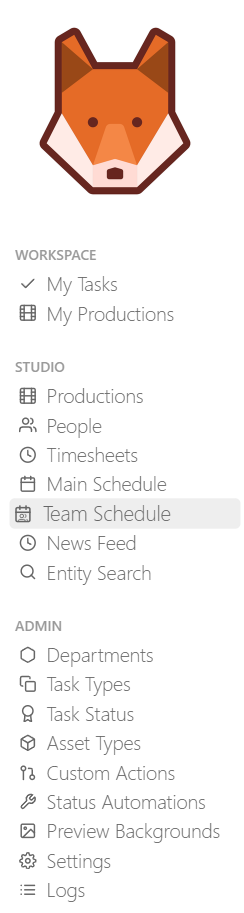
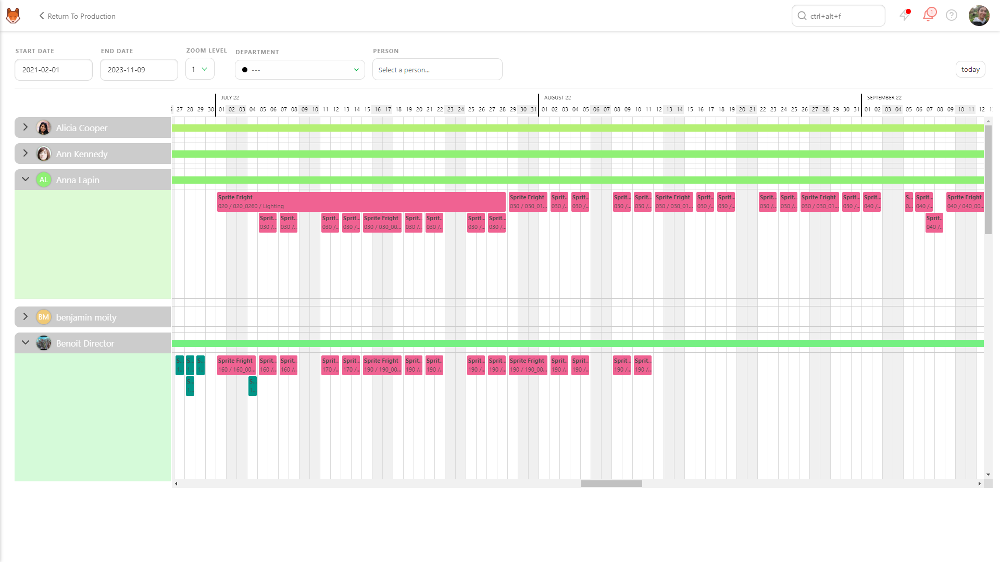

# Schedules

## Production Schedule

As Studio Manager, you can set the global Schedule as a reference for your production.

The main purpose of this Schedule is to keep track of the milestones link to your contract.

It's your **Reference schedule**.

To display the Schedule properly, you need first to create assets and shots and define your Task Types for your production.

On the drop-down menu, choose **SCHEDULE**

On top of the Schedule, you can see the start date (1) and the end date (2) you have defined when creating the production.

Click on the box to open the calendar and pick a date.

You can define, on the Gantt Schedule, the start and end date of each task type.
The task types are the ones you have already added to your production.

You can do it two ways, the first one is by moving the bar directly, the second way if entering date on the **setting page** under the **task type** section.

Put your cursor on the start date; the cursor changes as a double arrow. Then drag and slide the start date.
Do the same for the end date.

Once you have defined all the start and end dates of the task types, your Schedule should look like the example.

Once it's done, you can unfold each task type and access to a level of detail: asset type for the assets,
sequences for the shots.

You can select all the Gantt Diagramm bars and move them all at once, with **CRTL** + **Left Click**.

You can set the start and end date the same way as for the task type. You can define the work period for all the asset types.

You can do the same for the shots task types. You can determine the start and end date for the sequences.

You can add a milestone by hovering a date. A  appears,

When you click, a pop-up window appears and asks you to add a name to the milestone.

You can see a small black dot and a vertical line as a display of the milestone.
If you hoover the little black dot, the name of the milestone appears.

You can change the name of the milestone if you click on the , or anywhere on the milestone name.

From there on can rename the milestone or delete it.

Everybody has access to this page, but only the **Studio Manager** can modify it.

Now to go to further detail and keep track of the tasks, you can click on the task type's name.

It will lead you to the **Schedule** tab of the task type page.

## Set a Task Estimation

Click on the name of a task type.

The new page is the **Supervisor view**. You have more detailed information specific to this specific **task type**.

To go further in detail with the Supervisor view :
- (1) You can see and change the status of a task
- (2) You can assign people to tasks

(1) and (2) are filled with the action menu.

- (3) You can add an estimation for the task (in day unit)
- (4) Kitsu calculate the sum of the timesheet fed by the artists
- (5) The number of back and forth with the retake status
- (6) You can add a start date for the task (with the calendar)
- (7) Kitsu calculate the due date with the Start Date and the estimation
- (8)(9) the Wip and Validation dates are automatically filled
- (10) the Last comment section help you to keep an eye on the last activity of this task type.

(7) to (10) is automatically filled.

To add an estimation to a task, click on the line, and type the number of days you estimate. You can select multiple assets or shots at the same time.

You can also define a **Start date** by clicking on it.
A calendar will open and let you choose your start date.

The **Due date** is automatically calculated with the **Estimation**.

To help you to set a correct estimation, you can use the **Estimation** Tab.

On the left part of the screen is the list of the shots with the assignation and the number of frames (1).
Depending on the **FPS** you have set for the production, the number of **Seconds** will be automatically calculated (2).
(See how to set your production fps [Create your first production]((../getting-started-production/README.md#create-your-first-production) )

 On the right part of the screen, you can see the full team of the department (depending on the assignations you made), the number of shots they have to do, the number of frames, seconds, and the average quota.

 And the last column is the **Estimation**, to modify the estimation, hoover the line with your mouse and click and the editing zone.

 You can also select multiple shots at the same time to edit them all the once.

 

 Every time you change the **Estimation** in day on the right part, you can see in real-time that the **Average Quota** is updated.

 For more information about the **Schedule** tab, go to the
 [Task Type Schedule](#task-type-schedule)

## Task Type Schedule

If you need more details than the production schedule, you can go to the **Task Type** page.

You can notice there are tabs on the page, Tasks, **Schedule**, and estimation. Click on the
**Tasks** or **Schedule** tab.

There are two ways to set the artist's Schedule.

The first way is with the **Tasks** tab, by setting the estimation time and the **Start date**.
The **Due date** is filled automatically. If you navigate the **Schedule** tab, you will see
the Gantt diagram is filled automatically.

You are only allowed on the **Schedule** Tab to slide the bar and change the **Start date** (or **Due date**). The length of the task is set by the **MD**.

**Once the estimation is set from the Tasks tab, you can change it by editing the MD column on the schedule tab**.

The second way is to set the length directly (**Estimation**), **Start date**, and the **Due Date** from the Gantt diagram.

Put your cursor on the start date, and the cursor changes as a double arrow. Then drag and slide the start date.
Define your **Due date** by filling the **MD**.

You can use the search bar (1) as on the other pages: you can search **status**
(no need to add the name of the task type as you already are on a specific task type page),
per **asset type** (or sequence), per **asset name** (or shot name), and per **Artist name**.

You can also reduce or expand each Artist (2) section to ease the reading of the Schedule.

You can change the color of the bar in the Gantt diagram (3). Per default, the **coloring** is set in Status Color.

**Status color** changes the color of the bar based on their status. For example, Blue is for WIP; red is for RETAKE,
purple for Waiting For Approval, green is for Done.

In a glimpse, you can see the state of your elements and team.

**Late in red** display the task that is not validated yet, but they are behind Schedule, Due Date is passed.

The Gantt diagram has an impact on the other pages on Kitsu.

The **Start date** and the **Due date** are displayed on the **Tasks** tab of the task type page.

But you can also see the **Due date** and **Estimation** days on the **Todo Page** of an Artist.

Everybody has access to this page, but only the **Studio Manager** can modify it.

## Studio Schedule

As a production manager, you have access to the Studio Schedule.
The schedules of all the production are in one place and help you prepare your productions better.

Go to the main menu (  ) and click on **Main Schedule** under the **Studio** section.

You see all your production in one line (start and end date of the production).
You can also have a total of the main-day you have planned to use during this timeframe.
You can also see the **milestones** that you have defined for each production.

You can unfold each production to see the detail of each task type.
The color is the same as the column on the global pages.

**An important thing to keep in mind**: you can't modify your production schedule from this page. You have to go back to the production schedule page you want to adjust to doing it.

Only the **Studio Manager** has access to this page.

## Team Schedule

As a Studio Manager you need to have a constant look into what is happening with the team.

For that you need a global view of each department, the best way is to go to the Team Schedule.

Go to the main menu (  ) and click on **Team Schedule** under the **Studio** section.

You will see all the people of the studio, one line each.

On the top of the page you can select the timeframe you want to display **Start Date**, **End Date**, you can also select the **Zoom Level**.

You can also focus on a specific **Deparment** and/or a specific **Person**.

If an artist has several task to do at the same time, the tasks will be on top of each other.

You can select each task and move them around. Theses tasks are linked to the **task type schedule**.

