# Batch Action

## Create assets from a CSV spreadsheet file

You may already have your asset list ready in a spreadsheet file.
With Kitsu, you have two ways to import them; the first is to import a `.csv` file directly, the second is to copy-paste your data directly into Kitsu.

First, save your spreadsheet as a `.csv` file.

Then, go back to the asset page on Kitsu, and click on the **Import** icon.

A pop-up window **Import data from a CSV** opens, click on **Browse** to pick your `.csv` file.

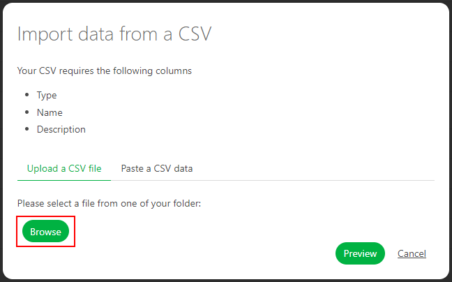

To see the result, click on the **Preview** button.
  
You can check and adjust the name of the columns with the preview of your data.
 
NB: the **Episode** column is only mandatory for a **TV Show** production.
 
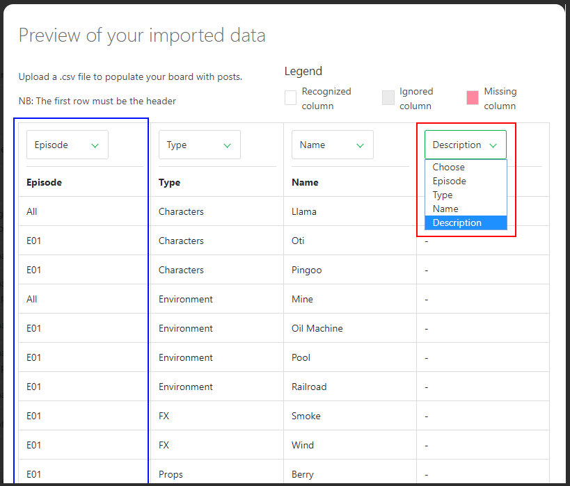

Once everything is good, click on the **Confirm** button to import your data into Kitsu.

Now, you have all your assets imported into Kitsu and the task created according to your **Settings**.

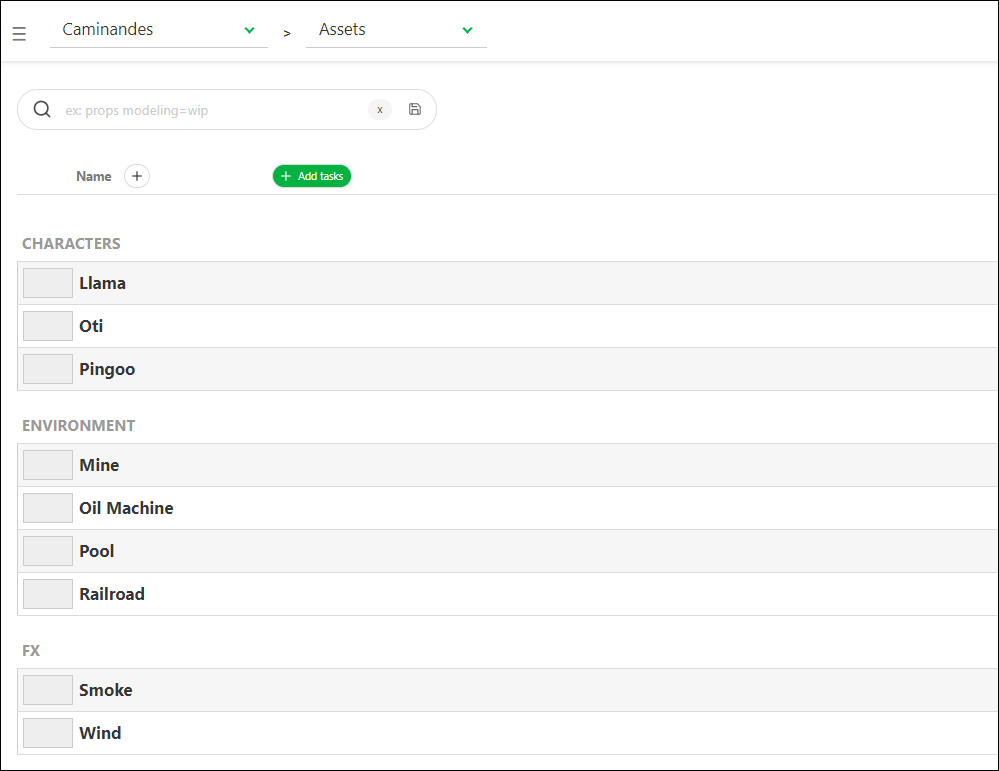

## Create assets by copy/paste a spreadsheet file

Open your spreadsheet, select your data and copy them.

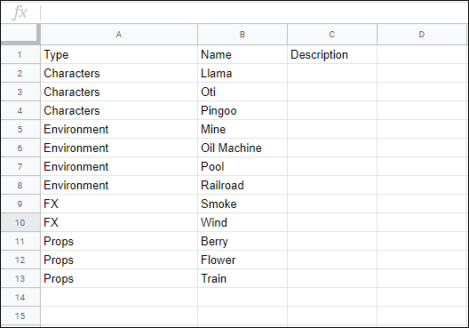

Then, go back to the asset page on Kitsu, and click on the **Import** icon 
.

A pop-up window **Import data from a CSV** opens, click on the **Paste a CSV data** tab.

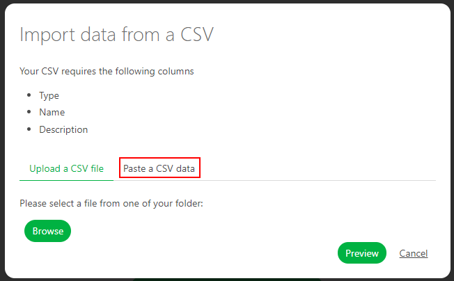
 
You can paste your previously selected data and see the result with the **Preview** button.
 
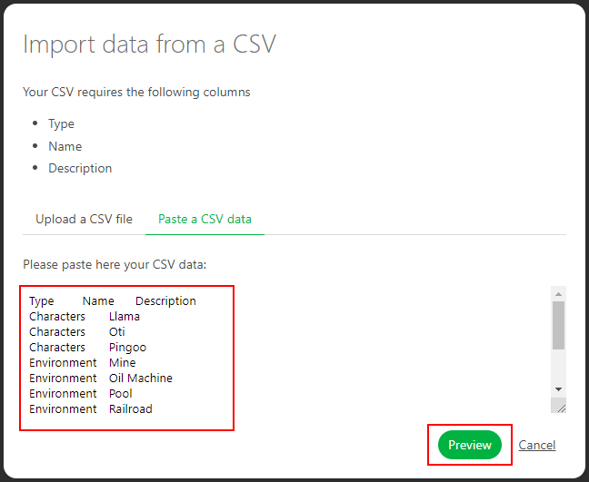
  
You can check and adjust the name of the columns with the preview of your data.
 
NB: the **Episode** column is only mandatory for a **TV Show** production.
 

Once everything is good, click on the **Confirm** button to import your data into Kitsu.

Now, you have all your assets imported into Kitsu and the task created according to your **Settings**.

## Update assets with the CSV import

You can use the CSV import to update your data quickly.

You need to switch on the option **Update existing data**. Then the lines that will be updated
will be highlighted in blue.

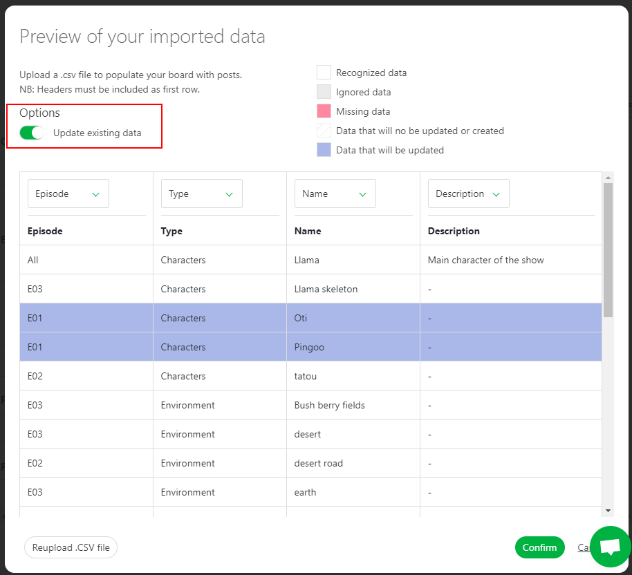

## Update assets by copy/paste a spreadsheet file

Open your spreadsheet, select your data and copy them.

Then, go back to the asset page on Kitsu, and click on the **Import** icon 
.

A pop-up window **Import data from a CSV** opens, click on the **Paste a CSV data** tab.

 
You can paste your previously selected data and see the result with the **Preview** button.
 

  
You can check and adjust the name of the columns with the preview of your data.

NB: the **Episode** column is only mandatory for a **TV Show** production. 
 
You need to switch on the option **Update existing data**. Then the lines that will be updated
will be highlighted in blue.

Now, you have all your assets imported into Kitsu and the task created according to your **Settings**.

## Create shots from a CSV spreadsheet file

You may already have your shots list ready in a spreadsheet file.
With Kitsu, you have two ways to import them; the first is to import a `.csv` file directly, the second is to copy-paste your data directly into Kitsu.

First, save your spreadsheet as a `.csv` file.

Then, go back to the shot page on Kitsu, and click on the **Import** icon.

A pop-up window **Import data from a CSV** opens, click on **Browse** to pick your `.csv` file.

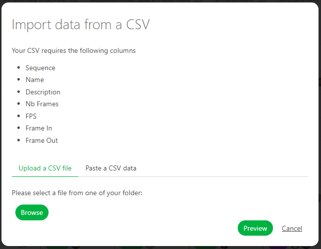

To see the result, click on the **Preview** button.
  
You can check and adjust the name of the columns with the preview of your data.
 
NB: the **Episode** column is only mandatory for a **TV Show** production.
 
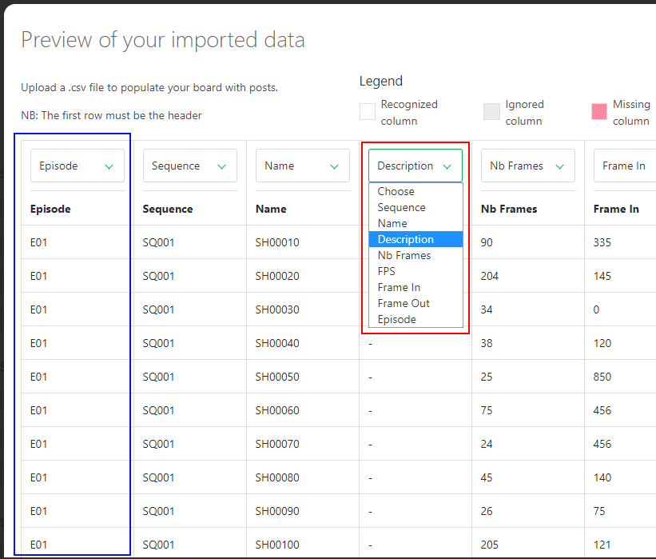

Once everything is good, click on the **Confirm** button to import your data into Kitsu.

Now, you have all your shots imported into Kitsu, and the task created according to your **Settings**.

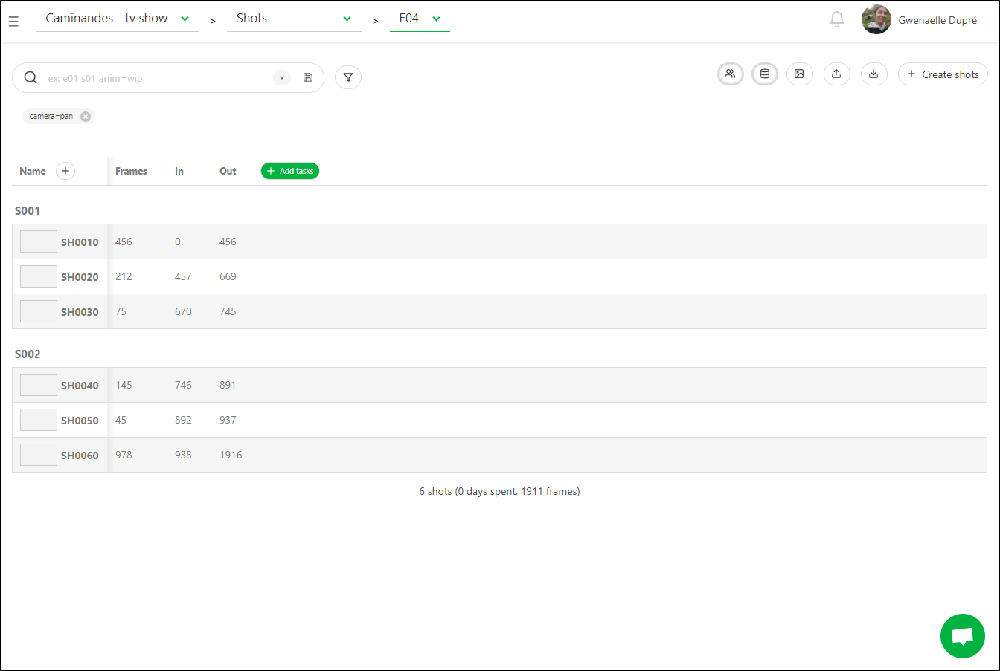

## Create shots with copy/paste a spreadsheet file

Open your spreadsheet, select your data and copy them.

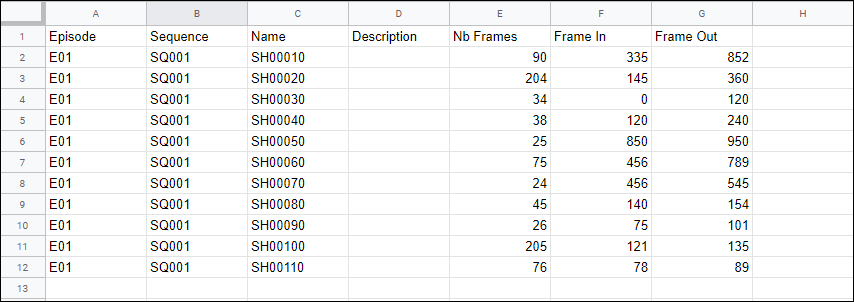

Then, go back to the shot page on Kitsu, and click on the **Import** icon 
.

A pop-up window **Import data from a CSV** opens, click on the **Paste a CSV data** tab.

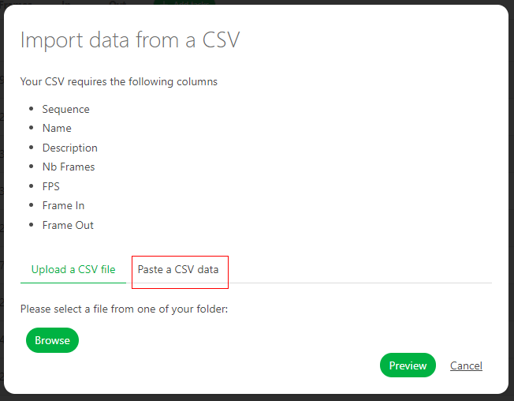
 
You can paste your previously selected data and see the result with the **Preview** button.
 
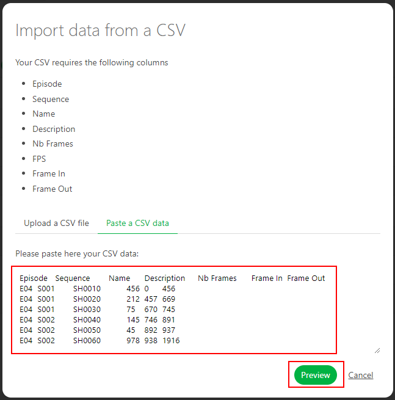
  
You can check and adjust the name of the columns with the preview of your data.
 
NB: the **Episode** column is only mandatory for a **TV Show** production.
 

Once everything is good, click on the **Confirm** button to import your data into Kitsu.

Now, you have all your shots imported into Kitsu, and the task created according to your **Settings**.

## Update Shots information with CSV Import

You can use the **CSV Import** to update your data as the **NB Frames**, **Frame IN**, **Frame Out** or any **Custom Column**

Open your spreadsheet, select your data and copy them.

Then, go back to the shot page on Kitsu, and click on the **Import** icon 
.

A pop-up window **Import data from a CSV** opens, click on the **Paste a CSV data** tab.

 
You can paste your previously selected data and see the result with the **Preview** button.
 

  
You need to switch on the **Option: Update existing data**.
the updated shots will be in blue

 
NB: the **Episode** column is only mandatory for a **TV Show** production.
 
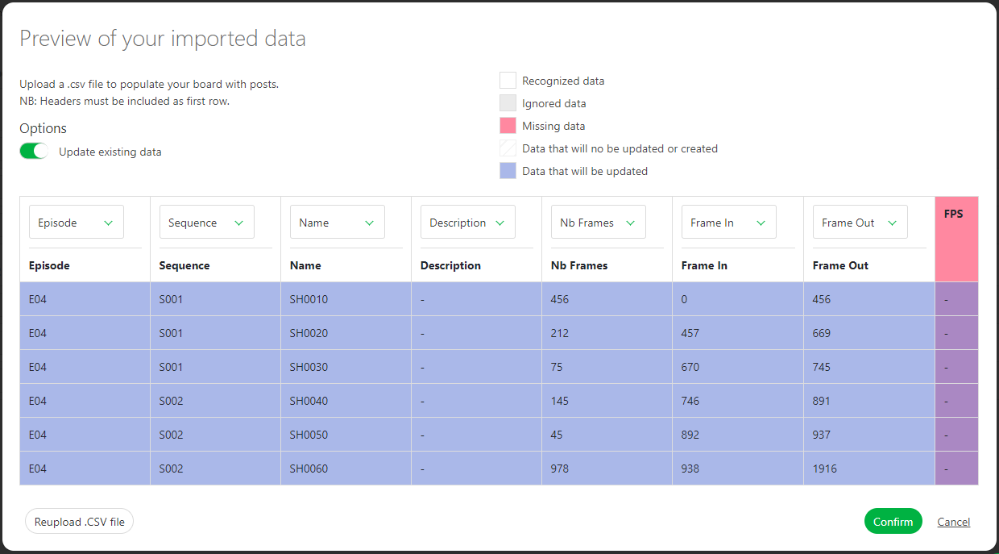

Once everything is good, click on the **Confirm** button to import your data into Kitsu.

Now, you have all your shots imported into Kitsu, and the task created according to your **Settings**.

## Create a breakdown list from a CSV file

You may already have your breakdown list ready in a spreadsheet file. With Kitsu, you have two ways to import it; the first is to import a .`csv` file directly, the second is to copy-paste your data directly into Kitsu.

First, save your spreadsheet as a `.csv` file following Kitsu's recommendation.

Click on the **import** button 

A pop-up window **Import data from a CSV** opens, click on **Browse** to pick your `.csv` file.

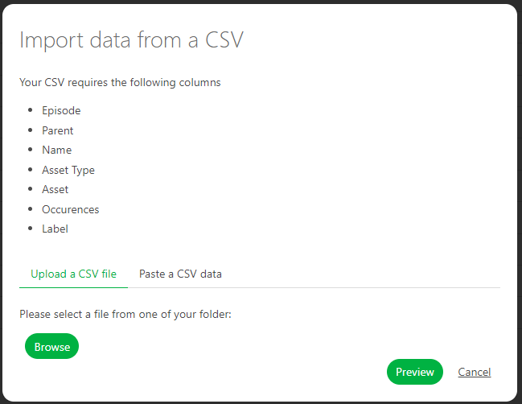

To see the result, click on the **Preview** button.

You can check and adjust the name of the columns with the preview of your data.

NB: the **Episode** column is only mandatory for a **TV Show** production.

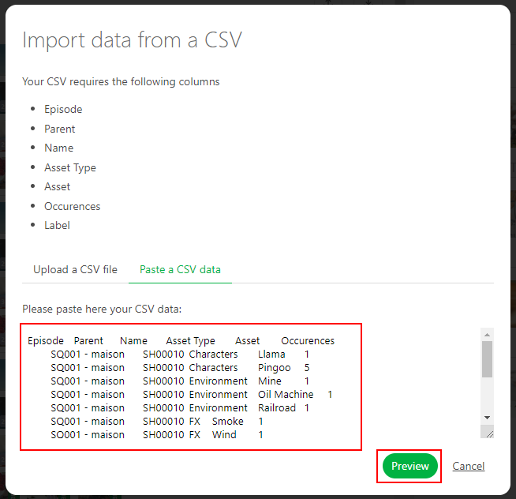

Once everything is good, click on the **Confirm** button to import your data into Kitsu.

Now, you have your breakdown imported into Kitsu.

## Create a breakdown list with copy/paste a spreadsheet file

Open your spreadsheet, select your data and copy them.

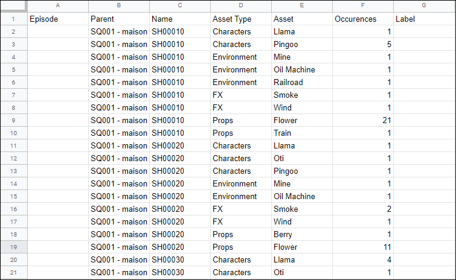

Then, go back to the breakdown page on Kitsu, and click on the **Import** icon 
.

A pop-up window **Import data from a CSV** opens, click on the **Paste a CSV data** tab.

 
You can paste your previously selected data and see the result with the **Preview** button.
 

  
You can check and adjust the name of the columns with the preview of your data.
 
NB: the **Episode** column is only mandatory for a **TV Show** production.
 

Once everything is good, click on the **Confirm** button to import your data into Kitsu.

Now, you have all your assets imported into Kitsu.

## Add employees from a CSV spreadsheet file

You may already have your employee list ready in a spreadsheet file.
With Kitsu, you have two ways to import them; the first is to import a `.csv` file directly, the second is to copy-paste your data directly into Kitsu.

First, save your spreadsheet as a `.csv` file.

Then, go back to the people page on Kitsu, and click on the **Import** icon.

A pop-up window **Import data from a CSV** opens, click on **Browse** to pick your `.csv` file.

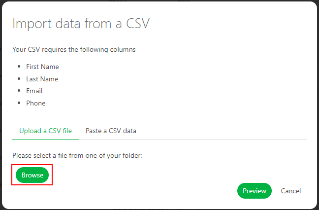

To see the result, click on the **Preview** button.
  
You can check and adjust the name of the columns with the preview of your data.

NB: the **Role** column is not mandatory.
 
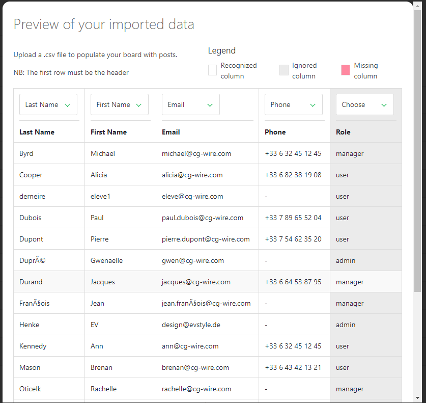

Once everything is good, click on the **Confirm** button to import your data into Kitsu.

Now, you have all your people imported into Kitsu.

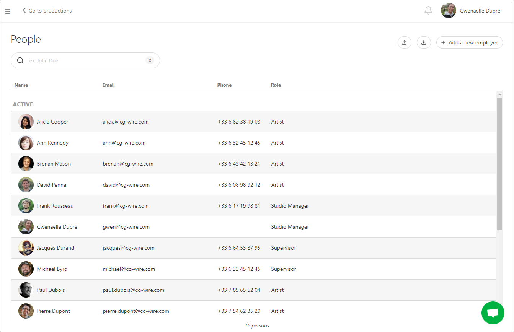

## Add batch of thumbnails (and previews)

You can use the **Add Thumbnails** button  on the global page to massively import thumbnails.

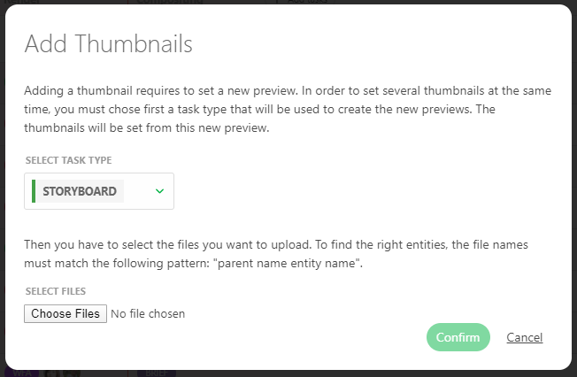

A new pop-up opens and asks you to choose which task types the thumbnails are linked.

**Thumbnails batch import accept images files and video files**.

For the video files, only the first frame is used as the thumbnail.

You have to name your thumbnails as sequence_shot.

