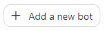
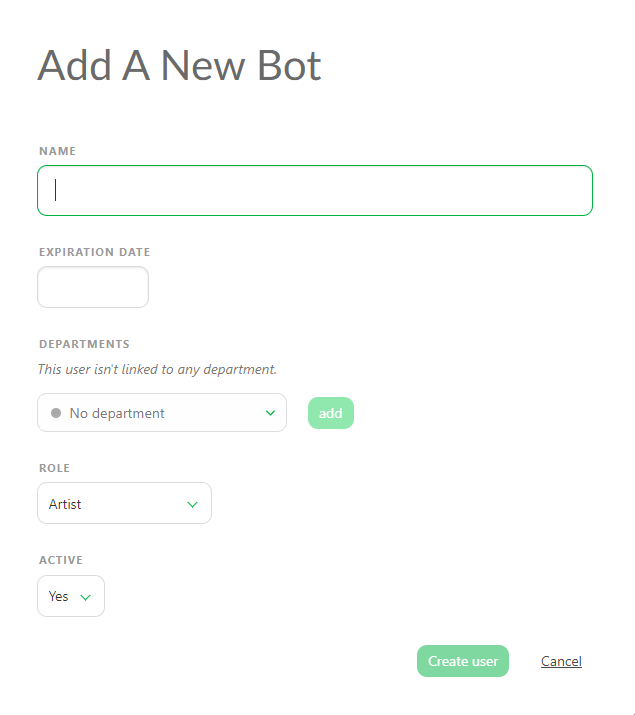

# Bots

Bots in Kitsu are non-physical users that can perform automated tasks, allowing you to run scripts and interact with Kitsu's API without logging in as a real user. 

::: tip
Bots do not count as active users, so you can create as many as you need, regardless of your subscription plan.
:::

## Why Use a Bot

The primary use of bots is for scripting with Gazu or other applications that can use the Kitsu API. Bots can access almost all API routes except those limited to real users.

**Key Benefits:**
- Perform automated tasks and scripts
- Interact with Kitsu's API
- Maintain system security by using tokens

## How to Create a Bot

::: warning
When you first create a bot, you will receive a **JWT token**. This token is crucial for connecting to the API, so make sure to keep it safe.
:::

1. **Navigate to the Bots Page:** On the Main Menu, under the Admin section, go to the Bots page.

    

2. **Add a New Bot:** Click on the  button. A pop-up window will appear where you can fill in the bot's details.

    - **Name:** Give your bot a name.
    - **Expiration Date:** Set an expiration date if needed.
    - **Departments:** Link the bot to a specific department.
    - **Role:** Define the role of the bot.
    - **Active:** Choose whether the bot is active or inactive.

    

3. **Create the Bot:** Fill in the details and click **Create user**.

    

 A new pop-up will display the bot's **API token**.

 

## Managing Bots

On the Bots page, you can manage your bots just like any user, such as:
- Assigning a role
- Setting an expiration date
- Changing their status to active or inactive

## Example Bot Usage

Here is an example script to retrieve the entire project **MyProduction** using a bot:

```js
import gazu
gazu.set_host("yourkitsu.cg-wire.com/api/")
gazu.set_token("my_jwt_token")
p = gazu.project.get_project_by_name("MyProduction")
```

This script demonstrates how to use a bot to interact with the Kitsu API without using a real user's login credentials. Depending on your needs, if you have a bot that publishes comments, you can think about permission and give it the same rights as a physical user.

## Security Considerations

If your bot's token is compromised, you can regenerate a new token, which will revoke the old one, ensuring your system remains secure.