# Getting started with Kitsu

With Kitsu, you can collaborate and track all kinds of productions: 2D, 3D Production, VFX, Video Games, etc.

It can be as short as a still-frame advertisement or as long as a 3h feature film, from one to thousands of elements.

But before jumping into our production, we must configure our **Studio Workflow**.

::: warning Definition
The Workflow is the coordination of the tasks that make up the work of a production.
:::

For example, you will do the modeling, rigging, and shading to complete an asset in a CGI production.

::: warning Definition
Modeling, shading, etc., are called **Task Type** in Kitsu; an asset, shot, etc., are called **Entities**.
A **task** intersects a **task type** and an **entities**.
:::

The chain of these 3 tasks is your **asset workflow**. Each task will be then **assigned to an artist**.

Once you have determined your assets workflow, you will do the same for the shots, sequences, etc.

Once your tasks workflow is defined, the next step is to think about your **Approval Workflow**.
It means to define all the statuses you will use to communicate with your team.

Status will also be useful for tracking the progress of your production.

The Workflow of your production is the sum of your Tasks and Status.

In Kitsu, you have two kinds of **libraries**:
- The first is the **Global Library** at the studio level.
Only the Studio manager has access to it.

- The second is the **Production Library**, where you will pick elements created in the global library to fill out.

The idea is to keep each production separated with a specific workflow.

You can create and modify the department, task type, task status, asset type, and status automation on the **Global Library**.

You can create as many elements as needed, give the name you want, and choose the best color and options that fit your needs.

Once your **Global Library** is populated, you can fill the **Production Library** with the newly created element from the **Global Library**.

## Create Departments

Departments are here to help the supervisors and artists to focus on their tasks.
Once they are linked to one or several departments, supervisors, and artists will have direct access to their
 filtered view, and departments also act on the permissions.

::: tip 
Per default, Kitsu provides some examples to help you get started.
:::

The department is the first element to set, as you will find multiple other elements linked to the department (such as people, task type, etc.). 

On the main menu  select the
**DEPARTMENT** page under the **Admin** section.

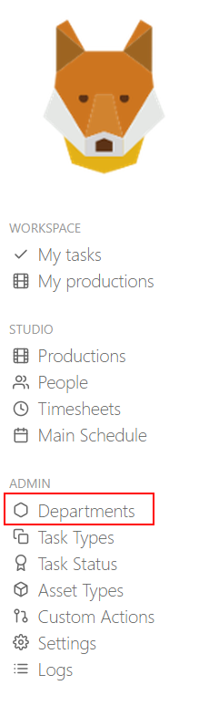

If you need more departments, you can create new ones. Click on the  button.

To add a department, you need

- The name of the department
- A color (it will be displayed as a small round next to a column task type or a custom column)

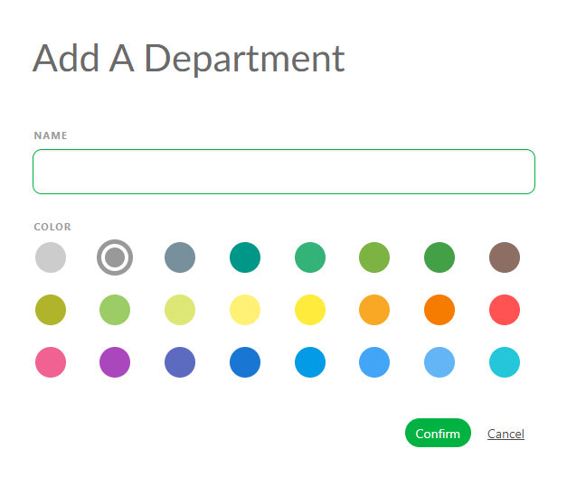

Click on **Confirm** to save your changes.

Once you finish creating the department, the page should look like this.

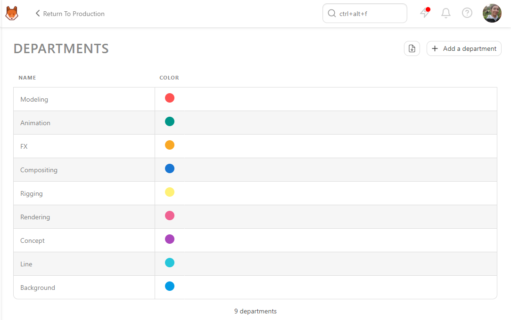

## Studio Workflow: Create a New Task Type

Let's create all the **Task Types** we need to do and track our production.
It could be for the assets, shots, sequences, episode or edit.

On the main menu  select
the **TASK TYPES** page under the **Admin** section.

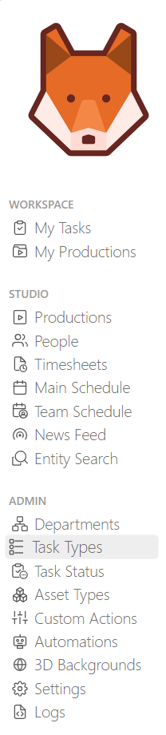

::: tip 
By default, Kitsu already provides some examples of task types for CGI production.
:::

You can notice these **Task Types** are already linked to a department.

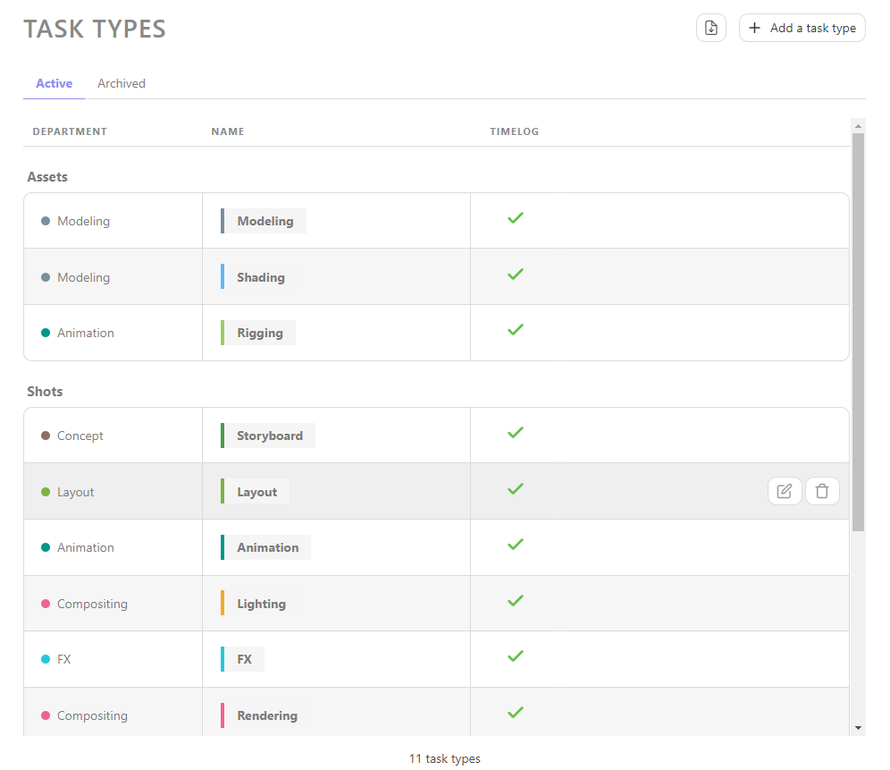

You can click on it if you need to add more **Task Type** 
button.

On the new pop-up, you can define your personalized task:

- The name of the task type
- For which entity it is used
- If the artists need to time log their work for tasks with this task type
- To which department is it linked
- The color (it will be the background color on the main spreadsheet page)

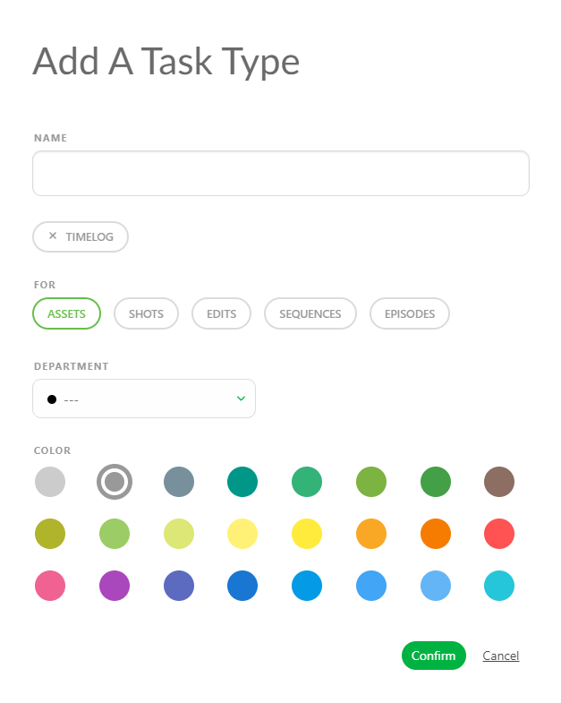

You can notice the **Department** option. You can select any previously created department to link to this specific task type.

The department will help people and task types to get organized.

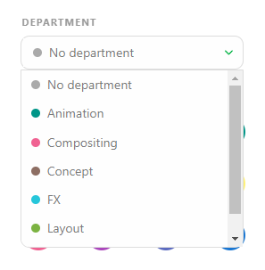

Click on **Confirm** to save your changes.

::: warning 
The new task type will be at the bottom of the list.
:::

To change the order, grab the **Task Type** and move it to its rightful place.

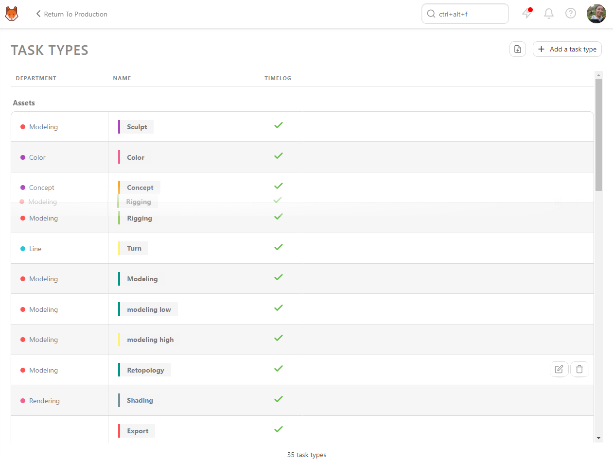

Now, your task is created on your **Global Library**. 

::: warning
You need to add the **Sequence**, **Episode** and **Edit** task types to your **Production Library** once you have created your production.
:::

::: tip
At any point during the production, you can return here and create more **Task Type** if needed, 
and then add them to your production.
:::

## Specific Asset Types Workflow

Once you have created your global Workflow, you should be more specific about the assets.

Assets need to be organized, as the shots are organized per sequence. Think about the **Asset Type** 
as folders to keep all your assets gather per family.

On the main menu  select the
**ASSET TYPES** page under the **Admin** section.

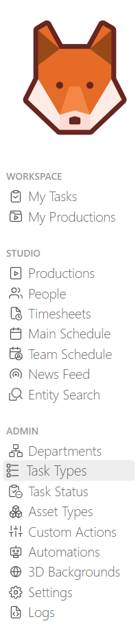

::: tip
By default, Kitsu already provides some examples of asset types for CGI production.
:::

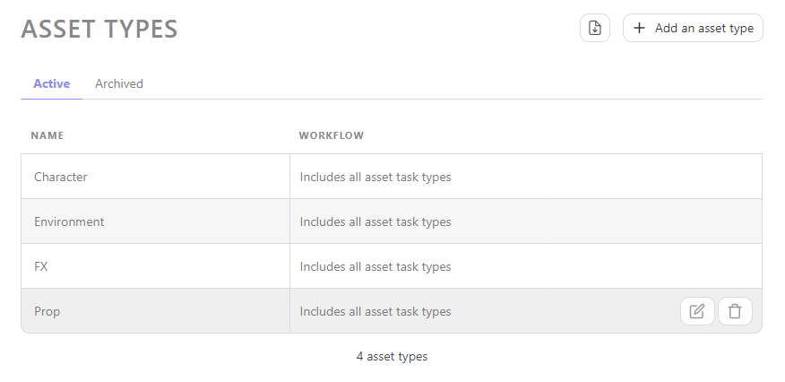

If you need more **Asset Type**, click on the  button.

On the new pop-up, you can define your personalized **Asset Type**:

- You can choose a name

- You can define a specific workflow.

All **Assets Types** won't behave the same way. For example, you may have fewer tasks for an **Environment** than a **Character**; you don't need the **Rigging** task.
 

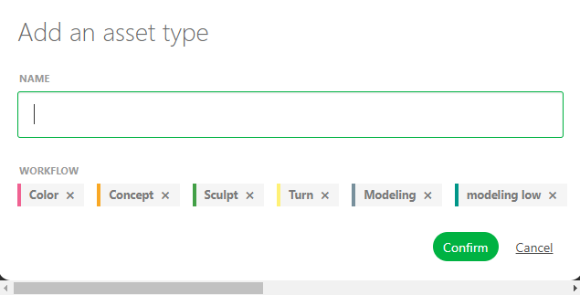

When you **create** or **edit** an **Asset Type**, you can add a specific **task type**; if you don't select a specific workflow for this asset type, your production asset workflow will be applied.

But if you choose specific **Task types** for this **Asset type**, only these will be applied to the production.

Click on **Confirm** to save your changes.

Your new **Asset Type** is now created on your **Global Library**. It will be available when you create your production.

::: tip
At any point during the production, you can return here and create more **Asset Type** if needed, 
and then add them to your production.
:::

## Approval Workflow: Task Status

Let's create all the statuses we need during our **Approval Workflow**.

The main point is to determine the situation behind the Status. 

On the main menu  select the
**TASK STATUS** page under the **Admin** section.

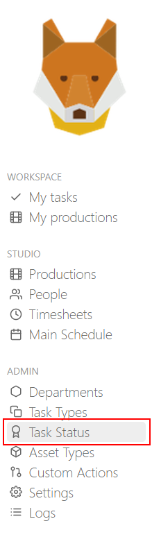

::: tip
Kitsu already provides examples of Task Status.
:::

For example, the **Ready**  status. In our example, it means that the artists have everything 
they need to start working, and shouldn't start their work without.

**Wip** : Work in Progress status is used by the artists to let their team and producer 
they are actively working on the task right now, so there is no need to assign it to someone else.

**WFA**: Waiting for approval status is used by the artists to let their supervisors know that they have finished their work and they are waiting for a review.
The supervisor can also use an alternative to this Status to let the directors know that everything is ready for them.

**Done** : Everything is validated. Congrats and the next step can begin.

**Retake** : A comment is made; the artists need to keep working on their work and publish a new version until validation.

These **Status** are the only examples of what is doable in Kitsu. Feel free to create your own.

On the main page, click on the  button.

On the new pop-up, you can define your personalized **Task Status**.

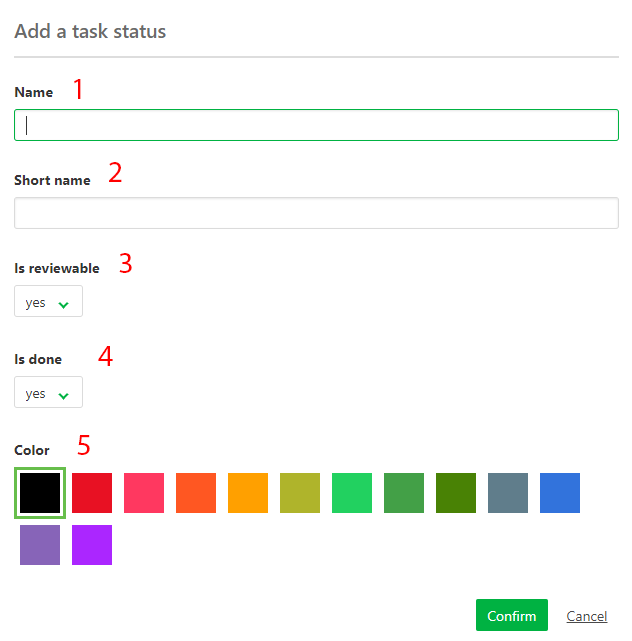

- **NAME**, the explicit name of the Status that will be displayed if you keep your mouse on top of the Status.
- **SHORT NAME**, what will be displayed in Kitsu
- **IS DEFAULT**, the first Status Kitsu will display per default on all the tasks. You can have only **ONE** default status in Kitsu.
- **IS DONE**: If this Status is used to validate a task (useful for the quota, to clean the todo list, and episode stat page)
- **HAS RETAKE VALUE** If this Status is used to comment on a task (useful to keep track of the back and forth in the task type page and for the episode stats page)
- **IS ARTIST ALLOWED**  Can the artist use this Status? If **No**, the artist won't see this Status on his list. But he can post on top of it.
- **IS CLIENT ALLOWED** Can the client use this Status? If **No**, the client won't see this Status on his list
- **IS FEEDBACK REQUEST** If this Status is used to ask for a review (useful to keep track of the quotas if you don't use a timesheet, it will appear in the Pending tab of the todo list, and all these statuses will be gathered on the **My Check** page. Kitsu will ask you to **publish a preview** each time you use this Status.
- Choose a background **COLOR** you like for this status

Click on **Confirm** to save your changes.

Now your **Status** is created on your **Global Library**; it will be available when you create your production.

::: tip
At any point during the production, you can return here and create more **Task Status** if needed, 
and then add them to your production.
:::

::: warning
Notice that you can modify Concept Status here but you can't create a new one.
:::

## Automation

### Create a New Status Automation

**Status Automation** is here to do the heavy lifting for you.

You can create **Status Automation** for the asset and the shot tasks.

For the **Asset**, you can create **Status Automation** between tasks.
For example, the modeling status must be ready when the Concept is validated.

You can also create **Status Automation** that changes the **Asset Status** according to a task status; for example, when the Concept is validated, the asset is ready for the storyboard.

Go to the main menu   and select **Automation**.

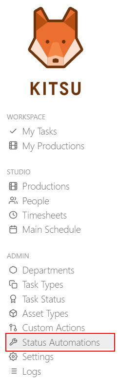

Once on the new page, you can create **Status Automation** by clicking the **+Add status automation** button.

You can choose between creating **Status Automation** for the **asset** or the **shot**.

Then, you can choose the **task type** and the **Status** that will trigger the Automation.

Then, you can select which **Task Type** will react to the Automation
and choose the **Status** that will be changed.

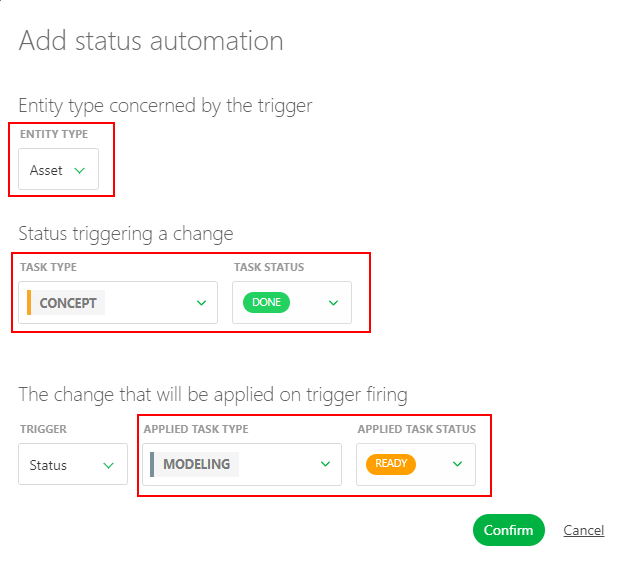

To trigger the change of **Ready For** Status, you need to change the trigger from Status to **Ready For**.

You will notice the **Applied task type** will now display **Shot task type**.

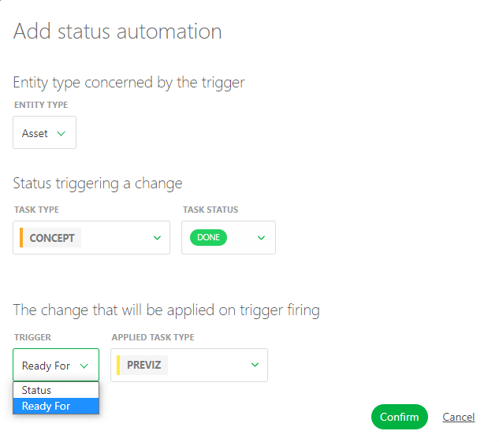

To create **Status Automation** for shots, you must change the **Entity Type** to shots.

Your new **Status Automation** is now created on your **Global Library**.

::: warning
You need to add them to your **Production Library** once you have created your production.
:::

::: tip
At any point during the production, you can return here and create more **Status Automation** if needed, 
and then add them to your production.
:::

## 3D Backgrounds

### Create your global library of HDR files

The **3D Backgrounds** help to better review your 3D file (`.GLB`) by adding an `.HDR` background.

`.GLB` is a binary file format, essentially a container for various 3D assets and resources. These assets can include 3D models, textures, materials, and animations.

::: warning Definition
It means you can review your 3D files with lighting information.
:::

In this section, you can create your own. `.HDR` files library that you can use in your production.

Go to the main menu , and select **3D Backgrounds**.

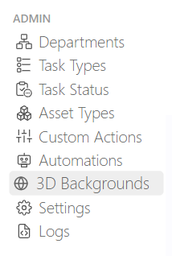

Once on the new page, you can add a `.HDR` Background by clicking the **+Add a new background** button.

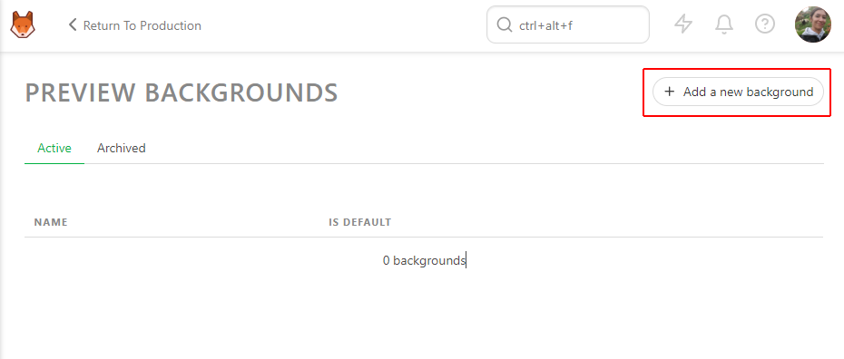

From here, you must select your `.HDR` Background, name it, and choose if you want this `.HDR` to be the default Background.

::: tip
Default means this HDR will be applied on the production instead of the grey background.
:::

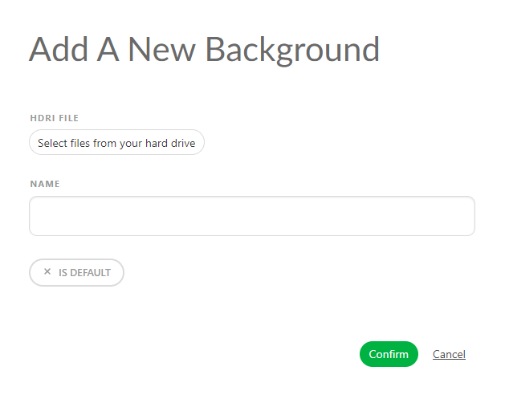

Once you have uploaded all your `.HDR` files, Kitsu will display them as a list.

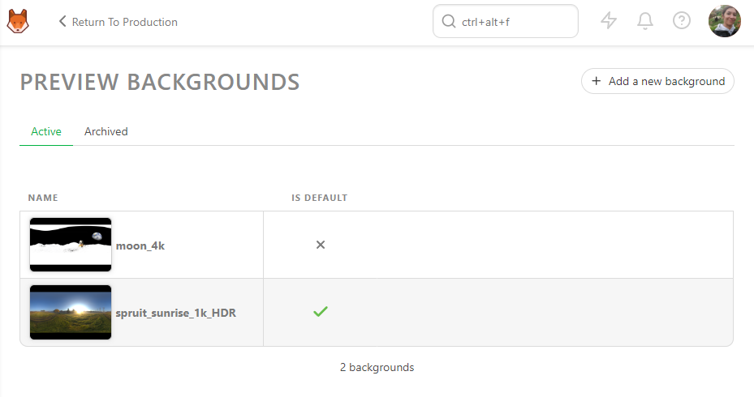

Your new **3D Background** is now created on your **Global Library**.

::: warning
You need to add them to your **Production Library** once you have created your production.
:::

## Change the Logo and Kitsu Setting

The next thing to do is set the logo on the main menu.

You can change the Kitsu logo for your studio logo.

Click on the main menu button 
, then under the **Admin** section, click on the **Settings**.

::: tip
Here, you will manage Kitsu's global settings.
:::

Click on the **Set studio logo** to select a picture.

You can also change the **Studio Name**.

You can change settings at the Kitsu / Studio level, impacting your whole studio. 

- How many hours per day should your team work?
- You can choose to use the original file name for downloads.
- Show the picture with HD quality by default. Use this option only if you have a very fast internet connection.
- About the timesheet, you can also lock the artists to modify their timesheets older than one week.

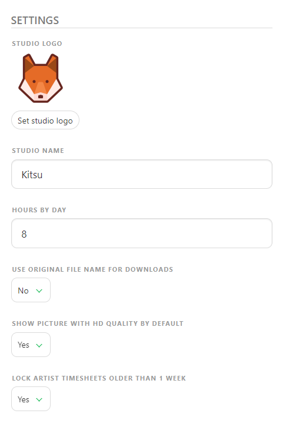

Note that you will also find the settings linked to the chat integration. Please refer to the **DEV section** to know more.

::: warning
Remember to **Save Settings** at the end when you are done.
:::