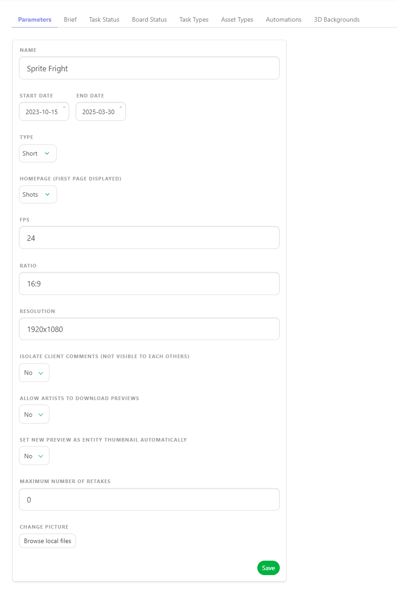
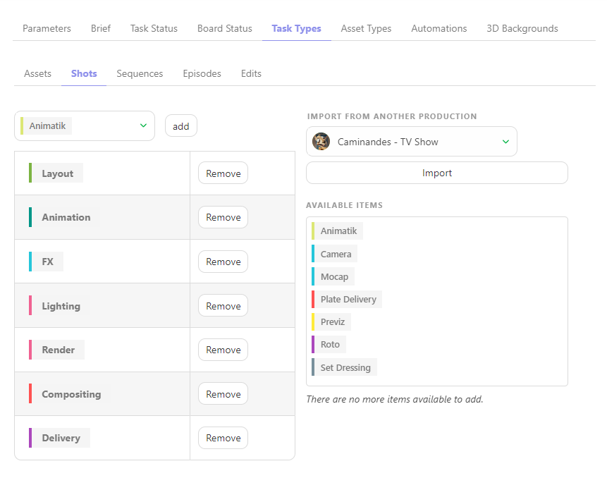
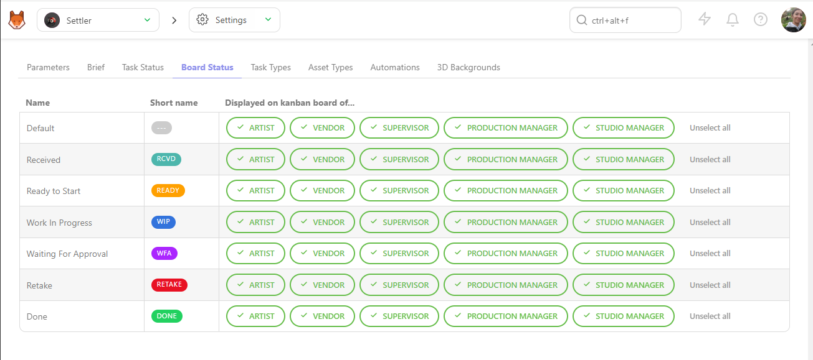
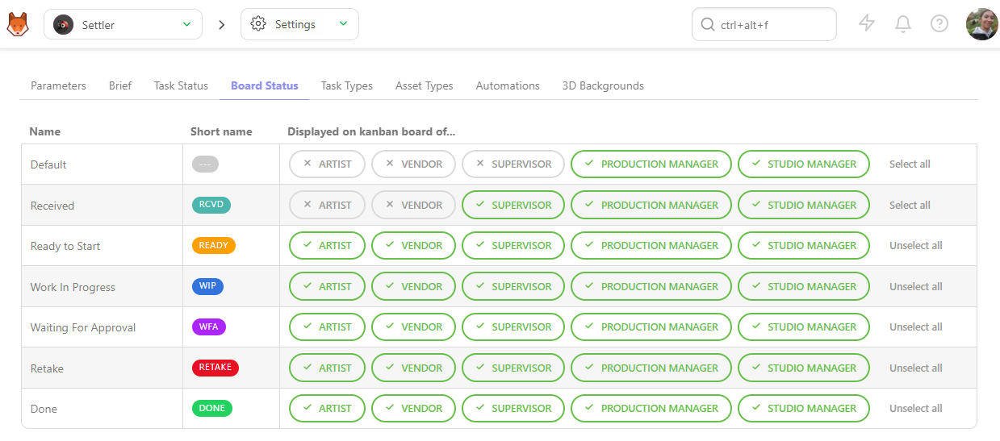
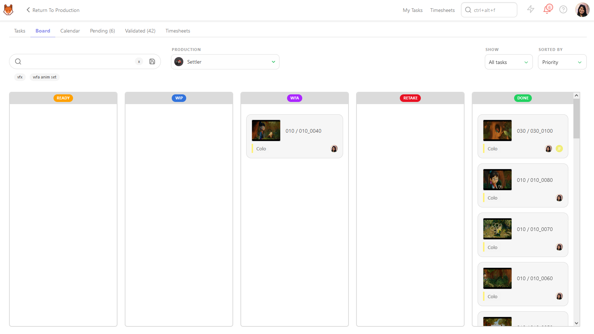

# Production Specific Workflow Settings

## Configure Production-Specific Settings
From the **Navigation Menu**, choose on the dropdown menu the **Setting**. 

The first tab, **Parameters** allows you to change the **Technical information** of the production.

::: warning
If you change the **FPS** or **Resolution** after uploading previews, the changes won't be applied; you must reupload the first previews.
:::

Here, you can enable specific options for the production as

- Isolate Client Comments (Not Visible To Each Other)

- Allow Artists To Download Previews

- Set New Preview As Entity Thumbnail Automatically

You can also specify the **Maximum Number of Retakes** for this production.

::: tip
You can also change the avatar of the production on the **Parameters** tab.
:::

## Task Statuses
### Configuring Specific Task Types for a Production

On the **Navigation Menu**, choose on the dropdown menu the **Setting**. 

Per default, Kitsu will load the **Task Status** you have defined when creating the production.

However, you can add or remove specific statuses during production if they are created on the Global Library first.

On the **Task Status** tab, you can choose which **status** you want to add or remove on this production, 
validate your choice with the **add** button.

## Task Types
### Enabling Specific Task Types for a Production

On the **Navigation Menu**, choose on the dropdown menu the **Setting**.

By default, Kitsu will add the **Task Types** you have chosen when creating the production.

However, you can add or remove specific **Task Types** if they are created on the Global Library first.

For example, you can import the task workflow from another production in your library.

On the **Task Types** tab, you can choose which production or task type you want to import  or remove on this production, 
validate your choice with the **Import** button.

::: warning
If you had a new task type **AFTER** creating an asset or shot, here is the **DELIVERY** task type.

You need to **add this task type** on the global page.

A pop-in will appear, and you must select the new task type on the dropdown menu.

Validate with **Confirm**.

:::

## Asset Types
### Enabling Specific Asset Types for a Production

On the **Navigation Menu**, choose on the dropdown menu the **Setting**.

Per default, Kitsu will load the **Asset Types** you have defined when creating the production.

However, you can add or remove specific Asset Types if they are created on the Global Library first.

On the **Asset Types** tab, you can choose which **Asset Types** you want to add or remove on this production, 
validate your choice with the **add** button.

## Status Automation
### Configuring Status Automation for a Production

On the **Navigation Menu**, choose on the dropdown menu the **Setting**.

Per default, Kitsu will load no **status automation** of your 
status automation **Global Library** into your **Production Library**.

But you can use only specific **Status Automation**, depending on your production type.

On the **Status Automation** tab, you can choose which automation you want to use on this production, 
validate your choice with the **add** button.

## Preview Backgrounds
### Select Specific Preview Background for a Production

On the **Navigation Menu**, choose on the dropdown menu the **Setting**.

On the **Preview Backgrounds** tab, you can choose which HDR file you want to add or remove on this production,

Validate your choice with the **add** button.

You can review your 3D file with an HDR background.

## Artist Board
### Artist Board Status Configuration

On the **Navigation Menu**, choose on the dropdown menu the **Setting**.

On the **Task Status** tab, you can reorder the status for the **Board** view.

Once it's done, go to the **Board Status** tab.

Here, you can choose who can see which status on the **Board view**

If you don't select the status properly, it can be overwhelming for the artists if they have too much choice.

Selecting the **Status** properly will make it easier for the artists.

