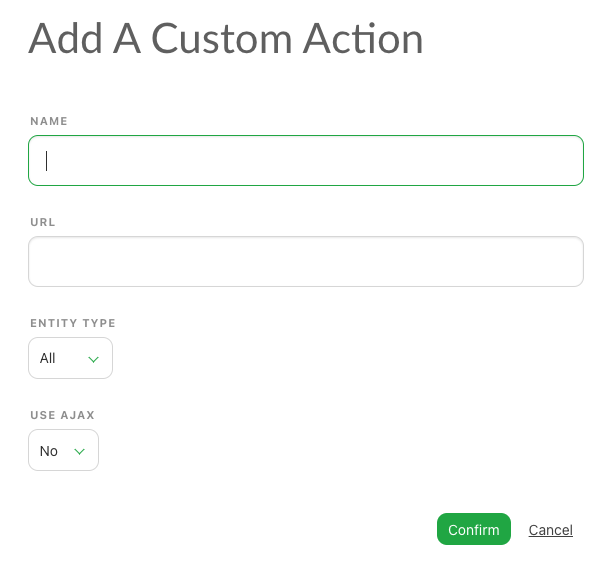

# Custom Actions

## What is a Custom Action?

A custom action is a simple HTTP request that sends information from your current Kitsu selection to a custom endpoint. Essentially, when a user is in the Kitsu UI, they can send a request to another server containing the IDs of the selected elements.

### Goal

The goal is to create an action outside of Kitsu (until a plugin system is available) without modifying the Kitsu/Zou core code. Essentially, it's a web request, usually a POST (but can be a GET) to a page or service you manage yourself. You catch the request and then perform an action with it.

Examples include:

- Debug page (displaying all accessible information for given objects, including field names, etc.)
- Launch render in CGRU or Flamenco
- Generate statistics pages for the APM
- Create special playlists
- Launch a custom protocol (with a service waiting for it) to start a video player, any DCC, etc.
- Integrate with an asset manager like Kabaret to open it at the right spot or launch some actions

Custom actions can be anything as long as you can catch the request (using, for example, a Python web server such as Flask or Tornado.web). They are designed to extend Kitsu to systems you control. 

Useful information is provided to whatever catches the request, such as the current selection, the page you were on, the user who launched the action, etc. You can adapt the response based on the provided information. 

Note that you can also run the custom action in the background (using an AJAX request instead of opening a new page) if you don't need to provide feedback to the user.


## How to Setup a Custom Action

### Creation

Only studio managers can set up a custom action. The custom action page is available in the right panel of the admin section.

When you have access to the custom action page, you can create a new action via the add button on the top right. The action creation requires four pieces of information:



- **Name**: The name of the action.
- **URL**: The target URL (we strongly recommend using the same domain as your Kitsu installation).
- **Entity Type**: For which kind of entity the custom action will be available.
- **Use AJAX**: Specify if the request must be sent as an AJAX request or as a form.

Once your action is created, it will be accessible in the action top bar. When a user selects tasks in the asset or shot lists, by going to the **Run custom action** section, they will be able to execute the custom action for the current selection.

### Data Sent via a Custom Action

Data is sent in JSON format. It contains an object with the following fields:

* `personid`: The ID of the user claiming the action.
* `personemail`:  The email of the user claiming the action.
* `projectid`:  The ID of the project of selected entities.
* `currentpath`:  Current url path in Kitsu web application.
* `currentserver`: Host of the Kitsu sending the custom action.
* `selection`:  List of selected task IDs.
* `entitytype`:  Type of entities for which tasks are selected.

Example:
```
{
  "personid": "b01bae1e-f829-458a-a1eb-131bb66628cc",
  "personemail": "admin@example.com",
  "projectid": "fa4d7f04-b8e0-4518-8dbc-2f24997ca76e",
  "currentpath": "/productions/fa4d7f04-b8e0-4518-8dbc-2f24997ca76e/assets",
  "currentserver": "localhost",
  "selection": "95c171e1-dfff-498f-93e3-548a739e3202",
  "entitytype": "asset"
}
```
