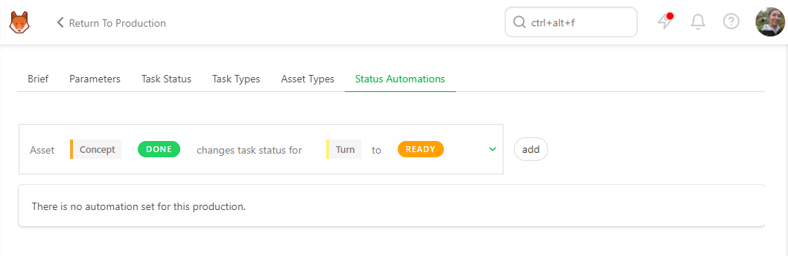
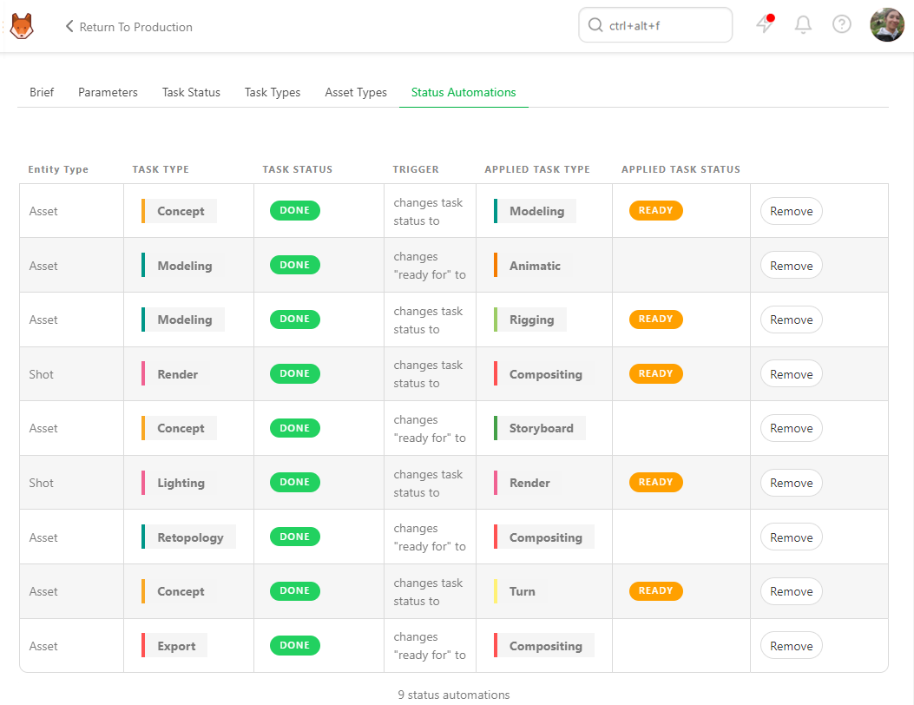

# Production Customization

## Select specific Task Status for a production

On the **Navigation Menu**, choose on the drop-down menu the **Setting**. 

Per default, Kitsu will load the Task Status you have defined when creating the production.

But you can choose to add or remove specific statuses during production.

On the **Task Status** tab, you can choose which status you want to add or remove on this production, 
validate your choice with the **add** button.

## Select specific Task Types for a production

On the **Navigation Menu**, choose on the drop-down menu the **Setting**.

By default, Kitsu will load the Task Types you must define when creating the production.

But you can choose to add or remove specific Task Types.

For example, you can create a 2D and A CGI workflow on your library and add the needed task types into this production.

On the **Task Types** tab, you can choose which status you want to add o remove on this production, 
validate your choice with the **add** button.

You can go back to the global asset or shot page and add the new **task type column** to your production.

## Select specific Asset Types for a production

On the **Navigation Menu**, choose on the drop-down menu the **Setting**.

Per default, Kitsu will load the Asset Types you have defined when creating the production.

But you can choose to add or remove specific Asset Types.

On the **Asset Types** tab, you can choose which Asset Types you want to add or remove on this production, 
validate your choice with the **add** button.

## Select specific Status Automation for a production

On the **Navigation Menu**, choose on the drop-down menu the **Setting**.

Per default, Kitsu will load no status automation of your status automation library into your production.

But you can choose to use only specific Task Types, depending on your production type.

For example, you can create a 2D and A CGI workflow on your library and add the needed task types into this production.

On the **Task Types** tab, you can choose which status you want to use on this production, 
validate your choice with the **add** button.

