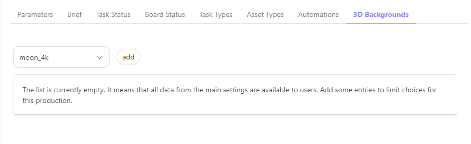
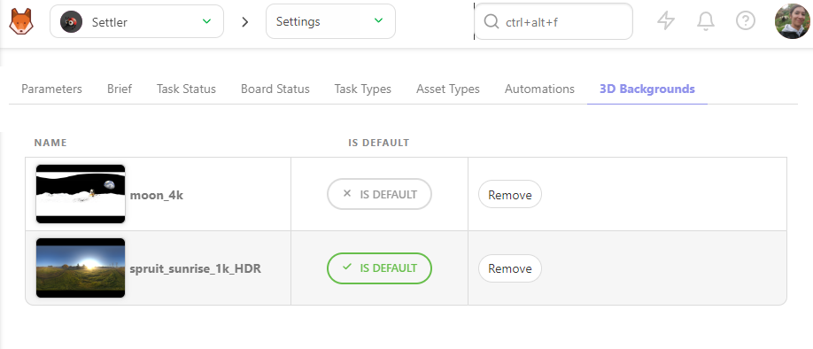

# Production Customization

## Select Specific Task Status for a Production

On the **Navigation Menu**, choose on the drop-down menu the **Setting**. 

Per default, Kitsu will load the **Task Status** you have defined when creating the production.

But you can choose to add or remove specific **statuses** during production if they are created on the **Global Library** first.

On the **Task Status** tab, you can choose which **status** you want to add or remove on this production, 
validate your choice with the **add** button.

## Select Specific Task Types for a Production

On the **Navigation Menu**, choose on the drop-down menu the **Setting**.

By default, Kitsu will load the **Task Types** you must define when creating the production.

But you can choose to add or remove specific **Task Types**, if they are created on the **Global Library** first.

For example, you can create a 2D and A CGI workflow on your library and add the needed task types into this production.

On the **Task Types** tab, you can choose which status you want to add o remove on this production, 
validate your choice with the **add** button.

You can go back to the global asset or shot page and add the new **task type column** to your production.

## Select Specific Asset Types for a Production

On the **Navigation Menu**, choose on the drop-down menu the **Setting**.

Per default, Kitsu will load the **Asset Types** you have defined when creating the production.

But you can choose to add or remove specific **Asset Types**, if they are created on the **Global Library** first.

On the **Asset Types** tab, you can choose which **Asset Types** you want to add or remove on this production, 
validate your choice with the **add** button.

## Select Specific Status Automation for a Production

On the **Navigation Menu**, choose on the drop-down menu the **Setting**.

Per default, Kitsu will load no **status automation** of your 
status automation **Global Library** into your **Production Library**.

But you can choose to use only specific **Status Automation**, depending on your production type.

On the **Status Automation** tab, you can choose which automation you want to use on this production, 
validate your choice with the **add** button.

## Select Specific Preview Background for a Production

On the **Navigation Menu**, choose on the drop-down menu the **Setting**.

On the **Preview Backgrounds** tab, you can choose which HDR file you want to add or remove on this production,

Validate your choice with the **add** button.

You can review your 3D file with an HDR background.

