# Departments

## Create departments

Departemnts are here to help the supervisors and artists to focus on their tasks.
Once they are link to one or several departments, supervisors and artists will have direct access to their
 filtered view. Deparments also act on the permissions.  

You can create as many ** Departments** you need.

On the main menu  select the 
**DEPARTMENT** page under the **Admin** section.

On the main page, you can create new departments. Click on the **+Add a department** button
.

To add a department, you need 

- (1) The name of the department
- (2) The color

Click on **Confirm** to save your changes.

Once you finish creating the department, the page should look like this.

## Modify departments

You can modify any **Department** you need.

On the main menu  select the 
**DEPARTMENT** page under the **Admin** section.

On the main page, you can edit all the departments already created 
.

You can change : 

- (1) The name of the department
- (2) The color

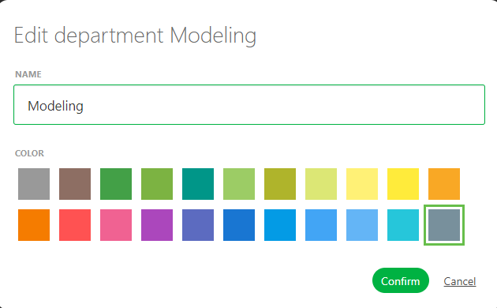

Click on **Confirm** to save your changes.

Once you finish modifying the department, the page should look like this.

## Organize your task types into Departments

You can now link your freshly created **Department** to **Task Types**.

On the main menu  select the 
**TASK TYPES** page under the **Admin** section.

You can notice the column on the left part of the screen **Department**.

You need to edit the **Task Types** to add **Department**

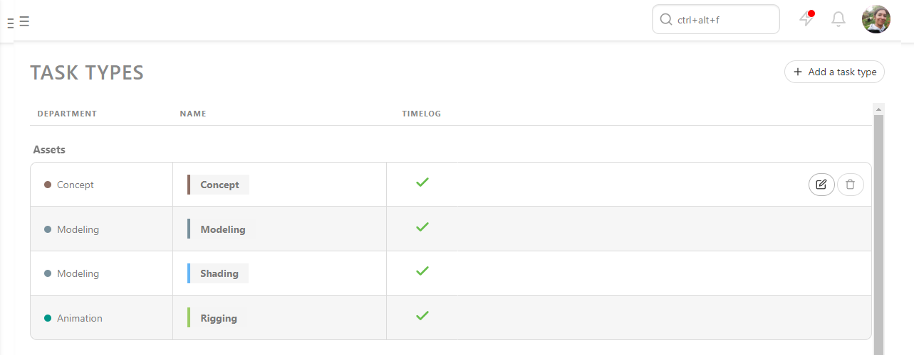

You can notice the **Department** option. You can select any previously created department to link to this specific task type.

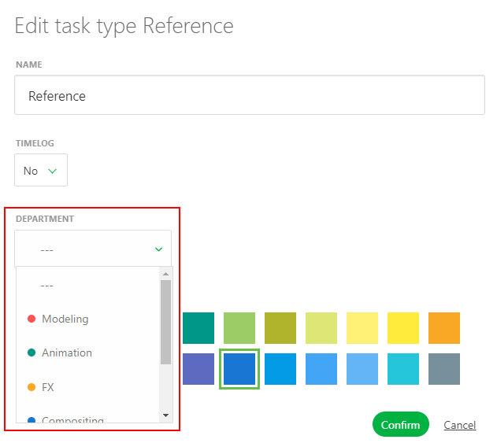

Once you're done, the **Task types** page should look like this.

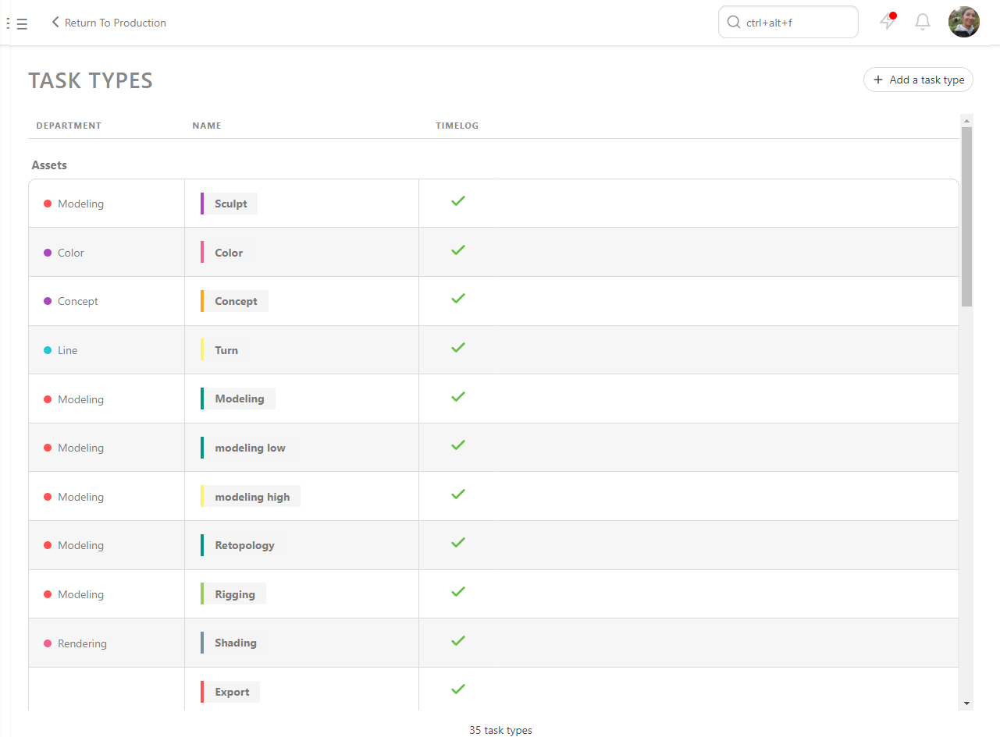

## Link people to departments

You can now link your freshly created **Department** to **People**.

On the main menu  select the 
**PEOPLE** page under the **Admin** section.

You can notice the empty column on the right part of the screen **Departments**.

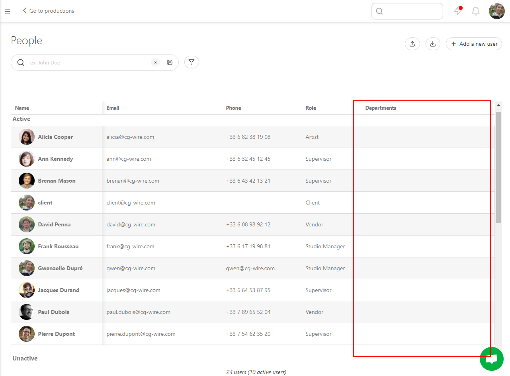

You need to edit directly a **People** entry to link a **Department** to this
person.

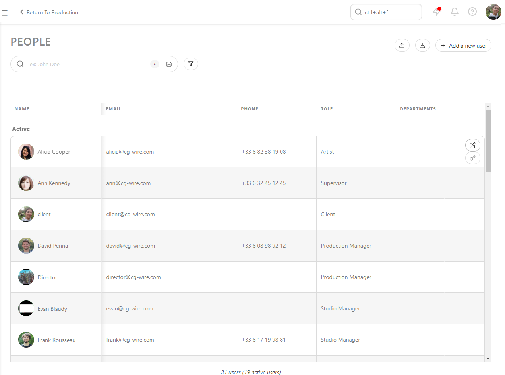

You can notice the **Department** option. You can select any previously created department to link to this specific task type.

Once you're done, the **People** page should look like this.

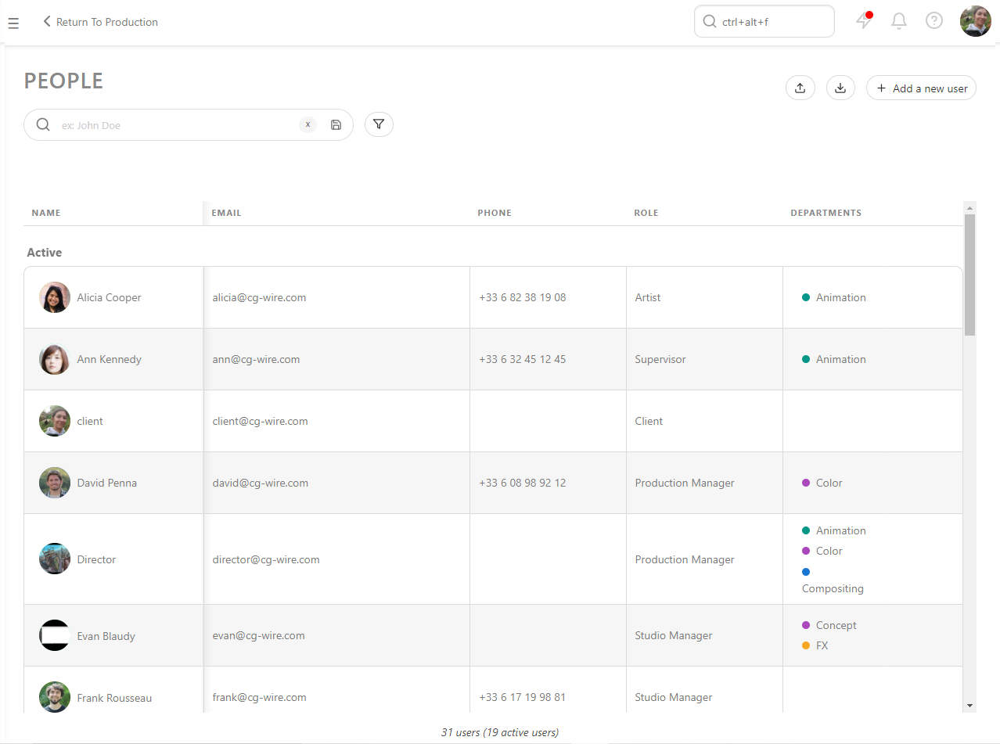

Once someone is linked to a deparment, the artist will have direct access to their deparment view on the global page.

Deparment supervisor will ba able to comment all the tasks from their department and assign only people from the same deparment(s).

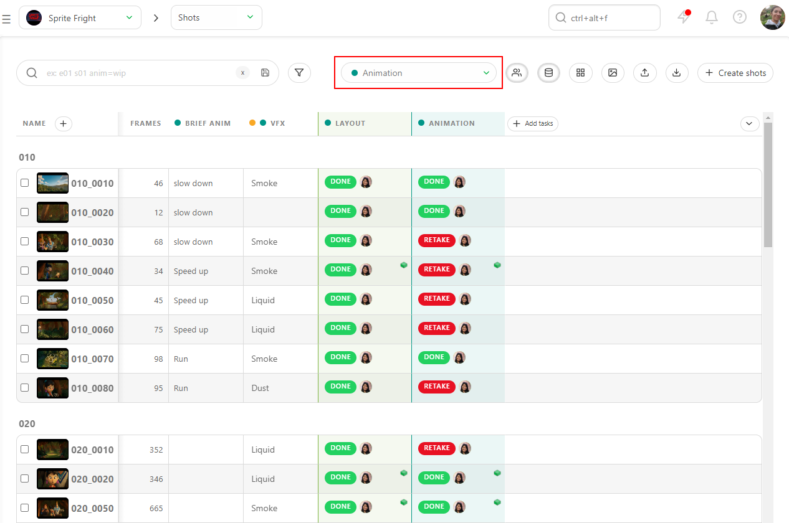

## Link custom column to department

You can now link your custom column to a **department**. This way this custom column will be seen on the department filtered view of the **Supervisor** and *Artist**.

On the global page of the asset or the shot, click on the arrow on the direct right of your custom column, and click on **Edit**

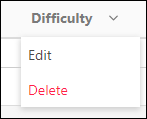

From there you can link the custom column to one or more department. Click on the department from the list and then click on **add** to be effective.

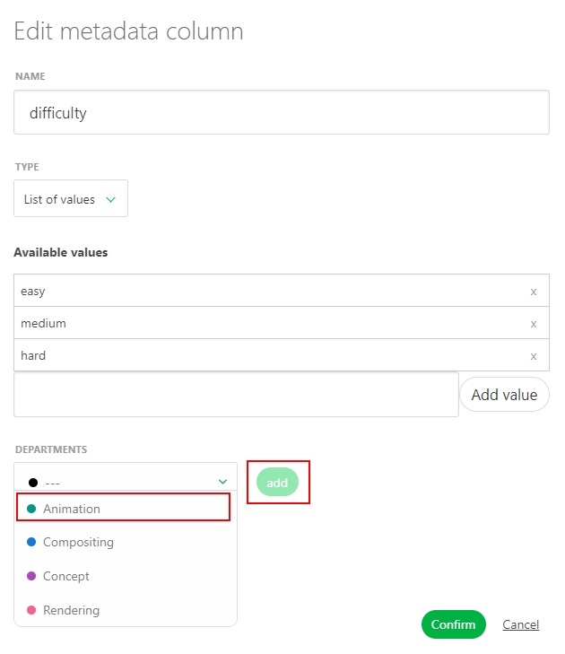

Now people link to this deparment will see this custom column on their filtered view.

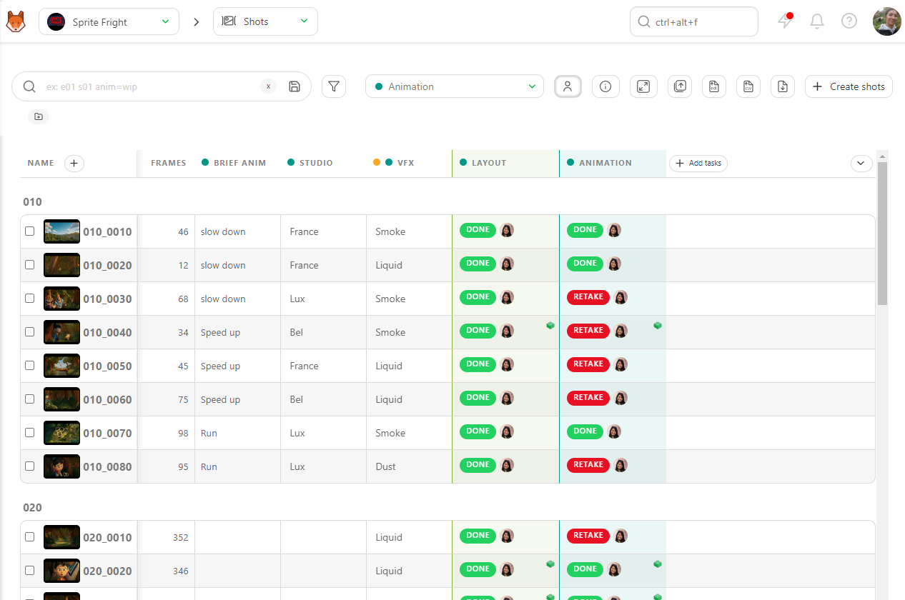
