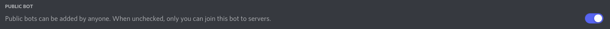
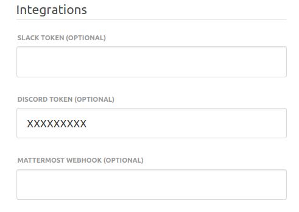
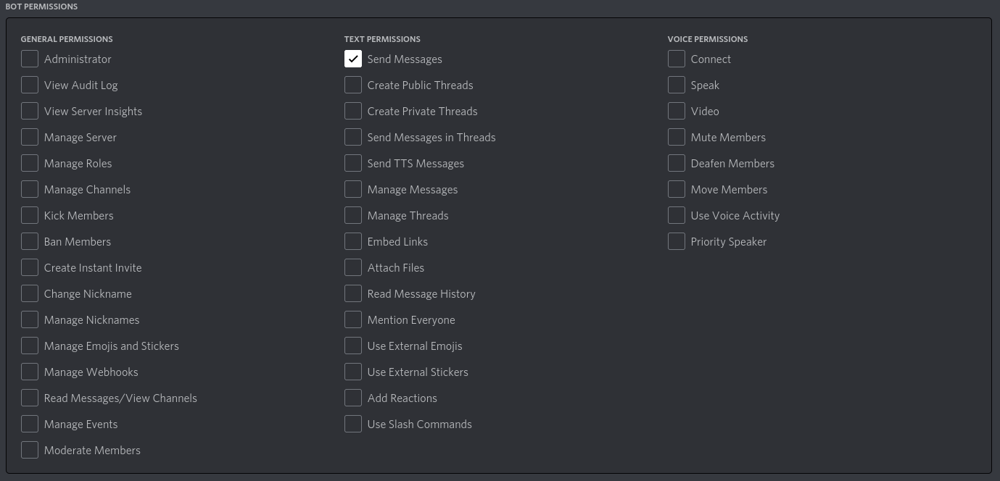

# Discord Integration

## Create a bot account

1. Make sure you're logged on to the [Discord website](https://discord.com/).
2. Navigate to the [application page](https://discord.com/developers/applications).
3. Click on the "New Application" button.
4. Give the application a name (for example "Kitsu") and click "Create".

5. Create a Bot User by navigating to the “Bot” tab and clicking “Add Bot”.
    - Click “Yes, do it!” to continue.

6. It's possible to add an icon for the bot by clicking on the icon next to "Username".
It will be the same icon used when the bot chat.

7. Make sure that Public Bot is ticked if you want others to invite your bot.

8. Make sure that Server Members Intent is ticked to allow the bot to see other members of a server.

9. Copy the token using the "Copy" button. 

10. Copy the token in Kitsu in "Settings" and in the text field "Discord token (optionnal)" and after click on "Save settings"

## Inviting your bot

So you’ve made a Bot User but it’s not actually in any server.

To add the bot in a server, follow these steps:

1. Make sure you're logged on to the [Discord website](https://discord.com/).
2. Navigate to the [application page](https://discord.com/developers/applications).
3. Click on your bot’s page.
4. Go to the “OAuth2” tab and after "URL Generator".
5. In "Scopes", tick only "bot"

5. In "Bot permissions" tick only "Send Messages"

6. Now the resulting URL can be used to add your bot to a server. Copy and paste the URL into your browser, choose a server to invite the bot to, and click “Authorize”.

> **_Note:_** The person adding the bot needs “Manage Server” permissions to do so.

> **_Note:_** The users who wants to have notifications enabled have to be in a same server than the bot.

## Enable notifications

Each user can set in their profiles the notification push to
Discord. They have to switch the "Discord notifications enabled" 
field to "Yes" and enter their "Discord username" (they're in the form username#number).

You're done!
