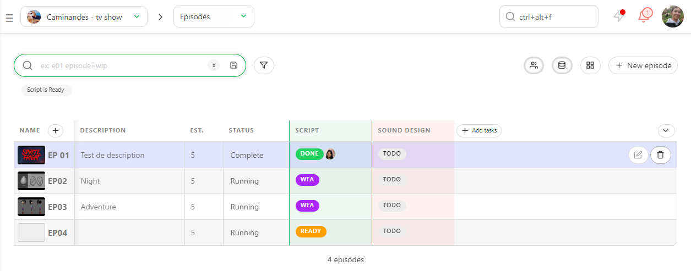
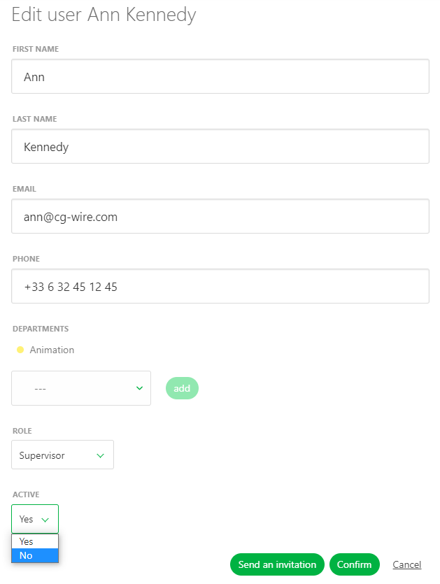

# How to Delete...

## How to Delete an Asset

Go on the main page of the assets and click on the box at the left part of the asset.

The action menu ask if you want to delete the asset. You can select more asset to delete if you need.

Validate with **Confirm**.

If the asset has no task, it will be deleted immediately.

If the asset has a task, once deleted, the asset appears as crossed, it can be still restored with  .

To definitively delete an asset, you have to click on
the box a second time anc click confirm.

The asset is removed from the database and won't appear anymore on Kitsu.

## How to Delete a Shot

Go on the main page of the shots and click on the box at the left part of the asset.

The action menu ask if you want to delete the shot. You can select more shots to delete if you need.

Validate with **Confirm**.

If the shot has no task, it will be deleted immediately.

If the shot has a task, once deleted, the shot appears as crossed, it can be still restored
with  .

To definitively delete a shot, you have to click on the box a second time and confirm.

The shot is removed from the database and won't appear anymore on Kitsu.

## How to Selete a Sequence

To delete a sequence, use the drop-down menu to
go to the **Sequence** page.

Then you can delete the sequence, with the
 button.

## How to Delete an Episode

To delete an episode, use the drop-down menu to
go to the **Episode** page.

Then you can delete the Episode, with the
 button.

## How to Delete a Task Type Column

To delete a task type (shot or asset), go to the global spreadsheet page,
and click on the arrow next to the name of the task type .

A sub-menu appears with the option **Delete all** the tasks.
Once you have click on it, a message appears and ask you to type the name of the task. You need to type it as it shows, it's case sensitive.

.

## How to Delete a Task

To delete a task (shot or asset), go to the global spreadsheet page,
and click on the status of the task that you want to delete.

The comment panel will appear . Select **Delete tasks** and validate with the **Confirm** button.

.

Once the tasks deleted, the column will be empty, and won't count on the stats.

The second benefit will be to hide automatically this empty column once your will filter your view.

## How to Delete Tasks for a Specific Asset Type (or Sequence)

To delete tasks (shot or asset) of a specific asset type or sequence , go to the global spreadsheet page, filter the view to display the element you want to delete.

.

Then click on the arrow on the right of the task that you want to delete and select **Delete all**.

.

On the pop-up window, type the name of the task type,
and select **For current list and filters** on the drop down menu.

.

Once the tasks deleted, the column will be empty, and won't count on the stats.

The second benefit will be to hide automatically this empty column once your will filter your view.

## How to Delete a Production

To delete a production, you need to close it first.

As **Studio Manager** open the main menu, and choose **Productions** under the **STUDIO** section.

Then on the **Productions** page, click on the edit button on the far right of the screen, on the selected production.

On the pop-up window, under the **Status** option, choose **Closed**.

Now your production appears as **Closed**. No one will have access to it, but it's saved.
It also means that you won't be able to delete any **task status**, **task type**, **asset type**.

## How to Remove Access to Someone?

At some point you may need to remove access to Kitsu to an artist, supervisor etc.

As **Studio Manager** open the main menu, and choose **People** under the **STUDIO** section.

Then on the **People** page, click on the edit button on the far right of the screen, on the selected people.

On the pop-up window, under the **Active** option, choose **No**.

As soon as someone is not **active** anymore, they won't have access to Kitsu. But you still can see their comment and version.

If you really want to delete someone, it means you will also delete all their comment and version they have uploaded.

If you still want to delete someone, then go to the **Unactive** part of the **People** page, and click on the task button on the right part of the line of the people.

