# How to delete...

## How to delete an asset

Go on the main page of the assets.

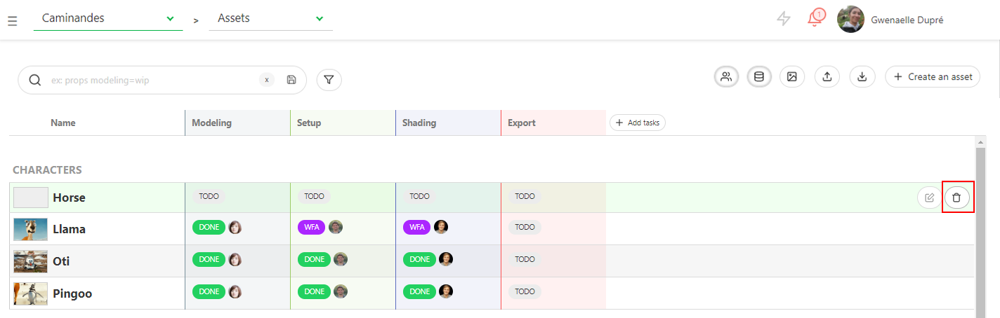

On the right part of the asset line, click on the 
 button.

A confirmation pop up appears, validate with **Confirm**.

If the asset has no task, it will be deleted immediately.

If the asset has a task, once deleted, the asset appears as crossed, it can be still restored with  .

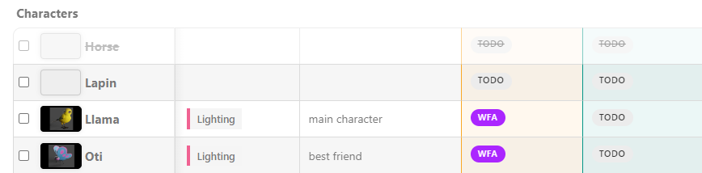

To definitively delete an asset, you have to click on 
 button a second time.

The asset is removed from the database and won't appear anymore on Kitsu.

## How to delete a shot

Go on the main page of the shots.

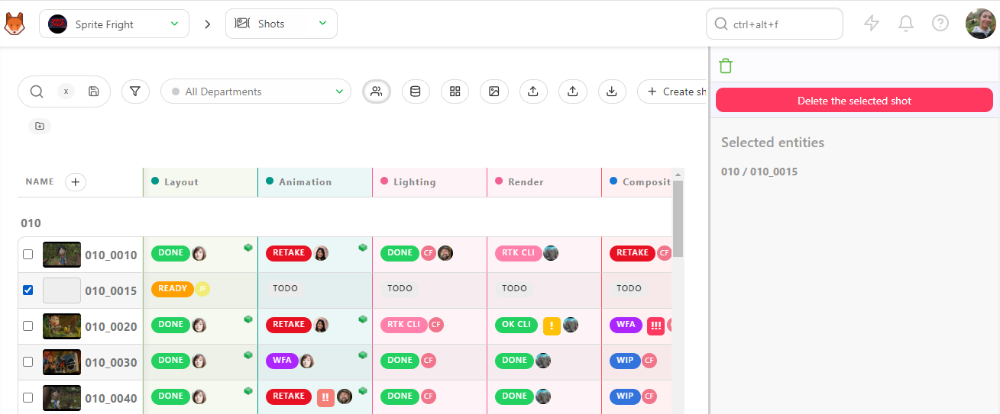

On the right part of the shot line, click on the 
 button.

A confirmation pop-up appears, validate with **Confirm**.

If the shot has no task, it will be deleted immediately.

If the shot has a task, once deleted, the shot appears as crossed, it can be still restored 
with  .

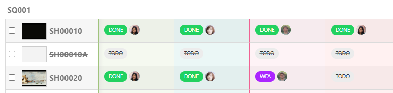

To definitively delete a shot, you have to click on 
 button a second time.

The shot is removed from the database and won't appear anymore on Kitsu.

## How to delete a sequence

To delete a sequence, use the drop-down menu to
go to the sequence page.
 

 
Then you can delete the sequence, with the 
 button.

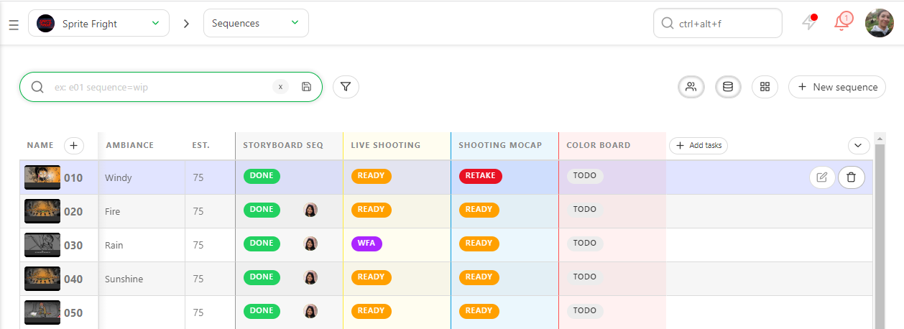

## How to delete a task type

To delete a task type (shot or asset), go to the global spreadsheet page, 
and click on the arrow next to the name of the task type . 

A sub-menu appears with the option **Delete all** the tasks.
Once you have click on it, a message appears and ask you to type the name of the task. You need to type it as it shows, it's case sensitive.

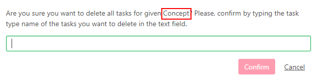. 

## How to delete a task

To delete a task (shot or asset), go to the global spreadsheet page, 
and click on the status of the task that you want to delete.

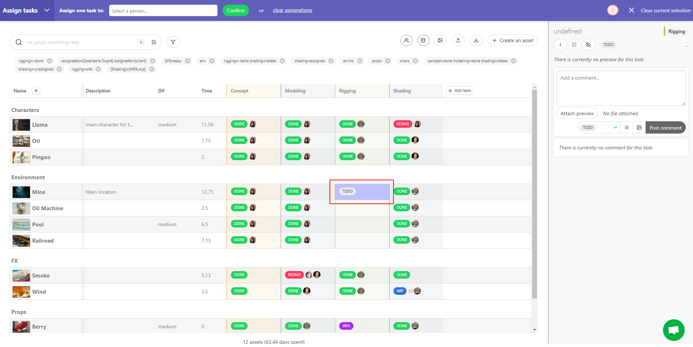

The action menu will appear. Select **Delete tasks** and validate with the **Confirm** button.

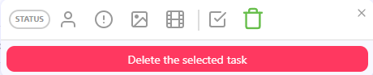. 

Once the tasks deleted, the column will be empty, and won't count on the stats.

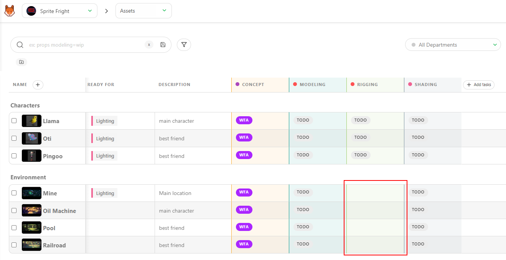

The second benefit will be to hide automatically this empty column once your will filter your view.

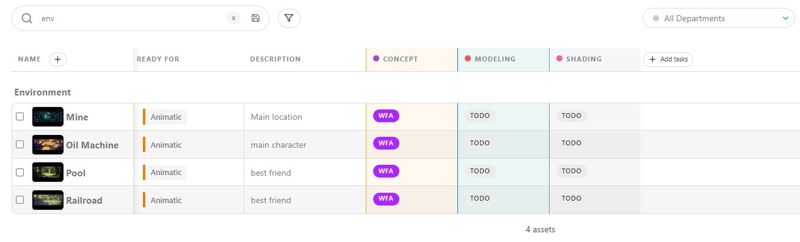

## How to delete tasks for a specific asset type (or sequence)

To delete tasks (shot or asset) of a specific asset type or sequence , go to the global spreadsheet page, filter the view to display the element you want to delete.

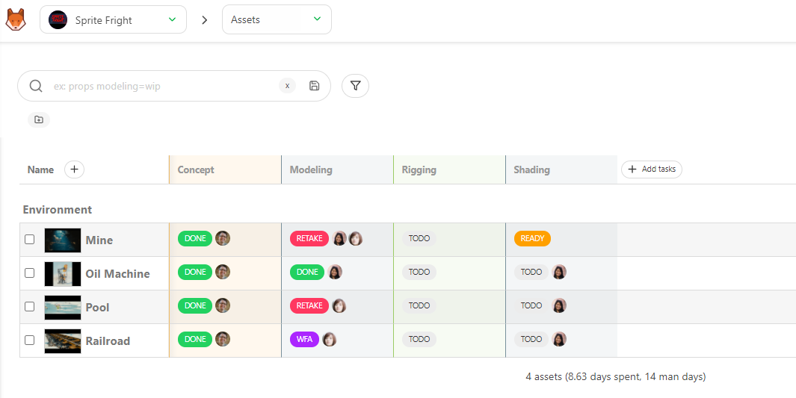. 

Then click on the arrow on the right of the task that you want to delete and select **Delete all**.

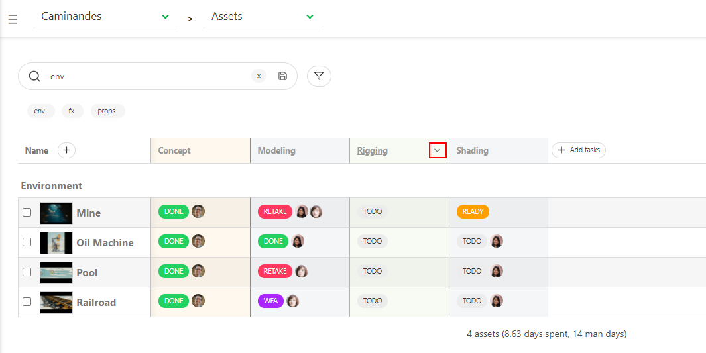. 

On the pop-up window, type the name of the task type, 
and select **For current list and filters** on the drop down menu.

. 

Once the tasks deleted, the column will be empty, and won't count on the stats.

The second benefit will be to hide automatically this empty column once your will filter your view.

