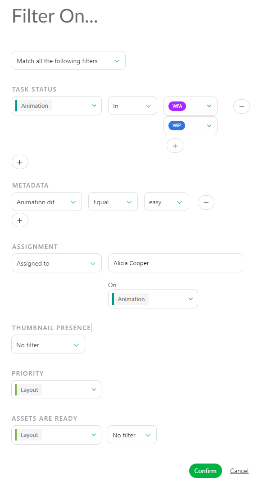
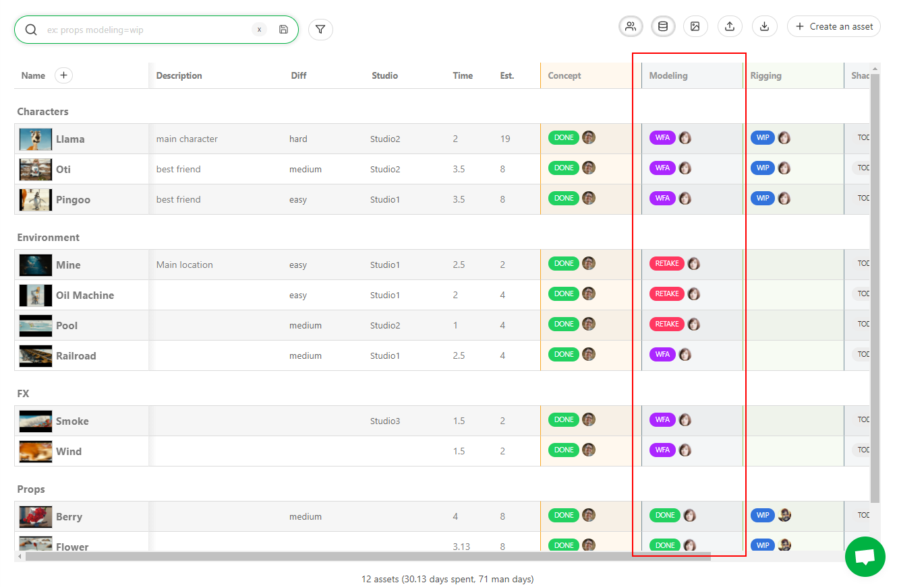
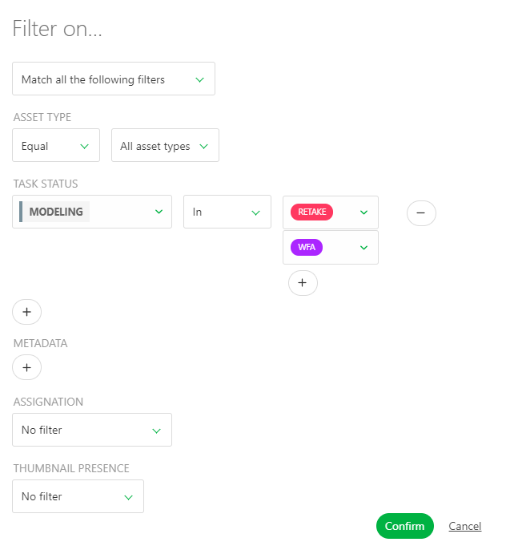
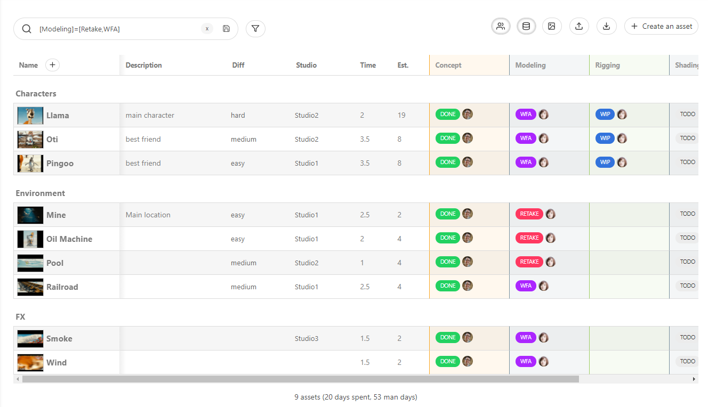
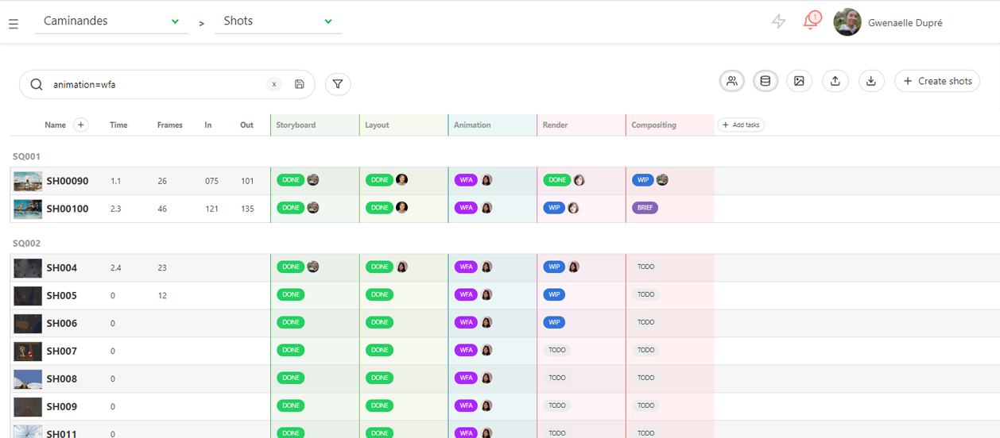
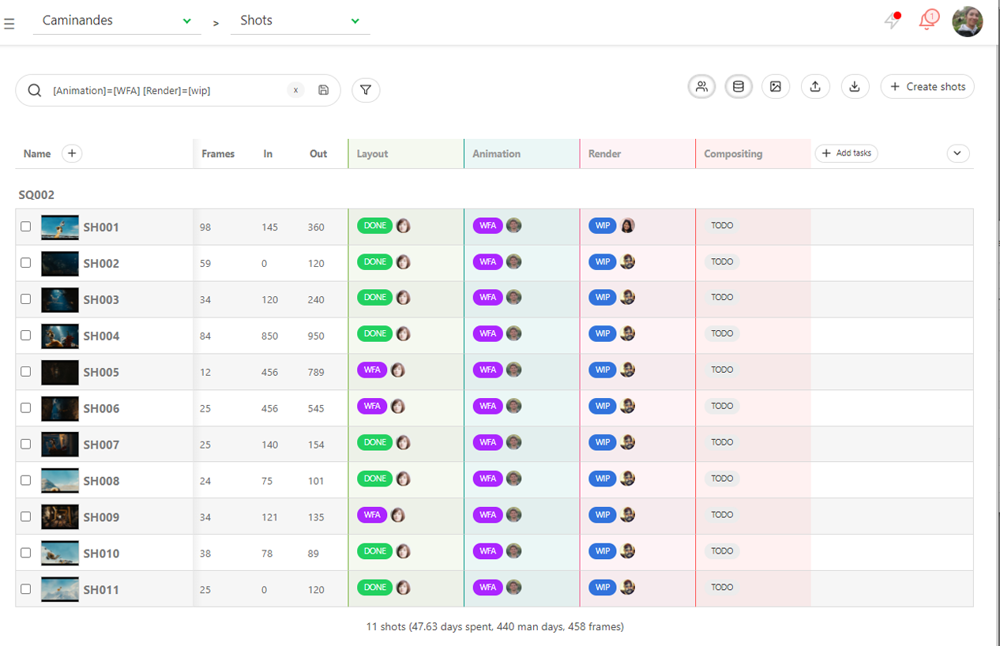

# How to Filter...

## Introduction to Filters

In **Kitsu**, the filters are set through the **search bar**. It allows you to
**save** your search query. Once done, you can rerun your query with a
simple click.

You can find the **search bar** and the **save** option . in the following pages:

* Assets
* Shots
* Sequences
* Todo-lists

NB: The **search bar** is available too in people episodes list.

## How to Use the Filter Builder?

Next to the search bar you have the icon of the **Filter Builder**

When you click on it a pop up opened, and gives you several choices for your filtering;

You can filter per **Status** on a **Task Type**, you can also filter through the custom metadata column,
see [Filter Builder option](../getting-started-advanced/#add-custom-metadata-columns).

You can also filter the global page through the assignation, per artist or per the lack of assignation.

And finally you can filter per the Thumbnails presence.

You can add several filters. Once you are done, validate your choice with the **Confirm** button.

## How to Filter Two Status of a Same Task?

You may need to filter for example all the tasks that are in **WIP** and **Done** status

When you click on it a pop up opened, and gives you several choices for your filtering;

Under the **Task Status**, choose the name of the task type you want to filter. Then instead of **Equal**, choose **IN**.
You can now add more status on this filtered task type.

For example we want to see the tasks in modeling that are in WFA **AND** in RETAKE.

Click on the filter builder and choose the task type Modeling, IN retake and WFA

Then validate with **Confirm**

You can now see the result

You can save your filter with the  save button.

## How to Use the Search Bar?

The **search bar** query is applied every time a new character is typed. You
don't need to type everything to get a quick result.

For example, in the assets page, type the letters `Ot` and you get the
result of all the assets starting with an `Ot`.

You can also search for some specific **type of asset**: `Props`, `Character`,
`Environment`, `Fx` ... The result displays all the assets from this type.

For example, let's search all the **FX** assets.

Another example gets **shots page** of a specific **sequence**.
Ex: see only the shots of the second sequence of the first episode.

Select the first episode on the drop-down menu, then search `sq002`, the result
 gets all the shots of all the episodes from sequence SQ002.

In the same way, you can search **specific status** link to the task.

Easiest way will be to use the filter builder

Under the **Task Status** click on the **+** and select the **Task Type** and the **Status** you want to filter.

Valid with **Confirm**.

You can be even more specific, let's focus on the shots that are still on retake at the animation stage, and already started at the render stage.

On the **Filter Builder** search for both task type and status (add more task type with the **+** bellow the first task type) and a metadata column.

Valid with **Confirm**.

You can also search for an **assigned** or **unassigned** task for a specific type of task.

## How to Save Filter Queries?

Kitsu allows you to save your research. You can save them by pressing the
**Enter**, or click on the **Save** button
.

Now under the **search bar** you can see your saved queries as buttons.

Every time you get back to this page, the buttons are there. It helps you to run common queries faster.

## How to Rename a Saved Filter

Once a have created your filter, and saved it, it will appear as a button under the search bar.
The search can be complex and not easy to read.

You can rename the filter with a more explicit choice of words.

For example you want to filter the task that are in RETAKE and WFA in modeling, with the difficulty easy, and assigned to Ann.

The saved filter is quite long, and hard to read. Hover your mouse on the saved filtered. You will see two icons, one to edit, the other to delete.

On the pop-up window, you can now change the displayed name on the **Name** section.

## What Filters can I Create?

You can create **filters** about **entities**:

* **Sequences** : `se01`, `se02` etc. or exclude : `-se01`, `-se02` etc.
* **Asset Type** : `characters`, `environment`, `fx` etc. or exclude `-characters`, `-fx`, etc.

You can also create **filters** about **task status** by following this syntax:
**task=status**.

Examples:

* Layout is work in progress (wip) : `layout=wip`
* Concept is waiting for approval (wfa) only for the fx : `concept=wfa fx`
* On sequence 2 Layout is wip : `se02 layout=wip`
* Animation is Retake and Render is waiting for approval (wfa) `animation=retake render=wfa`.

## How to Delete Filters?

If you have created a **filter button** by mistake, click on the cross next to
it .

The result of the filter is displayed, but not the button anymore. Just
cancel your research by deleting the text or use the cross next to the search
bar 

