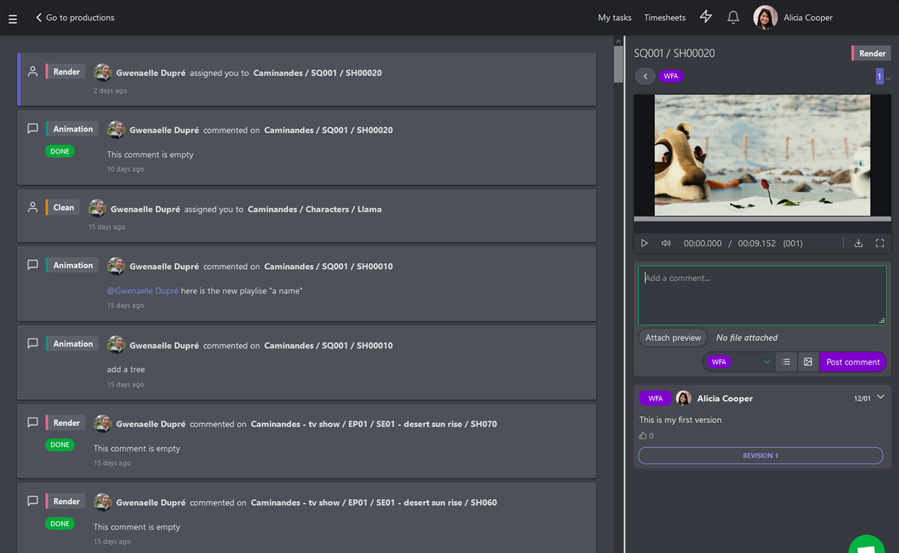
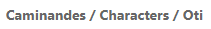
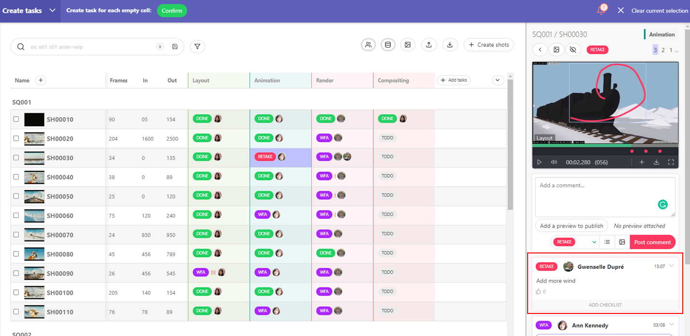
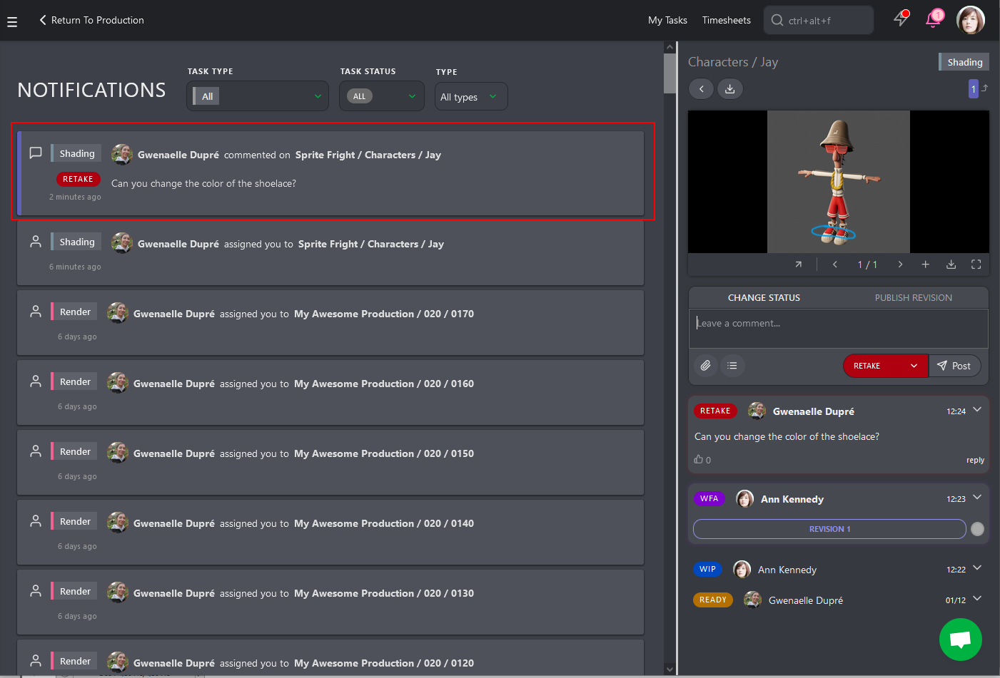
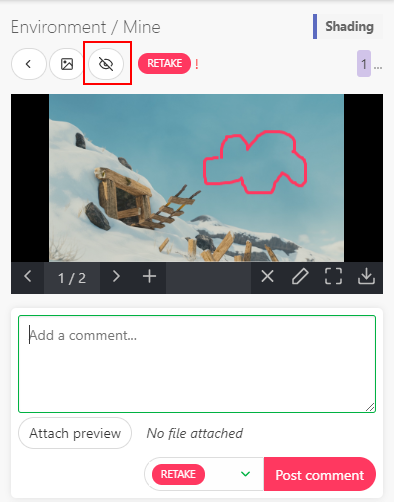
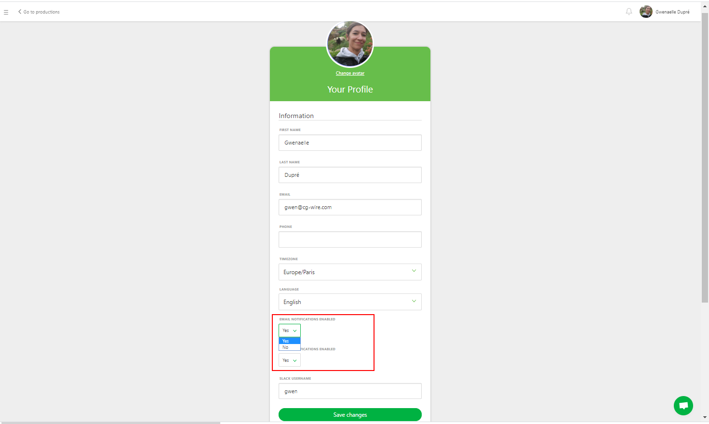
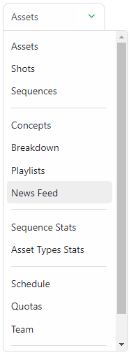
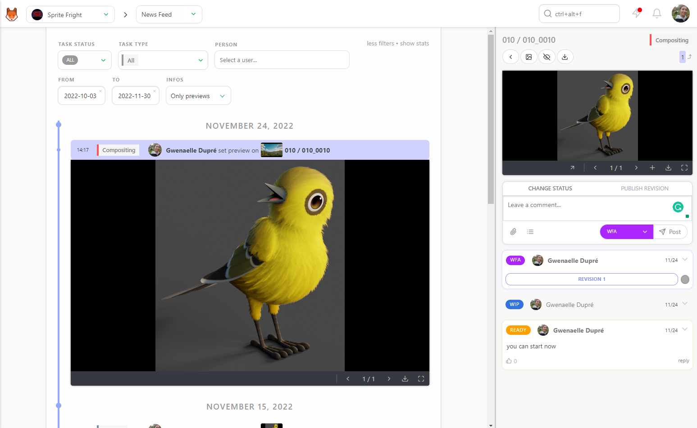

# Notification

## How notifications work?

The notification symbol is the **Bell** button next to your name, top right of
the screen.  Its color is **grey** 
 when you don't have
any notification, and **orange** 
 when you have a new
one.

When you click on the **bell** button, it opens the **notifications** page.

There, you can see all the changes made to the **tasks** you are following or
assigned to you.

Notifications include the following information: 

* If it's a notification  or a tag 

* the name of the **author** 

* the related **entity** 

* the related **task** 

* the new **status** 

* the **attached file** 

* and the comment.

When you click on the space of the notification, the comments panel on the right is displayed. You can answer directly from this page to any element.

Each part is a **link** you can use it to jump on the information you need. If
you click on the **status**, you jump to the status page of the entity. So
you can react quickly to this new change.

For example, let's give Alicia a retake.

Alicia receives notification immediately, the **bell** button change color
, and she can read the
new comment.

**All the notifications and comments appear in real-time**. No need to refresh
to stay up to date.

## How to get notified?

As an artist, you receive a notification 
 as soon as someone assigned you to a task, change
the status of one of your task, post a comment, or tag you on a comment.

You can also choose to follow specifics tasks. Go into the task page you want
to follow: on the **assets** or **shots** pages click onto the status icon, 
then on the top right side of the page, you can see an **eye** button 
.

By default you are following all the tasks you are assigned to, on the task
page the icon is on (eye open) . 

If you want to follow another task, click on the **crossed eye** button
. Its aspect changes,
it is not crossed anymore 
meaning you are now following this task and receive notification about
it. 

On your profil page you can also choose to receive your notification per Email, or per Slack.

(see https://kitsu.cg-wire.com/slack/#create-a-kitsu-application-in-slack)

## How to not be notified anymore?

If you don't want to follow a task anymore, click on the **eye** button
 on the task page. It is crossed , meaning
you won't receive notifications any more.

------------------------------------

## How to be notified of everything?

The **News feed** page is here to keep you aware of all the changes on the production.

You can go there with the drop-down menu on top of a page.

 
On the **News Feed** page, you can see all the change of status during the production. It gives you a global view of what happened.

You can choose to see all the **status** or a specific one.

The same thing with the **task types**, you can choose to see them all, or a specific one.

You can click on each element to open the right panel and see the detail of this task. You can review and comment on this page.

You can display the **previews** instead of the **status**.

Click on **more filters**, from there you can choose to diaplay data from a specific time frame or 
you can display the **previews** instead of the **status**.

You can now see all the **previews** (images and videos), posted during the production.

You can also select a specific **status** or a specific **task type**.

Moreover, you can also comment and review any previews from this page.

