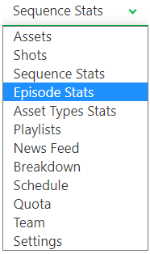
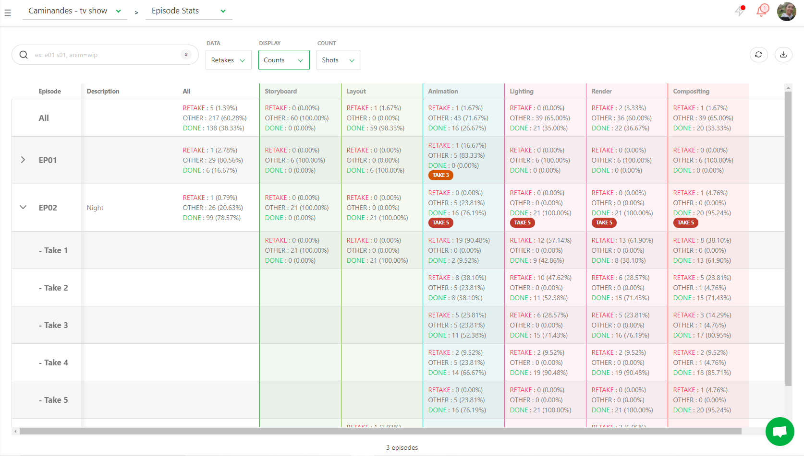
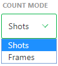
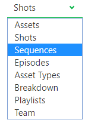
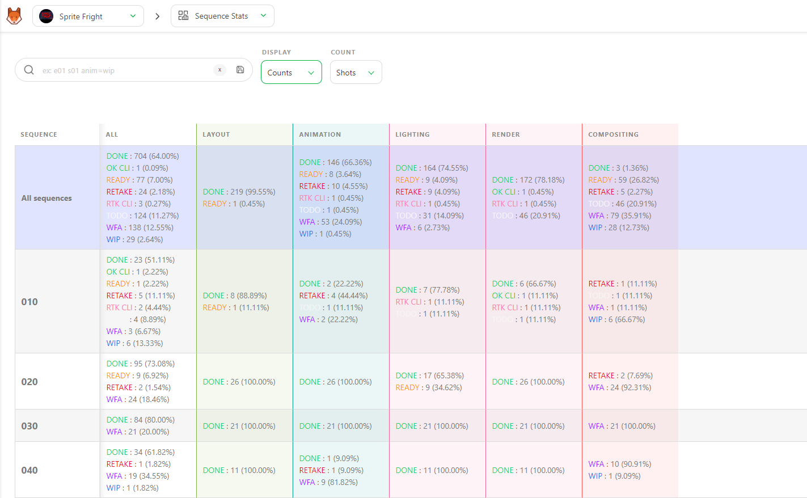
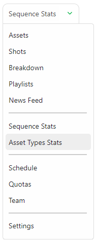
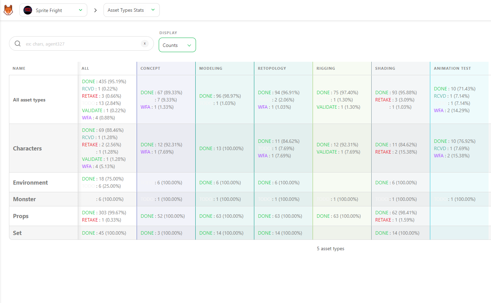
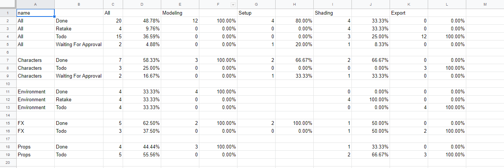

# How to report...

## How to have an overview of the take of an TV show?

Go to the **Episode Stats** page. You can go there with the drop-down menu on top of a page.

With this view, you can see all the Take number per tasks on each
sequences.

You can fly over the pie chart to have more detailed information about the
distribution.

If you click on the arrow on the left part of an episode, you can see the details of the take.

You can also display the statistic as a percentage.

You can also choose between two count modes: per shots or frames.

You can also click on the **tasks name** to have the detailed shots about this
task (page supervisor)

## How to have an overview of an TV show?

Go to the **Episode Stats** page. You can go there with the drop-down menu on top of a page.

With this view, you can see all the Take number per tasks on each
sequences.

You can fly over the pie chart to have more detailed information about the
distribution.

You can also display the statistic as a percentage.

You can also choose between two count modes: per shots or frames.

You can also click on the **tasks name** to have the detailed shots about this
task (page supervisor)

## How to have an overview of the Sequence?

Go to the **Sequence Stats** page. You can go there with the drop-down menu on top of a page.

With this view, you can see all the status distribution per tasks on each
sequences.

You can fly over the pie chart to have more detailed information about the
distribution.

You can also display the statistic as a percentage.

You can also choose between two count modes: per shots or frames.

You can also click on the **tasks name** to have the detailed shots about this
task (page supervisor).

## How to have an overview of the Assets?

Go to the **Asset Types Stats** page. You can go there with the drop-down menu on top of a page.

With this view, you can see all the status distribution per tasks on each
asset type.

You can fly over the pie chart to have more detailed information about the
distribution.

You can also display the statistic as a percentage.

On asset stats page, you can download an export of your data, as a `.csv` file.

Click on the **export** button .

You can open the `.csv` file with spreadsheet software.

