# Frequently Asked Questions

[[toc]]

-----------------------------------------    

## How to share a preview?

You can ask for a review by switching the status of a task to 
(**Waiting for Approval** ). This
status allows you to share your progress by posting a preview of your work. The
first step is to change the status of your task and write a comment. 

Then click on the **Attach preview** button.

A new window is displayed.

You can either drag and drop your pic or video on the **Choose a file** button,
or navigate through your system and pick your file, validate with the
**Confirm** button. Then click on the **Post comment** button.

Your work appears on the right part of the screen as a V1. 

If you post several revisions, you always keep track of your previous work.
Each time you add a new revision, the previous versions are still available. 

 -----------------------------------------    

## How to change your password?

Click on your name on the top right of the screen (1) then on **Profile** (2).

NB: A link to this documentation is available and the Dark Theme in this menu too (4).
 

If you keep scrolling, you can change your password. We
encourage you to change the default password with one of your own.

 -----------------------------------------    

## How to have an overview of a task type?

To access to the task type overview, you can click click on the **task type** name on a global page.

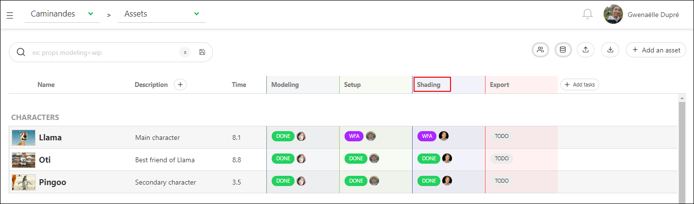

It goes to a page where you can see the state of all the **status** 
for this **specific task type** (per asset or per shot).

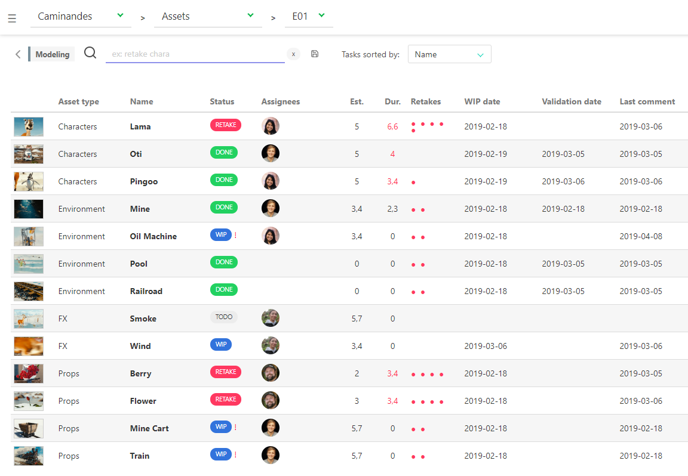

You find on these pages more information than on the global page. 
You can also [assigned](../getting-started-production/#assign-tasks-to-a-cg-artist) people from this page, and add an [estimation](../getting-started-production/#add-an-estimation-for-a-task) on the tasks.

You can also sort the information on the page, to focus on the crucial subject.

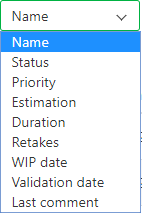

You can also filter the information. As you already are in a task, you need to type the status needed : 
`wip`, `wfa`, `-done`, etc.

You can also search per sequence or type of asset (`character`, or `seq01`)

## How to have an overview of the production?
### Sequence overview page

The other way is to go to the **Sequence Stats** page. You can go there with the drop-down menu on top of a page.

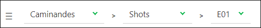

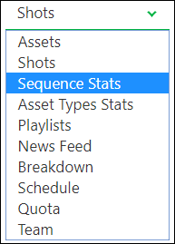

With this view, you can see all the status distribution per tasks on each
sequences.

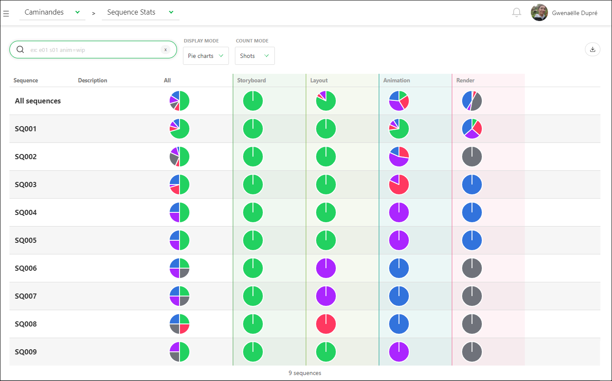

You can fly over the pie chart to have more detailed information about the
distribution.

You can also display the statistic as a percentage.

You can also choose between 2 count modes: per shots or frames.

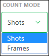

You can also click on the **tasks name** to have the detailed shots about this
task (page supervisor).

### Asset overview page

The other way is to go to the **Asset Types Stats** page. You can go there with the drop-down menu on top of a page.

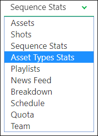

With this view, you can see all the status distribution per tasks on each
asset type.

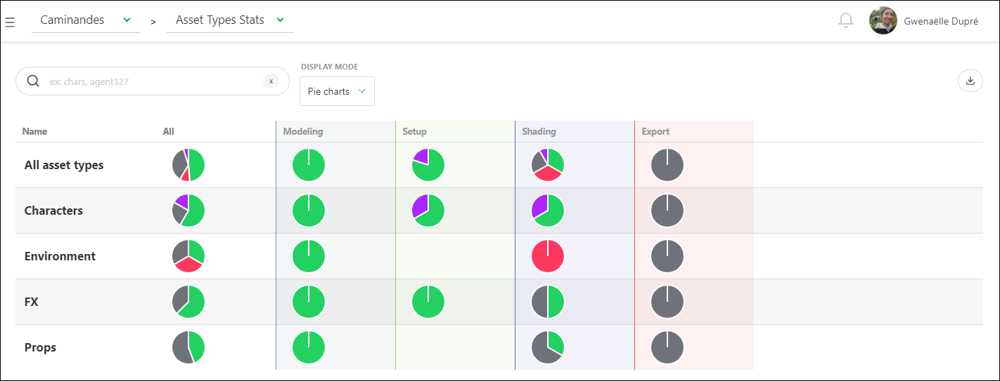

You can fly over the pie chart to have more detailed information about the
distribution.

You can also display the statistic as a percentage.

You can also click on the **tasks name** to have the detailed shots about this
task (page supervisor).

On both sequence and asset stats page, you can download an export of your data, as a `.csv` file.

Click on the **export** button .

You can open the `.csv` file with spreadsheet software.

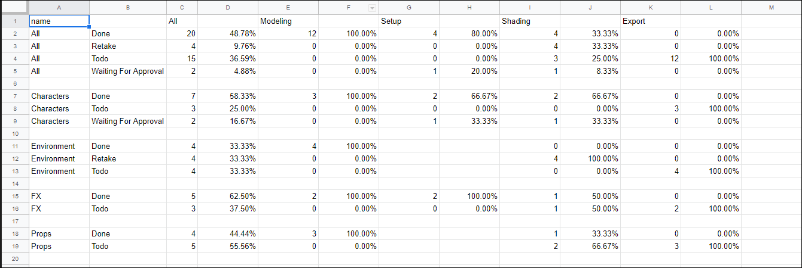

-----------------------------------------    
 
## How to create Filters?

### Introduction to filters

In **Kitsu**, the filters are set through the **search bar**. It allows you to
**save** your search query. Once done, you can rerun your query with a
simple click.
 
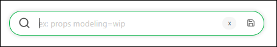

You can find the **search bar** and the **save** option . in the following pages: 

* Assets
* Shots
* Sequences
* Todo-lists

NB: The **search bar** is available too in people episodes list.

### How to use the search bar?

The **search bar** query is applied every time a new character is typed. You
don't need to type everything to get a quick result.

For example, in the assets page, type the letters `Ot` and you get the
result of all the assets starting with an `Ot`.  

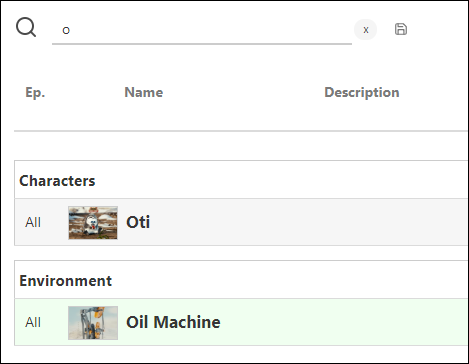

You can also search for some specific **type of asset**: `Props`, `Character`,
`Environment`, `Fx` ... The result displays all the assets from this type.

For example, let's search all the **FX** assets. 
    
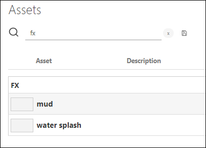

Another example gets **shots page** of a specific **sequence**.
Ex: see only the shots of the second sequence of the first episode.

Select the first episode on the drop-down menu, then search `sq002`, the result
 gets all the shots of all the episodes from sequence 2.

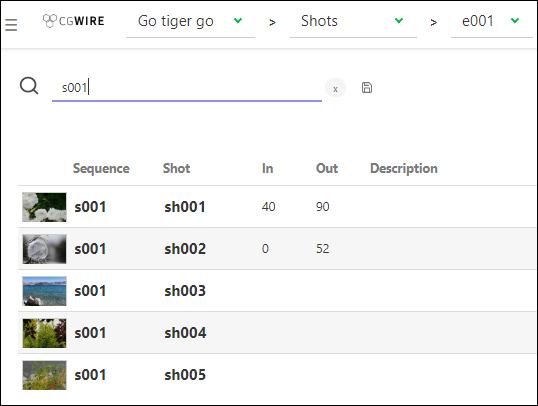

In the same way, you can search **specific status** link to the task. Type the
**name of the task** (or between `[` `]` if the task name is more than one word `[modeling low]`),
 then add the sign **equal**
(`=`) also, the **status** you are looking.

For example, search all the shots which are **Waiting for approval** 
at the **Animation** stage. So on the search bar, you type: `animation=wfa`.

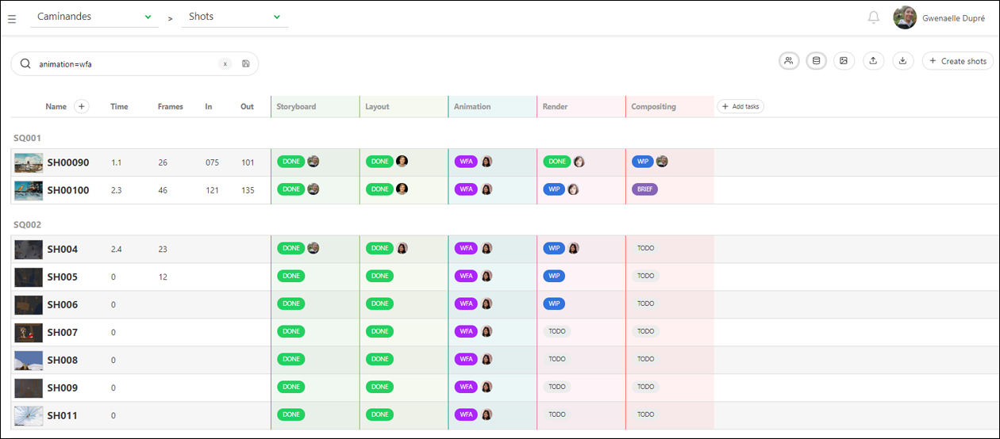

You can be even more specific, let's focus on the shots that are still on retake at the animation stage, and already started at the render stage: on the search
bar add a **space** after the previous search and type `render=wip`. 
The research is `animation=wfa render=wip`.

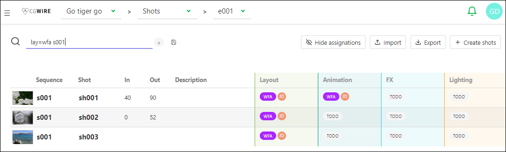

You can also search for an **assigned** or **unassigned** task for a specific type of task.
For example `Animation = unassigned`, `modeling=assigned`.

### How to save filter queries?

Kitsu allows you to save your research. You can save them by pressing the
**Enter**, or click on the **Save** button 
.

Now under the **search bar** you can see your saved queries as buttons. 

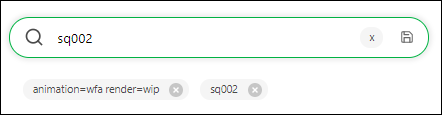

Every time you get back to this page, the buttons are there. It helps
you to run common queries faster.

## What filters can I create?

You can create **filters** about **entities**:

* **Sequences** : `se01`, `se02` etc. or exclude : `-se01`, `-se02` etc.
* **Asset Type** : `characters`, `environment`, `fx` etc. or exclude `-characters`, `-fx`, etc.

You can also create **filters** about **task status** by following this syntax:
**task=status**.

Examples:

* Layout is work in progress (wip) : `layout=wip`
* Concept is waiting for approval (wfa) only for the fx : `concept=wfa fx`
* On sequence 2 Layout is wip : `se02 layout=wip`
* Animation is Retake and Render is waiting for approval (wfa) `animation=retake render=wfa`.

### How to delete filters?

If you have created a **filter button** by mistake, click on the cross next to
it 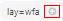.

The result of the filter is displayed, but not the button anymore. Just
cancel your research by deleting the text or use the cross next to the search
bar 

-----------------------------------------

## Where can I see my notifications?

### How notifications work?

The notification symbol is the **Bell** button next to your name, top right of
the screen.  Its color is **grey** 
 when you don't have
any notification, and **orange** 
 when you have a new
one.

When you click on the **bell** button, it opens the **notifications** page.

There, you can see all the changes made to the **tasks** you are following or
assigned to you.

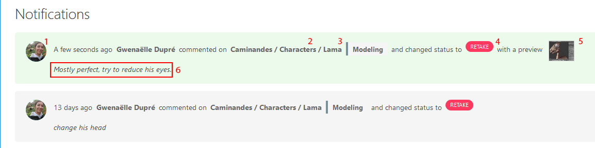

Notifications include the following information: 

* If it's a notification  or a tag 

* the name of the **author** 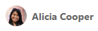

* the related **entity** 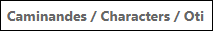

* the related **task** 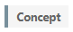

* the new **status** 

* the **attached file** 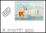

* and the comment.

When you click on the space of the notification, the comments panel on the right is displayed. You can answer directly from this page to any element.

Each part is a **link** you can use it to jump on the information you need. If
you click on the **status**, you jump to the status page of the entity. So
you can react quickly to this new change.

For example, let's give Alicia a retake.

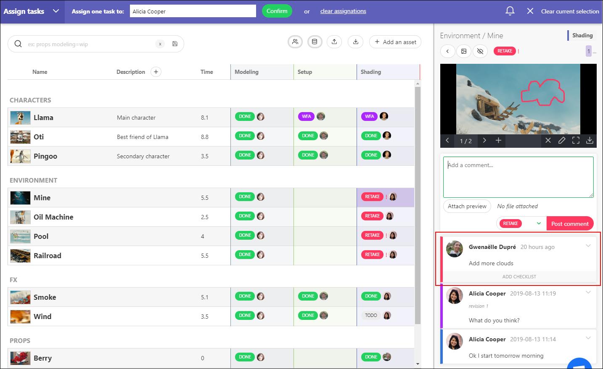

Alicia receives notification immediately, the **bell** button change color
, and she can read the
new comment.

**All the notifications and comments appear in real-time**. No need to refresh
to stay up to date.

### How to get notified?

As an artist, you receive a notification 
 as soon as someone assigned you to a task, change
the status of one of your task, post a comment, or tag you on a comment.

You can also choose to follow specifics tasks. Go into the task page you want
to follow: on the **assets** or **shots** pages click onto the status icon, 
then on the top right side of the page, you can see an **eye** button 
.

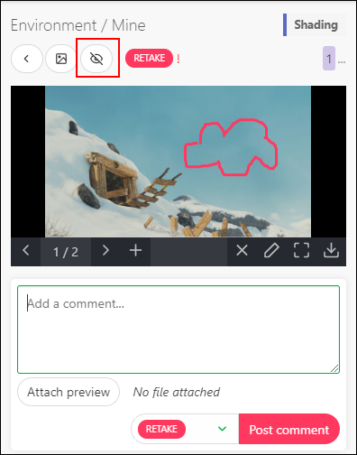

By default you are following all the tasks you are assigned to, on the task
page the icon is on (eye open) . 

If you want to follow another task, click on the **crossed eye** button
. Its aspect changes,
it is not crossed anymore 
meaning you are now following this task and receive notification about
it. 

On your profil page you can also choose to receive your notification per Email, or per Slack.

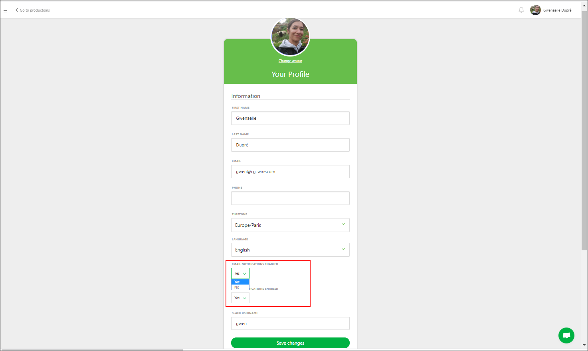

(see https://kitsu.cg-wire.com/slack/#create-a-kitsu-application-in-slack)

### How to not be notified anymore?

If you don't want to follow a task anymore, click on the **eye** button
 on the task page. It is crossed , meaning
you won't receive notifications any more.

------------------------------------

## How to be notified of everything?

The **News feed** page is here to keep you aware of all the changes on the production.

You can go there with the drop-down menu on top of a page.

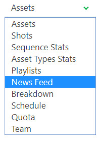
 
On the **News Feed** page, you can see all the change of status during the production. It gives you a global view of what happened.

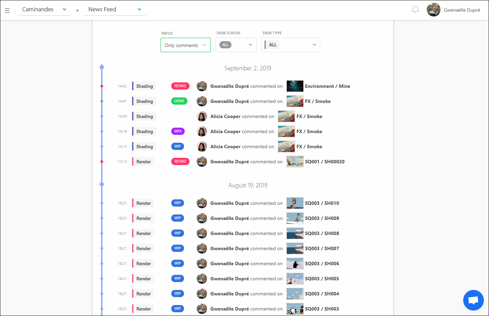

You can choose to see all the **status** or a specific one.

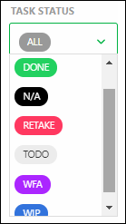

The same thing with the **task types**, you can choose to see them all, or a specific one.

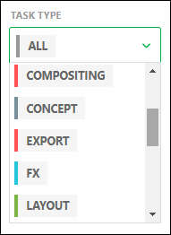

You can click on each element to open the right panel and see the detail of this task. You can review and comment on this page.

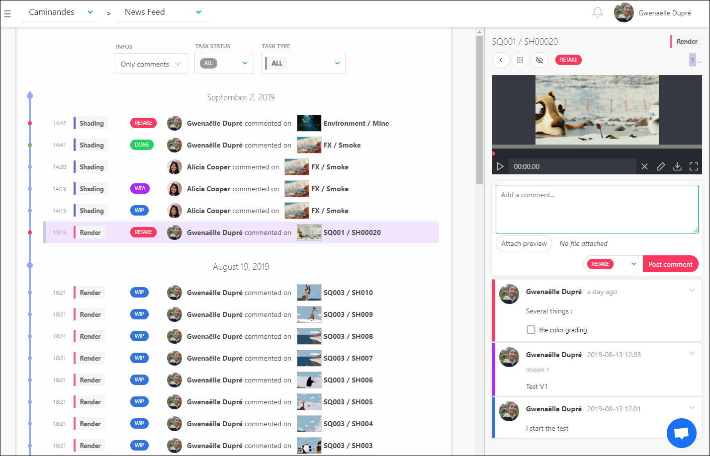

You can display the **previews** instead of the **status**.

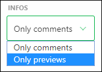

You can now see all the **previews** (images and videos), posted during the production.

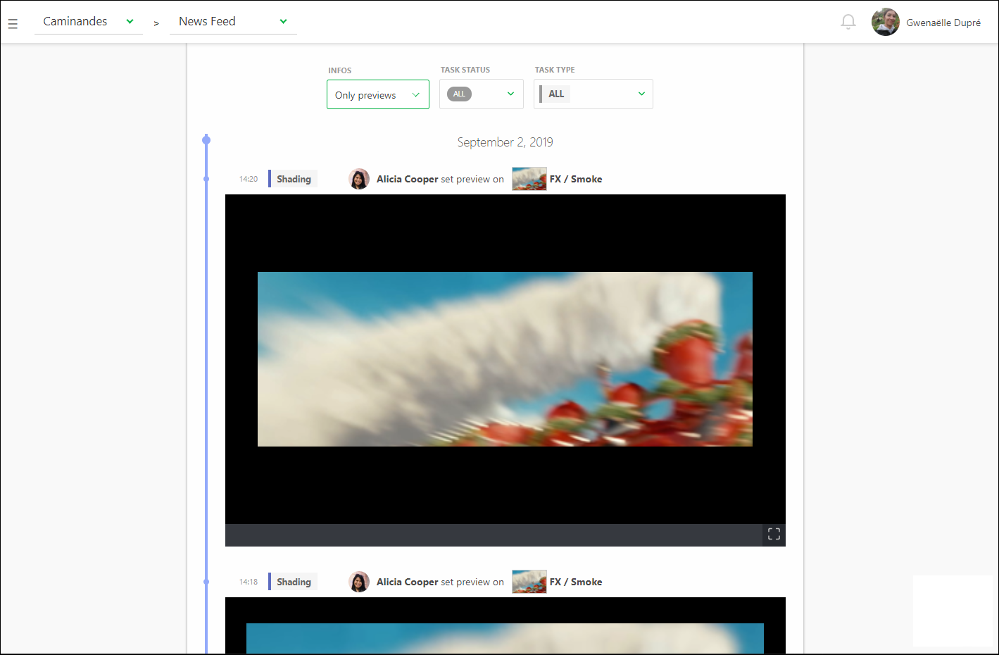

You can also select a specific **status** or a specific **task type**.

Moreover, you can also comment and review any previews from this page.

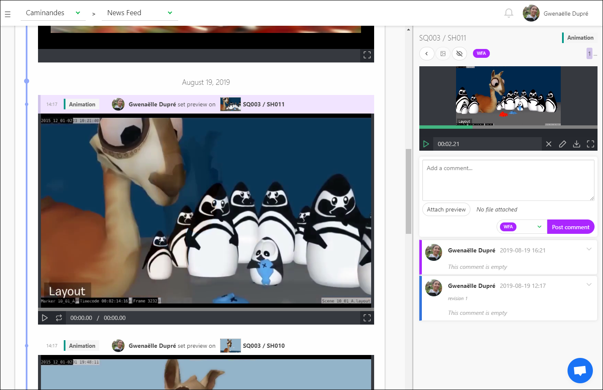

------------------------------------

## How to build a Playlist?

### How to create a playlist?

You can find the **Playlists** page on the drop-down menu. 

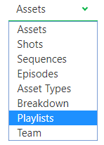

The **playlist** page is separated into 2 parts: 

* (1) The playlist list where you can **create** a playlist, or load an existing one.
* (2) The last created playlists and the last modified playlists

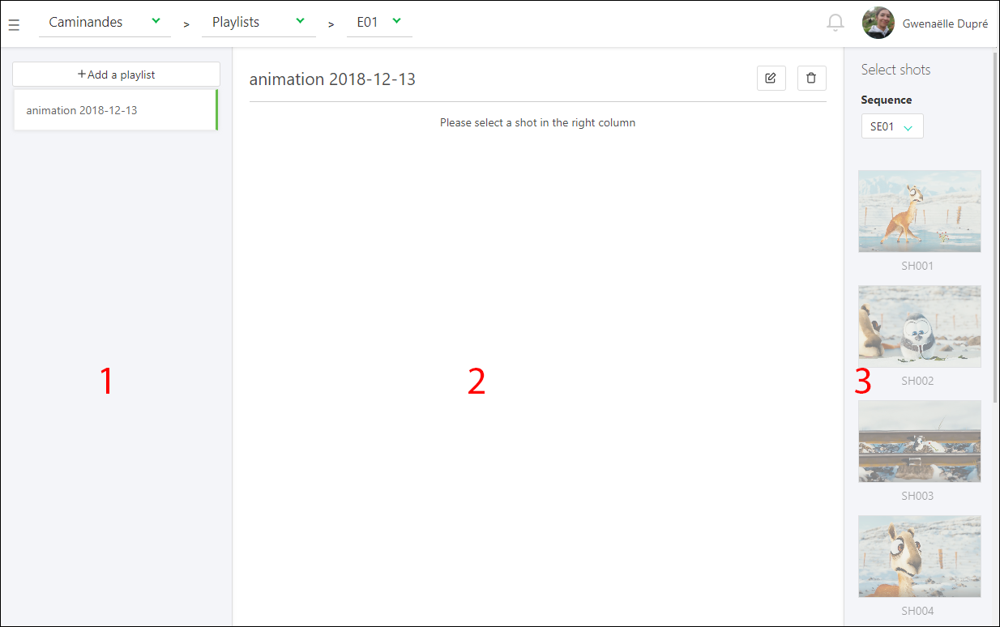

Start by creating a **Playlist** 
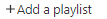, You default name
is the date and the hour. You can change it immediately. You can also choose if the playlist
will be shared with the studio or the client.

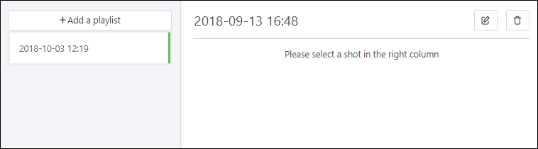

Once the playlist created, via the search/filter bar, you can select which shots to add
to your playlist. You can also choose to add the whole movie.

You can use the same filter than on the global shot/asset page. For example you can select all the 
WFA short for the animation stage.
You have to type **animation=wfa** in the search bar. Valid your selection with the **Add selection** button.

The shots appear on the top part of the screen. Every change are 
automatically saved.

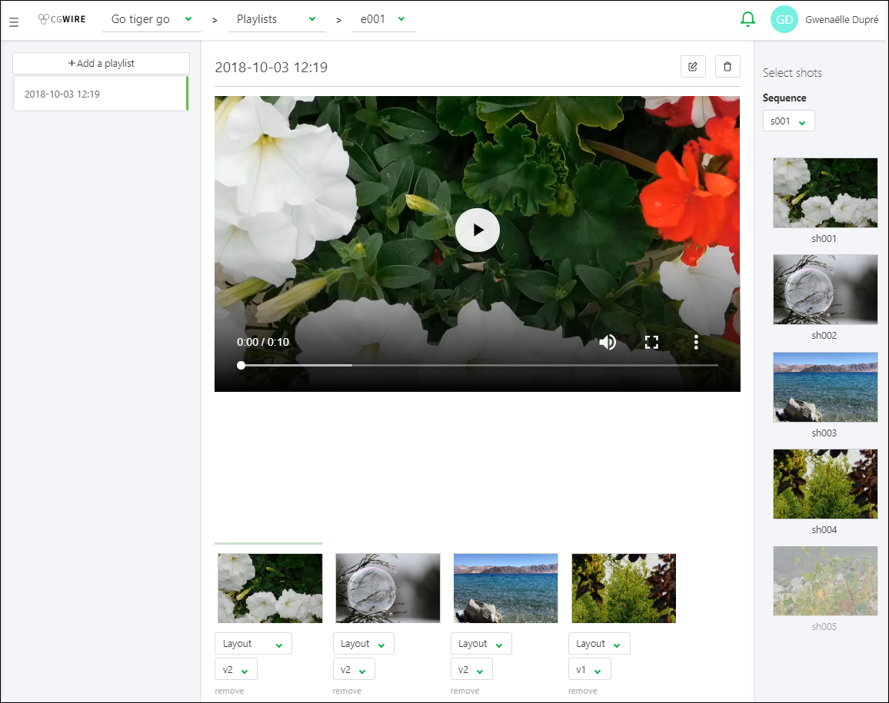

### How to switch between tasks and revisions?

For each playlisted shot you can choose the **task** and the
**version** you want to see.

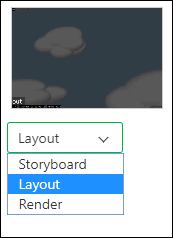
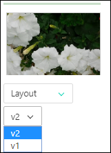

You can also play side by side two tasks of a shot.

Click on the **Compare** button  and choose the second task type.

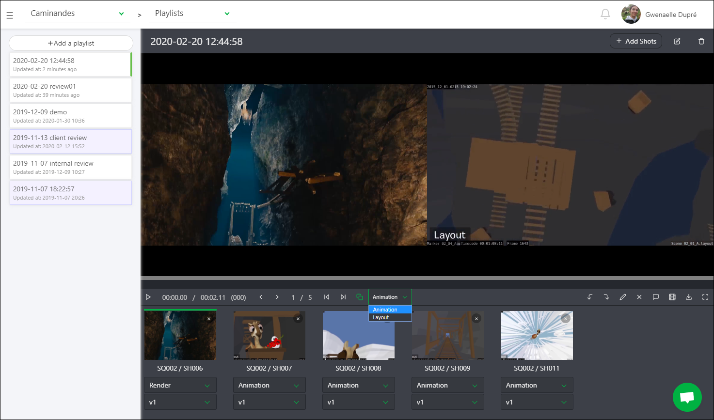

### How to comment on the playlist?

The primary purpose of the playlist is to help you with the review of the shots.

You can comment the shots directly from the preview.

Click on the **comment** button.

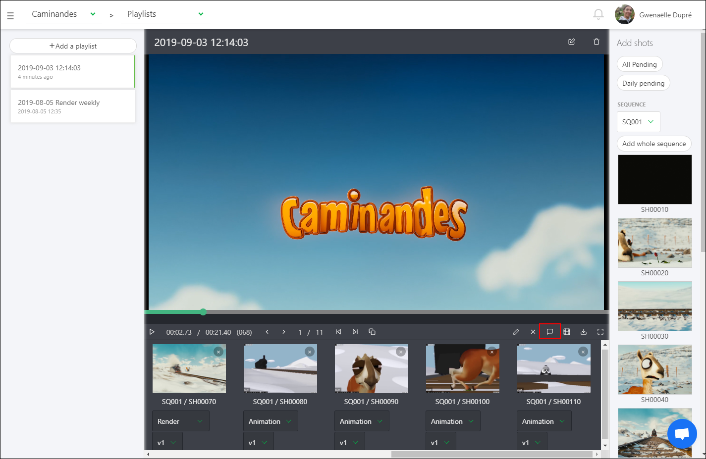

You now have access to the right panel, with all the history of the comments and status.

You can see the drawing comment on the video (the red dot below the timeline).

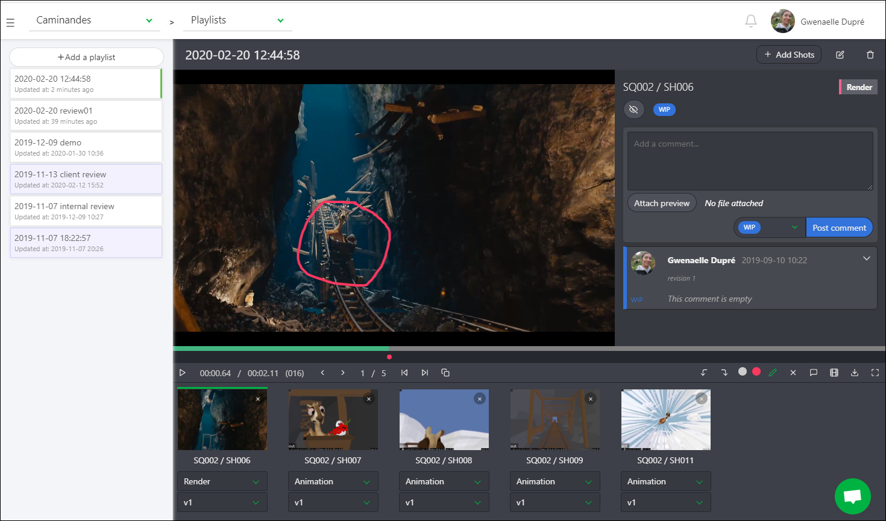

You can draw on the video (same than for the shot review), with the **draw** button 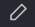

### How to delete a playlist?

To delete a playlist, load it by clicking on its name. Then,
click on the **delete** button . 
The button is located at the top right of the middle panel.

A confirmation pop-up appears. Validate it by clicking the **Confirm**
button.

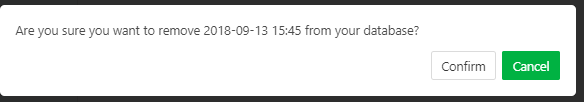

------------------------------------

## How to customize the workflow?

### How to edit an existing task type?

On the main menu  select the 
**TASK TYPES** page under the **Admin** section.

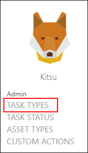

On the main page, you can edit all the tasks already created 
.

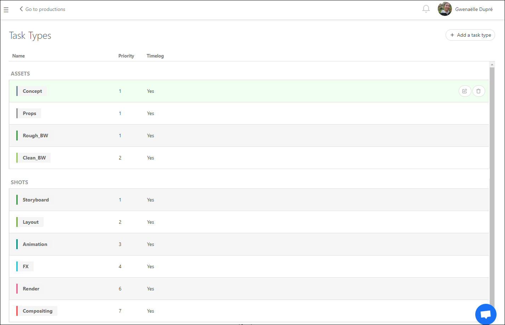

You can change : 
- (1) The name of the task type
- (2) The priority, meaning the order of the task types
- (3) For which entity it is used
- (4) If the artists need to time log their work on this task type
- (5) The color 

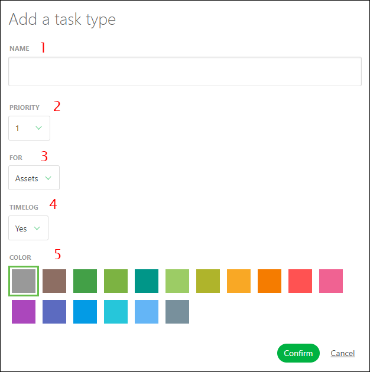

Click on **Confirm** to save your changes.

### How to create a new task type?

On the main menu  select 
the **TASK TYPES** page under the **Admin** section.

On the main page, click on the 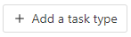
button.

On the new pop up you can define your personalized task:

- (1) The name of the task type
- (2) The priority, meaning the order of the task type columns
- (3) For which entity it is used
- (4) If the artists need to time log their work for tasks with this task type
- (5) The color 

Click on **Confirm** to save your changes.

### How to edit an existing status?

On the main menu  select the 
**TASK STATUS** page under the **Admin** section.

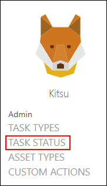

On the main page, you can edit some status already created 
. Except 

and , which are parts of the core
system.

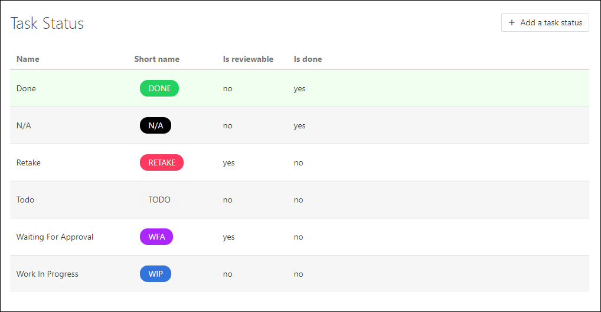
 
You can change : 
- (1) The name of the status
- (2) His short name, useful for the filters
- (3) If it's the end of the task
- (4) If it will count as a retake (for the supervisor page)
- (5) If the CG artist can use this status
- (6) The color 

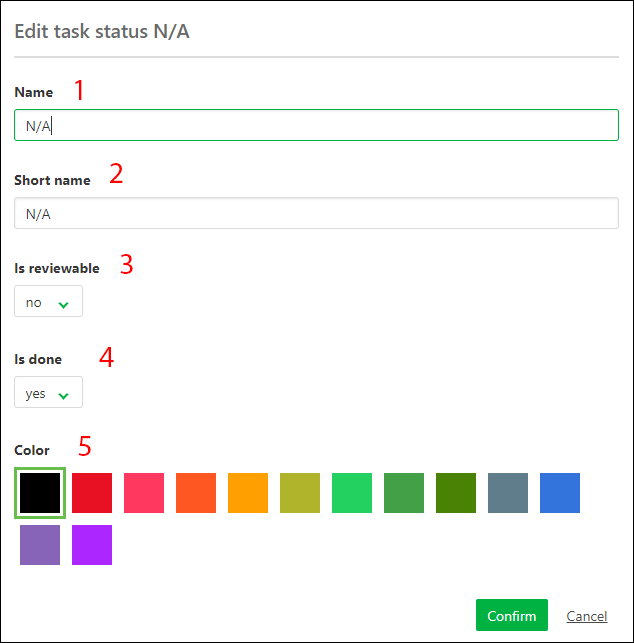

Click on **Confirm** to save your changes.

### How to create a new status?

On the main menu  select the 
**TASK STATUS** page under the **Admin** section.

On the main page, click on the 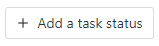 button.

On the new pop up you can define your personalized task : 

- (1) The name of the status
- (2) His short name, useful for the filters
- (3) If you can upload a preview with this task
- (4) If it's the end of the task
- (5) The color 

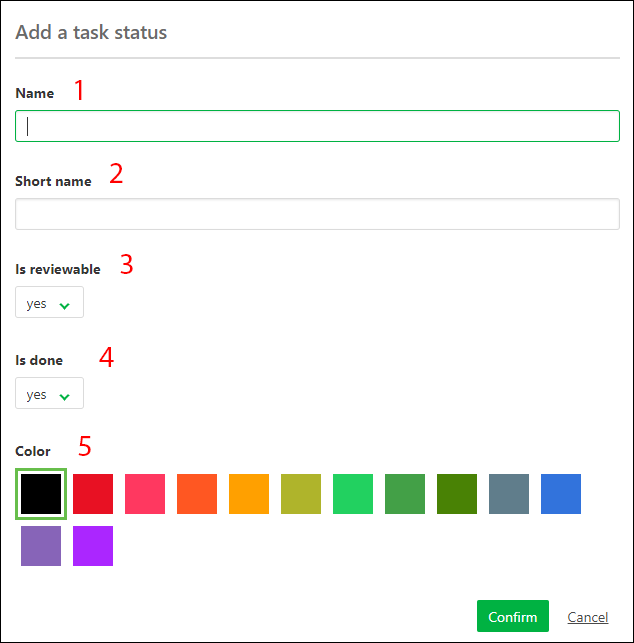

Click on **Confirm** to save your changes.

---------------------

## How to delete an asset

Go on the main page of the assets.

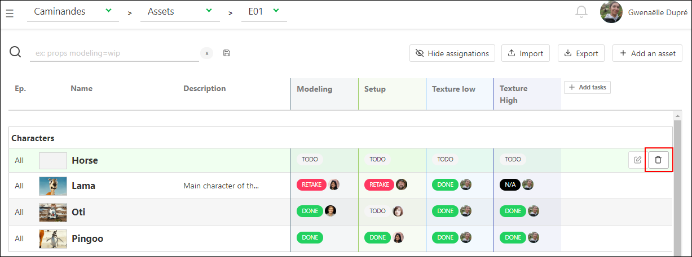

On the right part of the asset line, click on the 
 button.

A confirmation pop up appears, validate with **Confirm**.

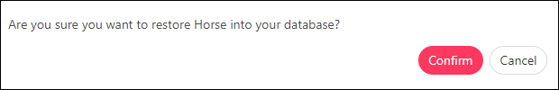

Once deleted, the asset appears as crossed, it can be still restored with  .

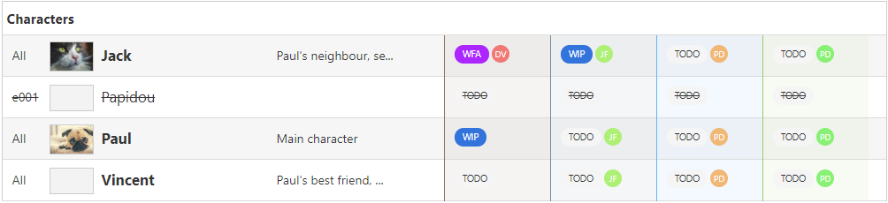

To definitively delete an asset, you have to click on 
 button a second time.

The asset is removed from the database and won't appear anymore on Kitsu.

---------------------

## How to delete a shot

Go on the main page of the shots.

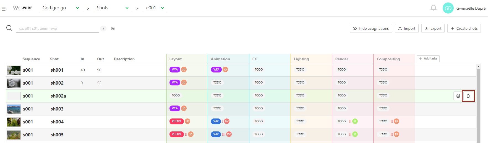

On the right part of the shot line, click on the 
 button.

A confirmation pop-up appears, validate with **Confirm**.

Once deleted, the shot appears as crossed, it can be still restored 
with  .

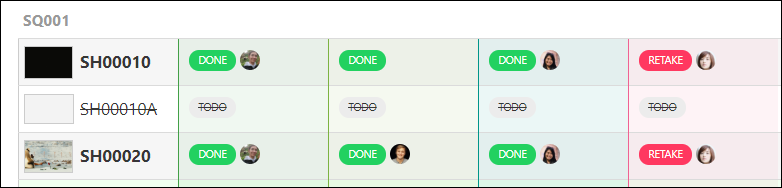

To definitively delete a shot, you have to click on 
 button a second time.

The shot is removed from the database and won't appear anymore on Kitsu.

-----------------------

## How to delete a sequence

To delete a sequence, you must first delete all the shots on this sequence.
It's a safeguard.

If you don't delete all the shots of a sequence before deleting it, you will
see an error message after confirming the deletion.

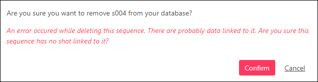

Once you have deleted all the shots of the sequence, use the drop-down menu to
go to the sequence page.
 

 
Then you can delete the sequence, with the 
 button.

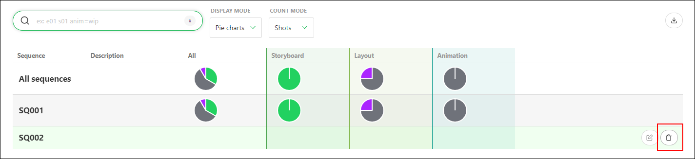

-----------------------

## How to delete a task type

To delete a task type (shot or asset), go to the global spreadsheet page, 
and click on the arrow next to the name of the task type . 

A sub-menu appears with the option **Delete all** the tasks.
Once you have click on it, a message appears and ask you to type the name of the task. You need to type it as it shows, it's case sensitive.

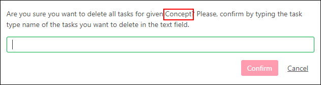. 