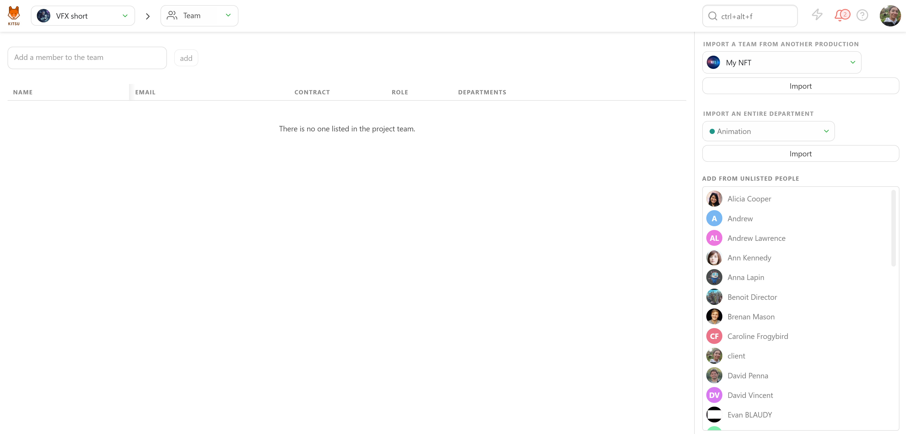

# Frequently Asked Questions

This FAQ guide provides quick solutions to common Kitsu issues, such as login problems, task management, and production organization. Explore the sections below for step-by-step instructions and helpful tips. For further support, check the detailed [Kitsu documentation](../configure-kitsu/) or contact support.

---

## Login Issues

### I can't log in to Kitsu anymore
The first thing to check is the **web address** you are using to log in.

- If the web address is **account.cg-wire.com/signin** and you see the CGWire logo, you are on the **wrong page**.
  
  

  The **account page** is only for managing subscriptions, invoices, etc. You won't have access unless you've registered for a subscription.

- The correct web address for your Kitsu instance should look like **your-studio-name.cg-wire.com**. On this page, you'll be prompted to log in, and you should see the Kitsu logo.

  

If you're unsure of the correct link:
- Check the invitation email you received.
- Contact your studio manager for assistance.

---

## Task Management

### I created a new Task Type, but I don't see it in my production
If you've created a new task type ([see documentation](../configure-kitsu/#task-types)) but don't see it in your production, here's why:

1. **Studio Library vs. Production Library**:  
   Task types are first created in the **Studio Library**. You need to add them to your **Production Library** before they can be used in a specific production.

2. **Permissions**:  
   If you can't see the **Settings** option in the main menu, you may not have the necessary permissions.

#### Steps to Add Task Types to Your Production
1. Go to your production **Settings** page from the navigation menu.  
   

2. Navigate to the **Task Types** tab.  
   

3. Select the appropriate entity tab (e.g., assets, shots, sequences, episodes, edits).  
4. Find your task type in the list on the right and click to add it.

Once added, go back to your entity page and click **Add Task Type**.  

---

### My Task Type columns are not in the right order
If task type columns appear out of order, you can adjust them:

- **Studio-wide order**:  
  1. Go to the main menu under the **ADMIN** section and click **Task Types**.  
     
  2. Drag and drop task types into the desired order.  
     

- **Production-specific order**:  
  1. Go to the **Settings** page for your production.
  2. Navigate to the **Task Types** tab and adjust the order by dragging and dropping.

---

### Task Type columns are missing
If some task type columns are missing on the entity page:

1. Check the department filter and ensure it is set to **All Departments**.  
   

2. Ensure the **Show additional information** button is highlighted.  
   

3. If columns are reduced, they won't display unless additional information is shown.

---

## Team and Assignments

### I can't assign anyone to a task
If the list of assignees in the comment panel is empty, it means the people you've added to the **People** page haven't been added to the production.

#### Steps to Add People to a Production
1. Navigate to the **Team** page from the production menu.  
   

2. The **Team** page will be empty, but you'll see a list of people on the right.  
   

3. Add people individually or by department.

Once added, they'll have access to the production, and you can assign them tasks.

---

### All assignments have disappeared
If assignees' avatars are no longer visible:

1. Ensure you haven’t accidentally clicked the **Hide Assignments** button.  
   

2. Click the button again to make the avatars reappear.

---

## Production Management

### How to delete or archive a production
If you no longer need access to a production:

1. Go to the main menu and select **Productions** under the **STUDIO** section.  
   

2. Find the production you want to archive and click the edit button.  
   

3. Change the **Status** from **Open** to **Closed** and confirm.  
   

Archived productions will no longer appear in the navigation menu but will remain accessible.

---

## Miscellaneous

### Where can I see the storage I'm using?
Currently, Kitsu does not display storage usage directly in the interface or on your account page. This means you won't find a section in the app showing how much storage your productions or assets are consuming.

If you need to check your storage usage:
- Contact your system administrator or IT team if Kitsu is hosted on your studio's servers.
- If you're using a cloud-hosted Kitsu instance, email **support@cg-wire.com** with your studio name and account details, where our team can provide you with the necessary information.