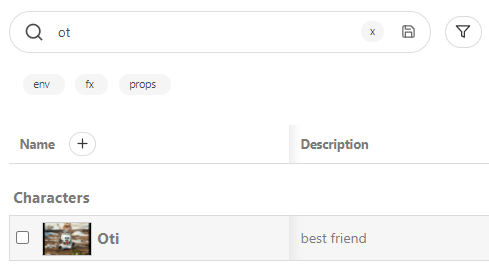
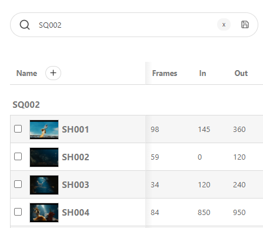
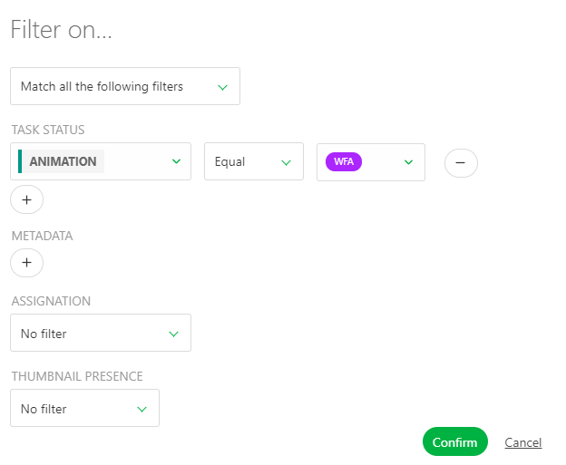
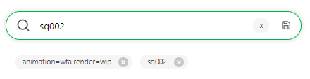
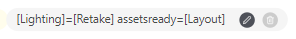
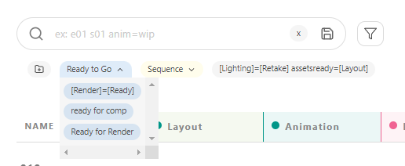

# Filters

## The Search Bar

In **Kitsu**, the filters are set through the **search bar**. It allows you to
**save** your search query. Once done, you can rerun your query with a
simple click.

You can find the **Search Bar**, **Filter Builder** and the **Save** option  in the following pages:

* Assets
* Shots
* Sequences
* Edits
* Episodes

NB: The **Search Bar** only and pre-build filters are available on the following page
* My Production
* My Tasks
* People
* Sequence Stats
* Episodes Stats
* Asset Types Stats
* Quotas
* Team
* Detailed Task Type page

::: tip
On the other pages of Kitsu, you will find pre-build filters.
:::

The **search bar** query is applied every time a new character is typed. You don't need to type everything to get a quick result.

::: warning
The filter is instant except for the **Feature Film** type of production.
Kitsu expects to have thousands of elements, so to speed up the process, you must type your Search and press **enter** to apply it.
:::

For example, on the assets page, type the letter `Ot`, and you get the
result of all the assets starting with an `Ot`.

You can also search for some specific **type of asset**: `Props`, `Character`,
`Environment`, `Fx` ... The result displays all the assets of this type.

For example, let's search all the **FX** assets.

Another example gets **shots page** of a specific **sequence**.
For example, you can only see the shots of the second sequence of the first episode.

Select the first episode on the dropdown menu, then search `sq002`; the result
 gets all the shots of all the episodes from sequence SQ002.

In the same way, you can search **specific status** link to the task.

::: tip
You can create **filters** about **entities** on all the pages:

* **Sequences** : `se01`, `se02` etc. or exclude : `-se01`, `-se02` etc.
* **Asset Type**: `characters`, `environment`, `fx` etc., or exclude `-characters`, `-fx`, etc.

You can also create **filters** about **task status** by following this syntax:
**task=status** on the global entities page

Examples:

* Layout is a work in progress (wip): `layout=wip.`
* Concept is waiting for approval (wfa) only for the fx: `concept=wfa fx.`
* On sequence 2, Layout is wip: `se02 layout=wip`
* Animation is retaken, and Render is waiting for approval (wfa) `animation=retake render=wfa`.

For the **Detailed task type page**, you can filter by typing only
- Status: `wip` or exclude `-done`, several status `[wfa] [retake].`
- Name of an artist: `Alicia` or exclude `-Paul`

You can do a mix of all the filters:

`[wfa] [retake] -alicia 020.`
:::

## Filter Builder

The easiest way to achieve more advanced filtering is to use the filter builder.

### Match all or one of the following filters

::: warning 
The first option, **Match all the following filters**, will use all the options you select on the filter builder for the filtering:

- Task Status
- Metadata
- Assignment
- Thumbnail Presence
- Priority
- Ready for / Assets are Ready

The second option, **Match one of the following filters**, will skip the unavailable filter option.

:::

### Task Status filtering option

**Task Status** helps you filter a task type by status.

- **Equal** will report all the tasks with this status on this task type
- **Not Equal** will report all the task **except** this status
- **In** report all the tasks with all the statuses you've selected

You can use the **-** button to remove one of the statuses selected.

You can use the **+** below the status to add more status.

::: tip
If you want to filter the status of several task types, click on the **+** below the task status option on the left part of the screen.

:::

### Metadata filtering option

The **Metadata** filter allows you to filter your page based on the information of the extra columns.

- **Equal** will report all the tasks with this information on this Metadata column
- **Not Equal** will report all the task **except** this information
- **In** report all the tasks with all the information you've selected

::: tip
If you want to filter elements on several Metadata, you can click on the **+** below the Metadata option on the left part of the screen.

:::

### Assignment filtering option

This option is related to people and assignments.

- No filter: you don't look for people
- Assigned to: allows you to search for the task assigned to someone on a specific task type
- Not assigned to: allows you to search for the task not assigned to someone on a specific task type
- Assignments exist for: will report all the tasks of a specific task type with an assignation
- No assignment exists for: will report all the tasks of a specific task type with no assignation

::: warning
You can only filter assignation on **ONE** Task type for **ONE** person.

You can not add several assignment filters.
:::

### Thumbnail Presence

By default, this filter is set to **No filter**, meaning Kitsu won't check whether a thumbnail is present.

Then you have the choice between:
- With thumbnail: display all the entities with a thumbnail
- Without thumbnail: display all the entities without a thumbnail

### Priority

You can filter a task type with a specific level of priority.

::: tip
To learn more about priorities, see 
[Change Priorities](../estimation/README.md#change-priorities)
:::

First, select your task type, then you can choose between 
- **Normal** (the default level of priority)
- **High**
- **Very High**
- **Emergency**

::: warning
You can only filter priority on **ONE** Task type for **ONE** level of priority.

You can not add several priority filters.
:::

### Ready For / Assets are Ready

Depending on whether you are filtering on the asset or shot global page, you can filter on the **Ready For** status.

- On the asset page, you will search for the **Ready for** column.

On the shot page, you will check whether all the assets for these tasks are ready (see Create your production).

::: warning
You can only filter **Ready for**** on **ONE** Task type 

You can not add several **Ready For** filters.
:::

## Save and Organize your Filter Queries

Kitsu allows you to save your research. You can save them by pressing the
**Enter**, or click on the **Save** button
.

Now, under the **search bar**, you can see your saved queries as buttons.

::: tip
Notice the first icon on the left and the colored buttons.

It allows you to Create a Filter Group. This way, you can keep your saved filters organized under a colored Group.

:::

The buttons are there every time you return to this page. They help you run common queries faster.

Once you have created your filter and saved it, it will appear as a button under the search bar.
The Search can be complex and not easy to read.

You can rename the filter with a more explicit choice of words.

The saved filter is quite long and hard to read. Hover your mouse over the saved filter. You will see two icons, one to edit and the other to delete.

You can now change the name displayed in the **Name** section in the pop-up window.

You can choose if you want to keep your saved queries in or out of a **Filtered Group**

::: details Delete a Filter

If you have created a **filter button** by mistake, click on the cross next to
it .

The result of the filter is displayed, but the button is not. Just
cancel your research by deleting the text or use the cross next to the Search
bar 
:::

### Pre-build Filters

You can find pre-build Filters on the following page:

- My Checks
- Timesheets
- Team Schedule
- All Tasks
- Newsfeeds
- Concepts
- Quotas
- Task Type detailed page (+search bar)

On this specific page, you can select the option we have created for you.

You can select the option you want on the dropdown menu.
