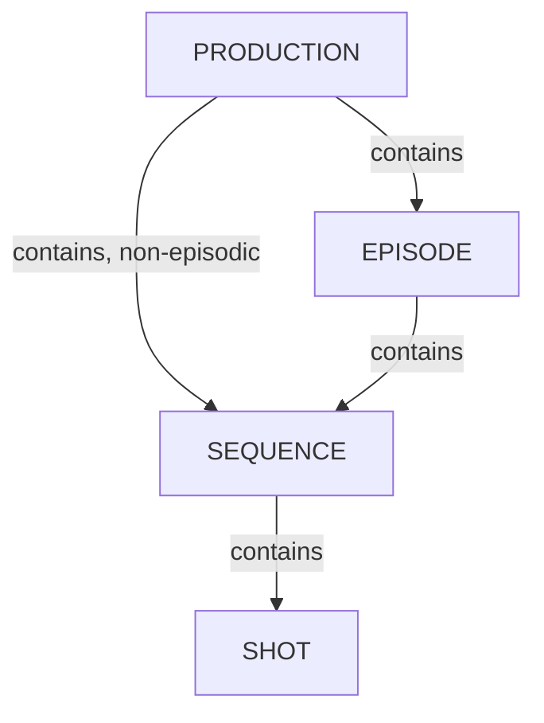

# Structure de production

Le modèle de données de Kitsu organise le travail autour d’une hiérarchie d’entités de production (production → épisode/séquence/plan, ou → asset), associée à un système de suivi des tâches (type de tâche, statut de tâche, département).

## Table des matières

1. [Gérer les productions](/fr/guides/production-structure/manage-productions/) - Créer, configurer et organiser les productions (projets) suivies dans Kitsu.
2. [Gérer les épisodes](/fr/guides/production-structure/manage-episodes/) - Ajouter, modifier et organiser les épisodes au sein d’une production.
3. [Gérer les séquences](/fr/guides/production-structure/manage-sequences/) - Ajouter, modifier et organiser les séquences au sein d’une production ou d’un épisode.
4. [Gérer les plans](/fr/guides/production-structure/manage-shots/) - Ajouter, modifier et organiser les plans qui composent une séquence.
5. [Gérer les libellés de studio](/fr/guides/production-structure/manage-studios/) - Pour les productions réparties sur plusieurs sites et studios. Créer et organiser les libellés de studio utilisés pour identifier le studio responsable de chaque tâche.

## Modèle de données

- **Département** - Groupe fonctionnel au sein d’un studio (par ex. modélisation, animation, éclairage, compositing). Les départements regroupent les types de tâches associés.
- **Production** - Projet (film, série, jeu, etc.) géré par le studio. Les productions contiennent des épisodes (pour les projets épisodiques), des séquences, des plans et des assets.
- **Épisode** - Subdivision d’une production, utilisée pour les projets de type série. Facultatif pour les productions de type long métrage.
- **Séquence** - Subdivision d’un épisode (ou directement d’une production pour les projets non épisodiques), regroupant des plans associés.
- **Plan** - Unité d’action filmée ou animée au sein d’une séquence ; principal conteneur des tâches liées aux plans.