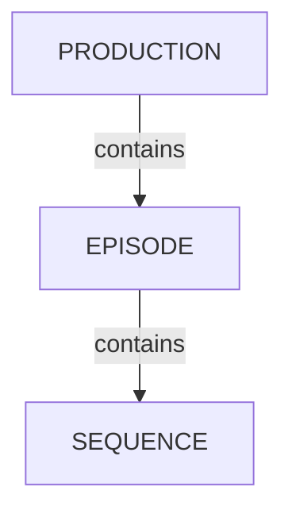

# Gérer les épisodes

<iframe width="560" height="315" src="https://www.youtube.com/embed/I-9QC6w2VOQ?si=ZUclg5iIPqMvUFK0" title="YouTube video player" frameborder="0" allow="accelerometer; autoplay; clipboard-write; encrypted-media; gyroscope; picture-in-picture; web-share" referrerpolicy="strict-origin-when-cross-origin" allowfullscreen></iframe>

<!-- #region body -->

Les productions de type série TV ont accès aux conteneurs d'épisodes pour organiser les séquences et les plans.

## Vue d'ensemble des épisodes

<!-- #region setup -->

Dans le menu de votre production, cliquez sur `Episodes` :

Vous accéderez ensuite à la page des épisodes, qui contient la liste complète des épisodes de la production actuelle :

Si vous cliquez sur le nom d'un épisode, vous accéderez à sa page de détails.

## Créer des épisodes

Sur la page `Episodes`, cliquez sur `New episode` en haut à droite :

Une fenêtre modale apparaît. Remplissez le formulaire, puis cliquez sur `Confirm` :

- **Name** : le nom de l'épisode
- **Status** : le statut de production de l'épisode (annulé, terminé, en cours, en attente)
- **Description** : une courte description du sujet de l'épisode
- **Resolution** : la résolution de l'épisode, par exemple « 1920x1080 », « 4K », etc.

::: info
Vous pouvez également créer des épisodes depuis la page globale des plans.
:::

<!-- #endregion setup -->

## Mettre à jour les épisodes

Survolez la ligne de l'épisode que vous souhaitez modifier dans la liste, puis cliquez sur l'icône `Edit` :  

## Types de tâches des épisodes

Les épisodes peuvent avoir leurs propres tâches, ce qui est utile pour les travaux qui couvrent un épisode entier plutôt qu'une seule séquence ou un seul plan : montage, conformation, animatique, mixage audio, livraison, etc.

Pour qu'un type de tâche soit disponible sur les épisodes, il doit être créé avec `Episode` comme type d'entité.

Dans le menu principal, accédez à `Task Types`, puis cliquez sur `Add task type` :

- **Name** : le nom du type de tâche, par exemple « Edit », « Conform », « Delivery »
- **For entity type** : sélectionnez `Episode`
- **Color** : la couleur utilisée pour le type de tâche dans l'interface
- **Priority** : la position de la colonne du type de tâche dans les listes

Une fois le type de tâche créé, ajoutez-le à votre production : accédez aux paramètres de la production et sélectionnez-le dans la liste des types de tâches.

La page des épisodes affiche alors une colonne par type de tâche d'épisode, avec le statut de chaque tâche.

Cliquez sur une cellule de tâche pour ouvrir le panneau des tâches, où vous pouvez modifier le statut, assigner des artistes, publier des aperçus et ajouter des commentaires, exactement comme pour une tâche de plan ou d'asset.

::: info
Les types de tâches d'épisode sont uniquement disponibles dans les productions de type série TV, puisque les autres types de production ne disposent pas de conteneur d'épisodes.
:::

## Supprimer des épisodes

Survolez la ligne de l'épisode que vous souhaitez supprimer dans la liste, puis cliquez sur l'icône `Delete` :  

::: warning
La suppression d'un épisode supprimera les séquences, les plans et les tâches correspondants. Vous ne pourrez pas les récupérer.
:::

<!-- #endregion body -->