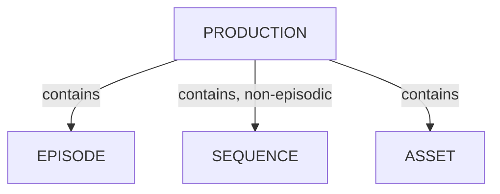

# Gérer les productions

<iframe width="560" height="315" src="https://www.youtube.com/embed/ZDDqZxdED0s?si=aZTOFBXQeV6SpBcQ" title="YouTube video player" frameborder="0" allow="accelerometer; autoplay; clipboard-write; encrypted-media; gyroscope; picture-in-picture; web-share" referrerpolicy="strict-origin-when-cross-origin" allowfullscreen></iframe>

<!-- #region body -->

<!-- #region setup -->

Pour accéder à la liste des productions, utilisez le menu de navigation et cliquez sur `Mes productions` :

Les administrateurs peuvent également utiliser la page `Productions` pour modifier et supprimer des productions :

## Créer une nouvelle production

Cliquez sur le bouton `Créer une nouvelle production` pour faire apparaître la page :

Saisissez le nom de votre production, choisissez un **Type de production** et sélectionnez le style de votre production (2D, 3D).

Ensuite, vous devez renseigner les informations techniques, telles que le nombre d'images par seconde, le ratio et la résolution.

Toutes ces données seront utilisées lorsque Kitsu réencodera les aperçus vidéo importés.

Vous devez ensuite définir les dates de début et de fin de votre production.

Vous pouvez définir le workflow de votre production dans la partie suivante, de 3 à 6.

Vous devez sélectionner le type de tâche pour les assets (3), le type de tâche pour les plans (4), le statut des tâches (5) et les types d'assets (6).

::: tip
Pour créer votre **workflow de production**, vous sélectionnerez des types de tâches dans la bibliothèque globale.

Si vous constatez qu'il vous manque certains types de tâches, types d'assets ou statuts de tâches, vous pourrez les ajouter ultérieurement pendant la production.

Consultez la section [Workflow du studio](../../../configure-kitsu/index.html#studio-workflows).
:::

<!-- #endregion setup -->

Les parties 7 et 8 correspondent aux options. Si vous avez déjà une feuille de calcul contenant vos assets/plans.

Consultez les sections **Importer depuis un fichier CSV** de chaque page d'entité pour plus de détails :

- [Importer des assets depuis un fichier CSV](/fr/guides/production/manage-assets/)
- [Importer des plans depuis un fichier CSV](/fr/guides/production-structure/manage-shots/)

Validez le tout avec le bouton `Tout est terminé`.

### Utiliser des modèles de production

La mise en place d'une nouvelle production implique souvent de répéter encore et encore les mêmes étapes de configuration, comme le choix des types de tâches pour les plans et les assets, la définition des statuts de tâches et l'ajustement des paramètres généraux du projet afin de les adapter au workflow de votre équipe.

Avec les modèles de projet, vous pouvez commencer à partir d'une configuration prédéfinie en un clic :

Lors de la création d'une nouvelle production, il vous suffit de sélectionner un modèle et Kitsu appliquera automatiquement vos paramètres préférés.

Dans l'exemple ci-dessus, le modèle comprend des types d'assets, des types de tâches, des statuts de tâches, etc. préconfigurés, que nous n'avons pas besoin de sélectionner manuellement dans la bibliothèque globale :

Consultez la section [Créer votre propre modèle de production](#create-your-own-production-template) ci-dessous pour en ajouter un.

## Configurer les paramètres spécifiques à une production

Dans le **menu de navigation**, choisissez **Paramètres** dans le menu déroulant. 

Le premier onglet, **Paramètres**, vous permet de modifier les **informations techniques** de la production.

::: warning
Si vous modifiez le **nombre d'images par seconde** ou la **résolution** après avoir importé des aperçus, les modifications ne seront pas appliquées ; vous devrez importer à nouveau les premiers aperçus.
:::

Vous pouvez ici activer des options spécifiques à la production, telles que :

- Isoler les commentaires du client (non visibles les uns pour les autres)
- Autoriser les artistes à télécharger les aperçus
- Définir automatiquement le nouvel aperçu comme miniature de l'entité

Vous pouvez également définir le **nombre maximal de retakes** pour cette production.

::: tip
Vous pouvez également modifier l'avatar de la production dans l'onglet **Paramètres**.
:::

### Configuration des statuts du tableau des artistes

Lorsque vous attribuez une tâche à un artiste, celle-ci apparaît sur sa page de tâches à faire lorsqu'il se connecte.

Bien que la vue par défaut affiche ses tâches sous forme de liste traditionnelle, il peut également choisir de les afficher sous forme de tableau. Chaque **statut** est représenté par une colonne, et les tâches attribuées sont des cartes qui peuvent être déplacées d'un statut à l'autre au fur et à mesure de leur progression.

Pour personnaliser la vue en tableau, accédez à la page des paramètres de votre production.

Dans l'onglet **Statut des tâches**, vous pouvez réorganiser les statuts de la vue **Tableau**.

Vous pouvez faire glisser et déplacer les statuts afin de modifier leur ordre d'affichage dans la vue en tableau.

Une fois cette étape terminée, accédez à l'onglet **Statuts du tableau**.

Vous pouvez ici choisir quels rôles disposant de permissions peuvent voir quels statuts dans leur **vue en tableau**.

Si vous ne sélectionnez pas correctement les statuts, les artistes peuvent se sentir submergés s'ils ont trop de choix.

Sélectionner correctement les **statuts** facilitera le travail des artistes.

::: tip
La personnalisation des statuts affichés dans la vue **Tableau** se fait par rôle disposant de permissions. Elle ne peut pas être personnalisée pour chaque utilisateur individuellement.
:::

## Fermer une production (archiver)

Il est recommandé d'archiver une production une fois celle-ci terminée, au cas où vous auriez besoin de réutiliser des assets ou d'autres éléments de production dans la suivante.

Commencez par cliquer sur le bouton de modification de la production cible dans la page `Menu principal > Studio > Productions` :

Dans la boîte de dialogue, sélectionnez `Fermée` comme statut de la production, puis cliquez sur `Confirmer` :

Votre production est désormais répertoriée comme `Fermée`.

## Supprimer une production

Pour supprimer une production, vous devez d'abord la fermer.

Une fois cette opération effectuée, cliquez simplement sur le bouton `Supprimer` dans l'élément correspondant de la liste des productions fermées. Votre production sera alors supprimée de votre instance :

## Créer votre propre modèle de production

Accédez à `Menu principal > Administration > Modèles` pour gérer vos modèles de production.

Pour en créer un nouveau, cliquez sur le bouton `Ajouter un modèle de production` et remplissez le formulaire :

- Nom : le nom de votre modèle
- Type : `Court métrage`, `Série TV`, `Long métrage`, `Uniquement des assets` ou `Uniquement des plans`
- Style : `Animation 2D`, `Animation 2D (papier)`, `Animation 3D`, `Animation 2D/3D`, `VFX`, `Publicité`, `Réalité virtuelle`, `Motion design`, `Archviz`, `Stop motion`, `Catalogue`, `Collection NFT`, `Jeu vidéo`, `Expérience immersive` ou `Réalité augmentée`
- Description : une courte description de votre modèle

Cliquez sur `Confirmer` pour enregistrer votre modèle afin de pouvoir l'utiliser ultérieurement.

<!-- #endregion body -->