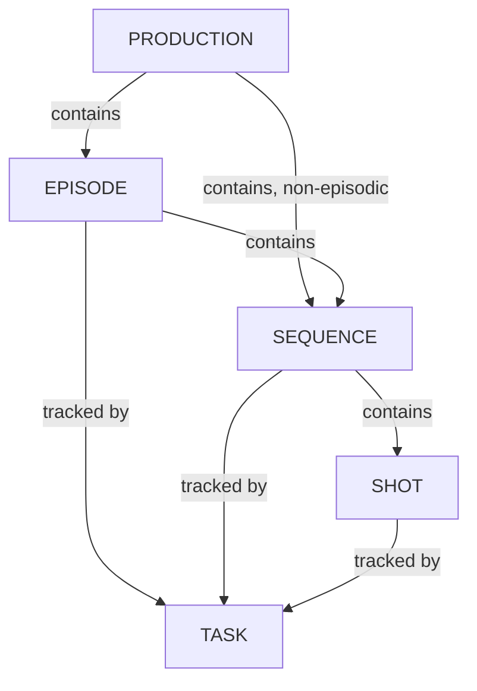

# Gérer les séquences

<iframe width="560" height="315" src="https://www.youtube.com/embed/Y5Fx6jlgQok?si=8WzQxoSdRSQ3nIwZ" title="YouTube video player" frameborder="0" allow="accelerometer; autoplay; clipboard-write; encrypted-media; gyroscope; picture-in-picture; web-share" referrerpolicy="strict-origin-when-cross-origin" allowfullscreen></iframe>

<!-- #region body -->

Dans Kitsu, vous pouvez également suivre les tâches au niveau des **séquences**.

C'est particulièrement utile lorsque vous avez des tâches globales à suivre, comme le storyboard et le color board, l'étalonnage, etc.

<!-- #region setup -->

Utilisez le menu de navigation pour accéder à la page **Séquences** :

Vous pouvez accéder à toutes les séquences en une seule fois ou par épisode si votre production est une série télévisée :

Vous pouvez attribuer des tâches, effectuer des révisions, modifier le statut, ajouter une colonne de métadonnées, remplir la description, etc.

Si vous cliquez sur le nom d'une séquence, vous verrez la page de détails de cette séquence.

Sur la page détaillée, vous avez accès au casting de la séquence afin de voir tous les assets utilisés dans l'ensemble de la séquence.

Vous pouvez également accéder au planning, aux fichiers de prévisualisation, à l'activité et au journal des temps des **tâches** de la séquence.

## Créer une séquence

Vous pouvez créer une séquence avec le bouton **+ Nouvelle séquence**.

::: tip
Vous pouvez créer une séquence directement depuis cette page (bouton +Nouvelle séquence) ou créer une séquence liée à vos plans depuis la page globale des plans.
:::

<!-- #endregion setup -->

## Mettre à jour une séquence

Survolez la ligne de la séquence que vous souhaitez modifier dans la liste, puis cliquez sur l'icône `Modifier` :  

## Supprimer une séquence

Survolez la ligne de la séquence que vous souhaitez supprimer dans la liste, puis cliquez sur l'icône `Supprimer` :  

<!-- #endregion body -->

