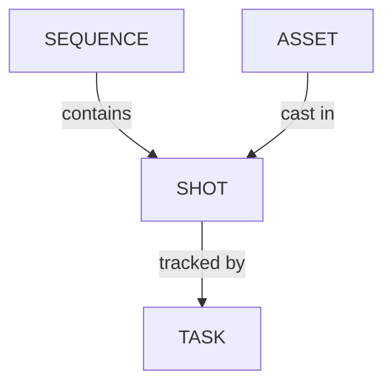

# Gérer les plans

<iframe width="560" height="315" src="https://www.youtube.com/embed/akjCFIaryYw?si=0qtJQUoLF7C_xPdE" title="YouTube video player" frameborder="0" allow="accelerometer; autoplay; clipboard-write; encrypted-media; gyroscope; picture-in-picture; web-share" referrerpolicy="strict-origin-when-cross-origin" allowfullscreen></iframe>

<!-- #region body -->

::: warning
Les plans sont liés aux séquences dans Kitsu.
Vous devez d’abord créer une séquence pour pouvoir y ajouter des plans.
:::

## Créer un plan

<!-- #region setup -->

Il est temps de créer les **plans** de votre production.

Pour accéder à la page **Plans**, utilisez le menu déroulant et cliquez sur `Plans`.

Cliquez sur le bouton **Ajouter des plans** pour commencer la création des plans.

::: warning
Lorsque vous créez un plan, le flux de tâches que vous avez conçu est appliqué et toutes les tâches sont créées en même temps que le plan.
:::

Une nouvelle fenêtre contextuelle s’ouvre pour créer les plans. Vous pouvez maintenant ajouter des séquences et les plans correspondants :

Saisissez la première séquence, par exemple SQ01, puis cliquez sur `ajouter`.

Pour ajouter des plans à cette séquence, sélectionnez-la et saisissez un nom dans le champ de saisie de la colonne des plans (par exemple SH0020), puis cliquez à nouveau sur `ajouter`.

::: tip
Vous pouvez également définir un incrément pour vos plans au lieu de le faire manuellement.

Si vous souhaitez nommer vos plans de dix en dix, comme SH0010, SH0020, SH0030, etc., définissez l’**incrément des plans** sur 10.
:::

Vous pouvez maintenant voir que les nouveaux plans sont listés et liés à leur séquence : vous venez de créer le premier plan de la première séquence !

Ajoutons maintenant d’autres plans.

Le champ de saisie contient déjà un code de nom incrémenté selon votre incrément ; il vous suffit donc de continuer à cliquer sur `ajouter` pour créer d’autres plans :

Pour ajouter d’autres séquences, allez dans la partie gauche, saisissez le nom de votre nouvelle séquence, puis cliquez sur `ajouter`.

Votre deuxième séquence est sélectionnée et vous pouvez maintenant ajouter des plans.

> [!TIP]
> Si un plan est placé dans la mauvaise séquence, vous devez modifier le plan depuis sa page dédiée pour changer la séquence. Consultez la section `Mettre à jour vos plans` pour plus d’informations.

<!-- #endregion setup -->

## Importer des plans

### Depuis un fichier EDL

Vous disposez peut-être déjà de votre liste de plans dans un fichier **EDL**.
Avec Kitsu, vous pouvez importer directement votre fichier **EDL** pour créer la séquence, le plan, le nombre d’images, l’image d’entrée et de sortie, etc.

Sur la **page globale des plans**, vous trouverez un bouton **Importer un EDL**.

Vous pouvez sélectionner, dans la fenêtre contextuelle, la convention de nommage du fichier vidéo utilisée pendant le montage.

Cela signifie que le clip vidéo du montage est nommé sous la forme project_sequence_shot.extension.

Voici un exemple d’EDL pour la production LGC.

Les fichiers vidéo sont nommés LGC_100-000.mov, ce qui signifie que LGC est le nom de la production, 100 le nom de la séquence et 000 le nom du plan.

Vous pouvez importer le fichier EDL une fois la convention de nommage définie.

Cliquez ensuite sur **Téléverser l’EDL**.

Kitsu créera alors les plans.

### Depuis un fichier tableur

Vous disposez peut-être déjà de votre liste de plans dans un fichier tableur.
Avec Kitsu, vous pouvez les importer de deux façons : importer directement un fichier `.csv` ou copier-coller vos données directement dans Kitsu.

#### Option 1 : Importer un fichier CSV

Commencez par enregistrer votre tableur au format `.csv`.

Retournez ensuite sur la page des plans dans Kitsu et cliquez sur l’icône **Importer**.

Une fenêtre contextuelle **Importer des données depuis un CSV** s’ouvre. Cliquez sur **Parcourir** pour sélectionner votre fichier `.csv`.

#### Option 2 : Copier-coller depuis un tableur

Ouvrez votre tableur, sélectionnez vos données et copiez-les.

Retournez ensuite sur la page des plans dans Kitsu et cliquez sur l’icône **Importer**.

Une fenêtre contextuelle **Importer des données depuis un CSV** s’ouvre ; cliquez sur l’onglet **Coller des données CSV**.

Vous pouvez coller les données que vous avez précédemment sélectionnées.

#### Prévisualiser et confirmer votre importation

Quelle que soit la méthode utilisée, cliquez sur le bouton **Prévisualiser** pour voir le résultat.

Vous pouvez vérifier et ajuster le nom des colonnes en prévisualisant vos données.

NB : la colonne **Épisode** est obligatoire uniquement pour une production de type **Série TV**.

Une fois que tout est correct, cliquez sur le bouton **Confirmer** pour importer vos données dans Kitsu.

Tous vos plans sont importés dans Kitsu et les tâches sont créées selon vos **Paramètres**.

## Voir les détails d’un plan

<!-- #region view-shots -->

Si vous souhaitez voir les détails d’un plan, cliquez sur son nom.

Une nouvelle page s’ouvre avec la liste des tâches, l’assignation et le fil d’actualité des statuts à droite.
Vous pouvez naviguer entre ces éléments en cliquant sur le nom des onglets.

Vous pouvez cliquer sur le statut de chaque tâche pour ouvrir le panneau des commentaires et consulter l’historique des commentaires ainsi que les différentes versions.

Vous pouvez également accéder au **Casting**,

Le **Planning** est disponible si vous avez précédemment renseigné les données de la page des types de tâches. Si vous avez déjà renseigné ces données, vous pouvez les modifier directement ici.

aux **Fichiers de prévisualisation** téléversés pour différents types de tâches,

ainsi qu’au **Suivi du temps** si les personnes ont renseigné leur feuille de temps pour les tâches de cet élément.

<!-- #endregion view-shots -->

## Ajouter des tâches après la création des plans

Si vous constatez après avoir créé les plans qu’une tâche manque, vous pouvez toujours l’ajouter ultérieurement.

Commencez par [vous assurer que le type de tâche manquant est ajouté](/fr/guides/task-configuration/managing-task-types/) à la page `Paramètres`, dans l’onglet `Type de tâche`.

Retournez ensuite sur la page `Plans` et cliquez sur `+ Ajouter des tâches`.

Pour plus de détails sur la création d’un type de tâche, [consultez la page de documentation correspondante](/fr/guides/task-configuration/managing-task-types/).

## Mettre à jour les plans

Vous pouvez mettre à jour vos plans à tout moment, modifier leurs noms et leurs séquences, modifier leurs descriptions et ajouter toute information personnalisée ajoutée à la page globale.

Vous pouvez modifier les plans en accédant à la page des plans, en passant la souris sur le plan que vous souhaitez modifier, puis en cliquant sur le bouton **Modifier** :

Pour développer la description sur la page principale des plans, cliquez sur le nom du plan ; une fenêtre contextuelle contenant la description complète s’ouvrira.

### Depuis un CSV

Vous pouvez utiliser l’**importation CSV** pour mettre à jour vos données en masse.

Ouvrez votre tableur, copiez vos données et collez-les comme dans la section `Importer des plans depuis un CSV`.

La seule différence est que vous devez activer l’**Option : Mettre à jour les données existantes**.

Les plans mis à jour apparaîtront en bleu :

NB : la colonne **Épisode** est obligatoire uniquement pour une production de type **Série TV**.

## Ajouter le nombre d’images et les plages d’images aux plans

Une fois votre animatique terminée, vous disposez de la durée (**nombre d’images**, **image d’entrée** et **image de sortie**) de chaque plan. Vous pouvez ajouter ces informations au tableur afin de vous assurer que toutes les images sont prises en compte dans votre pipeline.

::: warning
Si vous avez créé vos plans et votre séquence manuellement, la colonne **Images** sera masquée. Vous devez modifier au moins un plan et renseigner le nombre d’images pour afficher la colonne **Images**.

La colonne sera affichée si vous avez créé vos plans et importé le nombre d’images avec un fichier CSV ou un tableur.
:::

Vous devez modifier les plans pour renseigner les informations relatives à la plage d’images. Cliquez sur l’icône `Modifier` à droite de la ligne du plan :

Vous pouvez saisir les **images d’entrée** et les **images de sortie** du plan dans la nouvelle fenêtre. Enregistrez ensuite en cliquant sur le bouton **Confirmer**.

La plage d’images apparaît maintenant dans le tableur général de la page des plans.

::: tip
Si vous saisissez l’**image d’entrée** et l’**image de sortie**, Kitsu calcule automatiquement le **nombre d’images**.
:::

Maintenant que vous avez déverrouillé les colonnes **Images**, **Entrée** et **Sortie**, vous pouvez modifier directement les cellules depuis la page globale des plans. Cliquez simplement sur la cellule que vous souhaitez modifier :

::: info
Encore une fois, vous pouvez utiliser l’**importation CSV** pour mettre à jour plus rapidement vos plages d’images.
:::

::: info
Vous pouvez récupérer le nombre d’images à partir de la prévisualisation de votre vidéo.
:::

## Accéder à l’historique des modifications d’un plan

Vous pouvez également accéder à l’historique des modifications de vos plans.

Cliquez simplement sur l’icône `Historique` :

Une boîte de dialogue apparaît avec un tableau répertoriant toutes vos modifications :

## Supprimer des plans

Passez la souris sur la ligne du plan que vous souhaitez supprimer dans la liste, puis cliquez sur l’icône `Supprimer` :

Cela archivera ou clôturera le plan. Pour le supprimer définitivement, cliquez à nouveau sur l’icône `Supprimer`.

<!-- #endregion body -->