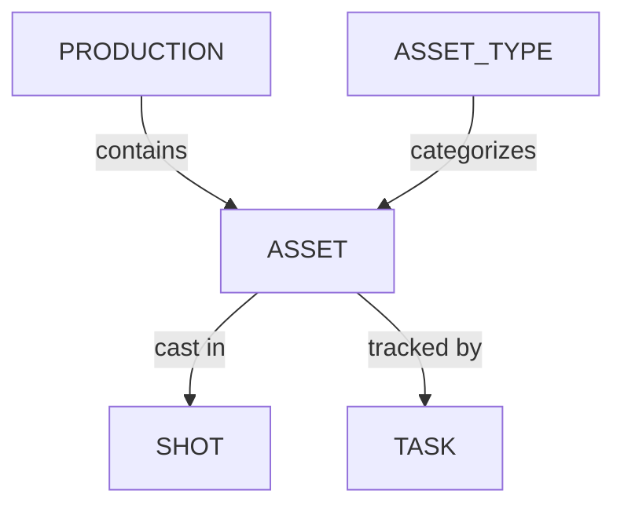

# Production

1. [Gérer les concepts](/fr/guides/production/manage-concepts/) - Apprenez à créer, organiser et valider les concept arts de votre production.
2. [Gérer les types d’assets](/fr/guides/production/managing-asset-types/) - Créez et organisez les catégories (comme Personnages, Accessoires ou Environnements) utilisées pour regrouper et classer les assets dans une production.
3. [Gérer les assets](/fr/guides/production/manage-assets/) - Apprenez à créer, organiser et suivre les assets utilisés tout au long de votre production.
4. [Attribuer des tâches](/fr/guides/production/assign-tasks/) - Apprenez à attribuer des tâches à des personnes
5. [Trouver les tâches attribuées](/fr/guides/production/find-assignments/) - Apprenez à trouver les tâches qui vous sont attribuées
6. [Découpage et casting](/fr/guides/production/breakdown-casting/) - Apprenez à découper vos scripts ou storyboards et à intégrer des assets dans les plans.
7. [Méta-colonnes](/fr/guides/production/meta-column/) - Apprenez à créer et organiser les métadonnées de votre production.
8. [Arrière-plan 3D](/fr/guides/production/3d-background) - Améliorez les revues 3D avec un arrière-plan .HDR

## Modèle de données

- **Asset** - Un élément de production réutilisable (personnage, accessoire, décor, configuration d’effets visuels) qui peut être intégré à un ou plusieurs plans.
- **Type d’asset** - Une catégorie d’assets (par ex. Personnage, Accessoire, Environnement, FX).