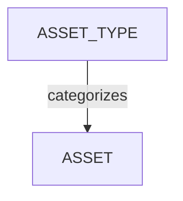

# Gestion des types d’assets

<iframe width="560" height="315" src="https://www.youtube.com/embed/Mgnenq75Wv0?si=ZR67ZkflyMUf5ga4" title="YouTube video player" frameborder="0" allow="accelerometer; autoplay; clipboard-write; encrypted-media; gyroscope; picture-in-picture; web-share" referrerpolicy="strict-origin-when-cross-origin" allowfullscreen></iframe>

<!-- #region body -->

## Définir votre workflow d’assets

Après avoir créé votre workflow global, vous pouvez définir vos **types d’assets**.

<!-- #region setup -->

Tout comme les plans peuvent être organisés par séquence, un asset peut être organisé par **type d’asset**. Imaginez qu’il s’agisse d’utiliser des dossiers pour organiser tous vos assets par catégorie.

Dans le menu principal, sélectionnez la page **Types d’assets** dans la section **Administration**.

::: tip
Par défaut, Kitsu fournit quelques exemples de types d’assets qui peuvent être utilisés pour une production en images de synthèse.
:::

Pour créer un nouveau **type d’asset**, cliquez sur le bouton `Ajouter des types d’assets` dans le coin supérieur droit.

Vous devrez ensuite fournir certaines informations sur votre **type d’asset**, notamment :

- Le nom du type d’asset
- Un workflow pour le type d’asset spécifique

Les différents types d’assets auront des workflows distincts. Par exemple, vous pouvez avoir moins de tâches pour un environnement que pour un personnage, car les assets d’environnement ne nécessitent généralement pas de tâches de rigging.

Lorsque vous **créez** ou **modifiez** un **type d’asset**, vous pouvez ajouter un **type de tâche** spécifique ; si vous ne sélectionnez pas de workflow spécifique pour ce type d’asset, votre workflow d’assets de production sera appliqué.

Cependant, si vous choisissez des types de tâches spécifiques pour ce type d’asset, seuls ceux-ci seront appliqués à la production.

Cliquez sur **Confirmer** pour enregistrer vos modifications.

Votre nouveau **type d’asset** est maintenant créé dans votre **bibliothèque globale**. Il sera disponible lorsque vous créerez votre production.

::: tip
À tout moment au cours de la production, vous pouvez revenir dans cette section pour créer d’autres **types d’assets** si nécessaire et les ajouter à votre workflow.
:::

<!-- #endregion setup -->

## Activer des types d’assets spécifiques pour une production

Dans le **menu de navigation**, sélectionnez **Paramètres** dans le menu déroulant.

Par défaut, Kitsu chargera les **types d’assets** que vous avez définis lors de la création de la production.

Cependant, vous pouvez ajouter ou supprimer des types d’assets spécifiques s’ils ont d’abord été créés dans la bibliothèque globale.

Dans l’onglet **Types d’assets**, vous pouvez choisir les **types d’assets** que vous souhaitez ajouter ou supprimer de cette production, puis valider votre choix avec le bouton **Ajouter**.

## Mettre à jour un type d’asset

Accédez à `Menu principal > Types d’assets` :

Survolez la ligne du type d’asset que vous souhaitez sélectionner, puis cliquez sur l’icône `Modifier` :

## Supprimer un type d’asset

Pour supprimer un type d’asset de la bibliothèque globale de votre studio, accédez à `Menu principal > Types d’assets`, puis survolez la ligne du type d’asset que vous souhaitez sélectionner et cliquez sur l’icône `Supprimer` :

Pour supprimer un type d’asset de la bibliothèque de votre production, accédez à `Menu de la production > Paramètres > Types d’assets` et cliquez sur le bouton `Supprimer` pour retirer le type d’asset de la liste :  

<!-- #endregion body -->