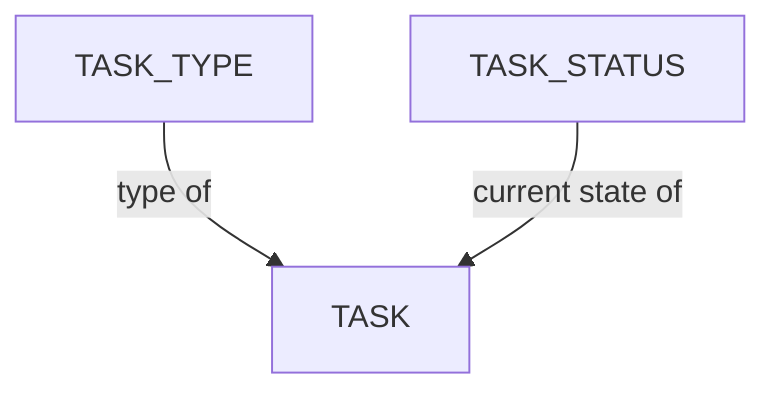

# Configuration des tâches

Le modèle de données de Kitsu organise le travail autour d’une hiérarchie d’entités de production (studio → production → épisode/séquence/plan, ou → élément) croisée avec un système de suivi des tâches (type de tâche, statut de tâche, département).

## Table des matières

1. [Gérer les types de tâches](/fr/guides/task-configuration/managing-task-types/) - Définir les étapes du pipeline (comme la modélisation, le rigging ou le compositing) que les éléments, les plans et les autres entités suivent au cours de la production.
2. [Gérer les statuts des tâches](/fr/guides/task-configuration/managing-task-statuses/) - Configurer les états de revue et d’approbation (comme À faire, En cours ou Terminé) qui permettent de suivre la progression d’une tâche dans le workflow.
3. [Automatisation des statuts](/fr/guides/task-configuration/status-automation/) - Définir des règles ou conditions qui déclenchent automatiquement des changements de statut des tâches selon des critères prédéfinis.

## Modèle de données

- **Tâche** - Une unité de travail suivie, toujours rattachée à un plan ou à un élément, avec un type de tâche et un statut actuel attribués.
- **Type de tâche** - Définit le type de travail représenté par une tâche (par ex. Layout, Animation, Lighting) ; appartient à un département.
- **Statut de tâche** - L’état actuel d’une tâche (par ex. À faire, En cours, Terminé, À refaire, En attente d’approbation).