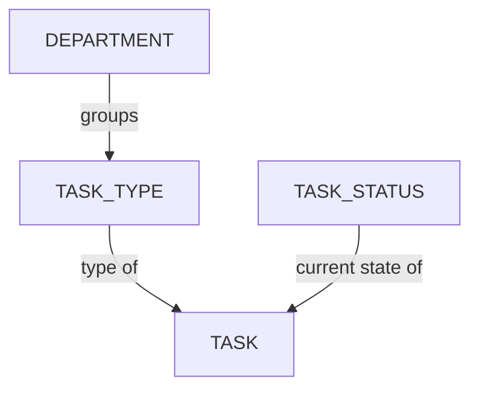

# Gérer les statuts des tâches

<iframe width="560" height="315" src="https://www.youtube.com/embed/JbmXL-EcrnY?si=rEHH_vPy-8Cp_MLg" title="lecteur vidéo YouTube" frameborder="0" allow="accelerometer; autoplay; clipboard-write; encrypted-media; gyroscope; picture-in-picture; web-share" referrerpolicy="strict-origin-when-cross-origin" allowfullscreen></iframe>

<!-- #region body -->

Un statut représente une étape ou une condition spécifique par laquelle une tâche doit passer dans le cadre du processus de révision et d'approbation.

<!-- #region setup -->

Dans le menu principal, sélectionnez la page **Statut de tâche** dans la section **Administration** :

::: tip
Par défaut, Kitsu fournit déjà quelques exemples de statuts.
:::

Vous accéderez à la page `Statut de tâche` :

## Créer un statut de tâche

Créons les statuts que nous avons l'intention d'utiliser pendant notre **flux de validation**.

Par exemple :

| Statut | Icône | Description |
|---|---|---|
| **Ready** |  | Indique que les artistes disposent de tout ce dont ils ont besoin pour commencer à travailler et qu'ils ne doivent pas commencer leurs tâches avant d'avoir atteint ce statut. |
| **WIP** |  | Utilisé par les artistes pour informer leur équipe qu'ils travaillent activement sur la tâche, indiquant qu'il n'est pas nécessaire de l'attribuer à quelqu'un d'autre. |
| **WFA** |  | Utilisé par les artistes pour informer leurs superviseurs qu'ils ont terminé leur travail et attendent une révision. Les superviseurs peuvent également utiliser un statut similaire pour informer les directeurs que le travail est prêt à être révisé. |
| **Done** |  | Indique que tout le travail a été terminé et approuvé. Cela signifie que la tâche actuelle est terminée et que l'étape suivante du processus peut commencer. |
| **Retake** |  | Indique qu'un commentaire a été ajouté, invitant les artistes à continuer à travailler sur leur tâche et à publier une nouvelle version jusqu'à validation. |

Ces statuts sont **simplement des exemples** de ce qui est possible dans Kitsu ! Vous êtes libre de créer les vôtres selon vos besoins.

Pour ce faire, depuis la page principale, cliquez sur le bouton `Ajouter un statut de tâche` dans le coin supérieur droit.

Vous devrez ensuite définir certains détails concernant votre **statut de tâche**, notamment :

- **NOM** est le nom explicite du statut qui sera affiché lorsque vous passerez la souris dessus
- **NOM COURT** est ce qui sera affiché dans les tableaux de bord Kitsu
- Choisissez la **couleur** d'arrière-plan que vous préférez pour ce statut

Vous pouvez également sélectionner plusieurs indicateurs :

| Indicateur | Signification |
|---|---|
| **PAR DÉFAUT** | Le premier statut que Kitsu affiche par défaut pour toutes les tâches. Un seul statut peut être défini comme statut par défaut. |
| **TERMINÉ** | Marque le statut comme validant une tâche : utile pour la gestion des quotas, l'organisation de la liste de tâches et la mise à jour des statistiques des épisodes. |
| **A UNE VALEUR DE REPRISE** | Marque le statut comme étant utilisé pour commenter une tâche : utile pour suivre les échanges concernant le type de tâche et la page des statistiques de l'épisode. |
| **AUTORISÉ POUR L'ARTISTE** | Contrôle si les artistes peuvent attribuer ce statut aux tâches. Si la valeur est **Non**, les artistes ne le verront pas dans leur liste de statuts disponibles, mais ils pourront toujours le commenter. |
| **AUTORISÉ POUR LE CLIENT** | Contrôle si les clients peuvent utiliser ce statut. Si la valeur est **Non**, les clients ne le verront pas dans leur liste de statuts disponibles. |
| **DEMANDE DE RETOUR** | Marque le statut comme étant utilisé pour demander une révision : utile pour suivre les quotas sans feuille de temps, il apparaît dans l'onglet En attente de la liste de tâches et regroupe ces statuts sur la page **Ma vérification**. Kitsu demandera une **publication d'aperçu** chaque fois que ce statut sera utilisé. |

Cliquez sur **Confirmer** pour enregistrer vos modifications.

Votre **statut** est maintenant créé dans votre **bibliothèque globale** et sera disponible pour être utilisé dans votre production.

::: tip
À tout moment au cours de la production, vous pouvez revenir ici et créer d'autres **statuts de tâche** si nécessaire,
puis les ajouter à votre production.
:::

::: warning
Vous remarquerez que quelques statuts de tâche sont répertoriés dans la catégorie *Statut de concept*. Ceux-ci sont utilisés par le système et, bien que vous puissiez les modifier ici, vous ne pouvez pas en créer de nouveaux.
:::

<!-- #endregion setup -->

## Ajouter des statuts de tâche à une production

Dans le **menu de navigation**, sélectionnez **Paramètres** dans le menu déroulant.

Par défaut, Kitsu chargera les **statuts de tâche** que vous avez définis lors de la création de la production.

Cependant, vous pouvez ajouter ou supprimer des statuts spécifiques pendant la production s'ils ont d'abord été créés dans la bibliothèque globale.

Dans l'onglet **Statut de tâche**, vous pouvez choisir quel **statut** vous souhaitez ajouter ou supprimer de cette production,
puis valider votre choix avec le bouton **Ajouter**.

## Mettre à jour un statut de tâche

Accédez à `Menu principal > Statut de tâche` :

Sélectionnez l'onglet Entités ou Concepts, puis passez la souris sur la ligne du statut de tâche que vous souhaitez modifier et cliquez sur l'icône `Modifier` :

## Supprimer un statut de tâche

Pour supprimer un statut de tâche de la bibliothèque globale de votre studio, accédez à `Menu principal > Statut de tâche`, puis passez la souris sur la ligne du statut de tâche que vous souhaitez sélectionner et cliquez sur l'icône `Supprimer` :

Pour supprimer un statut de tâche de la bibliothèque de votre production, accédez à `Menu de la production > Paramètres > Statut de tâche` et cliquez sur le bouton `Supprimer` pour retirer le statut de tâche de la liste :

<!-- #endregion body -->