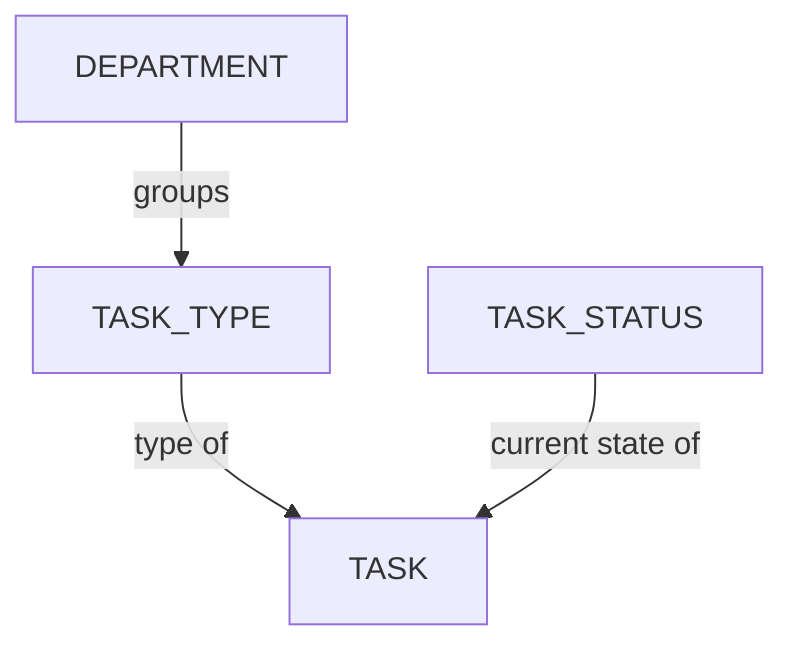

# Gérer les types de tâches

<iframe width="560" height="315" src="https://www.youtube.com/embed/mfAoiMIcqlM?si=LDANaDtNjV3wYmdH" title="YouTube video player" frameborder="0" allow="accelerometer; autoplay; clipboard-write; encrypted-media; gyroscope; picture-in-picture; web-share" referrerpolicy="strict-origin-when-cross-origin" allowfullscreen></iframe>

<!-- #region body -->

Les types de tâches peuvent être associés à plusieurs entités telles que des éléments, des plans, des séquences, des épisodes ou des montages.

## Créer un nouveau type de tâche

<!-- #region setup -->

Commençons par créer tous les **types de tâches** nécessaires pour gérer et suivre notre production.

Dans le menu principal, sélectionnez la page **Types de tâches** dans la section **Administration** :

::: tip
Par défaut, Kitsu fournit quelques types de tâches d'exemple qui peuvent être utilisés pour une production CGI. Vous pouvez renommer ou supprimer ceux qui ne sont pas pertinents pour votre production.
:::

Vous remarquerez que ces **types de tâches** sont déjà liés à un département.

Vous pouvez cliquer sur le bouton `Ajouter un type de tâche` dans le coin supérieur droit pour créer un nouveau **type de tâche**.

Vous devrez ensuite fournir certaines informations sur votre type de tâche, notamment :

- Le nom du type de tâche. Vous devez en utiliser un différent pour chaque type de tâche, même si les entités sont différentes.
- Le nom court apparaît dans les tableaux de bord comme une version concise du nom.
- Si les membres de l'équipe doivent enregistrer le temps consacré aux tâches de ce type.
- L'entité pour laquelle il sera utilisé.
- Le département auquel il doit être lié.
- La couleur (elle sera utilisée comme couleur d'arrière-plan sur la page principale du tableur).

Vous remarquerez que les **départements** sont disponibles comme option pour associer les types de tâches. Associer un département à un type de tâche spécifique aide votre équipe à rester organisée.

::: info
[À propos de la création de départements](/fr/guides/team-management/managing-departments)
:::

Cliquez sur **Confirmer** pour enregistrer vos modifications.

::: warning
Les types de tâches nouvellement créés apparaîtront en bas de la liste.
:::

Pour modifier l'ordre, cliquez simplement sur le **type de tâche** et faites-le glisser jusqu'à la position appropriée dans la liste.

Félicitations, votre type de tâche a maintenant été créé dans votre **bibliothèque globale** !

::: warning
Une fois votre production créée, vous devez ajouter les types de tâches **Séquence**, **Épisode** et **Montage** à votre **bibliothèque de production**.
:::

::: tip
À tout moment au cours de la production, vous pouvez revenir dans cette section pour créer des **types de tâches** supplémentaires si nécessaire et les ajouter à votre flux de travail.
:::

<!-- #endregion setup -->

## Ajouter des types de tâches à une production

Dans le **menu de navigation**, sélectionnez **Paramètres** dans le menu déroulant.

Par défaut, Kitsu ajoutera les **types de tâches** que vous avez sélectionnés lors de la création de la production.

Cependant, vous pouvez ajouter ou supprimer des **types de tâches** spécifiques s'ils ont d'abord été créés dans la bibliothèque globale.

Par exemple, vous pouvez importer le flux de travail des tâches d'une autre production de votre bibliothèque.

Dans l'onglet **Types de tâches**, vous pouvez choisir la production ou le type de tâche que vous souhaitez importer ou supprimer dans cette production, puis valider votre choix avec le bouton **Importer**.

::: tip
Si vous ajoutez un nouveau type de tâche **APRÈS** avoir créé un élément ou un plan :

Vous devez **ajouter ce type de tâche** sur la page globale de l'entité (plan, élément, séquence, etc.) :

Une fenêtre contextuelle apparaît, et vous devez sélectionner le nouveau type de tâche dans le menu déroulant :

Confirmez pour voir le type de tâche ajouté à votre tableau de bord :

:::

## Mettre à jour un type de tâche

Accédez à `Menu principal > Types de tâches` :

Cliquez sur l'onglet correspondant au type d'entité dont vous avez besoin (élément, plan, séquence, épisode ou montage), puis survolez la ligne du type de tâche que vous souhaitez sélectionner et cliquez sur l'icône `Modifier` :

## Archiver un type de tâche

Si vous souhaitez masquer un type de tâche sans le supprimer de l'instance, vous pouvez le modifier afin de l'archiver.

## Supprimer un type de tâche

Pour supprimer un type de tâche de la bibliothèque globale de votre studio, accédez à `Menu principal > Types de tâches`, puis survolez la ligne du type de tâche que vous souhaitez sélectionner et cliquez sur l'icône `Supprimer` :

Pour supprimer un type de tâche de votre bibliothèque de production, accédez à `Menu de production > Paramètres > Types de tâches` et cliquez sur le bouton `Supprimer` pour retirer le type de tâche de la liste :  

Vous pouvez également supprimer un type de tâche depuis la page globale des éléments ou des plans. Cliquez sur le chevron à côté du nom du type de tâche et sélectionnez `Tout supprimer`.

::: danger Attention
La suppression d'un type de tâche depuis la page globale des éléments ou des plans supprimera toutes les tâches, affectations, aperçus et commentaires correspondants. Cette action est irréversible, sauf si vous disposez d'une solution de sauvegarde.
::: 

<!-- #endregion body -->