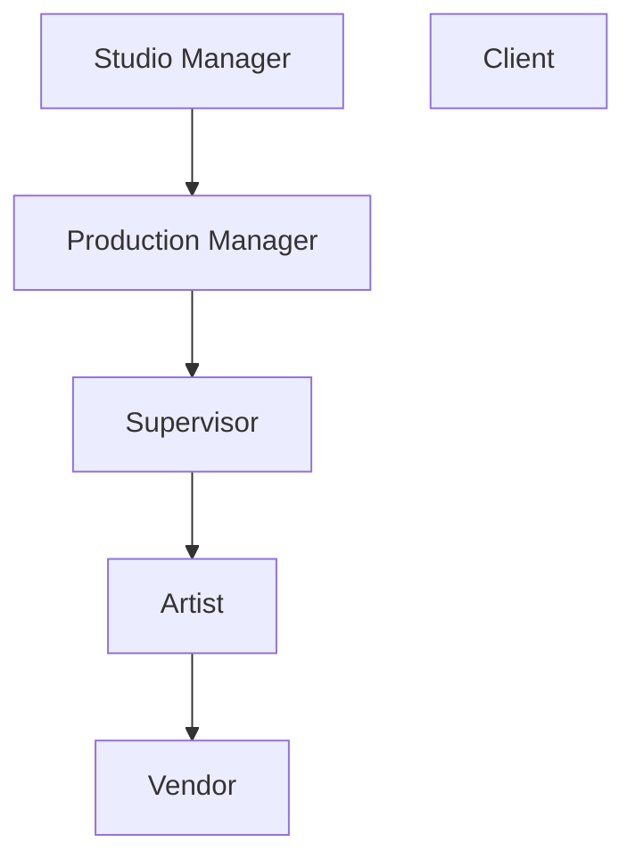

# Rôles et permissions des utilisateurs

<iframe width="560" height="315" src="https://www.youtube.com/embed/hPXF4dGz7AQ?si=5HLEQbY6P9l9TEu_" title="YouTube video player" frameborder="0" allow="accelerometer; autoplay; clipboard-write; encrypted-media; gyroscope; picture-in-picture; web-share" referrerpolicy="strict-origin-when-cross-origin" allowfullscreen></iframe>

<!-- #region body -->

::: warning Définition
Un rôle de permission définit un ensemble de droits d'accès et de privilèges accordés à un utilisateur au sein d'un système ou d'une application, en déterminant les actions qu'il peut effectuer et les ressources auxquelles il peut accéder.
:::

Les rôles sont très importants. Il est donc utile de comprendre le rôle de chacun et lesquels peuvent être pertinents pour certains membres de l'équipe.

Voici la hiérarchie de l'organisation sous forme de graphique simple :

Et un résumé des permissions pour chaque rôle :

| Rôle | Périmètre d'accès | Peut faire | Ne peut pas faire |
|---|---|---|---|
| **Artiste** | Uniquement les productions/tâches qui lui sont assignées | <ul><li>Créer des filtres personnels (pages globales et pages de types de tâches)</li><li>Modifier ses propres commentaires</li><li>Cocher les listes de contrôle des tâches assignées</li><li>Créer des playlists à la volée (non sauvegardables)</li></ul> | <ul><li>Voir les commentaires des clients</li><li>Accéder aux projets non assignés</li></ul> |
| **Prestataire** | Uniquement les tâches qui lui sont spécifiquement assignées (périmètre plus restreint que celui de l'Artiste) | <ul><li>Similaire à l'Artiste, mais tout ce qui ne lui est pas assigné est masqué</li></ul> | <ul><li>Voir/modifier quoi que ce soit qui ne lui est pas explicitement assigné</li></ul> |
| **Superviseur** | Son ou ses départements : assets, plans, tâches, assignations, statistiques, breakdown, playlists (hérite des permissions de l'Artiste) | <ul><li>Assigner des tâches aux artistes de son équipe</li><li>Commenter toutes les tâches de son ou ses départements</li><li>Cocher/épingler les listes de contrôle et les commentaires de son département</li><li>Modifier ses propres commentaires</li><li>Ajouter/modifier des playlists du studio ou du client</li><li>Voir les commentaires et validations des clients</li><li>Voir les commentaires des autres départements</li></ul> | <ul><li>Accéder à l'équipe du studio, aux feuilles de temps principales et à la liste des productions</li><li>Définir les types de tâches, les statuts et les types d'assets</li><li>Commenter les artistes d'autres départements ou leur assigner des tâches</li></ul> |
| **Responsable de production** | Les productions qui lui sont assignées : assets, plans, tâches, assignations, statistiques, breakdowns, playlists (hérite des permissions du Superviseur) | <ul><li>Créer des assets/plans (manuellement ou par importation CSV)</li><li>Commenter n'importe quelle tâche de la production</li><li>Modifier/épingler/cocher n'importe quel commentaire ou liste de contrôle de la production</li><li>Ajouter des colonnes de tâches</li><li>Supprimer/ajouter des tâches</li><li>Ajouter/modifier des playlists du studio ou du client</li><li>Voir les commentaires et validations des clients</li></ul> | <ul><li>Accéder à la page du studio, aux feuilles de temps principales et à la liste des productions</li><li>Définir les types de tâches, les statuts et les types d'assets</li></ul> |
| **Responsable du studio** | Toutes les productions et tous les paramètres (niveau administrateur, hérite des permissions du Superviseur) | <ul><li>Créer/modifier/supprimer des productions</li><li>Accéder à l'intégralité du studio (feuilles de temps, personnes, planning)</li><li>Définir les rôles et permissions</li><li>Personnaliser les types de tâches, les statuts, les types d'assets et l'image de marque du studio</li><li>Ajouter/supprimer des colonnes de tâches</li><li>Créer des colonnes de métadonnées personnalisées</li></ul> | — |
| **Client** | Uniquement sa propre production | <ul><li>Accéder aux pages globales des assets/plans</li><li>Accéder aux pages de statistiques</li><li>Accéder aux playlists client avec une visibilité limitée des statuts lors de la publication de commentaires</li></ul> | <ul><li>Voir les assignations de tâches</li><li>Voir les commentaires qu'il n'a pas écrits</li><li>Voir le statut de reprise/validation du client (Superviseurs et Responsable du studio uniquement)</li></ul> |

## Artiste

Les artistes peuvent uniquement accéder aux productions auxquelles ils participent. Ils peuvent commenter les tâches, importer des médias et modifier les statuts uniquement des tâches qui leur ont été assignées. Leur accès est limité à un ensemble prédéfini de statuts, déterminé par le Responsable du studio.

**Ils peuvent :**
* Créer des filtres personnels sur la page globale et la page des types de tâches.
* Modifier leurs propres commentaires.
* Cocher la liste de contrôle de leurs tâches assignées.
* Créer des playlists à la volée pour des plans ou des assets, mais ne pourront pas les sauvegarder.

**Ils ne peuvent pas :**
* Voir les commentaires des clients.
* Accéder à quoi que ce soit dans les projets qui ne leur ont pas été assignés.

Lorsqu'un artiste se connecte à Kitsu, la première page qu'il voit est sa page **Mes tâches**.

## Superviseur

Les superviseurs de département héritent des permissions des artistes.

Les superviseurs de département disposent d'un accès en lecture et en écriture à leur ou leurs départements :
assets, plans, tâches, assignations, statistiques, breakdown et playlists.

**Ils peuvent :**
* Assigner des tâches aux artistes de leur équipe (du même département).
* Publier des commentaires sur toutes les tâches de leur ou leurs départements.
* Cocher une liste de contrôle dans leur propre département.
* Épingler un commentaire.
* Modifier leurs propres commentaires.
* Ajouter/modifier une playlist pour le studio ou le client.
* Voir les commentaires et validations des clients.
* Voir les commentaires des autres départements.
* Consulter les feuilles de temps de leur ou leurs départements.

**Ils ne peuvent pas :**
* Accéder à l'équipe du studio, aux feuilles de temps principales et à la liste des productions
* Définir les types de tâches, les statuts des tâches et les types d'assets.
* Commenter les autres départements que le leur ; ils ne peuvent pas assigner d'artistes d'autres départements.

## Responsable de production

Les responsables de production héritent des permissions des superviseurs de département.

Les responsables de production disposent d'un accès en lecture et en écriture aux productions qui leur sont assignées, notamment aux
assets, plans, tâches, assignations, statistiques, breakdowns et playlists.

**Ils peuvent :**

* Créer des assets et des plans, manuellement ou au moyen d'un import groupé CSV.
* Publier des commentaires sur toutes les tâches de la production.
* Modifier n'importe quel commentaire de la production.
* Cocher n'importe quelle liste de contrôle de la production.
* Épingler n'importe quel commentaire de la production.
* Ajouter une colonne de tâches.
* Supprimer ou ajouter une tâche.
* Ajouter/modifier une playlist pour le studio ou le client.
* Voir les commentaires et validations des clients.

**Ils ne peuvent pas :**

* Accéder à la page du studio, aux feuilles de temps principales et à la liste des productions.
* Définir les types de tâches, les statuts des tâches et les types d'assets.

## Responsable du studio

Un Responsable du studio agit de la même manière qu'un Administrateur et dispose d'un accès en lecture et en écriture à toutes les productions et à tous les paramètres de Kitsu. Certains de ses privilèges comprennent :

### Créer et modifier une production

Le Responsable du studio peut créer une nouvelle production, définir son type, ses FPS, son ratio et sa résolution, et ajouter une image de couverture. Il peut également modifier et supprimer n'importe quelle production.

### Gérer le studio

Le Responsable du studio a accès à tout ce qui concerne le studio, notamment :

* Accès en lecture/écriture à toutes les productions
* Accès à la page globale des feuilles de temps
* Possibilité de voir toutes les personnes du studio
* Accès au planning principal

Dans la page Personnes, le Responsable du studio **définit le rôle et les permissions de chaque utilisateur**.

Il peut également :

* Personnaliser les aspects globaux de Kitsu : par exemple, ajouter et modifier les types de tâches, les statuts des tâches et les types d'assets.
* Définir les rôles et permissions
* Personnaliser les informations générales du studio, comme le nom du studio, l'ajout du logo de l'entreprise et la définition du nombre d'heures de travail par jour, etc.
* Choisir d'utiliser le nom de fichier d'origine pour le téléchargement des médias.

### Gérer les productions

Il dispose d'un accès complet à toutes les productions de votre site Kitsu. De plus :

* Il dispose des mêmes permissions que le superviseur.
* Il peut ajouter/supprimer une colonne de tâches.
* Il est autorisé à créer des colonnes de métadonnées personnalisées.

## Prestataire

Les prestataires disposent de permissions similaires à celles des artistes.

La principale différence est que, tandis qu'un artiste peut toujours voir les tâches de sa production (même s'il ne peut modifier que les tâches qui lui sont assignées), un prestataire ne peut voir et modifier que les tâches qui lui sont spécifiquement assignées.

Tout le reste, lorsqu'il n'est pas assigné, est masqué.

## Client

Le client peut uniquement voir la production à laquelle il participe.

**Il peut :**

* Accéder à la page globale des assets/plans.
* Accéder aux pages de statistiques.
* Accéder aux playlists client avec un accès limité au statut des tâches lorsqu'il publie un commentaire

**Remarque**
* Seuls les Superviseurs et le Responsable du studio peuvent voir le statut de reprise ou de validation du Client.

**Il ne peut pas :**

* Voir les assignations de tâches
* Voir les commentaires qu'il n'a pas écrits

<!-- #endregion body -->

