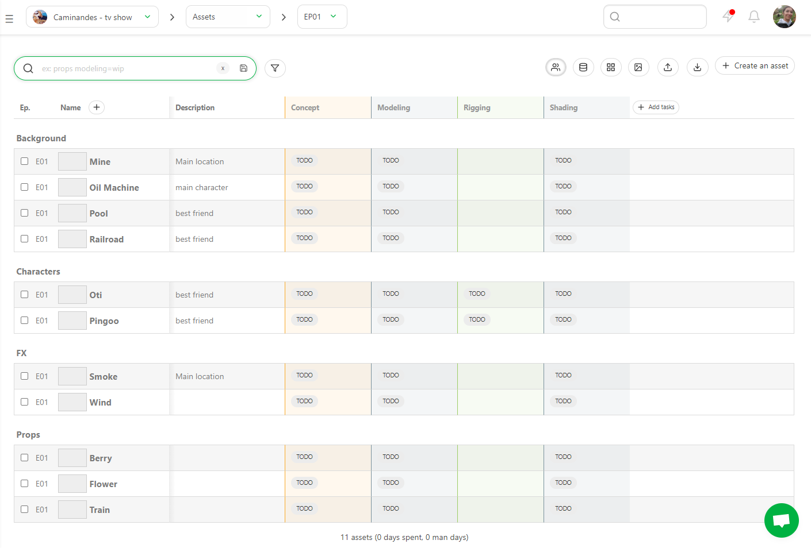
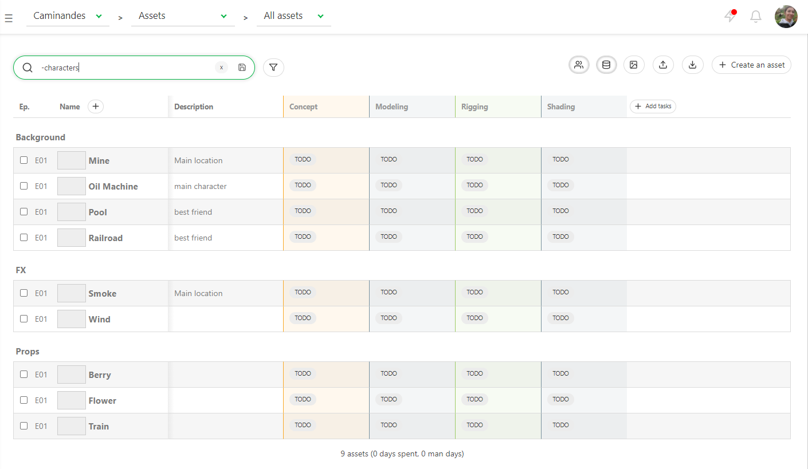
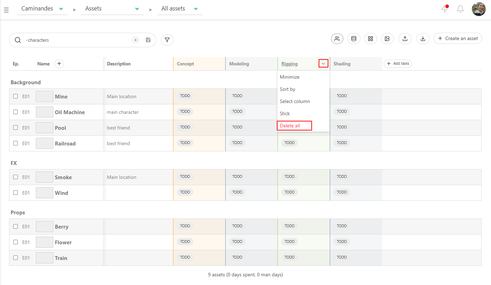
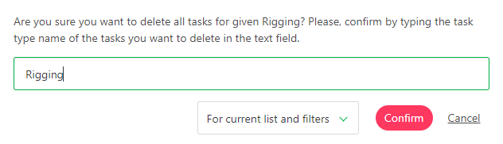

# Getting started as a Production Manager - Advanced Users

## Create extra tasks for the assets

If you realize you miss some task type on your pipeline, you need to add the new task type to your library.

(To add new Task Type see [Customization of the workflow](../customization/README.md#create-a-new-task-type) )

Once it's done, you need to add them to your **Setting** page too. 

Then, click on the **+ Add tasks** on the spreadsheet. 

A new window will open, and on the list, you can choose the task you need to add.
You can also create tasks for **the project**  or **For current list and filters** and validate it by the **Confirm** button.

## Create tasks for specific assets type

You can choose to create tasks only for **filtered elements**. For example, you want to create 
**Rigg** tasks only for the characters.

You need to type **Characters** on the search bar on the global asset page.

Then click on **+ Add tasks**. Next, select the task type, here **Rigging**, and switch to **For current list and filters**.

Valid with **Confirm**.

If you remove the filter characters, you will see the tasks only created for the selected elements.

You can also delete tasks for specific Asset Types. 
For example, you want to keep **Rig** only for the characters.

You need to type **-Characters** on the search bar on the global asset page. This way, the page will filter 
everything **but** the characters.

Then select the task type you want to delete for the filtered view. Click on the arrow next to the name 
of the task type and select **Delete all**.

Once the pop-up opens, type the name of the task type and double-check it's set to **For current list and filters**.

If you remove the filter **-characters**, you will see the tasks only created for the selected elements.

You can also delete only a task or selected tasks. If some assets don't match the task (as environment and setup), click on the menu to change the action (1), 
then select the ** delete tasks** (2) on the left top
of the page.
 

Now that we have created all the assets and related tasks, we can now add the
artists to the team and assign tasks to them.

## Create extra tasks for the shots

If you realize you miss some task type on your pipeline, you need to add the new task type to your library.

(To add new Task Type see [Customization of the workflow](../customization/README.md#create-a-new-task-type) )

Once it's done, you need to add them to your **Setting** page too.

Then,  click on
the **+Add tasks** button 
on the top of the spreadsheet. 

A new pop-up opens and lets you choose what task you want to add. All the
shots are linked to the tasks if you select the **For project** option.

## Add Custom columns

To add more information on the general spreadsheet pages, you have to create a 
**Custom column**.

Click on the **+** near the Name column.

You may have extra information to add on your pages as the **level of difficulties**,
the **name of the studios**, when a production is split, the shot order, etc.

You can store all kinds of text information in the custom column: a **list of value** or a **free value**.

The **free value** is different for each entity.

The **list of value** gives you the same choice for each entity. Moreover, it has to be filled now. 

Type the list elements below **Available values**, and confirm them by clicking on **Add value**.

Validate the creation of the custom column with the **Confirm** button.

Back on the global spreadsheets page, you can fill this information directly on the global page.
The cases are editable.

You can also modify the information with the edit button .

You now see a new line on the edit pop-up. You can select the information from the list, 
alternatively, enter the free values, depending on your previous choice.

Don't forget to press the **Confirm** button when you are done.

If you need to **edit** or **delete** the custom column, go back to the general spreadsheet page.
Nearby the name of your custom column, click on the arrow . 

You can now **sort** your global page with this new column. For example, let's create a **Sort Order** custom column.

Then click on the arrow on the right of the column name to open his menu. Then click on **Sort By**

Now the shots are not sorted by name but by the custom column information.

You can also select in the menu if you want to edit the name of the custom column and its information or if you want to delete it.

You can also use the **CSV Import** to fill your custom column quickly.
First, you need to create your **Custom Column** into kitsu, add it to your spreadsheet, and copy-paste your data into the **CSV Import**.

[Update Shots information with CSV Import](../batch-action/README.md#update-shots-information-with-csv-import)

## Add multiple Preview

You can add multiple images simultaneously, or once you have uploaded an image, you can add another one.

The **Add preview** pop-up opens and asks you to choose a file.

You can navigate through the pictures uploaded. 

You can change the preview order if you click on the number, then drag and drop them.

To delete an additional preview, you need to enlarge the comment panel.

And then click on the 

## See detail of a shot

If you want to see a detail of a shot, click on its name. 

A new page opens with the list of the tasks, the assignation, and the list
of assets that appear on this shot (**Shot casting**).
 

 
You can click on the status of each task to open the comment panel and see the history of the comments and the different versions.

## Change priorities

At some point in the production, you may want to prioritize some tasks, and
pinpoint these urgent tasks to your team.

For this, we use the same technique as before. Click on the space
near a status task (1). 

The action menu appears on the top of the screen. 

Click on the name on the left of the action menu, and choose 
**Change priority**.

There are four levels of priority: **Normal**, which is the fundamental level of all the
tasks, **High**, **Very High**, or **Emergency**. Save the changes with the
**Confirm** button.

As we have done for the assignation or the status, select the shots (1), select
the level of priority (2), and apply with **Confirm** (3).

You can now see next to the status of the task some **exclamation marks**. The
more there are, the more urgent the task is.  

* (1) is **Normal**, 
* (2) is **High**,
* (3) is **Very High**
* (4) is for **Emergency**.
    

## Change status per batch

Alternatively, you can do it per **batch**. 

You can select multiple shots or assets by pressing the **ctrl** or
**shift** key.

Then go to the **Change status** section on the action menu.

Choose the new status for your selected tasks (1). You can also add a comment for all the selected tasks (2)
You validate the new status with the **Confirm** button.

## Simplify the global page

You may need to reduce a task type column on a global page. For example, you may be 
only interested in layout and animation but not so much in the shipment for the client.

Close to each task type name, you can click on the arrow 
 to unfold a submenu. 

You can choose to **Minimize** **Sort by**, **Select column**, **Stick** or **Delete All** the task type.

Once the column is minimized, only colored dots show the status.

You can also choose which **Custom Column** you want to display.

To hide your custom column, click on the arrow on the right border of the global page.

Here you can choose which column you want to **hide** or **display**.

You can also hide all the non-essential columns, like **Description**, **Custom column**, 
even the minimized columns.

Just click on the **Hide additional information** 
 button on the top right of the page.

To make the information reappear, click on the same button,
 it won't have the grey highlight.

## Quotas stat

Kitsu has two ways to calculate the quotas per **shot Task Type**.

The first is linked to the timesheet : 
Shots are considered ended on the first feedback request. Then, quotas are weighted following time spent on the task (when the Artist filled his timesheet). 

In this example, Kitsu has weighted the quota per day linked to the timesheet.

If no timesheet is filled, then Kitsu considers that:

The task was started at the first status change to WIP
The task was done the day the feedback request was made.
It splits the done frames among all business days between the start and the end.

Kitsu grabs the number of frames (or seconds, or number of tasks) submitted per day/week/month per Artist.

**1**: Select the Task Type

**2**: Select the level of details, Day, Week, or Month

**3**: Select the count mode, per Frame, Seconds, or tasks.

You can click on a number and see its detail on the right panel at any time.
