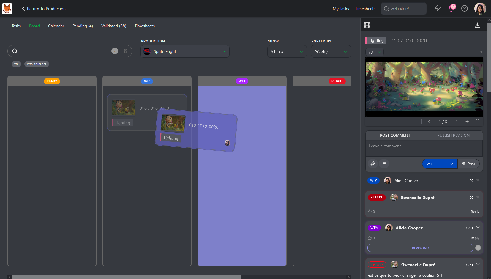
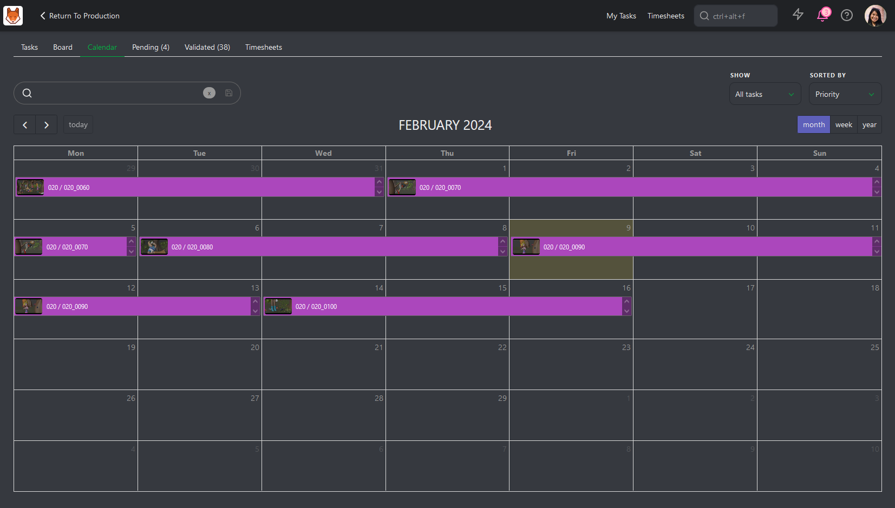
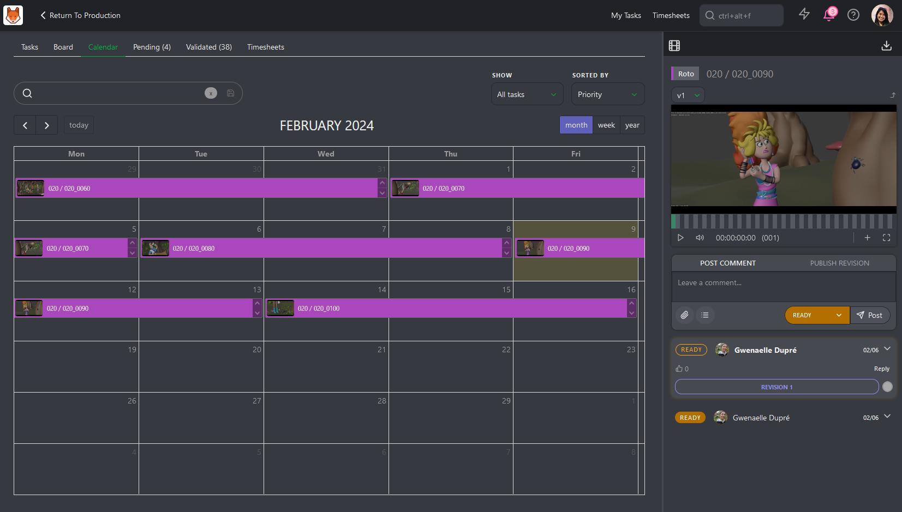
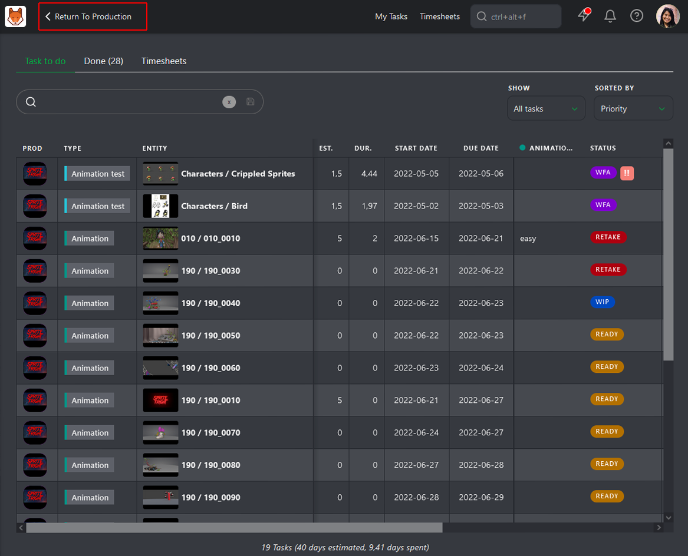
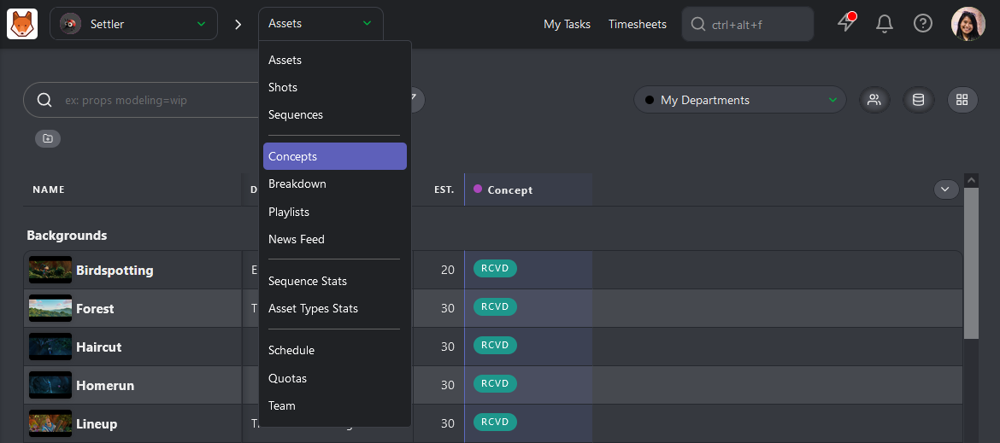
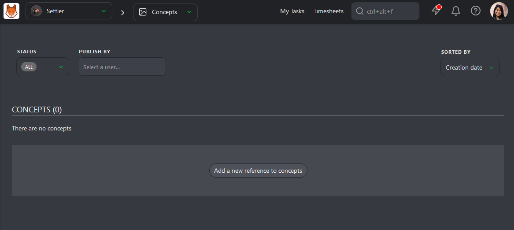
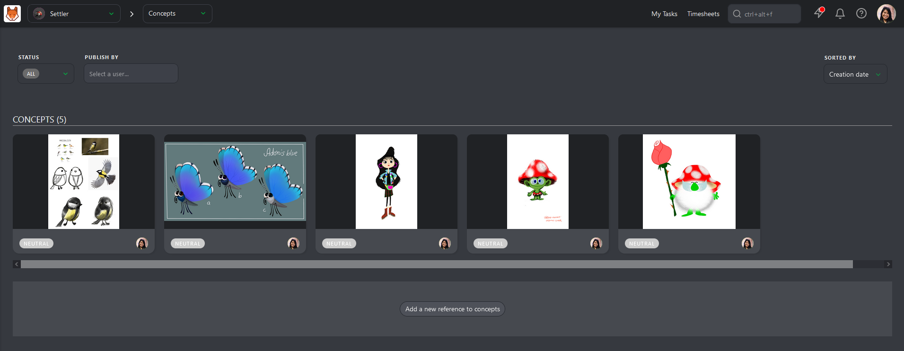

# Getting Started as an Artist

## First Connection

On your first connection, we encourage you to fill in your contact information
into your profile.
Click on your avatar on the top right of the screen, then on **Profile**. You can also change the color of the **Theme** and hide or display the **Support Chat**.

NB: A link to this **Documentation** and YouTube **Tutorials** are available.
You can also jump on our Discord or look at our roadmap.

On this new page, you can check your name and email (3), fill in your phone
number (4), change the timezone (5), the language of the website (6), and
post a pic of yourself as your avatar (7). It helps to recognize who is
doing what!

You can also define what kind of notification you want: email or Slack.

If you keep scrolling, you can also change your password if you want. We
encourage you to change the default password with one of your own.

## See your Assignments - Todo tab

You have three ways of seeing your Assignments; the first is with the **TODO** tab.

The central part for you, on **Kitsu**, is the **My tasks** page.
It's the first landing page when you log in.

You can see per **Production** (1) the **Entity** (2) you are assigned to, but also the **Estimation** time (3), and the **Duration** (4) you already spend, the **Due date** (5), the
**Status** (6) of the tasks you are working on and their **priority** (7).

You can display **All Tasks** or the tasks **Due this Week**.

You can sort your page by **name**, **priority**, **Status**, **estimation** or **last comment**.

You can also filter your tasks.

Besides the shortcut **My Tasks** at the top of the screen, you can also find it on the main menu ,
under the **User** section of **MY TASKS**. The Kitsu logo is a shortcut 
to your task list, too.

## Share your Progress - Todo tab

When you start a new task you are assigned to, click on the Status
(1) on your My Task page. You can also do it on the shots or assets page.

It opens a panel on the right of the screen, where you can communicate about your work. Let your teammates know what you are doing.
For instance, show them you have started working on something.
Each time you change the Status of a task, you can attach a
text comment to it.

For example, when you start a **new task**, you can say everything is okay.
You can ask all the questions you want if some information needs to be included.

To change the Status, let's say from  to  as an example, select the **Change status** tab
and type your comment. Then, click on the status box and choose the
one you want.

Validate your comment and the new Status by clicking on
**Post**  button.

You can edit your last comment by clicking on the "history" button and then
using the **edit** button
.

## See your Assignments - Board tab

With the board tab, you can see all your tasks under each status column.

On the card, you can see the thumbnail, the task type's name, and the entity's name.

If you click on the card, the comment panel on the right will open as usual.

You can display **All Tasks** or the tasks **Due this Week**.

You can sort your page by **name**, **priority**, **Status**, **estimation** or **last comment**.

When you want to change the Status of your tasks, you need to drag and move your task to the new status column.

Besides the shortcut **My Tasks** at the top of the screen, you can also find it on the main menu ,
under the **User** section of **MY TASKS**. The Kitsu logo is a shortcut 
to your task list, too.

## Share your Progress - Board tab

When you are ready to share your progress, you need to move your card to the status column **WFA**

Once done, Kitsu will automatically ask you to add a preview file for the Review.

You can drag and drop your preview on the **Select file from your hard drive**. Click on the button to select your file.

You can also take a screenshot and paste it on this popup.

Once it's done, click the confirm button to publish your Review.

## See your Assignments - Calendar

On the **Calendar** view, you can see all your assignments depending on your tasks' **Start** and **Due** date. If a task lasts several days, you will see the task across those days.

If you click on the task, the comment panel on the right will open as usual.

You can display **All Tasks** or the tasks **Due this Week**.

You can sort your page by **name**, **priority**, **Status**, **estimation** or **last comment**.

You can also filter your tasks.

Besides the shortcut **My Tasks** at the top of the screen, you can also find it on the main menu ,
under the **User** section of **MY TASKS**. The Kitsu logo is a shortcut 
to your task list, too.

## Share your Progress - Calendar

When you start a new task you are assigned, click on the task on your calendar page. 

It opens a panel on the right of the screen, where you can communicate about your work. Let your teammates know what you are doing.
For instance, show them you have started working on something.
Each time you change the Status of a task, you can attach a
text comment to it.

For example, when you start a **new task**, you can say everything is okay.
You can ask all the questions you want if some information needs to be included.

To change the Status, let's say from  to  as an example, select the **Change status** tab
and type your comment. Then, click on the status box and choose the
one you want.

Validate your comment and the new Status by clicking on
**Post**  button.

You can edit your last comment by clicking on the "history" button and then
using the **edit** button

## Share your Concept

As a **Concept Artist**, you have **Concept** to share with your supervisor and director.

From your **Todo page**, return to production with the **Return to Production** button.

Once you are on the global page of the production, use the navigation drop-down menu 
on top of the screen to navigate to the **Concept** page.

Once in the **Concept Page**, you have the filter option on top of the screen, then the concept list.

To upload a concept, click the **Add a new reference to concepts** button.

A pop-in will open and let you load your concepts. You can upload one or several concepts at the same time.

The concept page is now filled with references.

The next step is to link the uploaded **Concept** to the created production assets.

Click on the status part of the concept; it will open the comment panel on the right.

On the comment panel, you have two options on top of the panel: Link a concept to an asset and delete the concept.

To link an asset, click on the **Link**  button.

Kitsu will display all the **Assets** available to link with the concept uploaded.

On top of the comment panel, Kitsu will list the assets that are already linked. For now, there are **No Links**.

To link an asset, you have to click on it. You will see the name of the assets linked on the top of the screen, but also under the preview of the concept.

## Ask for a Review

You can ask for a review by switching the tab to **Publish revision**
and change the Status of a task to
(**Waiting for Approval** ).

You can drag and drop your file or click the **Attach preview** button.

Then, use the **Post** button.

Your work appears on the right part of the screen as a V1.

You always keep track of your previous work if you post several revisions.
The previous versions are still available each time you add a new revision.

You can add multiple images simultaneously, or once you have uploaded an image, you can add another one.

The **Add preview** popup opens and asks you to choose a file.

You can navigate through the pictures uploaded.

This detailed page of the tasks is your way to communicate with others.
They also use this page to answer your questions, give feedback, and request a retake. The history of the conversation is always available.

For quicker access to the information, when you get back to your todo
page, the last comment posted on each task is available, too.

You can also see the tasks validated as  and the discard tasks as 
on the **Done** tab.

And the **Pending** tasks

## Fill your Timesheet

Daily, you can declare how much time you spend on each task. On your **My Tasks**
page, go to the **Timesheets** tab (1). Or click on the shortcut on top of the screen.

It would help to move the cursor (3) next to each task to reflect the 
hours spent. You can also go quicker and click on the **1**, **4**, or **8**
hours buttons (4).

If you miss your declaration one day, you can click on the today date (2) 
You can go back in time and select the day you missed. If you didn't work, you could tag the day as a **Day Off** (5).

In case you forget to mention the time spent on a finished task, you can still
please find it in the **Done tasks** list below the running tasks list.

