# How to get started with Kitsu as a client

## First Connection

On your first connection, we encourage you to fill your contact information
into your profile.
Click on your name on the top right of the screen (1) then on **Profile** (2).

NB: A link to this **Documentation** is available (4), 
and you can switch to the **Dark Theme**  in this menu, too (3). You can also jump on our slack (5), or look at our roadmap (6).
 

 
On this new page, you can check your name (1) (2), your email (3), fill your phone
number (4), change the timezone (5), the language of the website (6), and
post a pic of yourself as your avatar (7). It helps to recognize who is
doing what! 
 

 
You can also define what kind of notification you want, email or slack.

 
If you keep scrolling, you can also change your password if you want. We
encourage you to change the default password with one of your own.

 
 
## See your playlists
 
The central part for you, on **Kitsu**, is the **Playlist** page. 
You can access it by clicking on the production avatar.

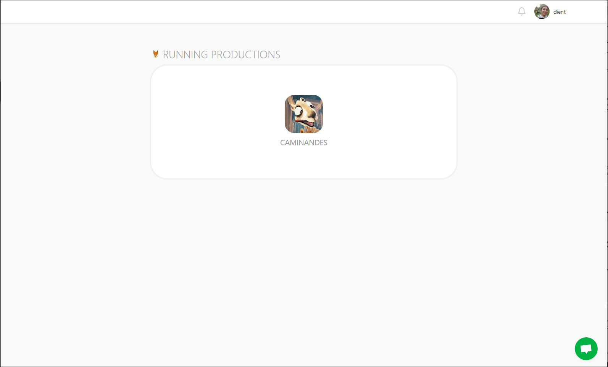

Once you have click on the production avatar, you will go to the **Playlist** page.

The playlists will gather all the assets and shots you have to comment.

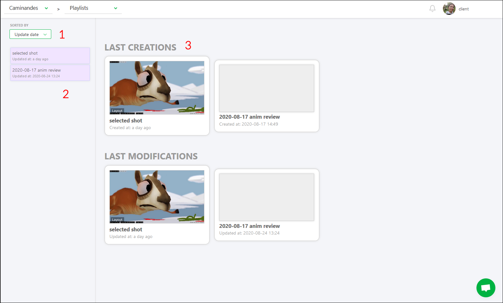

On the left part, you can sort the playlist per **Task Type**, **date** or per **name** (1), then the list of the playlists created for you (2). On the center part, you have fast access to the recent playlist (3).

### Detail of the playlist

On the left part, you keep access to the different playlists. On the center part, you see the different elements of the selected playlist. It can be assets or shots. On the right part, you have access to the comment section.

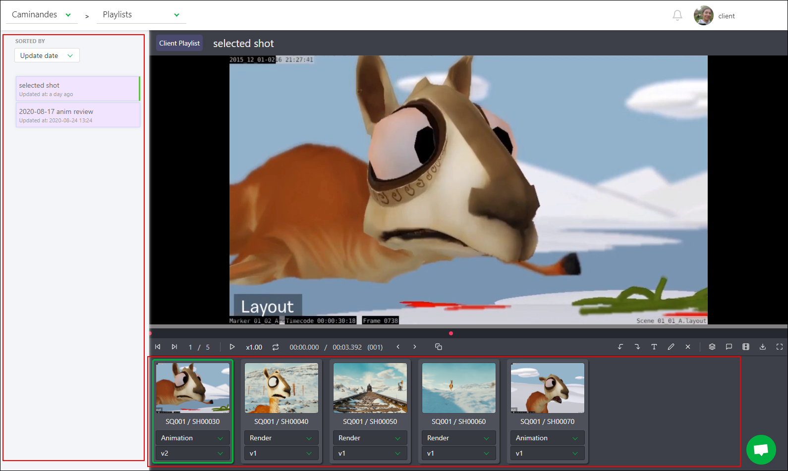

With the comment panel, you will be able to write a comment to validate the preview.

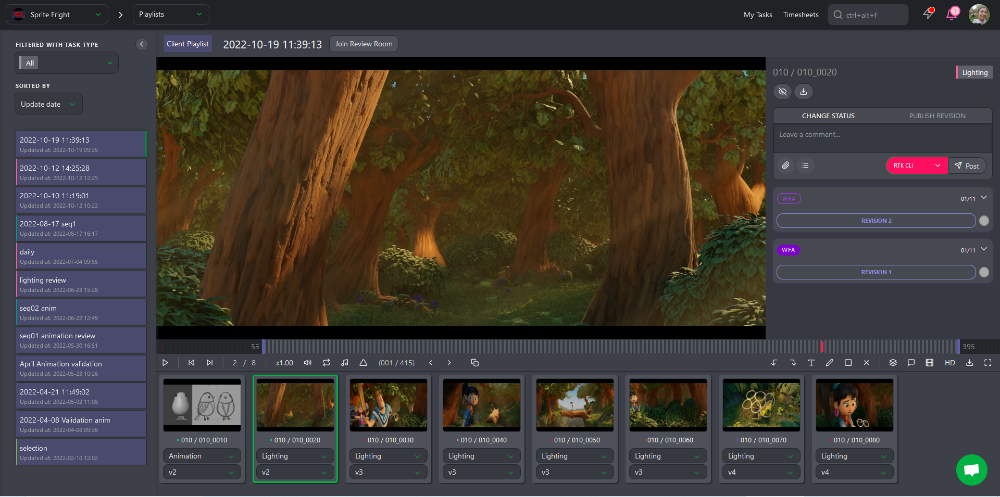

On top of the elements (assets or shots) you have access to different options:

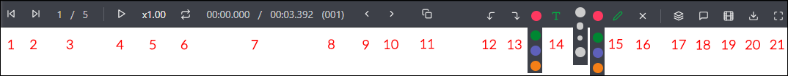

* (1) Previous shot / asset
*(2) Next shot / asset
* (3) the position of the element
* (4) the play and pause button
* (5) You can change the speed: x1..0, x0.50 or x0.25
* (6) loop the selected shot
* (7) Actual time code / global time code of the shot
* (8) Actual frame
* (9) Previous frame
* (10) Next frame
* (11) Split screen: You can compare two task types side by side
* (12) Undo annotation
* (13) Redo annotation
* (14) Write a comment on the picture, and change the color of the text
* (15) Draw a comment on the picture, and change the color and the size of the line
* (16) Select the drawing and click on the cross to delete it
* (17) Change the task type of all the elements in the playlist
* (18) Open the pannel section to post a comment and change the status
* (19) hide the list of the elements
* (20) Download the playlist
* (21) fullscreen

 
## Share your comment

First open the comment section. 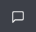

From there, you can change the status to  if you want that the CG artist
performs some changes. 

You can add a **checklist** to your comments.

You need to click on the **Add checklist** button, and the first item of the checklist appears. 

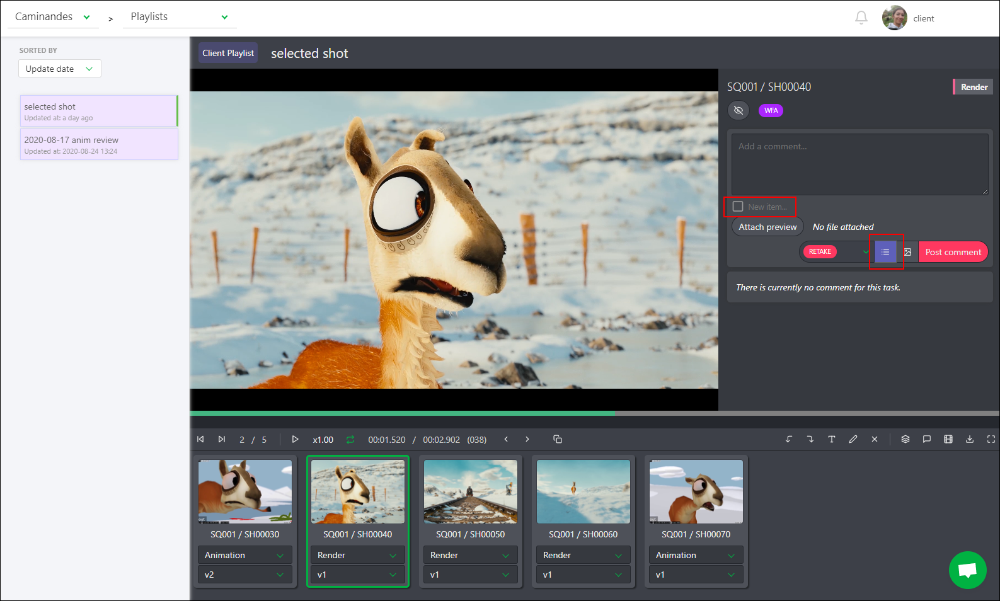

Type your comments, and hit **Enter** key to add another line on your checklist or click again on **Add Checklist** button.

## Global view of the assets

As a client, you can go to the global page of the assets with the drop-down menu on top of the screen.

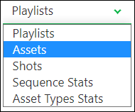

On the global page, you will be able to see all the status of the different steps of the assets.

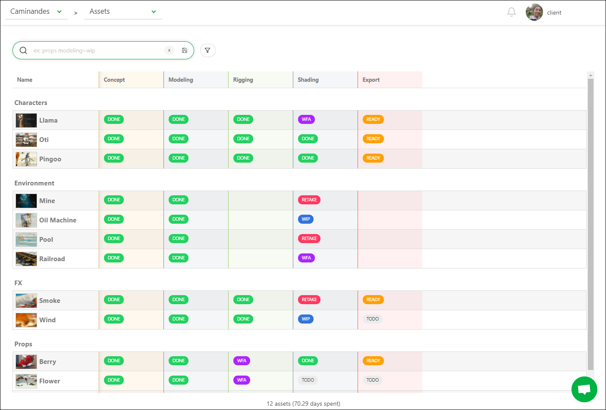

## Global view of the shots

As a client, you can go to the global page of the shots with the drop-down menu on top of the screen.

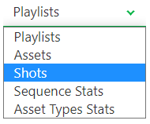

On the global page, you will be able to see all the status of the different steps of the shots.

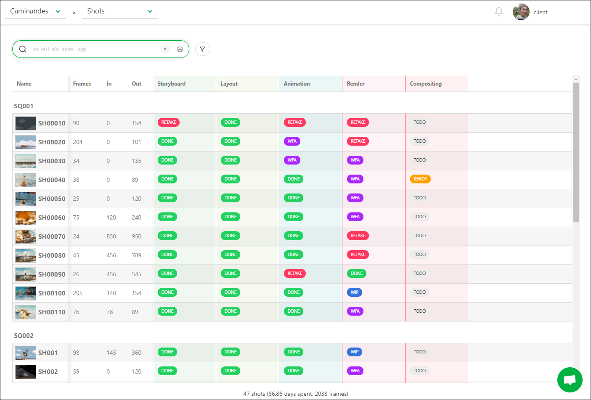

## Production report

To ease the communication with the studio, you have direct access to the production report, separated into two parts: the **Sequence Stats** and the **Asset Types Stats**

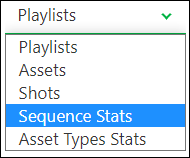

The **Sequence Stats** page is updated in real-time. Every time you look at this page, you are sure to have updated information.

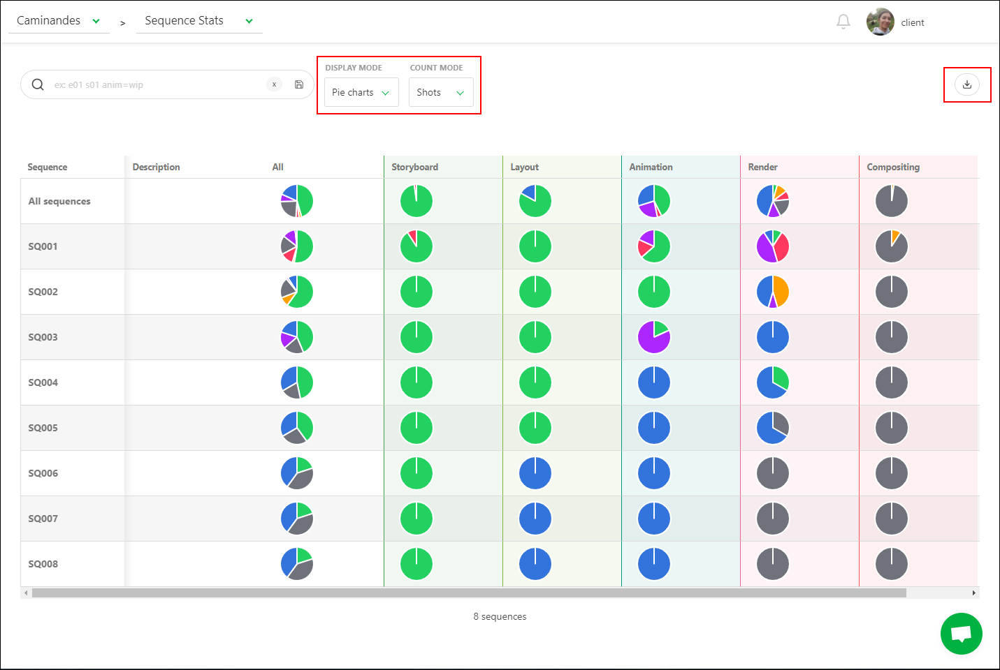

You can choose to display the stats per number of shots or number of frames.

You can also change the **Display Mode**; you can switch from the **Pie charts** view 
to the **Counts** view.

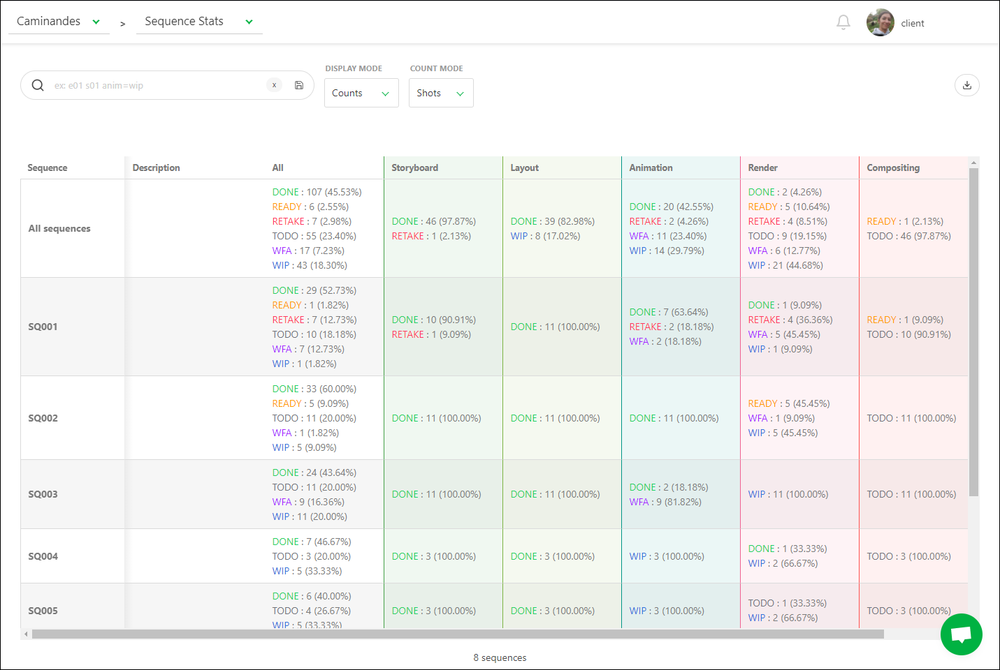

It's this presentation that you can download to keep track of the production progress.

