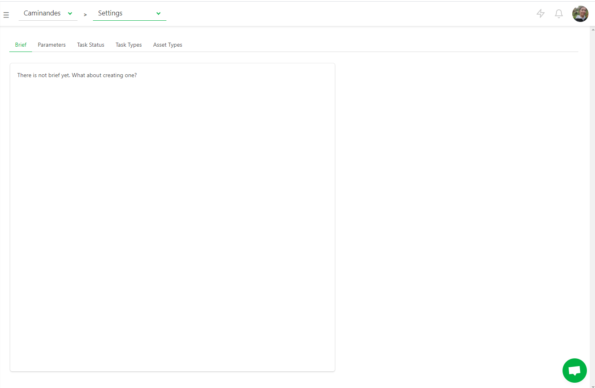
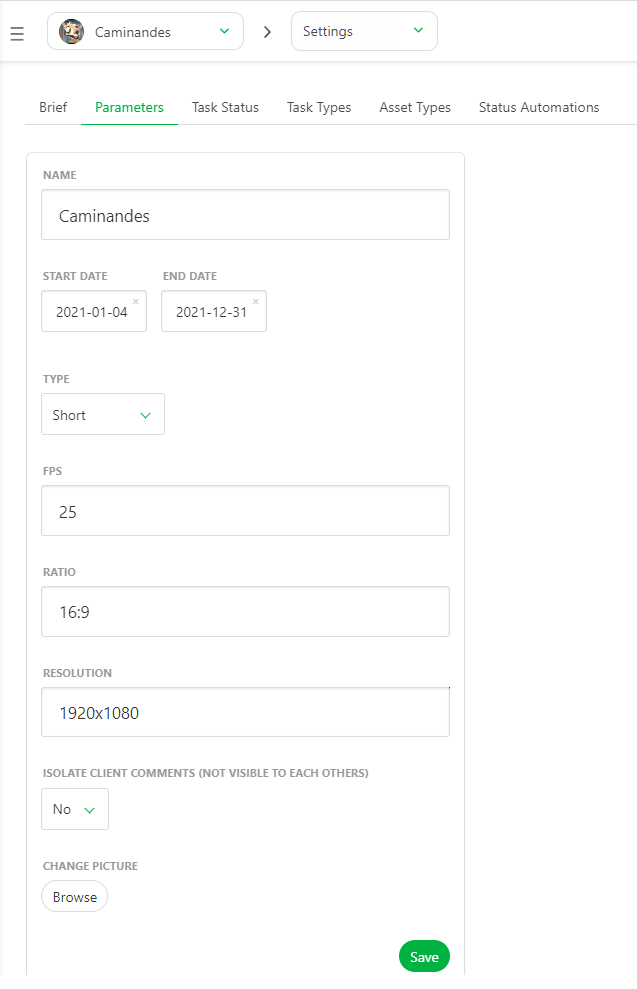
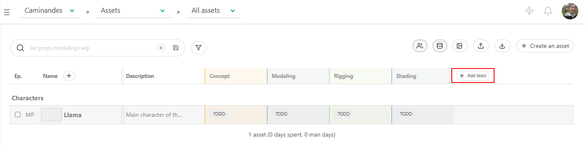
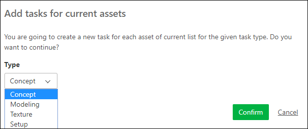
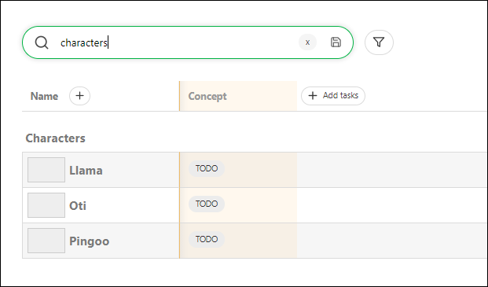
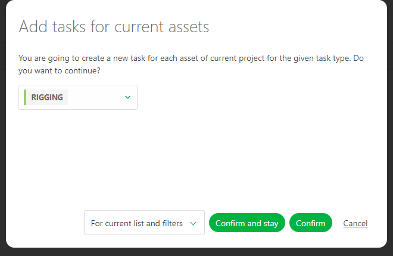
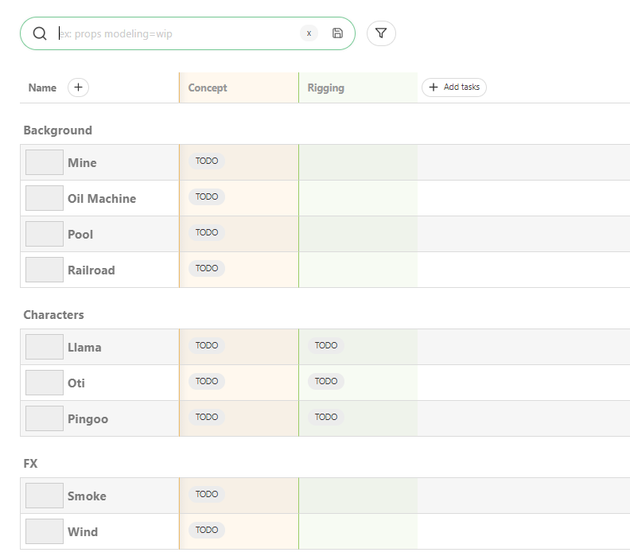
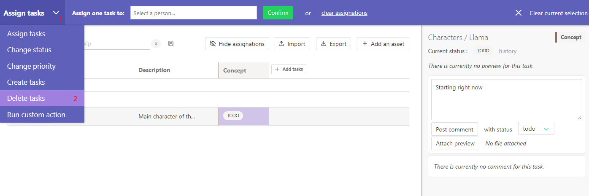
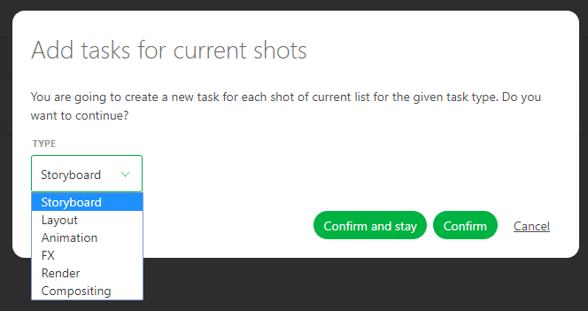

# Getting started as a Production Manager

## Create your first production

The first step on Kitsu is to create a production. Click on the **Create a new
production** button.  

Enter your production name, choose **TV Show** if you need more than one episode.
Then validate by clicking on **Confirm**.

To navigate through Kitsu sections, you need to use the sidebar. You can 
access it through the three lines button on top of the screen 
.  It opens a menu on
the left part of the screen. We want to see the production list. 
So below **Studio** section, click on the **PRODUCTIONS** button. 

Now you can see yout production on the main Kitsu's page.

You need to click on the avatar of the production to acces to its different pages.

The first step you need to do is to set the **settings** of your production.

Use the navigation menu and go to the **Settings** page.

### Add a Brief

On the first tab of the **Settings** page, Kitsu asks you about a brief. It's a good way to keep track of the first 
brief of the production, and being able to get back to it later.

**/!\ Only Studio manager permission have acess to the Settings page /!\**

### Define Production's Parameters

The second tab is the more **important**. You need to define your production's parameter to be sure that everything will go smoothly.

- 1/ You can change the name of the production

- 2/ You can define the start and end date of the production to set the schedule

- 3/ You can change the Type of the production : short, TV Show, Feature Film

- 4/ You can add the number of episodes of your TV Show for information

- 5/ You need to set the FPS of the video preview. Kitsu will use this FPS to encode them. **Per default Kitsu will set encode everything at 24 FPS**

- 6/ You can enter the ratio, for information only

- 7/ You need to set the resolution of the video preview. Kitsu will use this resolution to encode them. **Per default Kitsu will set encode everything at 1920*1080**

- 8/ You can add a picture to better identify your production.

Validate everything with the **Save** button.

### Select speticific Task Status for a production

Per default, Kitsu will load all the Task Status of your status library into your production.

But you can choose to use only specific status.

On the "Task Status" tab, you can choose which status you want to use on this production, 
validate your choice with the "add" button.

### Select specific Task Types for a production

Per default, Kitsu will load all the Task Types of your status library into your production.

But you can choose to use only specific Task Types, depending of the type of your production.

For example you can create a 2D and A CGI workflow on your library, and add the needed task types into this production.

On the "Task Types" tab, you can choose which status you want to use on this production, 
validate your choice with the "add" button.

### Select specific Asset Types for a production

Per default, Kitsu will load all the Asset Types of your status library into your production.

But you can choose to use only specific Asset Types, depending of the type of your production.

On the "Asset Types" tab, you can choose which Asset Types you want to use on this production, 
validate your choice with the "add" button.

## Create assets

So, now you have the first script for your production. It's time to do the
breakdown and the creation of the assets. It allows you to list your assets, 
dispatch the work to the artists, and follow each related
task's progress.

Let's begin with the asset page. You can access it via the drop-down menu on top of the page. 

.

On the asset page, click on **Add assets**.

A pop-up window opens:
 
It asks you to choose the asset **Type** (1): Camera, Characters, Environment,
FX, Props, ...  
Let's start with an environment. You select the ** episode** (2), or the main pack (**All**).
We give it a **Name** (3) and enter a description that helps the designer know what to do and later identify the asset quickly.
If you have multiple assets to create, click on **Confirm and stay**. 

You can change the asset type and keep adding assets. 

You can also customize the asset type list. 
[How to customize the workflow](../faq/README.md#how-to-customize-the-workflow)

You can see the newly created asset appearing in the background every time you click on **Confirm and stay**. After you added your last asset, click
on **Confirm**, it saves the asset and closes the window. If you don't have
more assets to add, click on **Close**, it cancels the window.

For now, the assets are linked with the first episode, or with the Main Pack.

You can edit assets by going to the asset page, hovering the asset you want to modify, and then click on the **edit** button 
 (1) on the right side of
the line.  

On the main asset page, to extend the description, click on the first words (2), and a pop-up opens with the full description.

To delete an asset see the FAQ : [How to delete an asset](../faq/README.md#how-to-delete-an-asset)

## Create tasks for the assets

And now we can create tasks for the assets, like **Concept**, **Modeling**,
**Shading**, **Rigging**, and other if needed (see 
[How to customize the workflow](../faq/README.md#how-to-customize-the-workflow)
).

Click on the **+ Add tasks** on top of the spreadsheet. 

A new window will
open, and on the list, under ** type**, you can choose the task you need to add.
You can also choose to create tasks for **the project** and validate it by the **Confirm** button.

You can choose to create tasks only for filtered elements. For example, you want to create 
**Rigg** tasks only for the characters.

You need to type **Characters** on the search bar on the global asset page.

Then click on **+ Add tasks**. Select the task type, here **Rigging**, and switch to **For current list and filters**.

Valid with **Confirm**.

If you remove the filter characters, you will see the tasks only created for the selected elements.

If you want to delete a task, If some assets don't match the task (as environment and setup), click on the menu to change the action (1), 
then select the **delete tasks** (2) on the left top
of the page.
 

Now that we have created all the assets and related tasks, we can now add the
artists to the team and assign tasks to them.

## Create (episodes) sequences and shots

It's time to do the breakdown of the storyboard. Meaning you can create
the sequences and the shots of the episode and associate assets to them.

Nb: Episodes are only mandatory for **TV Show** Production.

You need to go to the **Shots** page: you can use the
drop-down menu and click on the **SHOTS**.

 

To start with the shot creation, click on the **Add shots** button.

A new pop-up opens for the creation of the assets.
You can now create the episodes, the sequences, and shots.

Enter the first episode using your code name, e01, then click
on the **add** button (1).  Do the same for the sequence, for instance, sq01,
then **add** (2), and now the shots: sh001, then again **add** (3).
You can also define padding for your shots.

You can now see that new shots are listed, described by their episode and
sequence.
You have created the first shot of the first sequence of the first episode.

Now let's add more shots than just one! As you can see, the box already contains your name
code but incremented, so you have to continue to click on **add** to
create more shots.

You have to do the same with the sequences and episodes.

If a shot is misplaced on a sequence, you have to edit the shot you want
, and change the
sequence. 

If at some point you need to delete a shot, click on the **trash can**
icon on the right of the line . 
If you need to import back this shot, click on the restore button 
.

To delete a shot see the FAQ : [How to delete a shot](../faq/README.md#how-to-delete-a-shot)

To delete a sequence see the FAQ : [How to delete a shot](../faq/README.md#how-to-delete-a-sequence)

## Add the Frameranges

At this stage of the production, the animatic should be done. Meaning you have
the length (**frame range In** and **frame range Out**) for each shot. You can
add this information to the spreadsheet.  This way, you are sure that all
the frames a calculated, and none are missing or over computed.

You may also be able to add a camera as an asset!

You need to edit the shots to fill the frame range information. Click on the
edit button  on the right
side of the shot line.

You can enter the **In** and **Out** of the shot on the new window. Save with the **Confirm** button. 

Now the frame range appears on the general spreadsheet of the shot page.

You can also use the **CSV Import** to update quickly your frame range. [Update Shots information with CSV Import](#update-shots-information-with-csv-import)
.

You can have access to the shot values history too.

## Create tasks for the shots

We can now associate tasks with the shots. Same way as for the assets, click on
the **+Add tasks** button 
on the top of the spreadsheet. 

A new pop-up opens and lets you choose what task you want to add. All the
shots are linked to the tasks if you select the **For project** option.

## Add a new employee

Each artist required an account. Go to the drop-down menu , and under the **Studio**
section, choose **PEOPLE** page.

Then, click on the **+ Add a new employee** button. 

A creation window opens. You can enter the first (1) and last name (2), the email
(which is **mandatory** to create the account) (3), the phone number (4) and
define the role of the employee: **Artist**, **Supervisor**,
**Studio Manager**, **Vendor** or **Client** (5).  If the artist is working right now, keep
him active, otherwise select no. Validate by clicking the **Confirm** button.

See the [permissions](../permissions/README.md) section for more information. 
To make it short, artists, supervisors, and clients only see the
productions they are assigned.

All the people are now part of your studio. They are added to a specific
production when you assign them to a task on a production. Otherwise, they
won't have access to anything.

## Add an Artist to the team

You need to add someone to a production to assign him a task.

On the drop-down menu on the top of the page, select the **TEAM** page.

 

On the **Team** page, you can see all the assignations for a specific project.
If you want to check another project team, you need to switch the project
on the top of the page.

You can also add someone to a production without assigning him to a task; if you have less than ten people, you
can select his name on the search box (or type his name) and validate with
**add**.

## Assign tasks to an Artist

We can now get back to the **ASSETS** page via the drop-down menu.

.

Now it's time to do your first assignment! 

Click on the status (1) you want to assign.

The **Action Menu** on top of the screen appears. 

You can now do the assignation. Click on the text input, and you see
the list of available people. Click on a person's name to perform to select
him. Then click on the confirmation button to complete the assignation.

You can assign several tasks to the same person in one step (1). Once you have
the blue menu visible, keep **ctrl** on your Keyboard pressed and select
multiple tasks. You can even use the **shift** key to choose a range of tasks
(2). When you have chosen everything you need, apply with the **Confirm**
button.  

In the same way, you can click on **Clear assignations** to remove all 
assignations, or press the "Escape" key.

When you finish all the assignations, quit this mode using the **Clear
current selection** button .

Now you can see next to each status the avatar of the artist.

To unclutter the list, you can hide this information with the **Hide
assignations** button on the top of the spreadsheet .

Once you assigned someone, he is part of the production team. Depending
on his position (Artist, Supervisor, Vendor), he only sees the production where
he's assigned. 

Now, everybody knows what to do and who is doing what!

## Change status

To write a comment and to change the status of a task, you can click on the
status of the task (1). 

It makes appear a panel on the right, and here you can write a comment (1) and change the status (2), attach a file (3).

Validate the post and the new status with **Post status**

## Add a Preview

You can add one or several previews to any comments. It can be a picture (`.png`, `.jpg`, `.jpeg`), or a video (`.mp4`, `.mov`, `.wmv`), 
or an `.obj` file. You can review all the previews from the browser or a mix of everything.

Other files like `.pdf`, `.zip`, `.rar`, `.ma` or `.mb` however, they need to be
downloaded to be reviewed.

If you have defined a **FPS** for the production, Kitsu conforms to the uploaded video to this FPS.

Otherwise, the video is compressed to 1080P and 30mbits/sec. 

Click on the "Attach preview" button, the explorer opens and lets you choose your file or several files.

Once your file is selected, you see its name near the "Attach preview" button.

You can also **drag & drop** the file in the comment section.

## Add a thumbnail

You can use the preview as a **thumbnail** on the asset or shot spreadsheet. It
helps to recognize the assets/shots on the main pages. 
On the list page, click on the status you want, then on the right panel, click on the **Preview** button (1).

Once you have clicked on the button, you see the thumbnail appears, and the button turns gray.

## Create a breakdown list

Filling the breakdown help you with the assembly of the shots. With the
breakdown, you have all the details of the assets you need to add to create your
shot. We are sure to omit nothing.

On the drop-down menu, choose **BREAKDOWN**.

On the left part of the breakdown page is the episode/sequence/shot menu (1); you can choose between those you created. They are the right part of
the screen; all the assets available ever created for this production (main pack and episodes) (3). Moreover, in
the middle section, it is your selection for the shot (2).

So now you have to select the shot you want to cast.

If you don't have thumbnails yet, you can choose to display the assets as text.

You may also realize during your breakdown that an asset is missing from the list.

You can create a new asset directly from the breakdown page. Click on the **+** on the right of the **All available assets**.

You can also choose multiple shots at the same time. Click on the first shot, hold the **shift** key and click on the last shot of your selection.

Then click on the assets you want
to assign: characters, backgrounds, ... from the right part (3). 
If you have selected multiple shots, your selection is applied to the numerous shots, as well.

When you pass over the asset, you can see a **+1** or **+10**. It's the number
of times you add this asset. You can click as many times as you need on it.

You can now see the asset appearing in the middle part of the screen (2). Next
to the name of the asset is the number of times it has been added. In this
example, we have added two times the character asset Llama.

If you add twice an asset by mistake, you have to go on the middle part of
the screen on your selection of assets for this shot (2). From there, click on
**-1**.  When you are done with this shot, go on with the other shots. 
Your selection is automatically saved.

If a new asset is created during the storyboard, get back to the asset
page (using the drop-down menu), create the assets you
need. The tasks previously created are applied immediately to these new
assets. However, you have to do the assignation, and then you are good to
continue with the breakdown.

Now your **Breakdown** page should look like this.

You can also make a breakdown list for your assets if you need to assemble them and keep track of the separated parts.

On the top left corner of the screen, choose ** asset** in the drop-down menu, below **FOR**.

You now have access to a second drop-down menu, where you can choose your asset type: **Character**, **Environment**, **Props**, **FX**, ...

You can fill the asset breakdown page the same way as the shots. Select one or more assets on the left part, then add the elements from the right part.

## Perform a review

When an artist needs a review, he changes the status of his task to .

Click on the status (1) to open the right panel and start the review. 

You can watch the version from the right panel, enlarge it (2), or even go fullscreen  (3).

You can draw directly on the preview with the **pencil** tool and select a color . 

You can also add **text** on the frame.

If you need to delete your line, click again on the **pencil** icon, the cursor changes to a multi-directional cross , and then you can select your line and move it around.

Select the line with the directional cross, and then press the **delete** icon 

If you go into **Full-Screen**, you can compare two task type or version side by side when you click on the **Compare** button 
.

From there, you can change the status to  if you want that the artist
performs some changes. 

You can add a **checklist** to your comments.

You need to click on the **Add checklist** button, and the first item of the checklist appears. 

Type your comments, and hit the **Enter** key to add another line on your checklist or click again on the **Add Checklist** button.

Besides your comment, you can also attach a preview. Click on the "**Add attachment" button.

You can also **tag** someone on the team in the comments. Type the `@`and it opens a sub-menu with the list of the team. 

Alternatively, you can change it to  to notify the artist that his work is validated.

## The timesheets

As Studio Manager, you can use the main menu to check the timesheets.

Open the main menu with the  button. 

On the menu, choose the **Timesheets** page.

You can choose which **month** or **year** you want to display.

You can also choose the detail level: **day**, **week**, **month**.

Per week, Kitsu highlights the overdue time per Artist.

If you click on a number, a side panel opens with the details of the time spent per task this week.

You can also set up a number of working hours per day. 

Go back to the main menu and select **Settings**. 

