# Getting started as a Production Manager

## Create your first production

The first step in Kitsu is to create a production. Click on the **Create a new
production** button.  

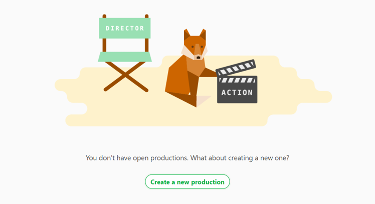

Enter your production name, and choose **TV Show** if you need more than one episode.

Then you have to fill in technical information, such as the number of FPS, the Ration, and the Resolution.

All these data will be used when Kitsu reencodes the video previews uploaded.

Then you need to define start and end dates for your production.

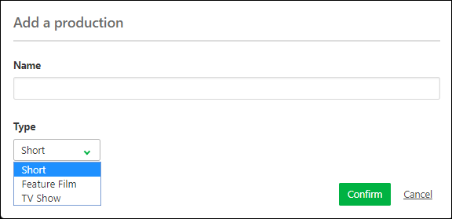

You can define your production pipeline in the next part, 3 to 6.
First, you need to select your asset task type, shot task type, and task status and asset types.

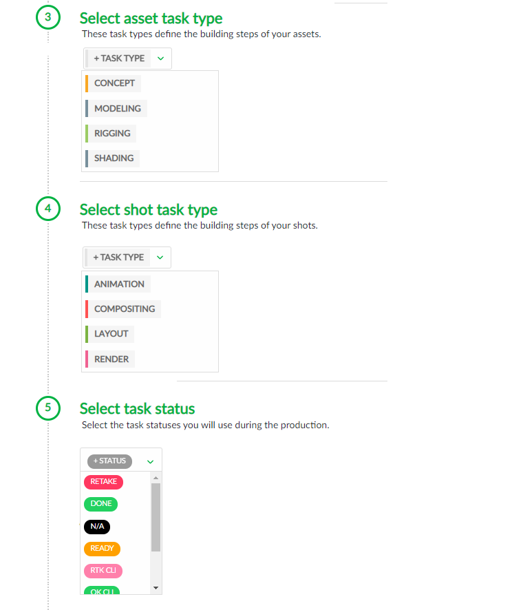

Then 7 and 8 are the option parts. If you already have a spreadsheet with your asset/shot.

See the **import CSV** section for more details. 

[Import asset](../batch-action/README.md#create-assets-from-a-csv-spreadsheet-file)

[Import shot](../batch-action/README.md#create-shots-from-a-csv-spreadsheet-file)

Validate everything with the  button.

If you don't find all the **Task Types**, **Status**, or **Asset Types** that you need while 
creating the production. You will be able to add them to your production later.

See the **Customization** section for more details.

[Pipeline Customization](../customization-pipeline/README.md#task-type)

## Introduction to Kitsu global page

Welcome to the global asset page of Kitsu.

Let's take a look around.

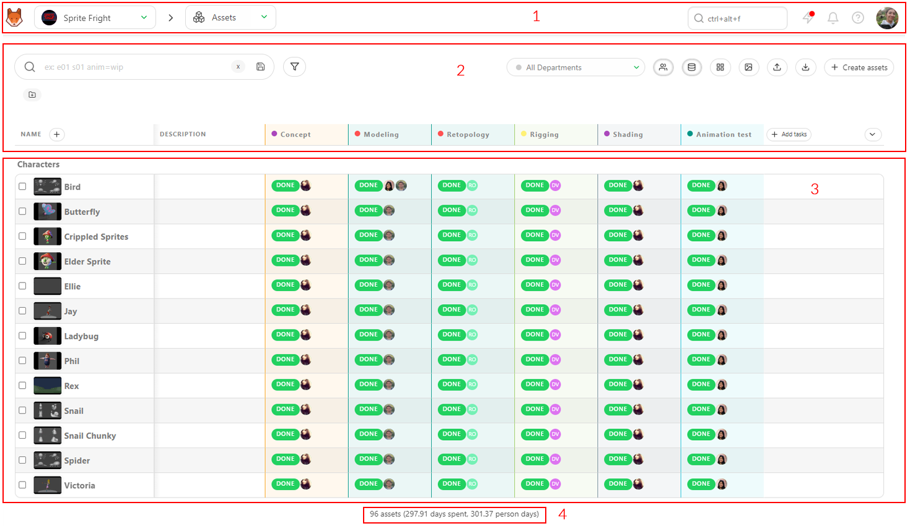

On the top part (1), you have the global navigation, which is always visible throughout all the production pages.

With the main menu button , you can go to your productions and your tasks (it's common to all permissions). And because you are an administrator, you have access to extra options, like the global view of the schedule, timesheets of your whole studio, and workflow customization.

You can choose between production. The name of the actual production is displayed now, but thanks to the drop-down menu, you can navigate from production to production (if you have several). 

The next drop-down menu is here to help you navigate through the different pages of the production.
You always start with the asset page, but you can switch to shots, sequence, statistics, team, and breakdown. With this drop-down menu, you can also change the production setting (including the workflow).

If you have defined your production as a **TV Show**, you will have an episode drop-down menu with the **All assets**, **Main pack**, and episode options.

On the right part of the top screen, you have the global search and also news from Kitsu. You can see with an animated gif all the new features.

 . 

Then, the bell shows you your notification (assignation, comments, tag), and then your avatar to open your menu (setting, documentation, etc.) 

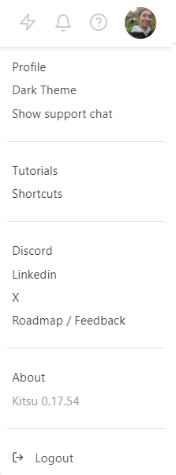.

The second part of the screen is common to the asset and shot page. This part always sticks to the top of the page, even if you scroll down.

The first element on the left is the filter box. You can type anything you want for simple filtering, sequence, asset type, etc.

If you need more advanced filtering, please use the filter builder button. 

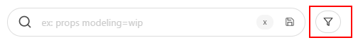

You can then save all the filters and use them as your pages.

On the right part of the screen, there are some buttons (from left to right) to hide or display the assignation, hide or display the extra column, enlarge or reduce the thumbnail, 

batch import thumbnail , and finaly export  or import  data.

Below you have the name of the column. the (+) next to **Name** 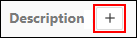 is here to create a new custom column. Then you have the name of the task type column. 

On the far right of the screen, next to the scroll bar, is the option to hide and display a text column
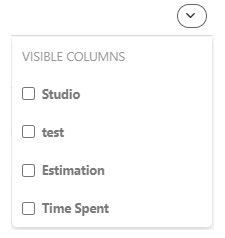.

We have created a **Studio** and **test** custom column in this example.

The last part (4), at the bottom of the screen, is the sum-up of your displayed page. It means the sum-up will update if you filter the page.

You can see the number of elements (assets or shots), the total number of estimated days, and the total number of already spent days.

## Create assets

So, now you have the first script for your production. Next, it's time to do the
breakdown and the creation of the assets. Finally, it allows you to list your assets, 
dispatch the work to the artists, and follow each related
task's progress.

Let's begin with the asset page. You can access it via the drop-down menu at the top of the page. 

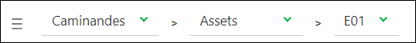.

On the asset page, click on **Add assets**.

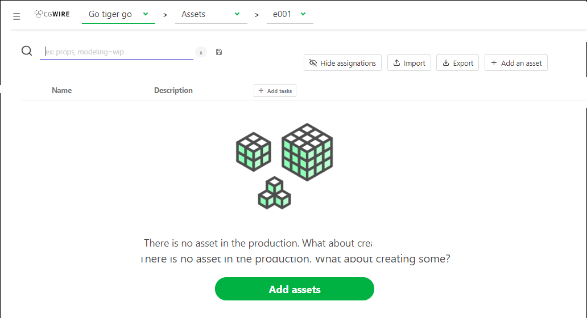

A pop-up window opens:
 
It asks you to choose the asset **Type** (1): Camera, Characters, Environment,
FX, Props, ...  
Let's start with a character. 

Then, you select the **Main Pack**, or the **episode** (2)

We give it a **Name** (3) and enter a description that helps the Artist know what to do and quickly identify the asset.

Click on ** Confirm and stay ** if you have multiple assets to create.

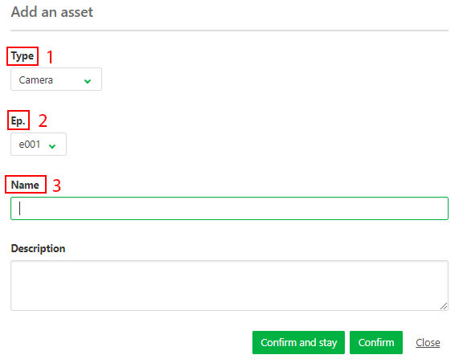

You can change the asset type and keep adding assets. 

You can also customize the asset type list and their tasks pipeline. 
[Customization of the workflow](../customization/README.md#modify-an-existing-asset-types) )

The newly created asset appears in the background every time you click on **Confirm and stay**. 

After adding your last asset, click
on **Confirm**. It saves the asset and closes the window. If you don't have
more assets to add, click on **Close**, it cancels the window.

The assets are linked with the first episode **E01** (created per default by Kitsu) or with the **Main Pack**.

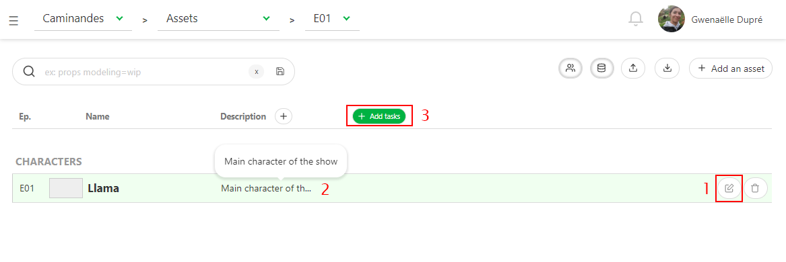

You will also see the tasks are created at the same time. By default, all the tasks of your library will be added, and if you have set your parameters, only the selected tasks will be added.

If you need to add more **Assets**, click on the **Add assets** button.

You can edit assets by going to the asset page, hovering over the asset you want to modify, and then clicking on the **edit** button 
 (1) on the right side of
the line.  

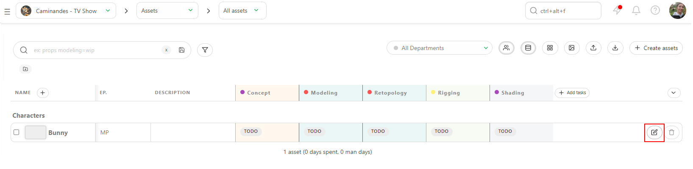

To extend the description on the main asset page, click on the first words (2), and a pop-up opens with the full description.

To delete an asset, see the FAQ : [How to delete an asset](../faq-deletion/README.md##how-to-delete-an-asset)

## Create (episodes) sequences and shots

It's time to do the breakdown of the storyboard. Meaning you can create
the sequences and the shots of the episode and associate assets to them.

Nb: Episodes are only mandatory for **TV Show** Production.

You can also create tasks for episode and shot. See the ADVANCE section

You need to go to the **Shots** page: you can use the
drop-down menu and click on the **SHOTS**.

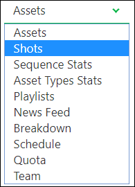 

Click on the **Add shots** button to start with the shot creation.

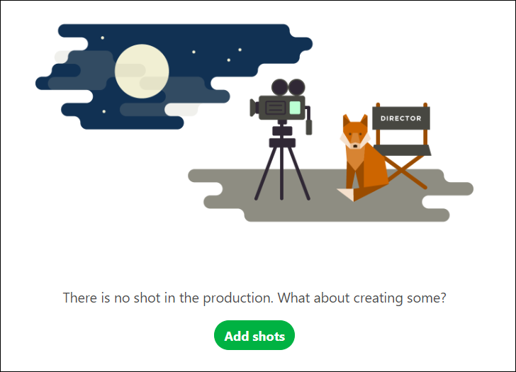

A new pop-up opens for the creation of the assets.
You can now create the episodes, the sequences, and the shots.

Enter the first episode using your code name, e01, then click
on the **add** button (1). Then, for instance, do the same for the sequence, for instance, sq01,
then **add** (2), and now the shots: sh001, then again **add** (3).
You can also define padding for your shots.

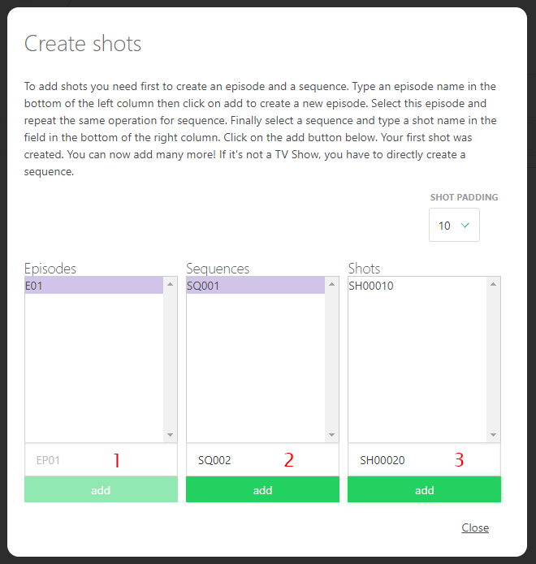

You can now see that new shots are listed, described by their episode and
sequence.
You have created the first shot of the first sequence of the first episode.

Now let's add more shots than just one! As you can see, the box already contains your name
code but incremented, so you have to continue to click on **add** to
create more shots.

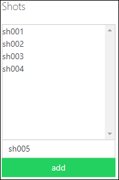

You have to do the same with the sequences and episodes.

If a shot is misplaced on a sequence, you have to edit the shot you want
, and change the
sequence. 

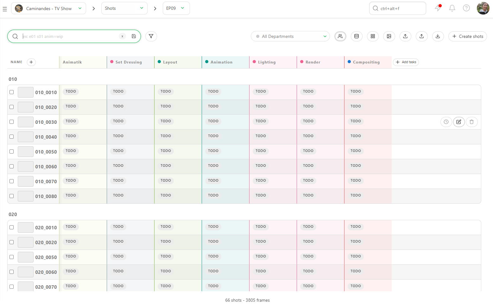

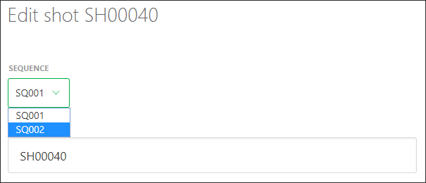

If at some point you need to delete a shot, click on the **trash can**
icon on the right of the line . 
If you need to import this shot back, click on the restore button 
.

To delete a shot, see the FAQ : [How to delete a shot](../faq-deletion/README.md#how-to-delete-a-shot)

To delete a sequence, see the FAQ : [How to delete a Sequence](../faq-deletion/README.md#how-to-delete-a-sequence)

## Add the Frameranges

At this stage of the production, the animatic should be done. This means you have
the length (**number of frames**, **frame range In**, and **frame range Out**) for each shot. You can
add this information to the spreadsheet. This way, you are sure that all
the frames a calculated and none are missing or over-computed.

You may also be able to add a camera as an asset!

You need to edit the shots to fill the frame range information. Click on the
edit button  on the right
side of the shot line.

You can enter the **In** and **Out** of the shot on the new window. Then, save with the **Confirm** button. 

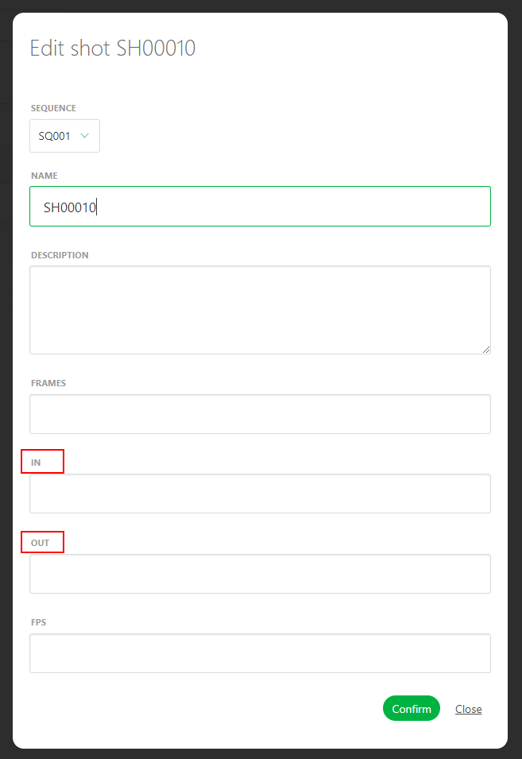

Now the frame range appears on the general spreadsheet of the shot page.

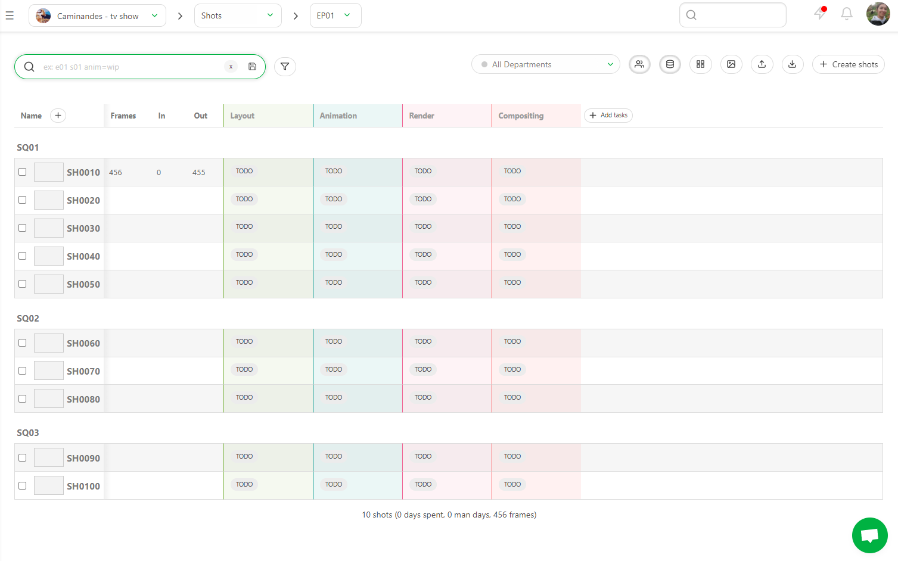

Now that you have unlocked the **Frames**, **In**, and **Out** columns, you can fill them 
directly from the global shot page.

Click on the case you want to fill in and add the data.

If you fill in the **Frame In** and the **Frame out**, Kitsu will calculate the number
 of frames automatically.

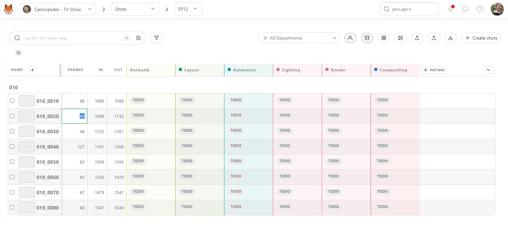

You can also use the **CSV Import** to update your frame range quickly.
 [Update Shots information with CSV Import](../batch-action/README.md#update-shots-information-with-csv-import)

You can have access to the shot values history too.

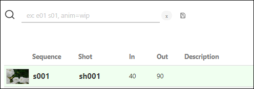

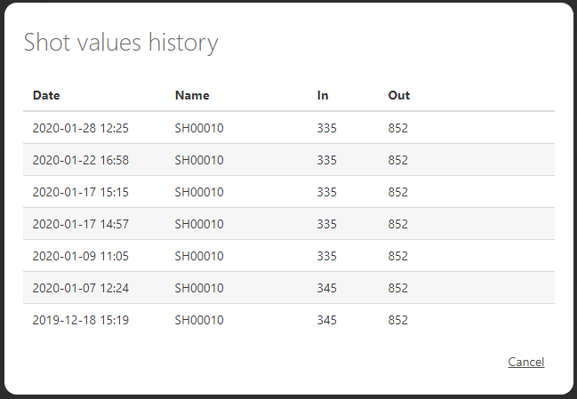

## Create a breakdown list

Filling out the breakdown helps you with the assembly of the shots. With the
breakdown, you have all the details of the assets you need to add to create your
shot, and we are sure to omit nothing.

On the drop-down menu, choose **BREAKDOWN**.

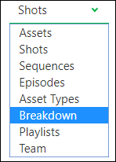

On the left of the breakdown page is the episode/sequence/shot menu (1); you can choose between those you created. They are the right part of
the screen; all the assets created are available for this production (main pack and episodes) (3). Moreover, in
the middle section, it is your selection for the shot (2).

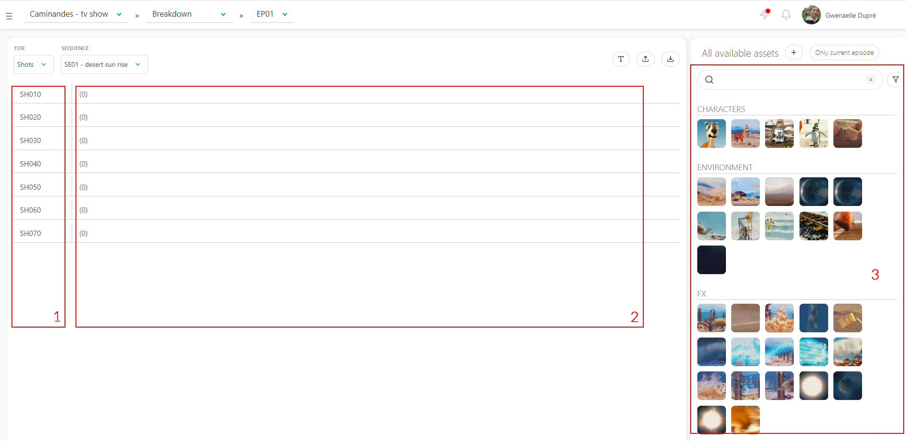

So now you have to select the shot you want to cast.

You can display the assets as text if you don't have thumbnails yet.

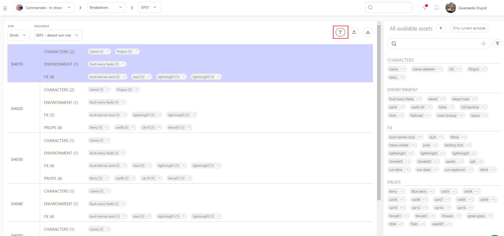

During your breakdown, you may also realize that an asset is missing from the list.

You can create a new asset directly from the breakdown page. Click on the **+** on the right of the **All available assets**.

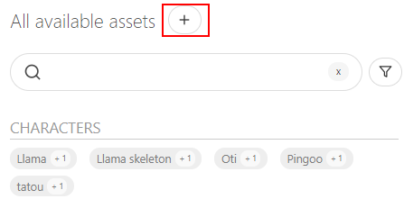

You can also choose multiple shots at the same time. Click on the first shot, hold the **shift** key, and click on the last shot of your selection.

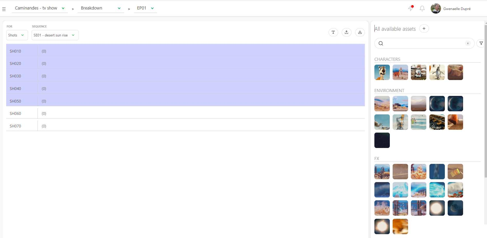

Then click on the assets you want
to assign: characters, backgrounds, ... from the right part (3). 
If you have selected multiple shots, your selection is also applied to the numerous shots.

You can see a **+1** or **+10**when you pass over the asset. It's the number
of times you add this asset, and you can click on it as many times as you need.

You can also link all your assets to episodes on a TV show without specifying a sequence or shot.

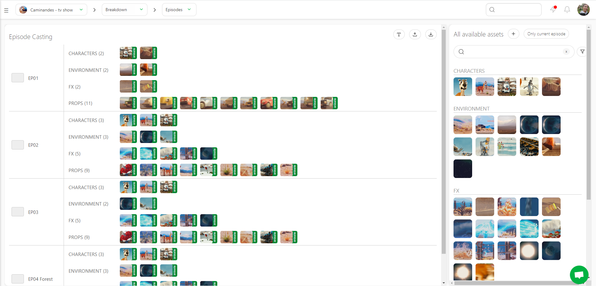

This way, you can link all your assets to one or several episodes before the storyboard/animatic stage.

You can now see the asset appearing in the middle part of the screen (2). Next
to the asset's name is the number of times it has been added. In this
example, we have added two times the character asset Llama.

If you add an asset twice by mistake, you must go to the screen's middle part to select assets for this shot (2). From there, click on
**-1**. When you finish this shot, go on with the other shots. 
Your selection is automatically saved.

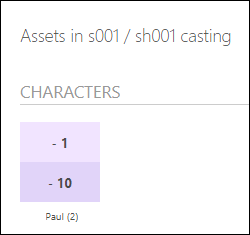

If a new asset is created during the storyboard, get back to the asset
page (using the drop-down menu), and create the assets you
need. The tasks previously created are applied immediately to these new
assets. However, you have to do the assignment, and then you can
continue with the breakdown.

Now your **Breakdown** page should look like this.

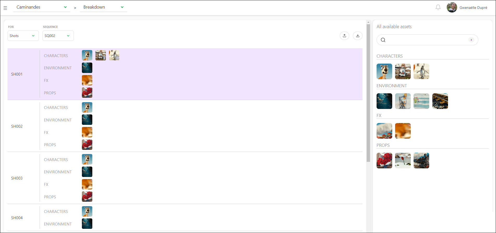

You can also make a breakdown list for your assets if you need to assemble them and keep track of the separate parts.

On the top left corner of the screen, choose **asset** in the drop-down menu below **FOR**.

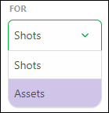

You now have access to a second drop-down menu, where you can choose your asset type: **Character**, **Environment**, **Props**, **FX**, ...

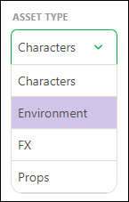

You can fill the asset breakdown page the same way as the shots. First, select one or more assets on the left part and then add the right part's elements.

## Change asset status

For example, when an asset is validated at the **Concept** stage, it can be used for the storyboard. 
Then when it's validated at the **Modeling** stage, you can use it for the layout and so on.

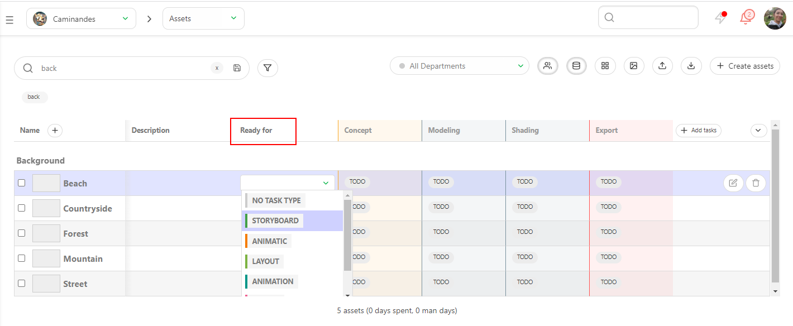

It's useful to know the global status of the state of life of an asset, especially when the breakdown is complete.

On the global page of the shot, you will see a green box: all the assets cast in this shot are ready for this specific task.

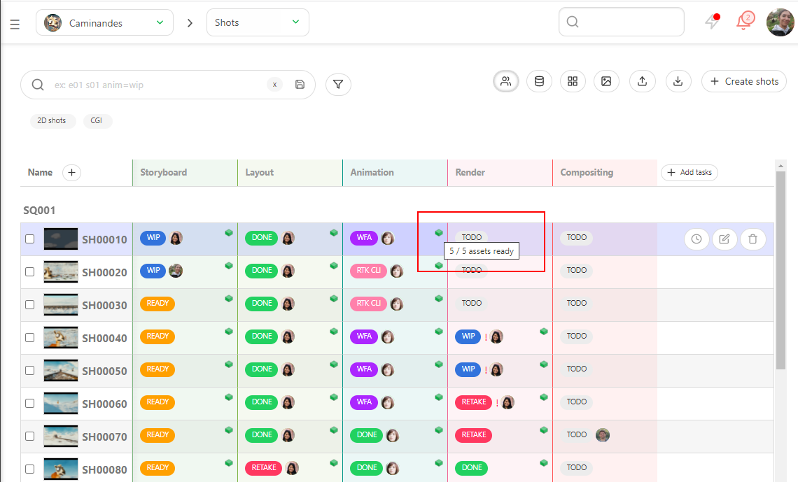

If you don't see the green box, Kitsu will display how many assets are ready.

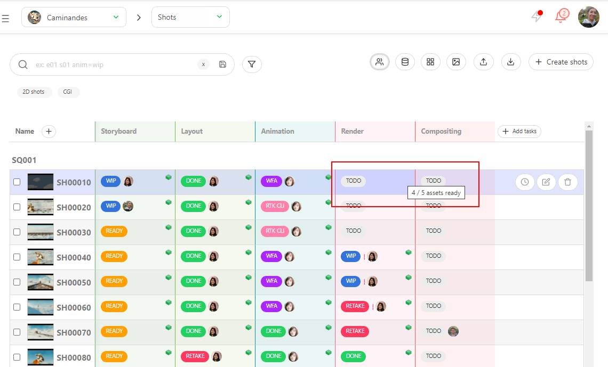

 Then you can click on the shot's name to go to its detail page.
Then you will see all the assets cast in this shot and their status.

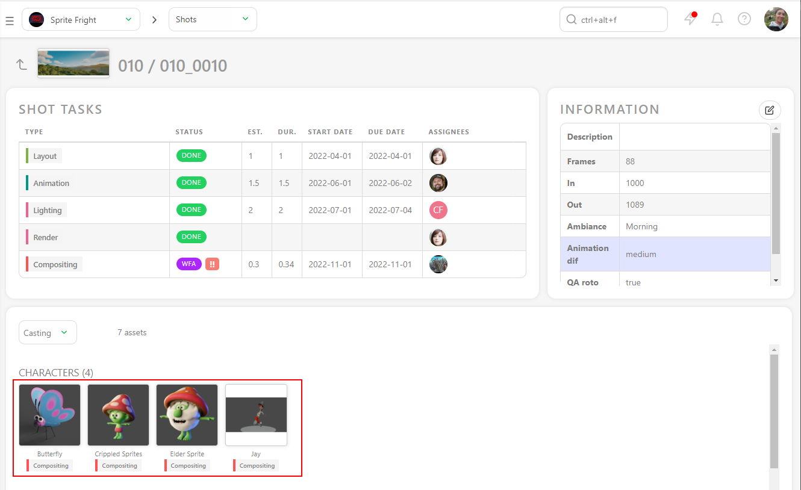

It's the fastest way to know if you can start a shot for a specific task.

## Add a new user

Each Artist required an account. Go to the drop-down menu , and under the **Studio**
section, choose **PEOPLE** page.

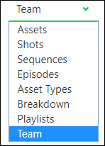

Then, click on the **+ Add a new user** button. 

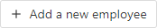

A creation window opens. You can enter the first (1) and last name (2), the email (which is **mandatory** to create the account) (3), and the phone number (4).

You can add the new user to a **Department** (or several) (5).
See **DEPARTEMENT DOCUMENTATION**

Then you need to define the role of the user: ** Artist**, **Supervisor**, **Production Manager**,
**Studio Manager**, **Vendor** or **Client** (6).  If the Artist is working right now, keep
him active; otherwise, select no. Validate by clicking the **Confirm** button.

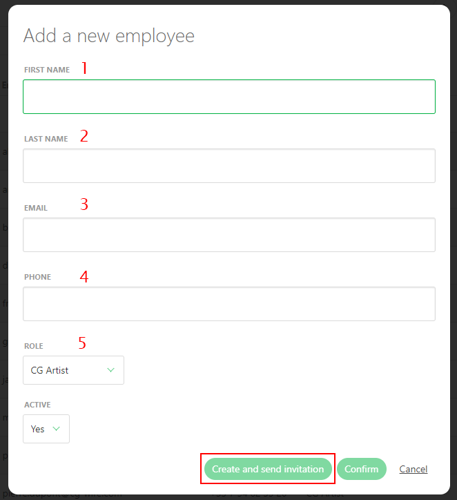

See the [permissions](../permissions/README.md) section for more information. 
To make it short, artists, supervisors, production managers, vendors, and clients only see the
productions they are assigned.

All the people are now part of your studio. They are added to a specific
production when you add them to a team on a production. Otherwise, they
won't have access to anything.

## Add a User to the team

You need to add someone to a production to assign him a task.

On the drop-down menu at the top of the page, select the **TEAM** page.

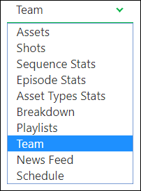 

On the **Team** page, you can see all the assignations for a specific project.
If you want to check another project team, you must switch to the page's top.

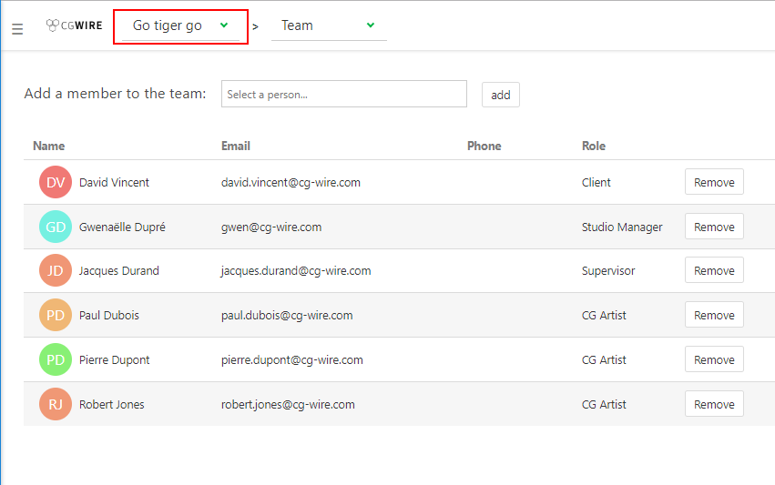

## Assign tasks to an Artist

We can now get back to the **ASSETS** page via the drop-down menu.

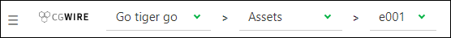.

Now it's time to do your first assignment! 

Click on the status (1) you want to assign.

The **Action Menu Box** appears. 

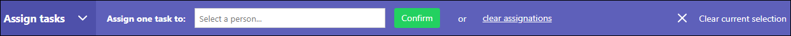

You can now do the assignment. Click on the text input, and you will see
the list of available people. Click on a person's name to perform to select
him. Then click on the confirmation button to complete the assignation.

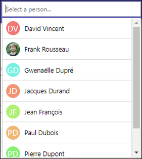

You can assign tasks to the same person in one step (1). Once the blue menu is visible, keep **ctrl** on your Keyboard pressed and select
multiple tasks. You can even use the **shift** key to choose a range of tasks
(2). When you have chosen everything you need, apply with the **Confirm**
button.  

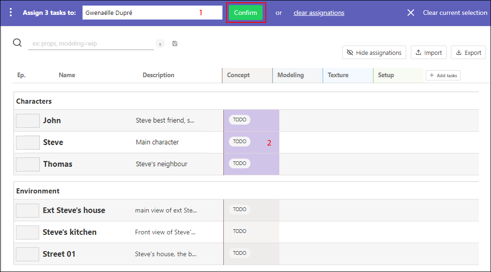

In the same way, once you have selected someone, you can click on
 **or unassign from selection** to remove this assignation.

When you finish all the assignations, quit this mode using the **Escape** key, 
or the cross on the top right corner of the action box.

Now you can see next to each status the avatar of the ArtistArtist.

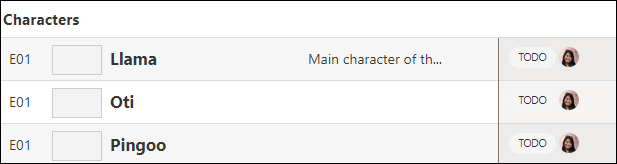

To unclutter the list, you can hide this information with the **Hide
assignations** button on the top of the spreadsheet 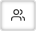.

Once you assign someone, he is part of the production team. Depending
In his position (Artist, Supervisor, Vendor), he only sees the production where
he's assigned. 

Now, everybody knows what to do and who is doing what!

## Change status and write a comment

To write a comment and change the status of a task, you can click on the
status of the task (1). 

The comment uses the **Markdown** language. If you need specific syntax, feel free to look at the markdown guide website: https://www.markdownguide.org/basic-syntax/

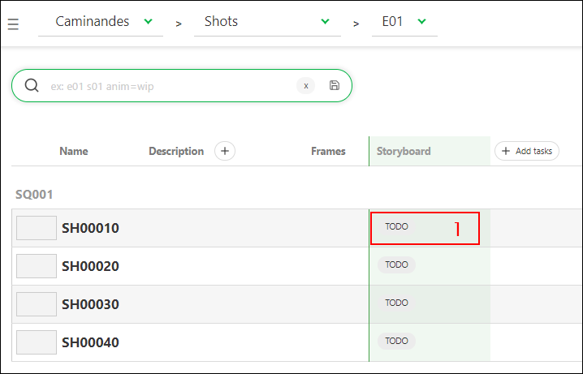

It makes a panel appear on the right, and here you can write a comment (1) and change the status (2), attach a file (3).

You can **tag** someone on the team in the comments. Type the `@`and it opens a sub-menu with the list of the team. 

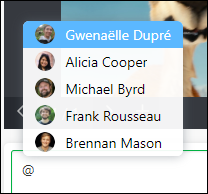

You can tag a frame (whatever version you are in), type the `@`and it opens a sub-menu with the team list, and start typing **frame**. 

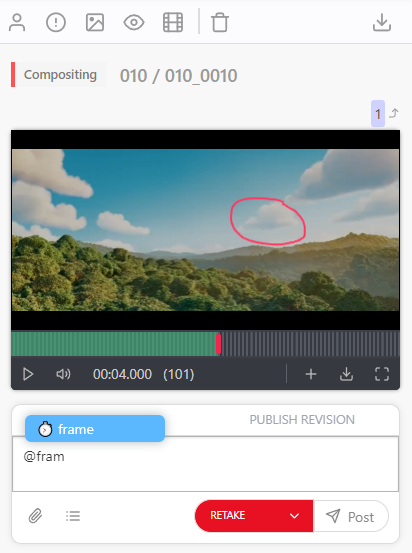

You can add a **checklist** to your comments.

You need to click on the **Add checklist** button, and the first item of the checklist appears. 
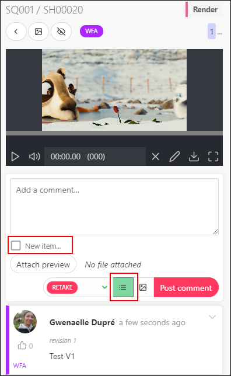

Type your comments, hit the **Enter** key to add another line to your checklist, or click again on the **Add Checklist** button.

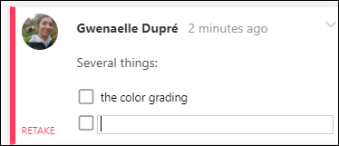

Besides your comment, you can also attach a preview. Click on the **Add attachment** button.

Validate the post and the new status with **Post status**

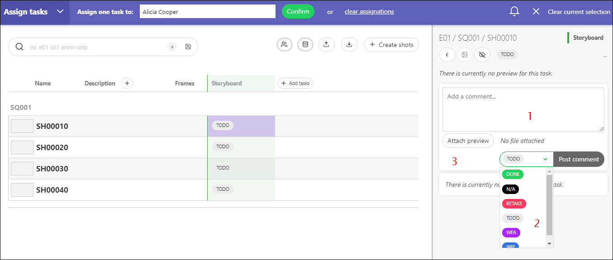

## Add a Preview

Kistu will automatically switch to the **Pulish Revision** tab when you use status with the option **IS FEEDBACK REQUEST**, like the **WFA** Status.

You can add one or several previews to any comments. It can be a picture (`.png`, `.jpg`, `.jpeg`), a video (`.mp4`, `.mov`, `.wmv`), 
or an `.obj` file. You can review all the previews from the browser or mix everything.

Other files like `.pdf`, `.zip`, `.rar`, `.ma` or `.mb`, however, need to be
downloaded to be reviewed.

If you have defined an **FPS** for the production, Kitsu conforms to the uploaded video to this FPS.

Otherwise, the video is compressed to 1080P and 30mbits/sec. 

You need to select the **Publish Revision** tab.

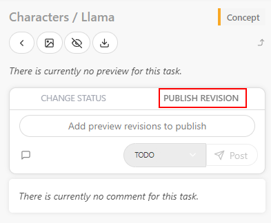

Then, click on the "Add preview revision to publish" button. The explorer opens and lets you choose your file or several files.

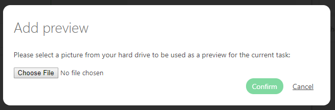

You can also copy-paste a screenshot, for example, to this screen.

You will see a preview of the attached files.

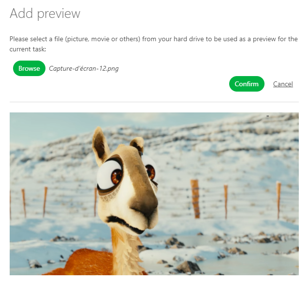

Once your file is selected, you will see its name near the **Attach preview** button.

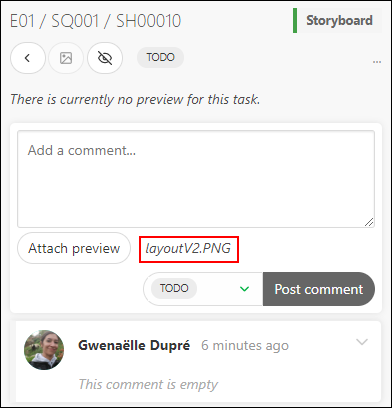

You can also **drag & drop** the file in the comment section.

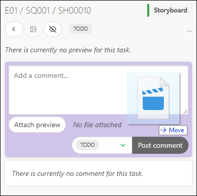

You can select your status and publish your preview with the **Post** Button.

## Add a thumbnail

You can use the preview as a **thumbnail** on the asset or shot spreadsheet. It
helps to recognize the assets/shots on the main pages. 
On the list page, click on the status you want, then on the right panel, click on the **Preview** button (1).

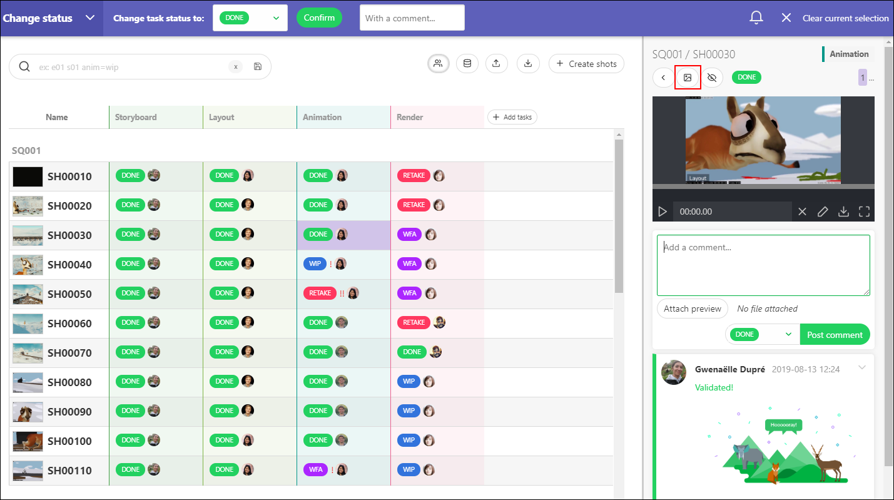

Once you have clicked on the button, you see the thumbnail appears, and the button turns gray.

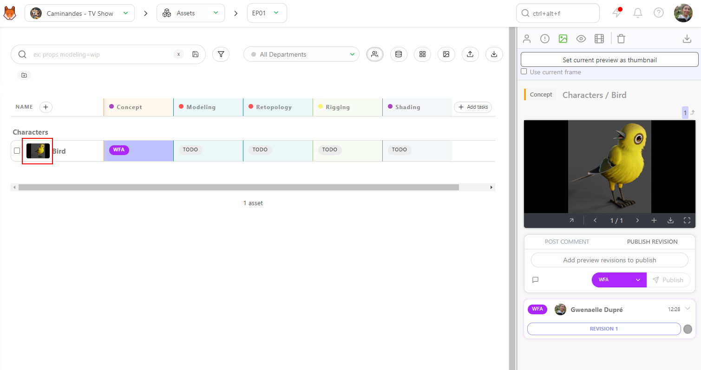

## Perform a review

When an artist needs a review, he changes the status of his task too.

Click on status (1) to open the right panel and start the review. 

You can watch the version from the right panel, enlarge it (2), or even go fullscreen 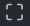 (3).

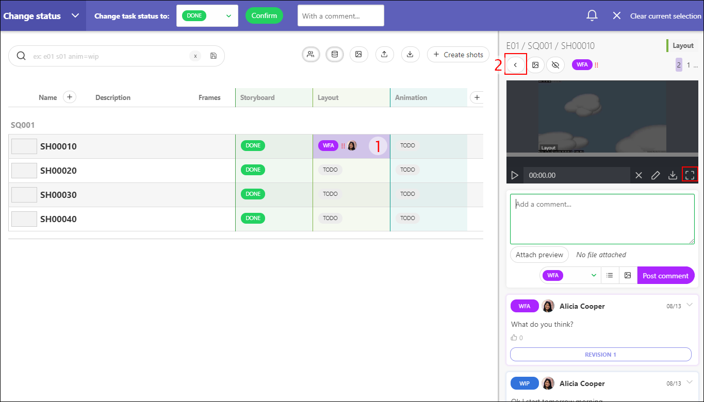

You can draw directly on the preview with the **Pencil** tool and select a color . 

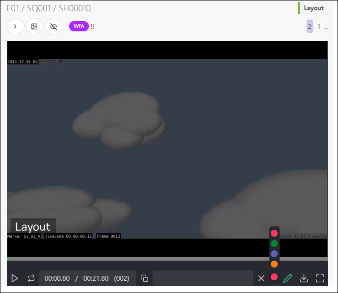

You can also add **text** on the frame.

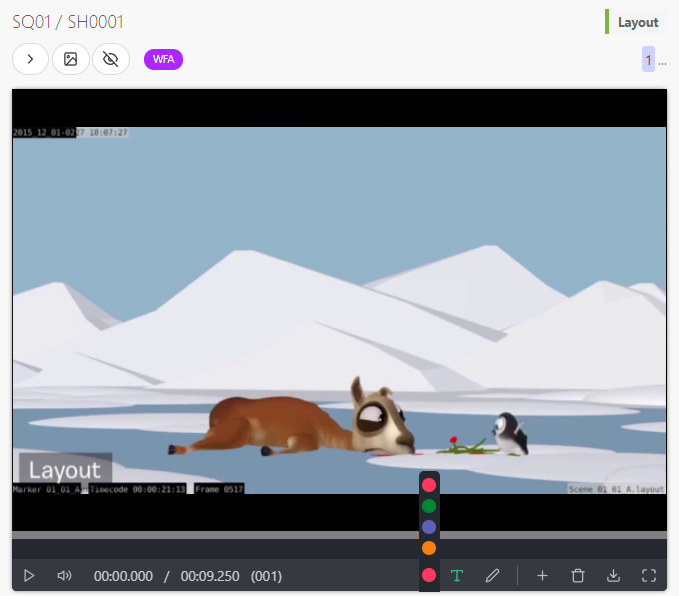

You can tag a frame (whatever version you are in), type the `@`and it opens a sub-menu with the team list, and start typing **frame**. 

If you need to delete your line, click again on the **pencil** icon, and the cursor changes to a multi-directional cross , and then you can select your line and move it around.

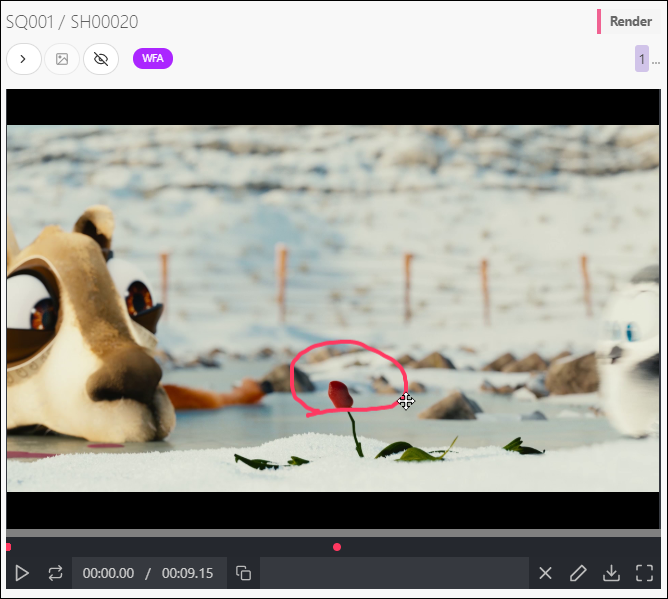

Select the line with the directional cross, and then press the **delete** icon 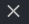

If you go into **Full-Screen**, you can compare two task types or versions side by side when you click on the **Compare** button 
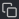.

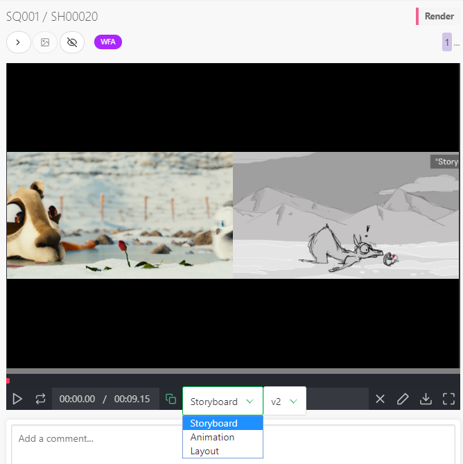

From there, you can change the status too if you want that the ArtistArtist
performs some changes. 

You can add a **checklist** to your comments.

You need to click on the **Add checklist** button, and the first item of the checklist appears. 

Type your comments, hit the **Enter** key to add another line to your checklist, or click again on the **Add Checklist** button.

Besides your comment, you can also attach a preview. Click on the **Add attachment** button.

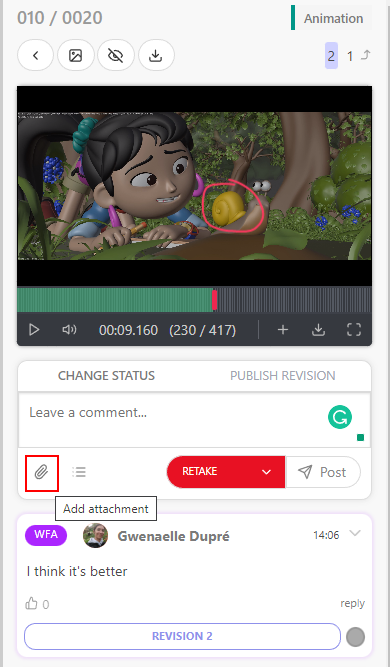

You can also choose to **Attach snapshots from your annotation**on the attachment option.

Once you click the button, Kitsu will grab all the frames with annotation and display the result. You can publish them with **Confirm**.

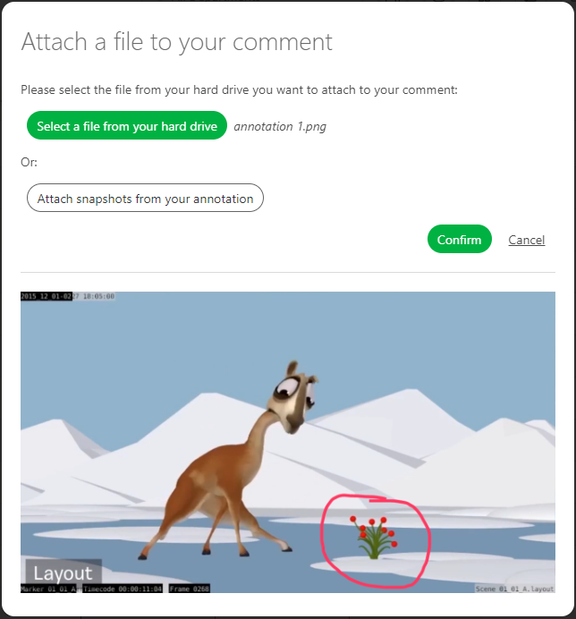

You can also **tag** someone on the team in the comments. Type the `@`and it opens a sub-menu with the list of the team. 

Alternatively, you can change it to  to notify the ArtistArtist that his work is validated.

## Add an estimation for a task

Click on the name of a task type.

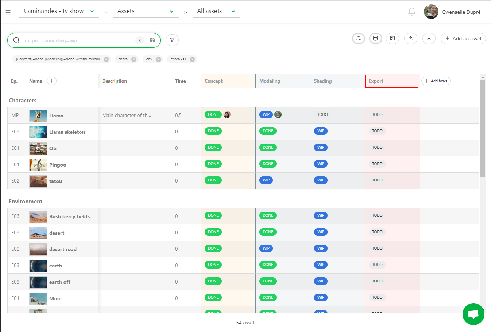

The new page is the **Supervisor view**. You have more detailed information specific to this specific **task type**.

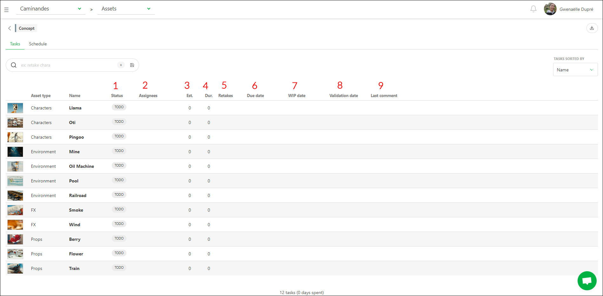

To add an estimation to a task, click on the line, and type the number of days you estimate. You can select multiple assets or shots at the same time.

You can also define a **Start date** by clicking on it.
A calendar will open and let you choose your start date.

The **Due date** is automatically calculated with the **Estimation**.
 

To go further in detail with the Supervisor's view :  
- (1) You can see and change the status of a task
- (2) You can assign people to tasks

(1) and (2) are filled with the action menu.

- (3) You can add an estimation for the task (in day unit)
- (4) Kitsu calculates the sum of the timesheet fed by the artists
- (5) The number of back-and-forths with the retake status
- (6) You can add a start date for the task (with the calendar)
- (7) Kitsu calculates the due date with the Start Date and the estimation
- (8)(9) the Wip and Feedback dates are automatically filled
- (10) the Last comment section help you to keep an eye on the last activity of this task type.

(7) to (10) is automatically filled.

  
To help you to set a correct estimation, you can use the **Estimation** Tab.

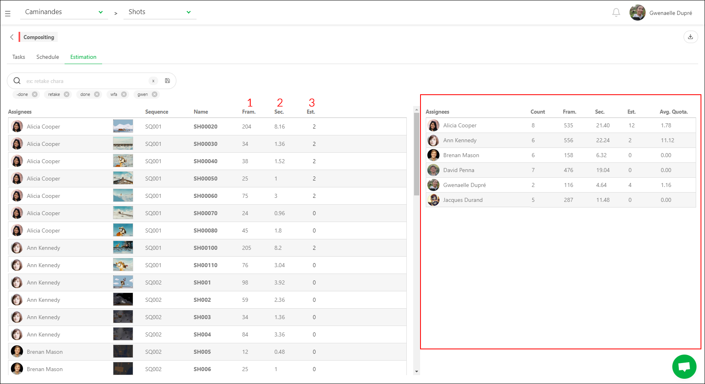 

The left part of the screen lists the shots with the assignation and the number of frames (1).
Depending on the **FPS** you have set for the production, the number of **Seconds** will be automatically calculated (2). 
(See how to set your production fps [Create your first production]((../getting-started-production/README.md#create-your-first-production) ) 

 On the right part of the screen, you can see the full team of the department (depending on the assignments you made), the number of shots they have to do, the number of frames, seconds, and the average Quota. 
 
 
 And the last column is the **Estimation**, to modify the estimation, hover the line with your mouse and click the editing zone.
 
 You can also select multiple shots simultaneously to edit them all the once.
 
 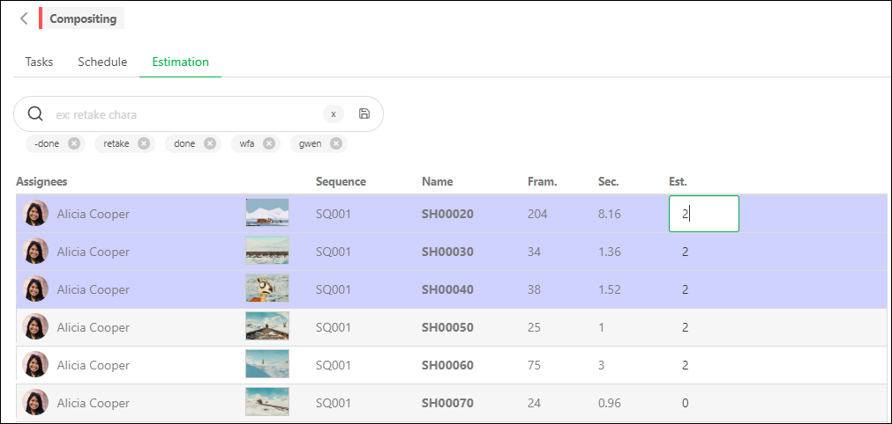 
 
 Every time you change the **Estimation** (in the number of days) on the right part, you can see in real-time that the **Average Quota** is updated.
 

 
 For more information about the **Schedule** tab, go to the 
 [Task Type Schedule](#task-type-schedule) 
 
 

## The timesheets

As Studio Manager, you can use the main menu to check the timesheets.

Open the main menu with the  button. 

On the menu, choose the **Timesheets** page.

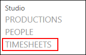

Per default, Kitsu will display the timesheet of all the production, but you can choose to see 
the timesheet for a specific production only.

You can choose which **month** or **year** you want to display.

You can also choose the detail level: **day**, **week**, **month**.

Per week, Kitsu highlights the overdue time per ArtistArtist.

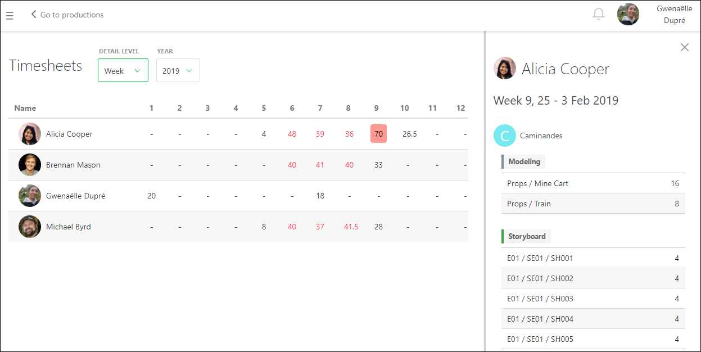

If you click on a number, a side panel opens with the details of the time spent per task this week.

You can also set up several working hours per day. 

Go back to the main menu and select **Settings**. 

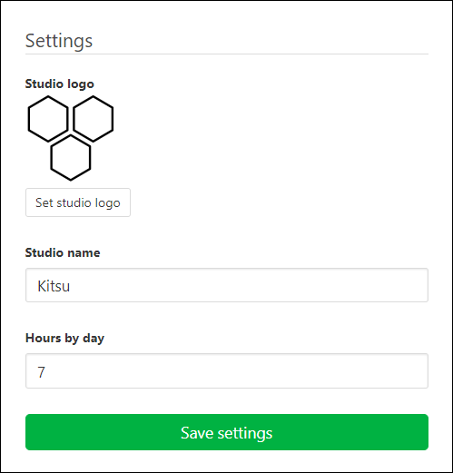

