# Getting started as a Production Manager

## Create your first production

The first step on Kitsu is to create a production. Click on the **Create a new
production** button.  

Enter the name of your production, choose **TV Show** if you need more than one episode.
Then validate by clicking on **Confirm**.

To navigate through Kitsu sections, you need to use the sidebar. you can 
access it through the three lines button on top of the screen 
.  It opens a menu on
the left part of the screen. We want to see the production list. 
So below **Studio** section, click on the **PRODUCTIONS** button. 

There, you can see all the productions you have created, their type and their status (open
for an Active Production, or Closed if not Active). When your cursor is above a
production line you can see two news icons on the right part of the line :
**edit**  and **delete**
.

To modify a production go into the **Edit production** page. 

You can add some specific information as the **FPS** (Frames per second), 
the **Ratio** and the **Resolution** of the picture.

If nothing is filled, the **FPS** is set to **24 FPS** per default. 
The **FPS** will be applied to re-encode the video, and also to calculate the quotas.

NB: The default avatar for a production is the first letter displayed on a
colored background. You can change it with a picture if you want.

## Create some assets

So, now you have the first script for your production. It's time to do the
breakdown and the creation of the assets. It allows you to list your assets, 
dispatch the work to the CG artists, and follow the progress of each related
tasks.

Let's begin with the asset page. You can access it via the drop-down menu on top of the page. 

.

On the asset page, click on **Add assets**.

A pop-up window opens:
 
It asks you to choose the asset **Type** (1): Camera, Characters, Environment,
FX, Props, ...  
Let's start with an environment. You select the **Episode** (2), or the main pack (**All**).
We give it a **Name** (3) and enter a description that helps the designer to know what to do, and later to
identify the asset quickly.
If you have multiple assets to create, click on **Confirm and stay**. 

You can change the asset type, and keep adding assets. 

You can also customized the asset type list 
[How to customize the workflow](../faq/README.md#how-to-customize-the-workflow)

You can see the newly created asset appearing on the background, every time you click on **Confirm and stay**. After you added your last asset, click
on **Confirm**, it saves the asset and closes the window. If you don't have
more assets to add, click on **Close**, it cancels the window.

For now, the assets are linked with the first episode, or with the Main Pack.

You can edit assets by going to the asset page, hovering the
asset you want to modify, and then click on the **edit** button 
 (1) on the right side of
the line.  

On the main asset page, to extend the description, click on the first words
(2), and a pop-up opens with the full description.

To delete an asset see the FAQ : [How to delete an asset](../faq/README.md#how-to-delete-an-asset)

## Create assets from a csv spreadsheet file

You may have already your asset list ready in a spreadsheet file.
With Kitsu you have 2 ways to import them, the first is to import a `.csv` file directly, the second is to copy paste your data directly into Kitsu.

First save your spreadsheet as a `.csv` file.

Then, go back to the asset page on Kitsu, and click on the **Import** icon.

A pop-up window **Import data from a CSV** opens, click on **Browse** to pick your `.csv` file.

To see the result, click on the **Preview** button.
  
You can check and adjust the name of the columns with the preview of your data.
 
NB: the **Episode** column is only mandatory for a **TV Show** production.
 

Once everything is good, click on the **Confirm** button, to import your data into Kitsu.

Now, you have all your assets imported into Kitsu.

## Create assets with copy/paste a spreadsheet file

Open you spreadsheet, select your data and copy them.

Then, go back to the asset page on Kitsu, and click on the **Import** icon 
.

A pop-up window **Import data from a CSV** opens, click on the **Paste a CSV data** tab.

 
There you can paste your previously selected data, and see the result with the **Preview** button.
 

  
You can check and adjust the name of the columns with the preview of your data.
 
NB: the **Episode** column is only mandatory for a **TV Show** production.
 

Once everything is good, click on the **Confirm** button, to import your data into Kitsu.

Now, you have all your assets imported into Kitsu.

## Update assets with the CSV import

You can use the CSV import to update quickly your data.

You need to switch on the option **Update existing data**. Then the lines that will be updated
will be highlighted in blue.

## Update assets with copy/paste a spreadsheet file

Open you spreadsheet, select your data and copy them.

Then, go back to the asset page on Kitsu, and click on the **Import** icon 
.

A pop-up window **Import data from a CSV** opens, click on the **Paste a CSV data** tab.

 
There you can paste your previously selected data, and see the result with the **Preview** button.
 

  
You can check and adjust the name of the columns with the preview of your data.

NB: the **Episode** column is only mandatory for a **TV Show** production. 
 
You need to switch on the option **Update existing data**. Then the lines that will be updated
will be highlighted in blue.

Now, you have all your assets imported into Kitsu.

## Create (episodes) sequences and shots

It's time to do the breakdown of the storyboard. Meaning you can create
the sequences and the shots of the episode and associate assets to them.

Nb: Episodes are onlu mandatory for **TV Show** Production.

You need to go to the **Shots** page: you can use the
drop-down menu and click on the **SHOTS**.

 

To start with the shot creation, click on the **Add shots** button.

A new pop up opens, as for the creation of the assets.
You can now create the episodes, the sequences, and shots.

Enter the first episode using your code name, for example, e01, then click
on the **add** button (1).  Do the same for the sequence, for instance, sq01,
then **add** (2), and now the shots: sh001, then again **add** (3).
You can also define padding for your shots.

You can now see that new shots are listed, described by their episode and
sequence.
You have created the first shot of the first sequence of the first episode.

Now let's add more shots than just one! As you can see the box already contains your name
code but incremented, so you have to continue to click on **add** to
create more shots.

You have to do the same with the sequences and episodes.

If a shot is misplaced on a sequence, you have to edit the shot you want
, and change the
sequence. 

If at some point you need to delete a shot, click on the **trash can**
icon on the right of the line . 
If you need to import back this shot, click on the restore button 
.

To delete a shot see the FAQ : [How to delete a shot](../faq/README.md#how-to-delete-a-shot)

To delete a sequence see the FAQ : [How to delete a shot](../faq/README.md#how-to-delete-a-sequence)

## Create shots from a csv spreadsheet file

You may have already your shots list ready in a spreadsheet file.
With Kitsu you have 2 ways to import them, the first is to import a `.csv` file directly, the second is to copy paste your data directly into Kitsu.

First save your spreadsheet as a `.csv` file.

Then, go back to the shot page on Kitsu, and click on the **Import** icon.

A pop-up window **Import data from a CSV** opens, click on **Browse** to pick your `.csv` file.

To see the result, click on the **Preview** button.
  
You can check and adjust the name of the columns with the preview of your data.
 
NB: the **Episode** column is only mandatory for a **TV Show** production.
 

Once everything is good, click on the **Confirm** button, to import your data into Kitsu.

Now, you have all your shots imported into Kitsu.

## Create shots with copy/paste a spreadsheet file

Open you spreadsheet, select your data and copy them.

Then, go back to the shot page on Kitsu, and click on the **Import** icon 
.

A pop-up window **Import data from a CSV** opens, click on the **Paste a CSV data** tab.

 
There you can paste your previously selected data, and see the result with the **Preview** button.
 

  
You can check and adjust the name of the columns with the preview of your data.
 
NB: the **Episode** column is only mandatory for a **TV Show** production.
 

Once everything is good, click on the **Confirm** button, to import your data into Kitsu.

Now, you have all your shots imported into Kitsu.

## Update Shots information with CSV Import

You can use the **CSV Import** to update your data as the **NB Frames**, **Frame IN**, **Frame Out** or any **Custom Column**

Open you spreadsheet, select your data and copy them.

Then, go back to the shot page on Kitsu, and click on the **Import** icon 
.

A pop-up window **Import data from a CSV** opens, click on the **Paste a CSV data** tab.

 
There you can paste your previously selected data, and see the result with the **Preview** button.
 

  
You need to switch on the **Option : Update existing data**.
the updated shots will be in blue

 
NB: the **Episode** column is only mandatory for a **TV Show** production.
 

Once everything is good, click on the **Confirm** button, to import your data into Kitsu.

Now, you have all your shots imported into Kitsu.

## Create a breakdown list

Fill the breakdown, help you with the assembly of the shots. With the
breakdown, you have all the details of the assets you need to add to create your
shot. We are sure to omit nothing.

On the drop-down menu, choose **BREAKDOWN**.

On the left part of the breakdown page is the episode/sequence/shot menu (1),
you can choose between the ones you have created. They are the right part of
the screen; all the assets available created for this production (3). Moreover, in
the middle section, it is your selection for the shot (2).

So now you have to select the shot you want to cast. You can also choose multiple shots at the same time. Click on the first shot, hold the **shift** key and click on the last shot of your selection.

Then click on the assets you want
to assign: characters, backgrounds, ... from the right part (3). 
If you have selected multiple shots, your selection is applied to the numerous shots, as well.

When you pass over the asset, you can see a **+1** or **+10**. It's the number
of times you add this asset. You can click as many times as you need on it.

You can now see the asset appearing in the middle part of the screen (2). Next
to the name of the asset is the number of times it has been added. In this
example, we have added two times the character asset Llama.

If you add twice an asset by mistake, you have to go on the middle part of
the screen, on your selection of assets for this shot (2). From there click on
**-1**.  When you are done for this shot, go on with the other shots. 
Your selection is automatically saved.

If a new asset is created during the storyboard, get back to the asset
page (using the drop-down menu), create the assets you
need. The tasks previously created are applied immediately to these new
assets. However, you have to do the assignation, and then you are good to
continue with the breakdown.

Now your **Breakdown** page should look like this.

You can also make a breakdown list for your assets if you need to assemble them and keep track of the separated parts.

On the top left corner of the screen, choose **Asset** in the drop-down menu, below **FOR**.

You now have access to a second drop-down menu, where you can choose your asset type: **Character**, **Environment**, **Props**, **FX**, ...

You can fill the asset breakdown page, the same way than the shots. Select one or more assets on the left part, then add the elements from the right part.

## Create a breakdown list from a CSV file

You may have already your breakdown list ready in a spreadsheet file. With Kitsu you have 2 ways to import it, the first is to import a .`csv` file directly, the second is to copy paste your data directly into Kitsu.

First save your spreadsheet as a `.csv` file following Kitsu's recommandation.

Click on the **import** button 

A pop-up window **Import data from a CSV** opens, click on **Browse** to pick your `.csv` file.

To see the result, click on the **Preview** button.

You can check and adjust the name of the columns with the preview of your data.

NB: the **Episode** column is only mandatory for a **TV Show** production.

Once everything is good, click on the **Confirm** button, to import your data into Kitsu.

Now, you have your breakdown imported into Kitsu.

## Create a breakdown list with copy/paste a spreadsheet file

Open you spreadsheet, select your data and copy them.

Then, go back to the breakdown page on Kitsu, and click on the **Import** icon 
.

A pop-up window **Import data from a CSV** opens, click on the **Paste a CSV data** tab.

 
There you can paste your previously selected data, and see the result with the **Preview** button.
 

  
You can check and adjust the name of the columns with the preview of your data.
 
NB: the **Episode** column is only mandatory for a **TV Show** production.
 

Once everything is good, click on the **Confirm** button, to import your data into Kitsu.

Now, you have all your assets imported into Kitsu.

## See detail of a shot

If you want to see a detail of a shot, click on its name. 

A new page opens with the list of the tasks, the assignation, and the list
of assets that appear on this shot (**Shot casting**).
 

 
You can click on the status of each task to open the comment panel and see the history of the comments and the different versions.

## Add the Frameranges

At this stage of the production, the animatic should be done. Meaning you have
the length (**frame range In** and **frame range Out**) for each shot. You can
add this information to the spreadsheet.  This way, you are sure that all
the frames a calculated, and none are missing, or over computed.

You may also be able to add a camera as an asset!

You need to edit the shots to fill the frame range information. Click on the
edit button  on the right
side of the shot line.

On the new window, you can enter the **In** and **Out** of the shot. Save with the **Confirm** button. 

Now the frame range appears on the general spreadsheet of the shot page.

You can also use the **CSV Import** to update quickly your frame range. [Update Shots information with CSV Import](#update-shots-information-with-csv-import)
.

You can have access to the shot values history too.

## Add Custom columns

To add more information on the general spreadsheet pages, you have to create a 
**Custom column**.

Click on the **+** near the Name column.

You may have extra information to add on your pages as the **level of difficulties**,
the **name of the studios**, when a production is split, etc.

In the custom column, you can store all kinds of information: a **list of value** or a **free value**.

The **free value** is different for each entity.

The **list of value** gives you the same choice for each entity. Moreover, it has to be filled now. 

Type the elements of the list below **Available values**, and confirm them by clicking on **Add value**.

Validate the creation of the custom column with the **Confirm** button.

Back on the global spreadsheets page, you can fill this information with the edit 
button .

You now see a new line on the edit pop-up. You can select the information from the list, 
alternatively, enter the free values, depending on your previous choice.

Don't forget to press the **Confirm** button when you are done.

If you need to **edit** or **delete** the custom column, go back to the general spreadsheet page.
Nearby the name of your custom column, click on the arrow . 

You can also use the **CSV Import** to fill quickly your custom column.
You need to first create your **Custom Column** into kitsu, then add it in your spreadhseet, then copy paste your data into the **CSV Import**.
[Update Shots information with CSV Import](#update-shots-information-with-csv-import)

Select in the menu if you want to 
edit the name of the custom column and its information, or you want to remove it.

## Create tasks for the assets

And now we can create tasks for the assets (3), like **Concept**, **Modeling**,
**Texture**, **Setup**, and other if needed (see 
[How to customize the workflow](../faq/README.md#how-to-customize-the-workflow)
).

Click on the **+ Add tasks** (3) on top of the spreadsheet. A new window will
open and on the list under **Type** you can choose the task you need to add.
You can also choose if you want to create tasks for **the project**, validate it by **Confirm** button.

You can choose to create tasks only for filtered elements. For exemple you want to create 
**Rigg** tasks only for the characters.

You need to type **Characters** on the search bar on the asset global page.

Then click on **+ Add tasks**. Select the task type, here **Rigging**, and switch to **For current list and filters**.

Valid with **Confirm**.

If you remove the filter characters, you will see the tasks only created for the selected elements.

If you want to delete a task, If some assets don't match the task (as environment and setup), click on the menu to change the action (1), 
then select the **delete tasks** (2) on the left top
of the page.
 

Now that we have created all the assets and related tasks, we can now add the
artists to the team and assign tasks to them.

## Create tasks for the shots

We can now associate tasks with the shots. Same way than for the assets, click on
the **+Add tasks** button 
on the top of the spreadsheet. 

A new pop-up opens and lets you choose what task you want to add. All the
shots are linked to the tasks if you select **For project** option.

## Add a new employee

Each artist required an account. Go to the drop-down menu , and under the **Studio**
section, choose **PEOPLE** page.

Then, click on the **+ Add a new employee** button. 

A creation window opens. You can enter the first (1) and last name (2), the email
(which is **mandatory** to create the account) (3), the phone number (4) and
define the role of the employee: **CG artist**, **Supervisor**,
**Studio Manager**, **Vendor** or **Client** (5).  If the artist is working right now, keep
him as active, otherwise select no. Validate by clicking **Confirm** button.

See the [permissions](../permissions/README.md) section for more information. 
To make it short, CG artists, supervisors and clients only see the
productions they are assigned.

All the people are now part of your studio. They are added to a specific
production when you assign them to a task on a production. Otherwise, they
won't have access to anything.

## Add employees from a csv spreadsheet file

You may have already your employee list ready in a spreadsheet file.
With Kitsu you have 2 ways to import them, the first is to import a `.csv` file directly, the second is to copy paste your data directly into Kitsu.

First save your spreadsheet as a `.csv` file.

Then, go back to the people page on Kitsu, and click on the **Import** icon.

A pop-up window **Import data from a CSV** opens, click on **Browse** to pick your `.csv` file.

To see the result, click on the **Preview** button.
  
You can check and adjust the name of the columns with the preview of your data.

NB: the **Role** column is not mandatory.
 

Once everything is good, click on the **Confirm** button, to import your data into Kitsu.

Now, you have all your people imported into Kitsu.

## Add a CG Artist to the team

You need to add someone to a production to assign him a task.

On the drop-down menu on the top of the page, select the **TEAM** page.

 

On the **Team** page, you can see all the assignations for a specific project.
If you want to check another project team, you need to switch the project
on the top of the page.

You can also add someone to a production without assigning him to a task if you have less than 10 people, you
can select his name on the search box (or type his name), and validate with
**add**.

## Assign tasks to a CG artist

We can now get back to the **ASSETS** page via the drop-down menu.

.

Now its time to do your first assignment! 

Click on the status (1) you want to assign.

The **Action Menu** on top of the screen appears. 

You can now do the assignation. Click on the text input, and you see
the list of available people. Click on a person's name to perform to select
him. Then click on the confirmation button to complete the assignation.

You can assign several tasks to the same person in one step (1). Once you have
the blue menu visible, keep **ctrl** on your keyboard pressed and select
multiple tasks. You can even use the **shift** key to choose a range of tasks
(2). When you have chosen everything you need, apply with the **Confirm**
button.  

In the same way, you can click on **Clear assignations** to remove all 
assignations, or press the "Escape" key.

When you finish all the assignations, quit this mode using the **Clear
current selection** button .

Now you can see next to each status the avatar of the CG artist.

To unclutter the list, you can hide this information with the **Hide
assignations** button on the top of the spreadsheet .

Once you assigned someone, he is part of the production team. Depending
on his position (CG Artist, Supervisor, Vendor), he only sees the production where
he's assigned. 

Now, everybody knows what to do and who is doing what!

## Add an estimation for a task

Click on the name of a task type.

The new page is the **Supervisor view**. You have more detailed information specific to this specific **task type**.

To go further in detail with the Supervisor view :  
- (1) You can see and change the status of a task
- (2) You can assign people to tasks

(1) and (2) is filled with the action menu.

- (3) You can add an estimation for the task (in day unit)
- (4) Kitsu calculate the sum of the timesheet fed by the artists
- (5) The number of back and forth with the retake status
- (6) You can add a start date for the task (with the calendar)
- (7)Kitsu calculate the due date with the Start date and the estimation
- (8)(9) the Wip and Validation dates are automatically filled
- (10) the Last comment section help you to keep an eye on the last activity of this task type.

(7) to (10) is automatically filled.

To add an estimation to a task, click on the line, and type the number or days you estimate. You can select multiple assets or shots at the same time.

You can also define a **Start date** by clicking on it.
A calendar will open and let you choose your start date.

The **Due date** is automatically calculated with the **Estimation**.
 

  
To help you to set a correct estimation, you can use the **Estimation** Tab.

 

On the left part of the screen is the list of the shots with the assignation and the number of frames (1).
Depending on the **FPS** you have set for the production, the number of **Seconds** will be automatically calculated (2). 
(See how to set your production fps [Create your first production](#create-your-first-production) ) 

 On the right part of the screen you can see the full team of the departement (depending on the assignations you made), the number of shots they have to do, the number of frame, seconds, and the average quota. 
 
 
 And the last column is the **Estimation**, to modify the estimation, hoover the line with your mouse and click and the editing zone.
 
 You can also select multiple shot at the same time to edit them all the once.
 
  
 
 Everytime you change the **Estimation** in day on the right part, you can see in real time that the **Average Quota** is updated as well.
 

 
 For more information about the **Schedule** tab, go to the 
 [Task Type Schedule](#task-type-schedule) 

## Change status and add a Preview

To write a comment and to change the status of a task, you can click on the
status of the task (1). 

It makes appear a panel on the right, and here you can write a comment (1) and change the status (2), attach a file (3).

Validate the post and the new status with **Post status**

You can add a preview to any comments. It can be a picture (`.png`, `.jpg`, `.jpeg`), or a video (`.mp4`, `.mov`, `.wmv`), 
or an `.obj` file. All can be reviewed from the browser.

Other files like `.pdf`, `.zip`, `.rar`, `.ma` or `.mb` however, they need to be
downloaded to be reviewed.

If you have defined a **FPS** for the production, Kitsu conforms to the uploaded video to this FPS.

Otherwise, the video is compressed to 1080P, and 30mbits/sec. 

Click on the "Attach preview" button, the explorer opens and lets you choose your file.

Once your file is selected, you see its name near the "Attach preview" button.

You can also **drag & drop** the file in the comment section.

You can add multiple images at the same time, or, once you have uploaded an image, you can add another one.

The **Add preview** pop-up opens and asks you to choose a file.

You can navigate through the pictures uploaded.

To delete an additional preview, you need to enlarge the comment panel.

And then click on the 

## Add a thumbnail

You can use the preview as a **thumbnail** on the asset or shot spreadsheet. It
helps to recognize the assets/shots on the main pages. 
On the list page, click on the status you want, then on the right panel, click on **Preview** button (1).

Once you have clicked on the button, you see the thumbnail appears, and the button turns gray.

## Add batch of thumbnails (and previews)

You can use the **Add Thumbnails** button  on the global page to massively import thumbnails.

A new pop-up opens and asks you to choose which task types the thumbnails are linked.

**Thumbnails batch import accept images files and video files**.

For the video files, only the first frame is used as the thumbnail.

You have to name your thumbnails as sequence_shot.

## Change priorities

At some point on the production you may want to prioritize some tasks, and
pinpoint these urgent tasks to your team.

For this, we use the same technique as before. Click on the space
near a status task (1). 

The action menu appears on the top of the screen. 

Click on the name on the left on the action menu, and choose 
**Change priority**.

There are four levels of priority: **Normal**, that is the fundamental level of all the
tasks, **High**, **Very High**, or **Emergency**. Save the changes with the
**Confirm** button.

As we have done for the assignation or the status, select the shots (1), select
the level of priority (2), and apply with **Confirm** (3).

You can now see next to the status of the task some **exclamation marks**. The
more there are, the more urgent the task is.  

* (1) is **Normal**, 
* (2) is **High**,
* (3) is **Very High**
* (4) is for **Emergency**.
    

## Perform a review

When a CG artist needs a review, he changes the status of his task to .

Click on the status (1) to open the right panel and start the review. 

You can watch the version from the right panel, or enlarge it (2), or even go fullscreen    (3).

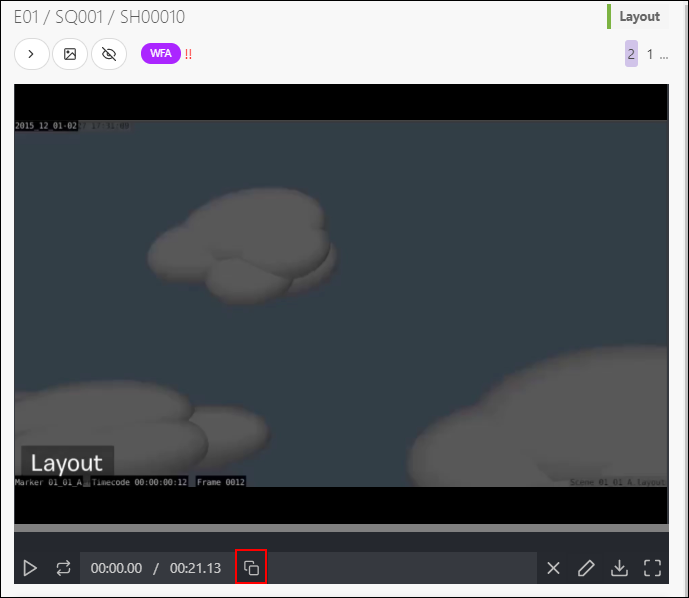

You can compare two task type or version side by side when you click on the **Compare** button 
.

You can draw directly on the preview with the **pencil** tool and select a color . 

If you need to delete your line, click again on the **pencil** icon, the cursor changes to a multi-directional cross , and then you can select your line and move it around.

Select the line with the directional cross, and then press the **delete** icon 

From there, you can change the status to  if you want that the CG artist
performs some changes. 

You can add a **checklist** to your comments.

You need to click on the **Add checklist** button, and the first item of the checklist appears. 

Type your comments, and hit **Enter** key to add another line on your checklist or click again on **Add Checklist** button.

You can also **tag** someone of the team in the comments. Type the `@`and it opens a sub-menu with the list of the team. 

Alternatively, you can change it to , to notify the CG artist that his work is validated.

## Change status per batch

Alternatively, you can do it per **batch**. 

You can select multiple shots or assets, by pressing the **crtl** or
**shift** key.

Then go to the **Change status** section on the action menu.

Choose the new status for your selected tasks (1). You can also add a comment for all the selected tasks (2)
You validate the new status with the **Confirm** button.

## Create a playlist

You can find the **Playlists** page on the drop-down menu. 

The **playlist** page is separated into 2 parts: 

* (1) The playlist list where you can **create** a playlist, or load an existing one.
* (2) The last created playlists and the last modified playlists

Start by creating a **Playlist** 
, You default name
is the date and the hour. You can change it immediately. You can  choose if the playlist
will be shared with the **studio** or the **client** and if it's a **shot** or **asset** playlist.

Once the playlist created, via the search/filter bar, you can select which shots to add
to your playlist. You can also choose to add the whole movie.

You can use the same filter than on the global shot/asset page. For example you can select all the 
WFA short for the animation stage.
You have to type **animation=wfa** in the search bar. Valid your selection with the **Add selection** button.

The shots appear on the top part of the screen. Every change are 
automatically saved.

## Validate with a playlist

For each playlisted shot/asset you can choose the **task** and the
**version** you want to see.

You can also play side by side two tasks of a shot.

Click on the **Compare** button  and choose the second task type.

The primary purpose of the playlist is to help you with the review of the shots adn assets.

You can comment the shots directly from the preview.

Click on the **comment** button.

You now have access to the right panel, with all the history of the comments and status.

You can see the drawing comment on the video (the red dot below the timeline).

You can draw on the video (same than for the shot review), with the **draw** button 

## Simplify the global page

You may need to reduce a task type column in a global page. For example, you may be 
only interested in layout and animation but not so much about the shipment for the client.

Close to each task type name, you can click on the arrow 
 to unfold a submenu. 

You can choose to **Minimize** or **Delete** the task type.

Once the column is minimized, only colored dots show the status.

You can also hide all the non-essential column, like **Description**, **Custom column**, 
even the minimize columns.

Just click on the **Hide additional information** 
 button on the top right of the page.

To make the information reappear, click on the same button,
 it won't have the grey highlight.

## The timesheets

As Studio Manager, you can use the main menu to check the timesheets.

Open the main menu with the  button. 

On the menu, choose the **Timesheets** page.

You can choose which **month** or **year** you want to display.

You can also choose the level of detail: **day**, **week**, **month**.

Per week, Kitsu highlights the overdue time per CG Artist.

If you click on a number, a side panel opens with the details of the time spent per task this week.

You can also set up a number of working hours per day. 

Go back to the main menu, and select **Settings**. 

## Production Schedule

As production, you can set the global schedule for your production. 

On the drop-down menu choose **SCHEDULE**

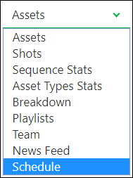

On top of the schedule, you can define the start date (1), and the end date (2). 
Click on the box to open the calendar and pick a date.
You can add your global man-days as on your quote.

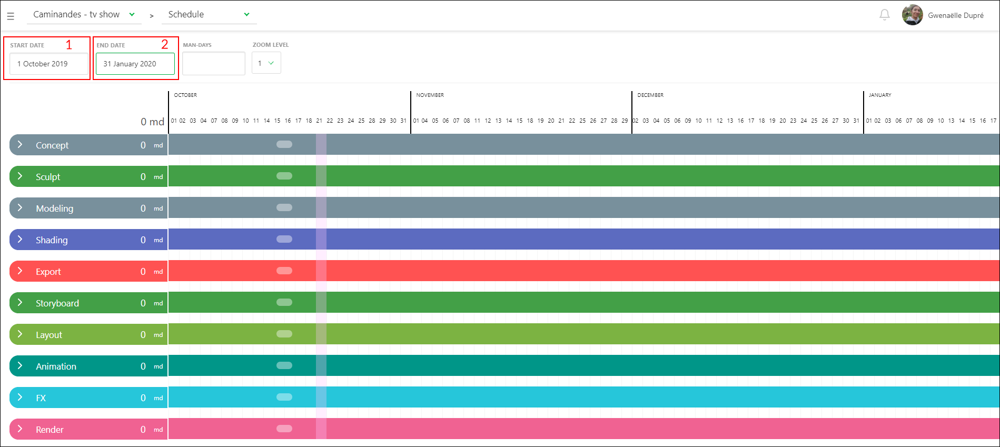

You can define, on the Gantt Schedule, the start and end date of each task type. 
The task types are the ones you have already added to your production.

Put your cursor on the start date; the cursor changes as a double arrow. Then drag and slide the start date.
Do the same for the end date. 

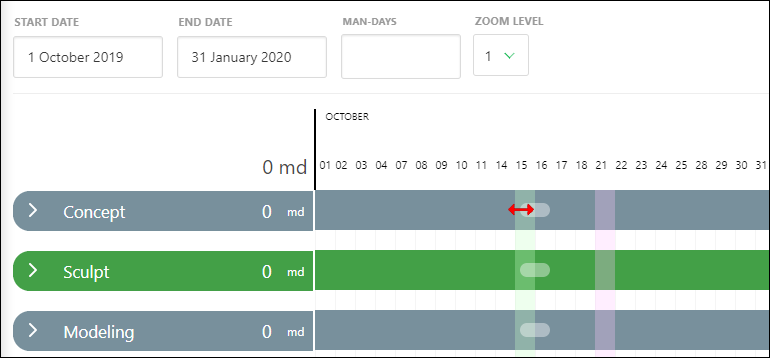

Once you have defined all the start and end dates of the task types, your schedule should look like the example.

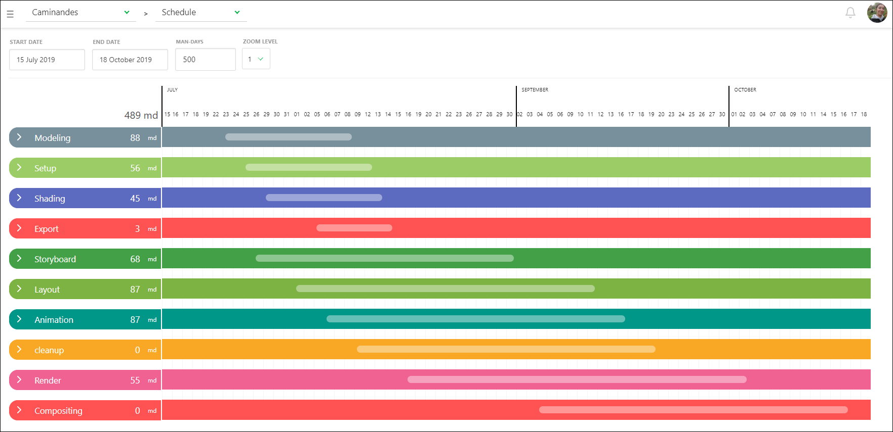

Once it's done, you can unfold each task type and access to a level of detail: asset type for the assets, 
sequences for the shots.

You can set the start and end date the same way than for the task type. You can define the work period for all the asset types.

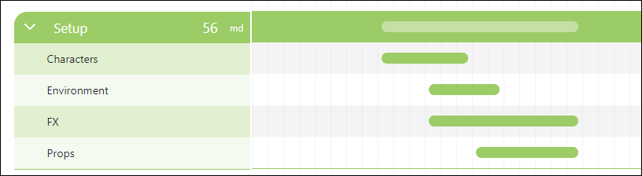

You can do the same for the shots task types. You can determine the start and end date for the sequences.

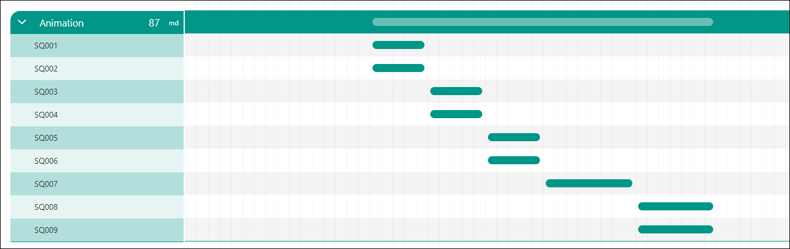

You can add a milestone by hovering a date. A  appears, 

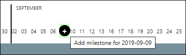

When you click, a pop-up window appears and asks you to add a name to the milestone.

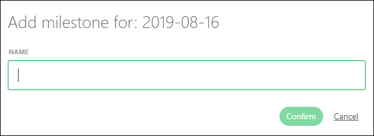

You can see a small black dot and a vertical line as a display of the milestone.
If you hoover the little black dot, the name of the milestone appears.

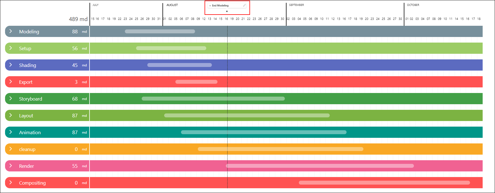

You can change the name of the milestone if you click on the , or anywhere on the milestone name.

From there on can rename the milestone or delete it.

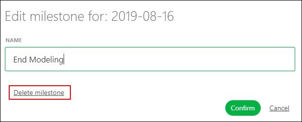

Everybody has access to this page, but only the **Studio Manager** can modify it.

## Task Type Schedule

If you need more details than in the production schedule, you can go to the **Task Type** page.

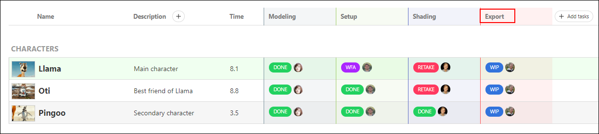

You can notice there are two tabs on the page, Tasks and **Schedule**. Click on the 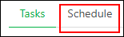 

There is two ways to set the artist schedule.

The first way is with the **Tasks** tab, by setting the estimation time and the **Start date**. The Grantt diagram is filled automatically.

Then you are only allowed on the **Schedule** Tab to slide the bar, to change the **Start date** and **Due date**.

**Once the estimation is set from the Tasks tab, you can't change is on the schedule tab**.

The second way is to set directly the lenght (**Estimation**), **Start date** and the **Due Date** from the Gantt diagram. 

Put your cursor on the start date, and the cursor changes as a double arrow. Then drag and slide the start date.
Do the same for the end date. 

You can use the search bar (1) as on the other pages: you can search **status** 
(no need to add the name of the task type as you already are on a specific task type page), 
per **asset type** (or sequence), per **asset name** (or shot name), and per **CG Artist name**.

You can also reduce or expand each CG Artist (2) section, to ease the reading of the schedule.

And you can change the color of the bar in the Gantt diagram (3). Per default, the **coloring** is set in Neutral.

Per dfault the color of the bar is set on **Status color**, but you can change it.

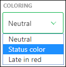

**Status color** changes the color of the bar based on their status. For example Blue is for WIP, red is for RETAKE, 
purple for Waiting For Approval, green is for Done.

In a glimpse, you can see the state of your elements and team.

**Late in red** display the bar that is not validated yet, but they are behind schedule.

The Gantt diagram has an impact on the other pages on Kistu.

The **Start date** and the **Due date** is displayed on the **Tasks** tab of the task type page.

But you can also see the **Due date** on the **Todo Page** of a CG Artist.

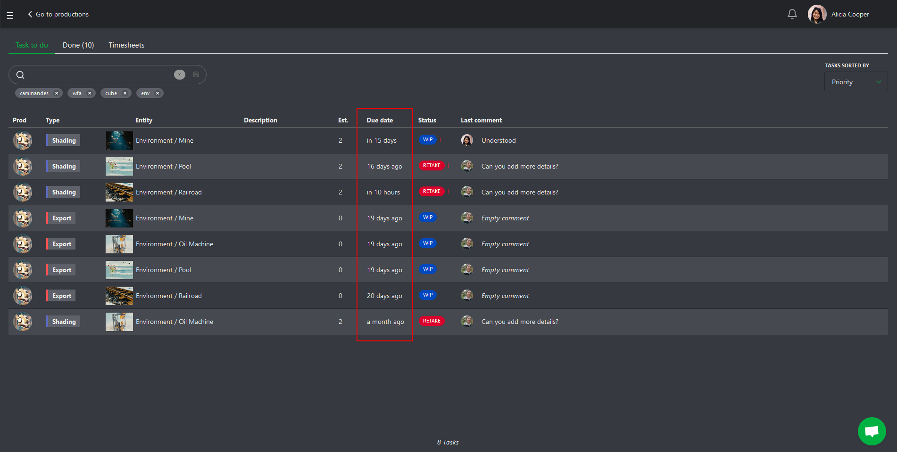

Everybody has access to this page, but only the **Studio Manager** can modify it.

## Main Schedule

As a production manager, you have access to the Studio Schedule.
The schedules of all the production are in one place, and help you to prepare your productions better.

Go to the main menu (  ) and click on **Main Schedule** under the **Studio** section.

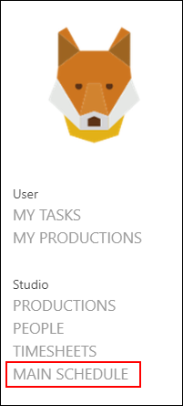

You see all your production in one line (start and end date of the production).
You can also have a total of the main-day you have planned to use during this timeframe.
You can also see the **milestones** that you have defined for each production.

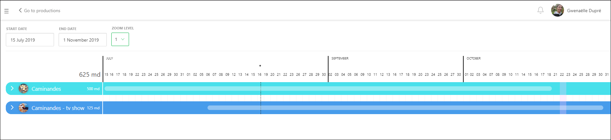

You can unfold each production to see the detail of each task type.
The color is the same as the column on the global pages.

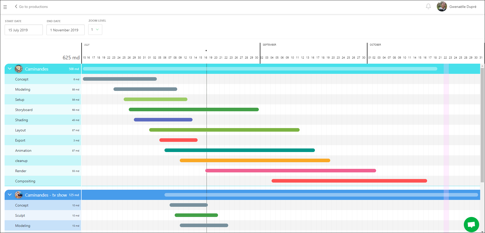

**An important thing to keep in mind**: you can't modify your production schedule from this page. You have to go back to the production schedule page you want to adjust to doing it.

Only the **Studio Manager** has access to this page.

## Quotas stat

Kitsu grabs the number of frames (or seconds) validated per day/week/month per CG Artist.

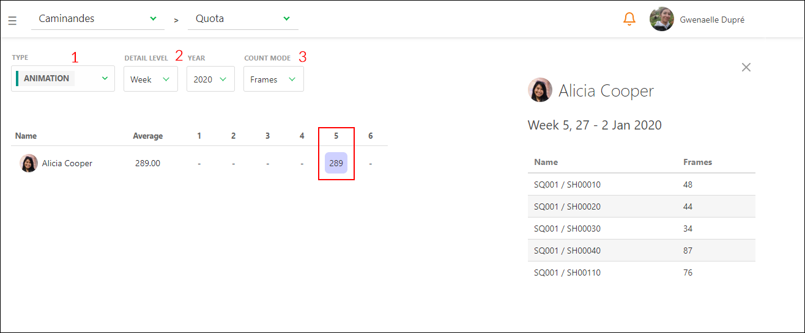

**1**: Select the Task Type

**2**: Select the level of details, Day, Week or Month

**3**: Select the count mode, per Frames or per Seconds.

At any time, you can click on a number and see its detail on the right pannel.
