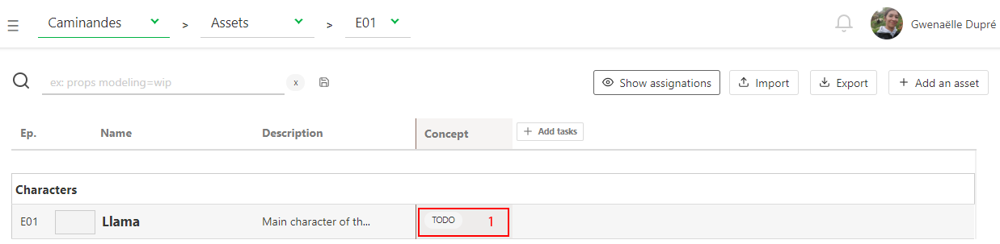
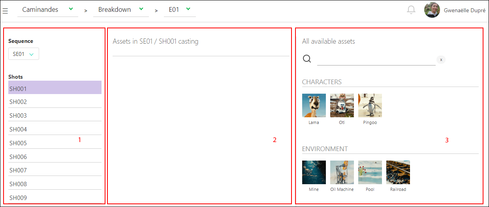
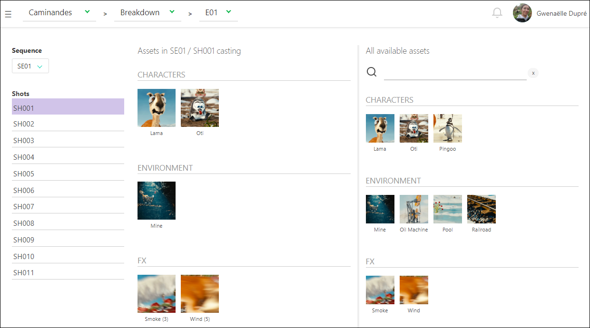
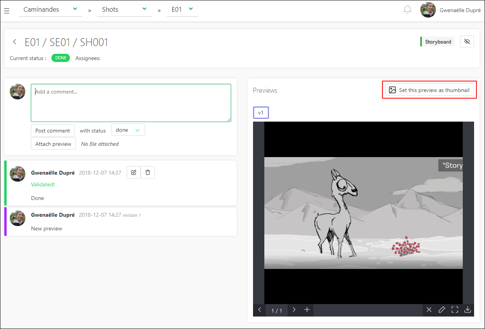
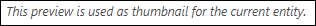

# Getting started as a Production Manager

## Create your first production

The first step on Kitsu is to create a production. Click on the **Create a new
production** button.  

Enter the name of your production, choose **TV Show** if you need more than one episode.
Then validate by clicking on **Confirm**.

To navigate through Kitsu sections you need to use the sidebar. It can be 
accessed through the 3 lines button on top of the screen 
.  It will open a menu on
the left part of the screen. We want to see the production list. 
So in below **Studio** section, click on the **PRODUCTIONS** button. 

There, you can see all the productions you have created, their type and their status (open
for an active production, or closed if not active). When you cursor is above a
production line you can see 2 news icons on the right part of the line :
**edit**  and **delete**
.

To modify a production go into the **Edit production** page. 

You can add some specific information as the **FPS** (Frames per second), 
the **Ratio** and the **Resolution** of the picture.

NB: The  default avatar for a production is the first letter displayed on a
colored background. You can change with a picture if you want.

## Create some assets

So, now you have the first script for your production. It's time to do the
breakdown and the creation of the assets. It will allow you to list your assets, 
dispatch the work to the CG artists, and follow the progress of each related
tasks.

Let's begin with the asset page, you can access it via the drop down menu on top of the page 

.

On the asset page click on **Add assets**.

A pop-up window opens:
 
It asks you to choose the asset **Type** (1): Camera, Characters, Environment,
FX, Props, etc.  
Let's start with an environment. You will then select the **Episode** (2), or the main pack (**All**).
We will give it a **Name** (3), and enter a
description that will help the designer to know what to do, and later to
indentify easily the asset.
If you have multiple assets to create, click on **Confirm and stay**. You
can change the asset type, and keep adding assets. 

You will see the newly created asset appearing on the background everytime your
click on **Confirm and stay**. After you added your last asset, click
on **Confirm**, it will save the asset and close the window. If you don't have
more asset to add, click on **Close**, it will cancel the window.

For now the assets are linked with the first episode, or with the main pack.

You can edit assets by going to the asset page, hovering the
asset you want to modify, and then click on the **edit** button 
 (1) on the right side of
the line.  

On the main asset page, to extend the description, click on the first words
(2), and a pop-up will open with the full description.

And now we can create tasks for the assets (3), like **Concept**, **Modeling**,
**Texture**, **Setup**, and other if needed.

Click on the **+ Add tasks** (3) on top of the spreadsheet, a new window will
open and on the list under **Type** you can choose the task you need to add,
validate it by **Confirm** button.

These tasks will be added to all the assets.

If some assets don't match the task (as environment and setup) just change the
status of this task on , or delete it.

To change a status click directly on the status you want to change (1).

A new page is opened, and here you can change a status and add a comment to
explain the status change (1). Choose a new status for the task (2). Then, 
click on the **Post status** button (3).  

If you want to delete a task, click on the **delete** button 
 on the right top
of the page.

Now that we have created all the assets and related tasks, we can now add the
artists to the team and assign tasks to them.

## Add a CG Artist to the team

An account is required for each artist. Go to drop down menu , and under the **Studio**
section, choose **PEOPLE** page.

Then, click on the **+ Add a new employee** button. 

A creation window opens. You can enter the first (1) and last name (2), the email
(which is **mandatory** to create the account) (3), the phone number (4) and
define the role of the employee : **CG artist**, **Supervisor**,
**Administrator** or **Client** (5).  If the artist is working right now keep
him as active, otherwise select no. Validate by clicking **Confirm** button.

See the [permissions](../permissions/README.md) section for more information. 
To make it short, CG artists, supervisors and clients will only see the
productions they are assigned to.

All the people are now part of your studio. They will be added to a specific
production when you will assign them to a task on a production. Otherwise they
won't have access to anything.

You can also add someone to a production without assign him a task.

On the drop down menu on the top of the page select the **TEAM** page.

 

On the **Team** page you can see all the assignations for a specific project.
If you want to check another project team you will need to switch the project
on the top of the page.

You can also add someone to a production without assigning him to a task, you
can select his name on the search box (or type his name), and validate with
**add**.

## Assign tasks to a CG artist

We can now get back to the **ASSETS** page via drop down menu

.

Now its time to do your first assignment! 

Click on the empty space on the right of the status (1) you want to assign.

A new blue line on top of the screen appears. 

You can now do the assignation. Click on the text input and you will see
the list of available people. Click on a person name to perform to select
him. Then click on the confirmation button to perform the assignation.

You can assign several tasks to the same person in one step (1). Once you have
the blue menu visible, just keep **ctrl** on your keyboard pressed and select
multiple tasks. You can even use the **shift** key to select a range of tasks
(2). When you have selected everything you need, apply with the **Confirm**
button.  

In the same way, you can click on **Clear assignations** to remove all 
assignations..

When you're done with all the assignations quit this mode using the **Clear
current selection** button .

Now you can see next to each status the avatar of the CG artist.

To unclutter the list, you can hide this information with the **Hide
assignations** button on the top of the spreadsheet .

Once you assigned someone, he will be added to the production team. Depending
of his position (CG Artist, Supervisor) he will only see the production where
he's assigned. 

Now, everybody know what to do, and who is doing what!

## Create sequences and shots

It's time to do the breakdown of the storyboard. Meaning you can create
the sequences and the shots of the episode and associate assets to them.

You need to go to the **Shots** page: you can use the
drop down menu and click on the **SHOTS**.

 

To start with the shot creation click on the **Add shots** button.

A new pop up will open, as for the creation of the assets.
You can now create the episodes, the sequences and shots.

Enter the first episode using your own code name, for example e01, then click
on the **add** button (1).  Do the same for the sequence, for example sq01,
then **add** (2), and now the shots : sh001, then again **add** (3).

You can now see that new shots are listed, described by their episode and
sequence.
You have created the first shot of the first sequence of the first episode.

Now let's add more shots! As you can see the box is already filled with your name
code but incremented, so you just have to continue to click on **add** to
create more shots.

You have to do the same with the sequences and episodes.

If a shot is misplaced on a sequence, you just have to edit the shot you want
, and change the
sequence. 

If at some point you need to delete a shot, just click on the **trash can**
icon on the right of the line . 
If you need to import back this shot, click on the restore button 
.

We can now associate tasks to the shots. Same way than for the assets, click on
the **+Add tasks** button 
on the top of the spreadsheet. 

A new pop-up will open and let you choose what task you want to add. All the
shots will be linked to the tasks.

Now we can do the breakdown of the storyboard, meaning associate the assets to
each shot. 

## Create a breakdown list

Fill the breakdown will help you for the assembly of the shots. With the
breakdown you have all the details of the assets you need to add to create your
shot. We will be sure to omit nothing.

On the drop down menu choose **BREAKDOWN**.

On the left part of the breakdown page is the episode/sequence/shot menu (1),
you can choose between the ones you have created. They are, the right part of
the screen, all the assets available created for this production (3). And on
the middle part it will be your selection for the shot (2).

So now you have to select the shot you want to cast, let's say the first one. 
Click on the shot sh001 on the left part (1), then click on the assets you want
to assign: characters, backgrounds, etc. from the right part (3). 

When you pass over the asset you can see a **+1** or **+10**. It's the number
of time you will add this asset. You can click as many times as you need on it.

You can now see the asset appearing on the middle part of the screen (2). Next
to the name of the asset is the number of  time it has been added. On this
example we have added 2 times the character asset Paul.

If you add twice an asset by mistake, you just have to go on the middle part of
the screen, on your selection of assets for this shot (2). From there click on
**-1**.  When you are done for this shot go on with the other shots. 
Your selection is automatically saved

If a new asset is created during the storyboard, just get back to the asset
page (using the drop down menu), create the assets you
need. The tasks previously created will be applied immediately to these new
assets. But you will have to do the assignation, then you will be good to
continue with the breakdown.

Now your **Breakdown** page should look like this.

We can now assign people on the shots tasks. If the animation and so are done
elsewhere, you can create an account for this studio and assign it to tasks.
They will be able to see your progress.

If you want to see a detail of a shot, click on its name. 

A new page will open with the list of the tasks, the assignation, and the list
of assets that will appear on this shot (**Shot casting**).
 

 

## Add the Frameranges

At this stage of the production, the animatic should be done. Meaning you have
the length (**framerange In** and **framerange Out**) for each shot. You can
add this information on the spreadsheet.  This way you will be sure that all
the frames will be calculated and none will be missing, or over computed.

You may also be able to add camera as assets!

You need to edit the shots to fill the framerange information. Click on the
edit button  on the right
side of the shot line.

On the new window you can enter the **In** and **Out** of the shot (1), you can
do it by hand or with the **+** and **-** buttons (2).  Save with the
**Confirm** button. 

Now the frameranges appear on the general spreadsheet of the shot page.

## Validation per batch

To do a validation (or changing the status of a task) you can click on the
status of the task (1). 

It will open a new page, and here you can post a comment (1) and change the
status (2), and validate the post and the new status with **Post status**
button (3).

Or you can do it per **batch**. 

We will use the same technique as for the assignation.

Click on the empty space on the right of the status/assignation on a task (1).

The blue menu on the top of the screen will appear. 

You can change its purpose by clicking on the 3 vertical dots on the left part
of the screen  , a
new menu will appear and there you can choose **Change status**.

You can now do your shots or assets selection, by pressing the **crtl** or
**shift** key (1) and then choose the new status for your selected tasks (2).
Validated the new status with the **Confirm** button (3).

## Change priorities

At some point on the production you may want to prioritized some tasks, and
pinpoint these urgent tasks to your team.

For this, we will use the same technique as before. Click on the empty space
near a status task (1). 

The blue menu will appear on the top of the screen. 

Click on the 3 dots menu button 
, and choose 
**Change priority**.

There are 4 levels of prioriy : **Normal**, that is the basic level of all the
tasks, **High**, **Very High**, or **Emergency**. Save the changes with the
**Confirm** button.

As we have done for the assignation or the status, select the shots (1), select
the level of priority (2), and apply with **Confirm** (3).

You can now see next to the status of the task some **exclamation marks**. The
more there are, the more urgent the task is.  

* (1) is **Normal**, 
* (2) is **High**,
* (3) is **Very High**
* (4) is for **Emergency**.
	

## Perform a review

When a CG arstist asks for a review  
you can go to the task page to see the result.  The CG artist may have send you
a picture, a movie or an `.obj` file. All can be reviewed from the browser.

Other files like `.pdf`, `.zip`, `.rar`, `.ma` or `.mb` but they need to be
downloaded to be reviewed.

From there you can change the status to  if you want that the CG artist
performs some changes. Or you can change it to , to notifiy the CG artist
that his work is validated.

You can also use the preview as a **thumbnail** on the asset or shot spreadsheet. It
will help to recognize the assets/shots on the main pages.  Below your preview,
click on the **Set this preview as thumbnail**. You can do this at each version 
of your work if needed.

Once you have clicked on the button a message appears instead to confirm the
modification.

