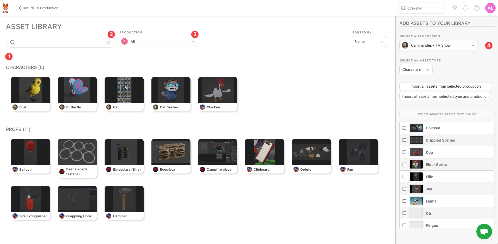
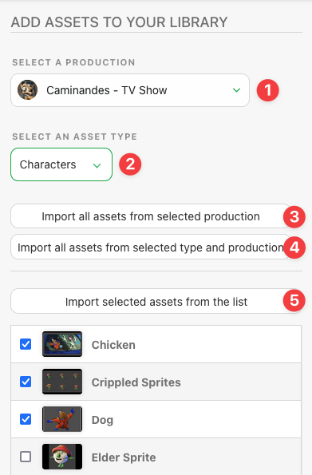

# Asset Library

## What is the Asset Library?

The Asset Library serves as a centralized repository for all assets used within Kitsu. Teams can import assets from any project into a shared library, making them accessible for future productions. With this functionality, assets like character models, props, environments, and more can be managed in one place and repurposed seamlessly in new projects.

## How to Use the Asset Library

- You can access the Asset Library from the **Studio** section of the main Kitsu menu.
- The main Asset Library window displays all assets currently available in the library (1). Use the search (2) and filter (3) options to quickly find specific assets within the library.
- On the right-hand pane (4), you’ll find the import option for bringing in assets from other productions into the Asset Library.

## Adding Assets to the Library

The right-hand pane is where you can add existing assets from other productions into the library. This action does not create a copy but simply references the original asset, allowing it to be used in other productions.

To import an asset:
- Select the production you wish to import the asset from (1).
- Choose the asset type you’d like to import (2).

There are three main ways to import assets:
- Import all assets from a specific production (3).
- Import assets by type from the selected production (4).
- Select individual assets for import (5).

Once imported, the asset will be available for use in breakdowns for other productions, allowing for efficient asset reuse across projects.

::: tip
There are specific rules around who can import assets into the asset library, depending on the user’s permission group:

- **Studio Manager**: Can import any assets from any production.
- **Production Manager**: Can import assets only if they are part of the team.
- **Supervisor** and **Artist**: Cannot import assets into the library.
:::
