# Breakdown & Casting

## Create a Breakdown List

Filling out the breakdown helps you with the assembly of the shots. With the
breakdown, you have all the details of the assets you need to add to create your
shot, and we are sure to omit nothing.

On the dropdown menu, choose **BREAKDOWN**.

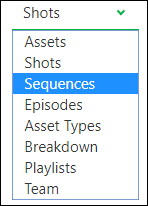

On the left of the breakdown page is the episode/sequence/shot menu (1); you can choose between those you created. They are the right part of
the screen; all the assets created are available for this production (main pack and episodes) (3). Moreover, in
the middle section, it is your selection for the shot (2).

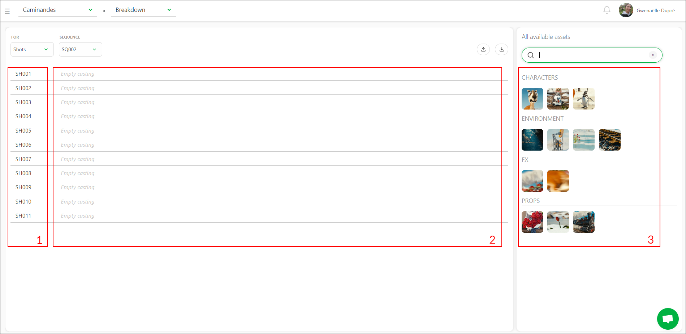

So now you have to select the shot you want to cast.

You can display the assets as text if you don't have thumbnails yet or enlarge the
thumbnails size.

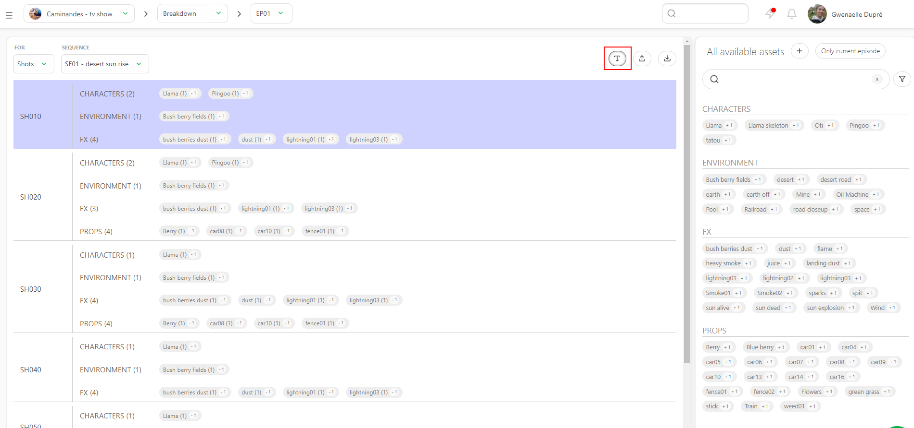

You may also realize an asset needs to be added to the list during your breakdown.

You can create a new asset directly from the breakdown page. Click the **+** on the right of the **All available assets**.

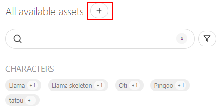

You can also choose multiple shots at once. Click on the first shot, hold the **shift** key, and click on the last shot of your selection.

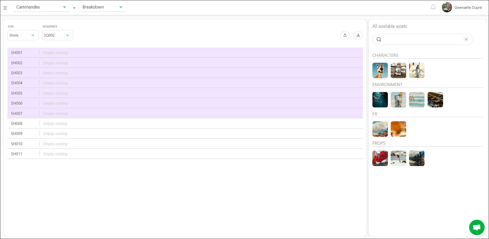

Then click on the assets you want
to assign: characters, backgrounds, ... from the right part (3).
If you have selected multiple shots, your selection is applied to the numerous shots.

Copy a shot filled with assets and paste this asset selection into another shot.

You can see a **+1** or **+10** when you pass over the asset. It's the number
of times you add this asset, and you can click on it as many times as you need.

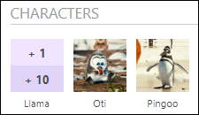

You can also link all your assets to episodes on a TV show without specifying a sequence or shot.

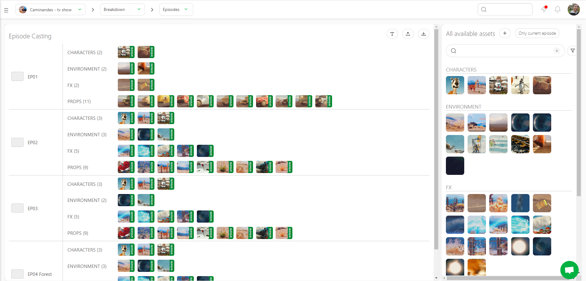

This way, you can link all your assets to one or several episodes before the storyboard/animatic stage.

You can now see the asset in the middle of the screen (2). Next
to the asset's name is the number of times it has been added. In this
example, we have added the character asset Llama two times.

If you add an asset twice by mistake, you must go to the screen's middle part to select assets for this shot (2). From there, click on
**-1**. When you finish this shot, go on with the other shots.
Your selection is automatically saved.

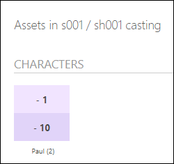

If a new asset is created during the storyboard, return to the asset
page (using the dropdown menu) and create the needed assets. The tasks previously created are applied immediately to these new
assets. However, you have to do the assignment, and then you can
continue with the breakdown.

Now, your **Breakdown** page should look like this.

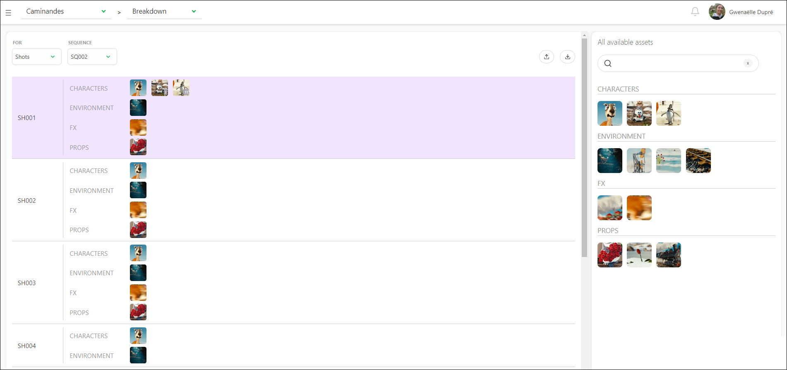

You can also make a breakdown list for your assets if you need to assemble them and keep track of the separate parts.

On the top left corner of the screen, choose **asset** in the dropdown menu below **FOR**.

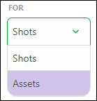

You can now access a second dropdown menu to choose your asset type: **Character**, **Environment**, **Props**, **FX**, ...

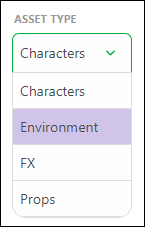

You can complete the asset breakdown page the same way you did the shots. First, select one or more assets on the left part and then add the right part's elements.

::: details Create a Breakdown List from a CSV File

You may already have your breakdown list ready in a spreadsheet file. With Kitsu, you have two ways to import it: the first is to import a .csv file directly, and the second is to copy-paste your data directly into Kitsu.

First, save your spreadsheet as a `.csv` file following Kitsu's recommendation.

Click on the **import** button 

A pop-up window **Import data from a CSV** opens. Click on **Browse** to pick your `.csv` file.

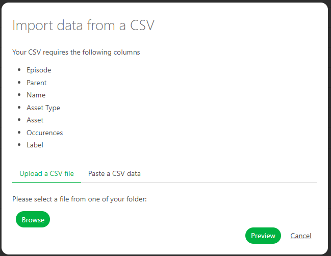

To see the result, click on the **Preview** button.

You can check and adjust the name of the columns by previewing your data.

NB: the **Episode** column is only mandatory for a **TV Show** production.

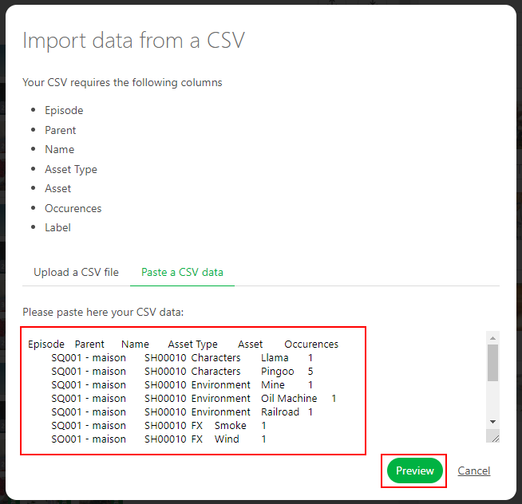

Once everything is good, click the **Confirm** button to import your data into Kitsu.

Now, you have your breakdown imported into Kitsu.

:::

::: details Create a Breakdown List by Copying / Pasting a Spreadsheet File

Open your spreadsheet, select your data, and copy them.

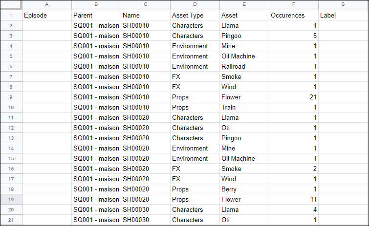

Then, go back to the breakdown page on Kitsu and click on the **Import** icon
.

A pop-up window **Import data from a CSV** opens; click on the **Paste a CSV data** tab.

 
You can paste your previously selected data and see the result with the **Preview** button.
 

 
You can check and adjust the name of the columns by previewing your data.
 
NB: the **Episode** column is only mandatory for a **TV Show** production.
 

Once everything is good, click on the **Confirm** button to import your data into Kitsu.

Now, all your assets have been imported into Kitsu.

:::

## Introduction to Asset State: Ready For

Most of the time, you don't need to wait for an asset's tasks to be approved to use it on a shot task.

For example, when an asset is approved at the **Concept** stage, it can be used for the **Storyboard** stage.
Then, when it's approved at the **Modeling** stage, you can use it for the **Layout** stage and so on.

That's exactly what the asset state **Ready For** is doing: it lets you know the state of an asset's tasks and compares its usability for the shot tasks.

Now that we have filled out our breakdown, we know exactly which asset is used on every shot.

First, we need to define an asset's state relative to its task status. You can modify the **Ready for** by clicking on a cell. You will see a dropdown menu with the shot task.

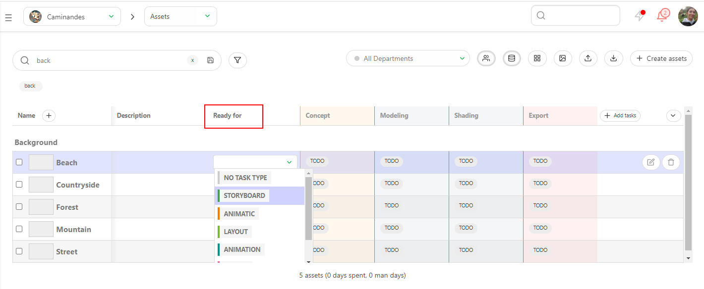

::: tip
You can use the **automations** to do the heavy lifting.

You can set automation with the **ready for** trigger.
:::

We can see the result in the shot page now that we have changed some asset states **Ready for**.

You can notice that some white boxes are now **Green**: all the assets cast in this shot are ready for this specific task.

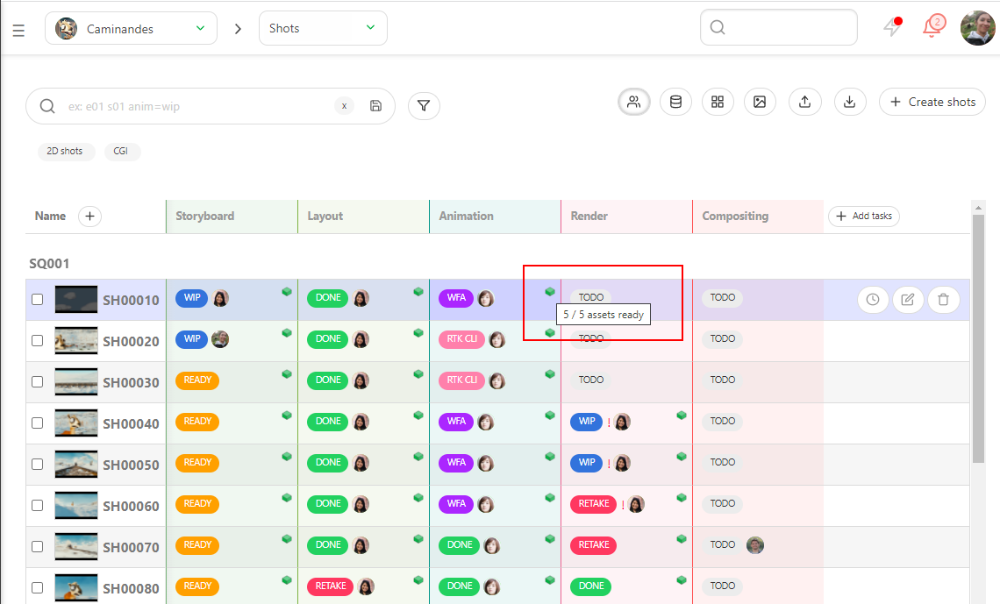

If you see the white box, Kitsu will display how many assets are ready for this task.

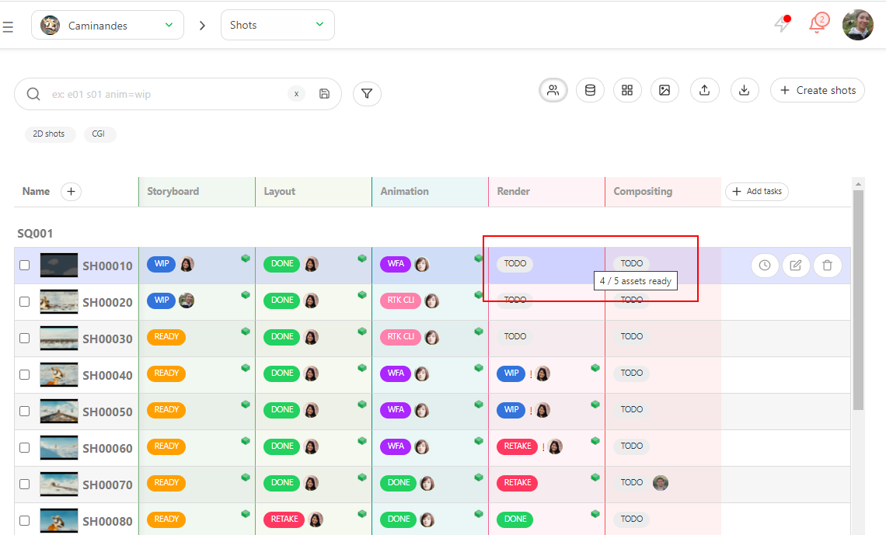

::: tip
If you don't see any boxes, no assets are cast for this shot.
:::
 
Then, you can click on the shot's name to go to its detail page.
Then, you will see all the assets cast in this shot and their status.

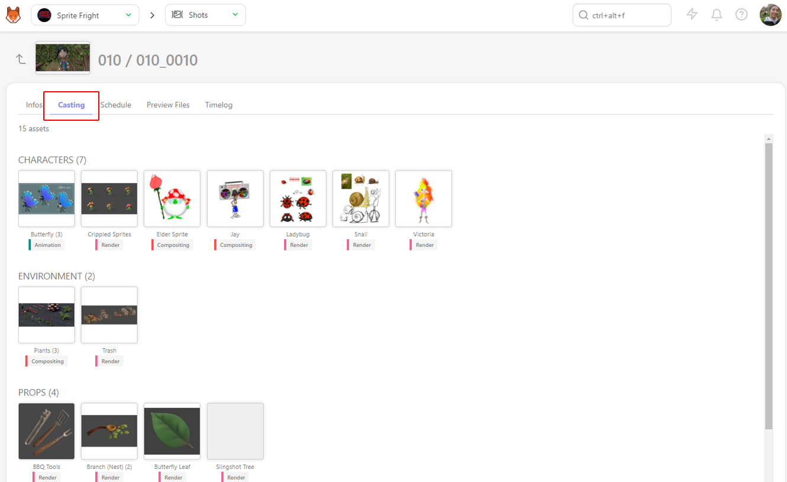

It's the fastest way to know if you can start a shot for a specific task.

## Casting from the Asset Library

It is also possible to cast assets from the global **Asset Library** into your production. This allows you to cast an already existing asset, without the need to re-create it for each production.

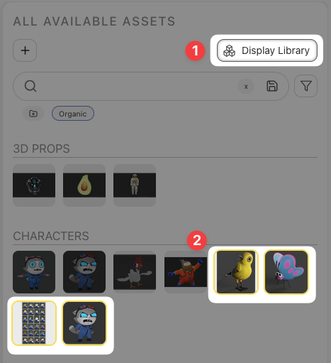

To see assets outside of your production from the asset library, click the **Display Library** Button (1)

Assets from the global asset library will appear, and will be highlighted with a yellow boarder (2). They can then be cast in your breakdown exactly the same as other assets.

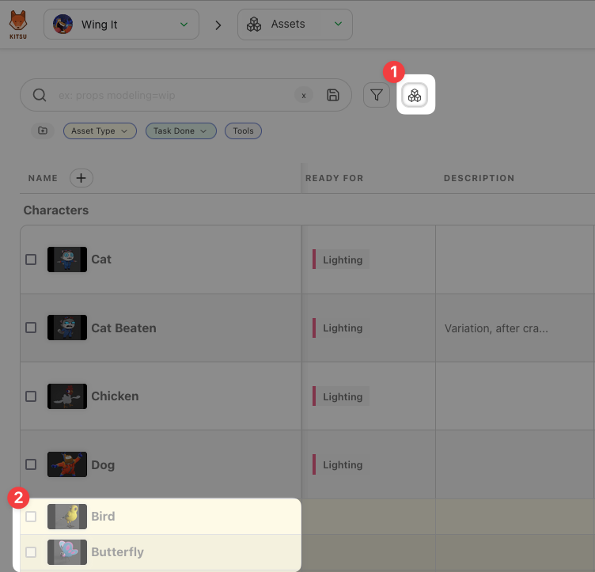

Back on your productions asset page, you can choose to display global assets that have been cast in your production by toggling the **Display Library** button (1). These assets will be highlighted in yellow, indicating that they originate from the global asset library, and not your current production. (2).
