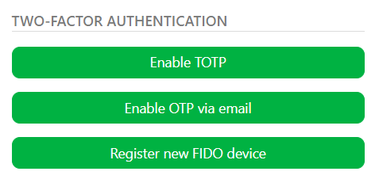

# Authentication

## Two-Factor Authentication

### Add Additional Security to Your Studio

**Two-Factor Authentication** provides an additional layer for security for users logging in to Kitsu. It can be enabled on a per-user basis, so you can decide for which users it is enforced.

To enable this, click on their avatar at the top right of the screen, then select **Profile**.
At the bottom of the page, they will find various **Two-Factor Authentication** options.

### Available Two-Factor Authentication Methods
- **TOTP**: This lets you use a Two-Factors Authentication app as a secondary password for your account. Selecting this option will present you with a QR, that once scanned into your 2FA app of choice, will prompt you for a one-time code each time you login.
- **OTP Via Email** Similar to TOTP, but instead of using an app the 2FA code is sent to your email address
- **FIDO Device** A FIDO device refers to a hardware security key that supports the FIDO (Fast IDentity Online) standard for two-factor authentication (2FA). If you own one of these devices, you can input it's name here to be used for Two-Factor-Authentication

