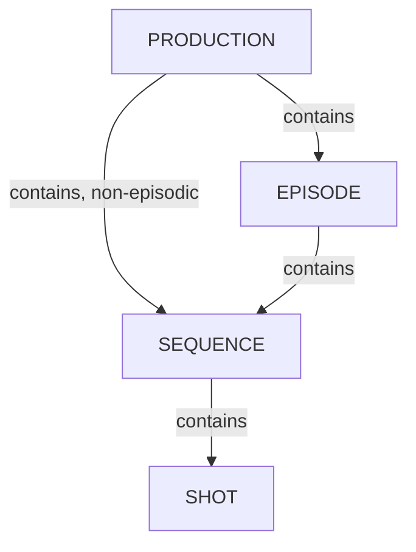

# Production Structure

Kitsu's data model organizes work around a hierarchy of production entities (studio → production → episode/sequence/shot, or → asset) crossed with a task-tracking system (task type, task status, department).

## Table of Content

1. [Manage Studio Labels](/guides/production-structure/manage-studios/) - Create and organize the studio labels used to identify which studio is responsible for each task.
1. [Manage Productions](/guides/production-structure/manage-productions/) - Create, configure, and organize the productions (projects) tracked in Kitsu.
1. [Manage Episodes](/guides/production-structure/manage-episodes/) - Add, edit, and organize episodes within a production.
1. [Manage Sequences](/guides/production-structure/manage-sequences/) - Add, edit, and organize sequences within a production or episode.
1. [Manage Shots](/guides/production-structure/manage-shots/) - Add, edit, and organize the shots that make up a sequence.

## Data Model

- **Studio** - The top-level organization. A studio runs one or more productions and defines its own departments.
- **Department** - A functional group within a studio (e.g. Modeling, Animation, Lighting, Compositing). Departments group related task types.
- **Production** - A project (film, series, game, etc.) managed by the studio. Productions contain episodes (if episodic), sequences, shots, and assets.
- **Episode** - A subdivision of a production, used for series-style projects. Optional for feature-style productions.
- **Sequence** - A subdivision of an episode (or directly of a production for non-episodic work), grouping related shots.
- **Shot** - A unit of filmed/animated action within a sequence; the main container for shot-based tasks.