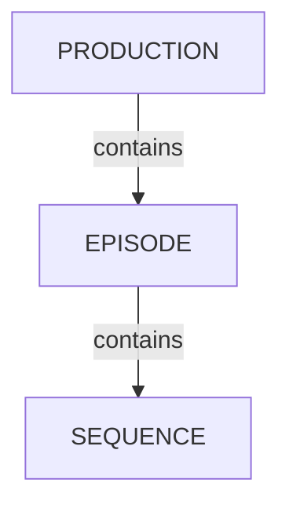

# Managing Episodes

<iframe width="560" height="315" src="https://www.youtube.com/embed/I-9QC6w2VOQ?si=ZUclg5iIPqMvUFK0" title="YouTube video player" frameborder="0" allow="accelerometer; autoplay; clipboard-write; encrypted-media; gyroscope; picture-in-picture; web-share" referrerpolicy="strict-origin-when-cross-origin" allowfullscreen></iframe>

<!-- #region body -->

TV Show productions have access to Episode containers to organize sequences and shots.

## Episodes Overview

In your production menu, click `Episodes`:

You'll then reach the Episodes page with a full list of episodes for the current production:

If you click on an episode name, you'll reach the detail page.

## Create Episodes

<!-- #region setup -->

In the `Episodes` page, click `New episode` in the top right corner:

A modal appears. Fill the form and click `Confirm`:

- **Name**: the episode name
- **Status**: the production status of the episode (canceled, complete, running, standby)
- **Description**: a short description of what the episode is about
- **Resolution**: the episode resolution e.g "1920x1080", "4K", etc.

::: info
You can also create episodes from the global shot page.
:::

<!-- #endregion setup -->

## Update Episodes

Hover over the episode row you wish to edit in the list and click the `Edit` icon:  

## Episode Task Types

Episodes can have their own tasks, which is useful for work that covers a whole episode rather than a single sequence or shot: editing, conform, animatic, sound mix, delivery, etc.

For a task type to be available on episodes, it must be created with `Episode` as its entity type. 

In the main menu, go to `Task Types`, then click `Add task type`:

- **Name**: the task type name e.g "Edit", "Conform", "Delivery"
- **For entity type**: select `Episode`
- **Color**: the color used for the task type in the interface
- **Priority**: the position of the task type column in the lists

Once the task type exists, add it to your production: go to the production settings and select it in the task types list.

The Episodes page then displays one column per episode task type, with the status of each task.

Click a task cell to open the task panel, where you can change the status, assign artists, publish previews, and add comments, exactly like a shot or asset task.

::: info
Episode task types are only available in TV Show productions, since other production types have no episode container.
:::

## Delete Episodes

Hover over the episode row you wish to remove in the list and click the `Delete` icon:  

::: warning
Deleting an episode will remove the corresponding sequences, shots, and tasks. You cannot retrieve them back.
:::

<!-- #endregion body -->
