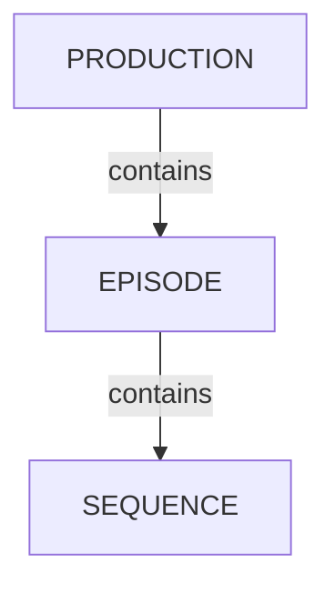

# Managing Episodes

<!-- #region body -->

TV Show productions have access to Episode containers to organize sequences and shots.

## Episodes Overview

In your production menu, click `Episodes`:

You'll then reach the Episodes page with a full list of episodes for the current production:

## Create Episodes

<!-- #region setup -->

In the `Episodes` page, click `New episode` in the top right corner:

A modal appears. Fill the form and click `Confirm`:

- **Name**: the episode name
- **Status**: the production status of the episode (canceled, complete, running, standby)
- **Description**: a short description of what the episode is about
- **Resolution**: the episode resolution e.g "1920x1080", "4K", etc.

<!-- #endregion setup -->

## Update Episodes

Hover over the episode row you wish to edit in the list and click the `Edit` icon:  

## Delete Episodes

Hover over the episode row you wish to remove in the list and click the `Delete` icon:  

<!-- #endregion body -->