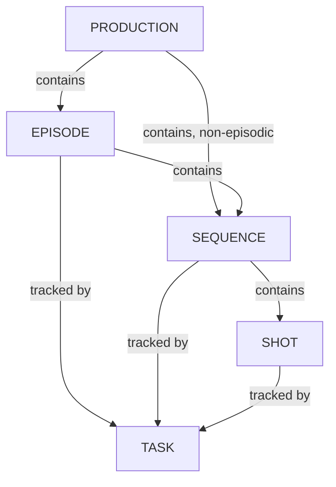

# Managing Sequences

<iframe width="560" height="315" src="https://www.youtube.com/embed/Y5Fx6jlgQok?si=8WzQxoSdRSQ3nIwZ" title="YouTube video player" frameborder="0" allow="accelerometer; autoplay; clipboard-write; encrypted-media; gyroscope; picture-in-picture; web-share" referrerpolicy="strict-origin-when-cross-origin" allowfullscreen></iframe>

<!-- #region body -->

In Kitsu, you can also track tasks at the **Sequence** Level.

It's especially useful when you have macro tasks to track, like Story and color Board, Color Grading, etc.

Use the navigation menu to go to the **Sequences** page:

You can access all the sequences in one go or per episode if your production is a TV show:

You can assign tasks, do reviews, change status, add a metadata column, fill in the description, etc.

If you click on the name of a sequence, you will see the detail page of this sequence.

On the detailed page, you have access to the sequence casting to see all the assets used in the whole sequence.

You can also access the schedule, Preview Files, Activity, and Timelog of the sequence **tasks**.

## Create a Sequence

<!-- #region setup -->

You can create a sequence with the **+ New Sequence** button.

::: tip
You can create a sequence directly from here (+New sequence button) or create a sequence linked to your shots from the global shot page.
:::

<!-- #endregion setup -->

## Update a Sequence

Hover over the sequence row you wish to edit in the list and click the `Edit` icon:  

## Delete a Sequence

Hover over the sequence row you wish to remove in the list and click the `Delete` icon:  

<!-- #endregion body -->
