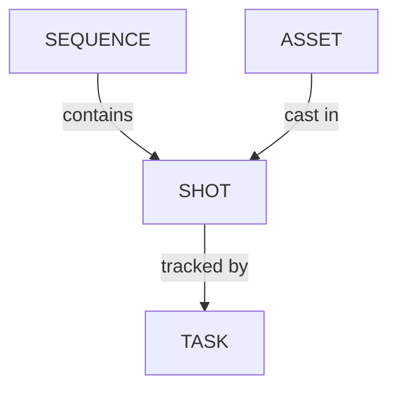

# Managing Shots

<!-- #region body -->

::: warning
Shots are linked to Sequences in Kitsu.
You must create a sequence first to populate it with shots.
:::

## Create a Shot

<!-- #region setup -->

It's time to create **shots** for your production.

You need to go to the **Shots** page: you can use the
dropdown menu and click on the **SHOTS**.

Click on the **Add shots** button to start with the shot creation.

::: warning
When you create a shot, the task workflow you have designed will be applied, and all the tasks will be created at the same time as the shot.
:::

A new pop-up opens for the creation of the shots. You can now add sequences and corresponding shots:

Enter the first sequence, for instance, SQ01, then click `add`. 

To add shots to this sequence, select it and type a name in the input field of the shots column (e.g SH0020), then again click `add`. 

::: tip
You can also define padding for your shots instead of doing it manually. 

If you want to name your shots ten on ten as SH0010, SH0020, SH0030, etc, set the **Shot Padding** to 10.
:::

You can now see that new shots are listed and linked by their sequence: you just created the first shot of the first sequence!

Now, let's add more shots. 

The input field already pre-writes an incremented name code based on your padding, so you just have to keep clicking on `add` to create more shots:

To add more sequences, go to the left part, type the name of your new sequence, and then click on `add`.

Your second sequence is selected, and you can now add shots.

> [!TIP]
> If a shot is misplaced on a sequence, you have to edit the shot in its dedicated Shot page to change the sequence. Look at the section `Update your shots` for more information.

<!-- #endregion setup -->

## Import Shots 

### From an EDL File

You may already have your shots list ready in an **EDL** file.
With Kitsu, you can directly import your **EDL** file to create the sequence, shot, number of frames, Frame in and out, and more.

On the **Global Shot Page**, you will see an **Import EDL** button.

You can select the naming convention of the video file used during the editing on the pop-up.

It means the video clip on the editing is named as project_sequence_shot.extension.

Here is an example of an EDL for the LGC production.

The video files are named  LGC_100-000.mov, which means LGC is the production name, 100 is the sequence name, and 000 is the shot name.

You can import the EDL file once you have the naming convention.

Then click on **Upload EDL**

Then Kitsu will create the shots.

### From a Spreadsheet File

You may already have your shots list ready in a spreadsheet file.
With Kitsu, you have two ways to import them: importing a `.csv` file directly, or copy-pasting your data directly into Kitsu.

#### Option 1: Import a CSV file

First, save your spreadsheet as a `.csv` file.

Then, return to the shot page on Kitsu and click the **Import** icon.

A pop-up window **Import data from a CSV** opens. Click on **Browse** to pick your `.csv` file.

#### Option 2: Copy / paste from a spreadsheet

Open your spreadsheet, select your data, and copy them.

Then, go back to the shot page on Kitsu and click on the **Import** icon.

A pop-up window **Import data from a CSV** opens; click on the **Paste a CSV data** tab.

You can paste your previously selected data.

#### Previewing and confirming your import

Whichever method you used, click on the **Preview** button to see the result.

You can check and adjust the name of the columns by previewing your data.

NB: the **Episode** column is only mandatory for a **TV Show** production.

Once everything is good, click the **Confirm** button to import your data into Kitsu.

All your shots are imported into Kitsu, and the task is created according to your **Settings**.

## See the Details of a Shot

<!-- #region view-shots -->

If you want to see the details of a shot, click on its name.

A new page opens with the list of the tasks, the assignation, and the status newsfeed on the right.
You can navigate through each by clicking on the name of the tabs.

You can click on the status of each task to open the comment panel and see the history of the comments and the different versions.

You can also access the **Casting**,

The **Schedule** is available if you have previously filled out the task type page data. If you have already filled out the data, you can modify them directly here.

the **Preview Files** uploaded at various task types,

And the **Timelog** if people have filled out their timesheet on the tasks of this asset.

<!-- #endregion view-shots -->

## Add More Tasks After Creating Shots

If you realize after creating the shots that a task is missing, you can still add it afterwards.

First, [make sure the missing task type is added](/guides/task-configuration/managing-task-types/) to the `Settings` page under the `Task Type` tab.

Then go back to the `Shots` page and click on `+ Add tasks`.

## Update Shots

You can update your shots at any point, change their names and sequences, modify their descriptions, and add any custom information you added to the global page.

You can edit shots by going to the shot page, hovering over the shot you want to modify, and then clicking on the **Edit** button:

To extend the description on the main shot page, click on the shot name, and a pop-up with the full description will open.

### From CSV

You can use the **CSV Import** to update your data in bulk.

Open your spreadsheet, copy your data, and paste it like in the `Import Shots From CSV` section.

The only difference is you need to switch on the **Option: Update existing data**.

The updated shots will apear in blue:
 
NB: the **Episode** column is only mandatory for a **TV Show** production.
 

## Add the number of Frames and Frame ranges to the shots

Once your animatic is done, you have the length (**number of frames**, **Frame range In**, and **Frame range Out**) for each shot. You can
add this information to the spreadsheet to make sure that all the frames are accounted for in your pipeline.

::: warning
If you have created your shots and sequence by hand, the **Frame** column will be hidden. You must edit at least one shot and fill in the number of frames to display the **Frame** column.

The column will be displayed if you have created your shots and imported the number of frames with a CSV/spreadsheet.
:::

You need to edit the shots to fill in the frame range information. Click on the `Edit` icon on the right side of the shot line:

You can enter the shots **Frame In** and **Frame Out** in the new window. Then, save by clicking the **Confirm** button.

Now, the frame range appears on the general spreadsheet of the shot page

::: tip
If you enter the **Frame In** and **Frame Out**, Kitsu automatically calculates the **Number of Frame**.
:::

Now that you have unlocked the **Frames**, **In**, and **Out** columns, you can edit the cells directly from the global shot page. Simply, click on the cell you want to edit:

Again, you can use the **CSV Import** to update your frame ranges faster.

## Access a Shot's Change History

You can also access the change history of your shots. 

Just click the `History` icon:

And a dialog will appear with a table listing all your changes:

## Remove Shots

Hover over the shot row you wish to remove in the list and click the `Delete` icon:

<!-- #endregion body -->