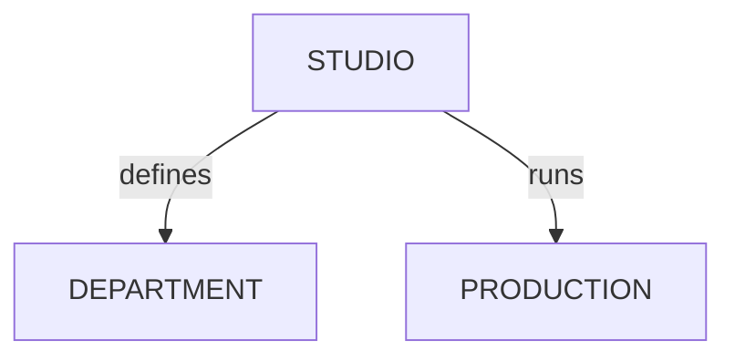

# Managing Studios

<!-- #region body -->

Go to `Main Menu > Admin > Studios` to reach the `Studios` page.

A studio is a label used to organize teams and tasks in multi-studio or multi-site productions.

You can use it to filter tasks, schedules, and teams per studio.

## Create a Studio

To create a new studio, click the `Add a studio` button:

It'll open a dialog to add a name for the studio and pick a color:  

Just click `Confirm` to save.

## Update a Studio

Hover over the studio row you wish to edit in the list and click the `Edit` icon:  

## Remove a Studio

Hover over the studio row you wish to remove in the list and click the `Delete` icon:  

<!-- #endregion body -->