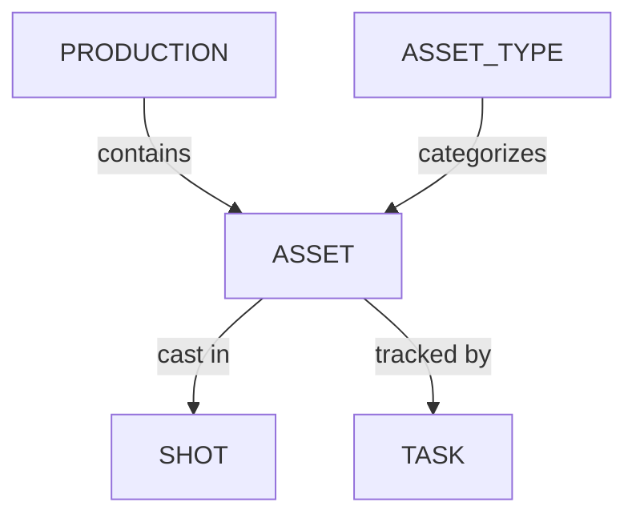

# Production

1. [Manage Concepts](/guides/production/manage-concepts/) - Learn how to create, organize, and validate concept art for your production.
2. [Manage Asset Types](/guides/production/managing-asset-types/) - Create and organize categories (like Characters, Props, or Environments) used to group and classify assets across a production.
3. [Manage Assets](/guides/production/manage-assets/) - Learn how to create, organize, and track the assets used throughout your production.
4. [Assign Tasks](/guides/production/assign-tasks/) - Learn how to assign tasks to people
5. [Find Assignments](/guides/production/find-assignments/) - Learn how to find tasks assigned to you
6. [Breakdown & Casting](/guides/production/breakdown-casting/) - Learn how to break down your scripts or storyboards and cast assets into shots.
7. [Meta-Columns](/guides/production/meta-column/) - Learn how to create and organize metadata from your production.
8. [3D Background](/guides/production/3d-background) - Improve 3D reviews with a .HDR background

## Data Model

- **Asset** - A reusable production element (character, prop, set, FX setup) that can be cast into one or more shots.
- **Asset Type** - A category for assets (e.g. Character, Prop, Environment, FX).