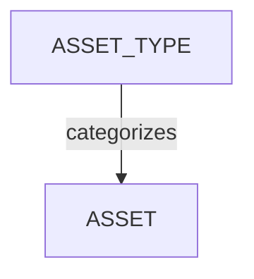

# Managing Asset Types

<!-- #region body -->

## Define Your Asset Workflow

After creating your global Workflow, you can define your **Asset Types**.

<!-- #region setup -->

Much like how shots can be organized by a sequence, an asset can be organised by it's **Asset Type**. Think of it as using folders to organize all your assets by category.

In the main menu, select the **Asset Types** page under the **Admin** section.

::: tip
By default, Kitsu provides some example asset types that can be used for a CGI production.
:::

To create new **Asset Type**, click on the `Add Asset Types` button in the top right corner.

Next, you will need to supply some information about your **Asset Type**, including:

- The name of the asset type
- A workflow for the specific asset type

Different Asset Types will have distinct workflows. For instance, you might have fewer tasks for an Environment compared to a Character, as Environment assets typically don't require Rigging tasks.

When you **create** or **edit** an **Asset Type**, you can add a specific **task type**; if you don't select a specific workflow for this asset type, your production asset workflow will be applied.

However, if you choose specific Task types for this Asset type, only these will be applied to production.

Click on **Confirm** to save your changes.

Your new **Asset Type** is now created in your **Global Library**. It will be available to use when you create your production.

::: tip
At any point during production, you can revisit this section to create additional **Asset Types** as necessary and add them into your workflow.
:::

<!-- #endregion setup -->

## Enabling Specific Asset Types for a Production

On the **Navigation Menu**, choose on the dropdown menu the **Setting**.

Per default, Kitsu will load the **Asset Types** you have defined when creating the production.

However, you can add or remove specific Asset Types if they are created on the Global Library first.

On the **Asset Types** tab, you can choose which **Asset Types** you want to add or remove on this production,
validate your choice with the **add** button.

## Update an Asset Type

Go to `Main Menu > Asset Types`:

Hover over the asset type row you wish to select then click the `Edit` icon:

## Remove an Asset Type

To remove an asset type from your studio's Global Library, go to `Main Menu > Asset Types` and hover over the asset type row you wish to select then click the `Delete` icon:

To remove an asset type from your production library, go to `Production Menu > Settings > Asset Types` and click the `Remove` button to remove the asset type from the list:  

<!-- #endregion body -->
