# Playlists

## Create a Playlist

A playlist is list of curated versions / previews compiled for review and approval. You can find the **Playlists** page in the drop-down menu.

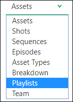

The **Playlist** page is separated into two parts:

- (1) A list of your playlists where you can **create** a news ones or load an existing one.
- (2) The last created playlists and the last modified playlists.

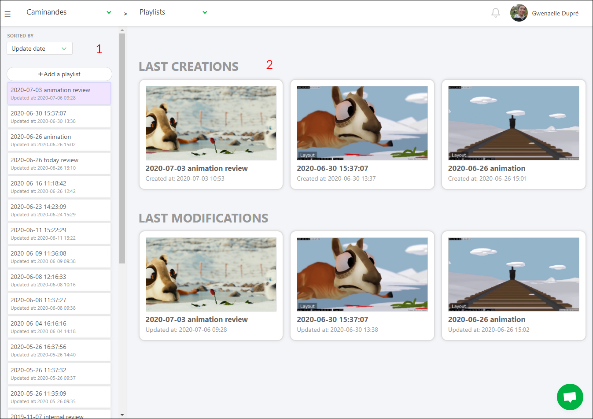

Start by creating a **Playlist** using the 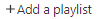 button. The playlist name defaults to the current date & time, but you can change this. You can choose if the playlist will be shared with the **studio** or the **client** and if it's a **shot** or **asset** playlist. You can also add a **Task Type** tag to the playlist.

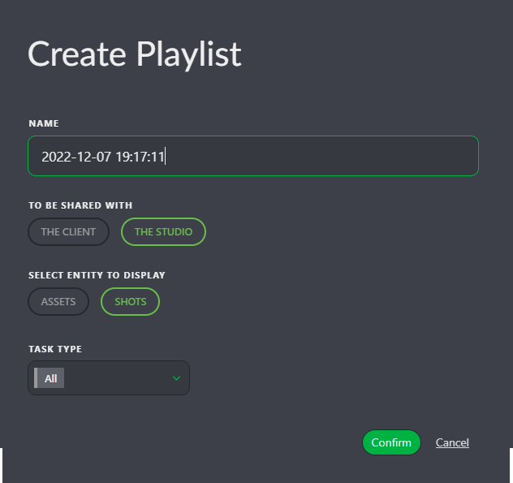

## Populating a Playlist

Once the playlist is created, use the search/filter bar to select which shots to add to your playlist.

You will also see options for adding the an **entire episode** / **entire sequence** if you want to add large chunks of the project at once.

You can select **Daily pending**, which will add all the **WFA** tasks of the day.

You can use the same **filters** as the global shot/asset page. For example, you can select all the **WFA** (short for "work for animation") tasks at the **Animation** stage by typing **animation=wfa** in the search bar. Validate your selection with the **Add selection** button. Kitsu will select the shots with the **WFA** status at the **Animation** stage and automatically load the **latest uploaded version**.

The shots appear in the top part of the screen. Every change is automatically saved.

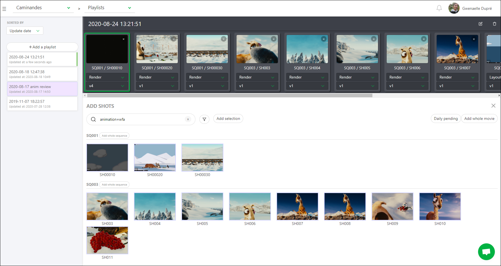

## Daily & Weekly review

For your dailies or weeklies, you can create a **Playlist**

### Create a Playlist for your internal review

You can find the **Playlists** page on the drop-down menu.

The **playlist** page is separated into two parts:

- (1) The playlist list where you can **create** a playlist or load an existing one.
- (2) The last created playlists and the last modified playlists

Start by creating a **Playlist**
. Your default name
is the date and the hour. You can change it immediately. You can choose if the playlist
will be shared with the **studio** or the **client** and if it's a **shot** or **asset** playlist.
You can also add a **Task Type** tag to the playlist.

Once the playlist is created, via the search/filter bar, you can select which shots to add
to your playlist.

You can also choose to **add the whole movie**, and it will add all the shots of the movie.

You can select **Daily pending**, which will add all the **WFA** tasks of the day.

Otherwise, you can **Add the whole sequence** if you want to focus only on a particular sequence.

You can use the same **filter** than on the global shot/asset page. For example, you can select all the
WFA is short for the animation stage.
You have to type **animation=wfa** in the search bar. Valid your selection with the **Add selection** button.
Kitsu will select the shots with the **WFA** status at the **Animation** stage. Still, Kitsu will automatically load **the latest uploaded version**.

The shots appear on the top part of the screen. Every change are
automatically saved.

## Review and Validations

Once you have created a playlist, you have several options:

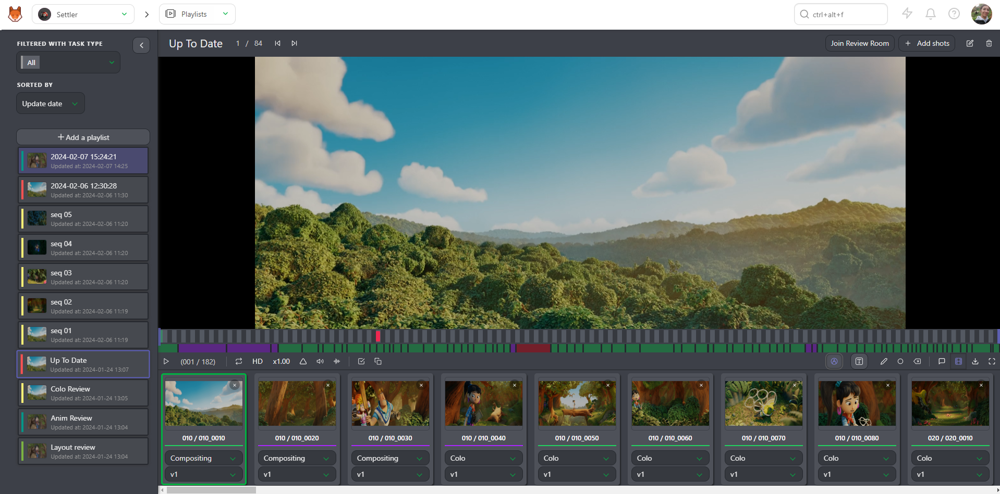

* Play or Pause
* Navigate from element to element
* See the position of the selected element compared to the total number of elements
* Mute or unmute the sound
* Change the speed, double speed (x2), full speed (x1), half of the speed (x0.50), or a quarter of the speed (x0.25)
* Loop on one element
* Display the sound wave
* Display annotations during the play
* TC of the element compared to the TC of the whole playlist
* Number of frames
* Navigate frame per frame on the preview. You can also do it with the arrow on the Keyboard.
* Compare tool

* Undo and Redo option for the drawing comment
* Text and drawing option, and delete selection

* Change the task type of all the elements of the playlist
* Display the comment section
* Hide the elements of the playlist
* Switch between LD (low definition) to HD (High definition)
* Download the playlist as a **Zip** files with all the separated elements, a **.csv** text file, or **Build .mp4** to create the whole movie (only for shots)
* Fullscreen

For each playlisted shot/asset, you can choose the **task** and the
**version** you want to see.

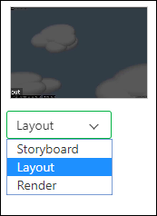
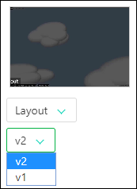

You can also play two tasks of a shot side by side.

Click on the **Compare** button 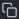 and choose the second task type.

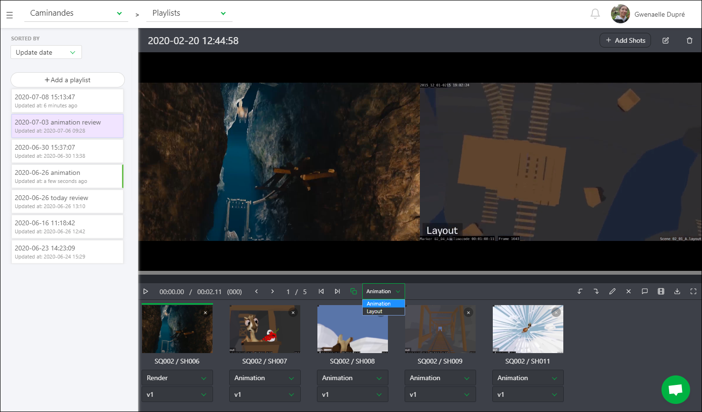

The primary purpose of the playlist is to help you review the shots and assets.

You can comment on the shots directly from the preview.

Click on the **comment** button.

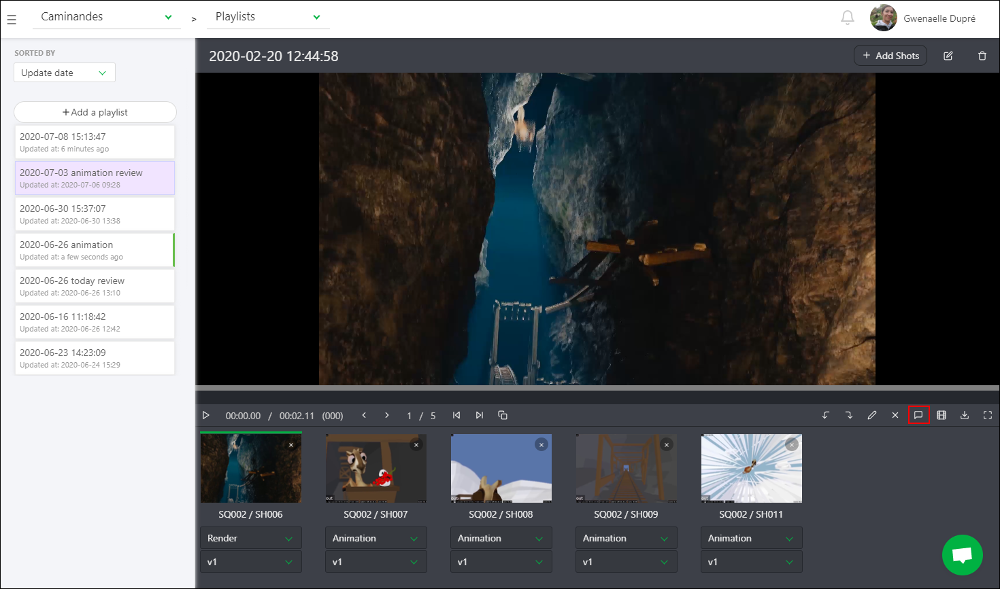

You now have access to the right panel, which has a history of the comments and their status.

You can see the drawing comment on the video (the red dot below the timeline).

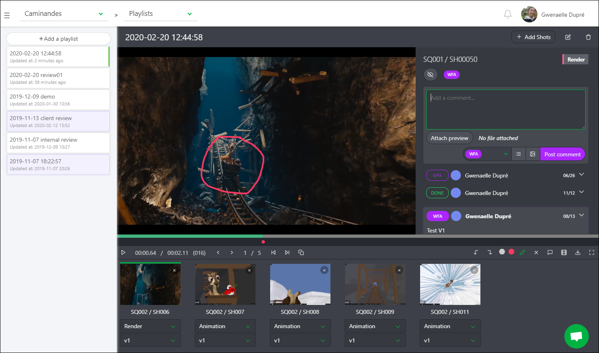

You can draw or type on the video with the **draw** button 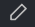

## Review Controls

Once you have created a playlist, you have several options:

* Play or Pause
* Jump between elements in your playlist
* See the position of the selected element compared to the total number of elements
* Mute or unmute the audio
* Change the speed: double speed (x2), full speed (x1), half speed (x0.50), or quarter speed (x0.25)
* Continuously loop a single element
* Display audio waveforms
* Display annotations during playback
* Show timecode (TC) of the element compared to the TC of the whole playlist
* Display the number of frames
* Navigate frame by frame on the preview (you can also use the left & right arrow keys on the keyboard)
* Access the cmpare tool

* Undo and redo options annotations
* Text and drawing options (including delete selection)

* Change the task type of all the elements in the playlist
* Display the comments section
* Hide elements in the playlist
* Switch between LD (low definition) and HD (high definition)
* Download the playlist as a **Zip** file with all the separate elements, a **.csv** text file, or **Build .mp4** to create the whole movie (only for shots)
* Enter fullscreen mode

For each shot/asset in the playlist, you can choose the **task** and the **version** you want to see.

You can also play two tasks of a shot side by side.

Click on the **Compare** button  and choose the second task type.

You can comment on the shots directly from the preview.

Click on the **comment** button.

You now have access to the right panel, which shows a history of the comments and their statuses.

You can see the drawing comment on the video (the red dot below the timeline).

You can draw or type on the video (similar to [Perform a review](../../../status-publish-review/index.md#perform-a-review)) using the **draw** button .

## Review Room

The Review Room is a collaborative space designed for efficient and synchronized dailies review sessions. It ensures that all participants are viewing the same content simultaneously, facilitating real-time feedback and discussion.

To learn more about the Review Room, [visit this section here](../../../playlist-client/index.md#review-room).

## See your Playlists

The central part for you, on **Kitsu**, is the **Playlist** page.
You can access it by clicking on the production avatar.

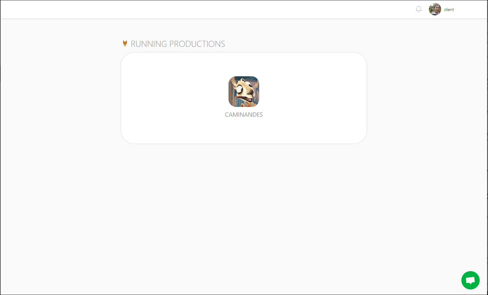

Once you have clicked on the production avatar, you will go to the **Playlist** page.

The playlists will gather all the assets and shots you have to comment on.

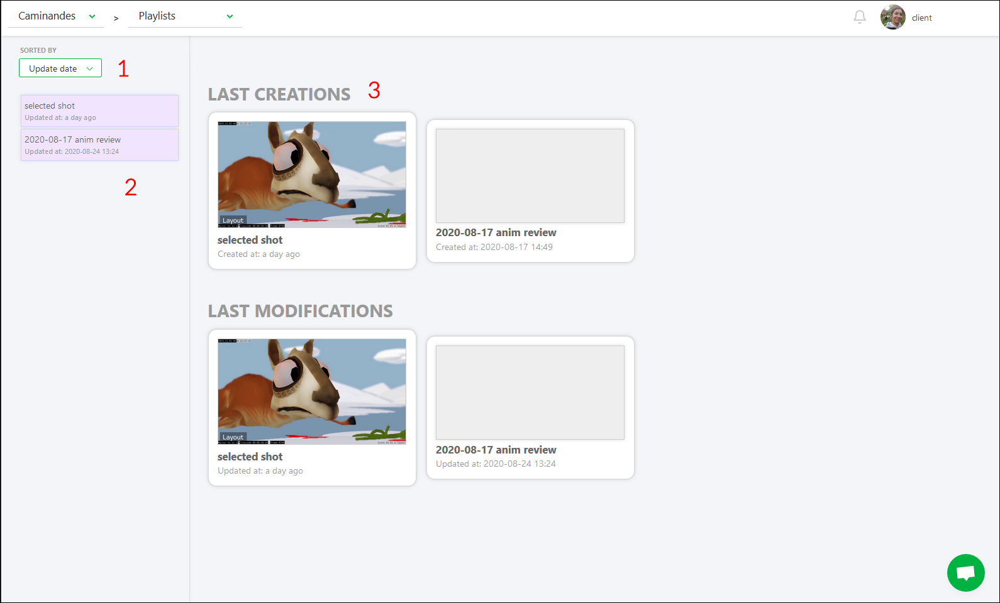

On the left part, you can sort the playlist per **Task Type**, **date**, or per **name** (1), then the list of the playlists created for you (2). On the center part, you have fast access to the recent playlist (3).

### Detail of the Playlist

On the left part, you keep access to the different playlists. In the center part, you see the different elements of the selected playlist. It can be assets or shots. On the right part, you have access to the comment section.

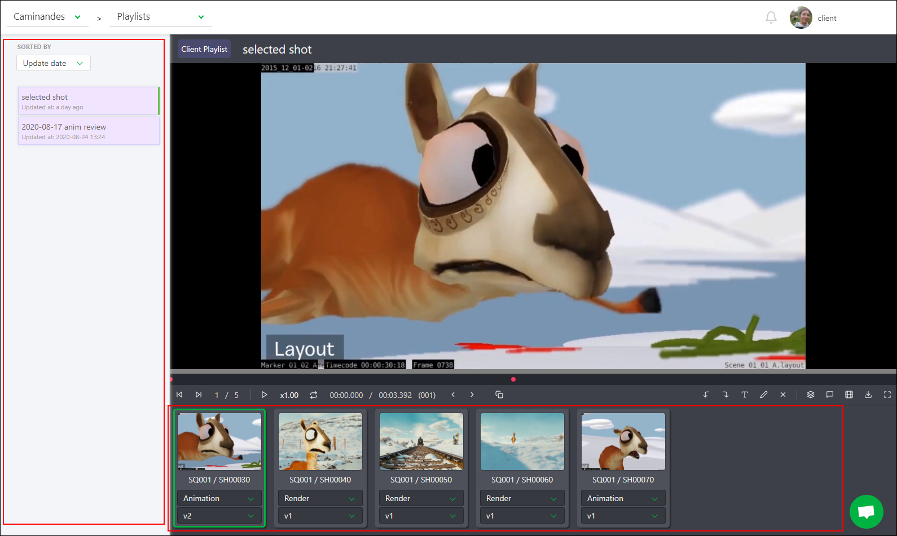

With the comment panel, you will be able to write a comment to approve the preview.

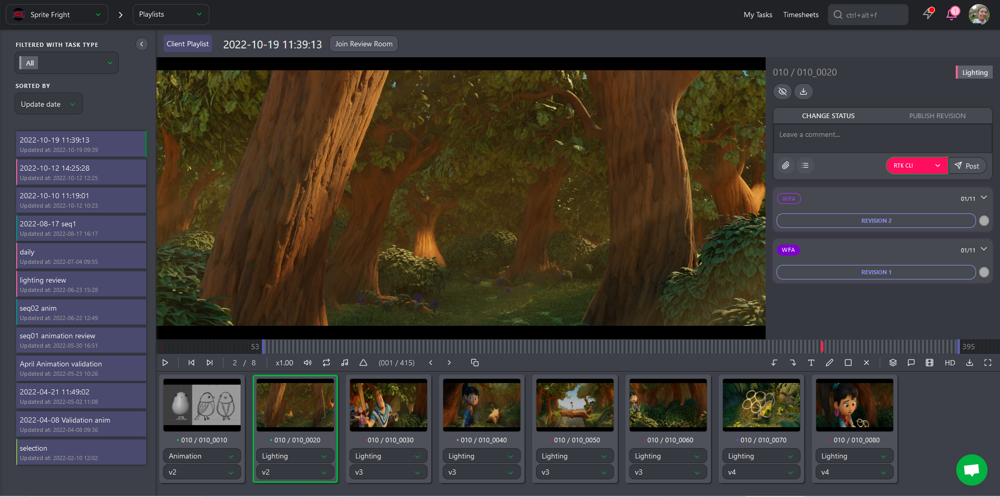

On top of the elements (assets or shots), you have access to different options:

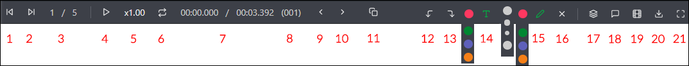

* (1) Previous shot / asset
*(2) Next shot / asset
* (3) the position of the element
* (4) the play and pause button
* (5) You can change the speed: x1..0, x0.50 or x0.25
* (6) loop the selected shot
* (7) Actual time code / global time code of the shot
* (8) Actual frame
* (9) Previous frame
* (10) Next frame
* (11) Split screen: You can compare two task types side by side
* (12) Undo annotation
* (13) Redo annotation
* (14) Write a comment on the picture, and change the color of the text
* (15) Draw a comment on the picture, and change the color and the size of the line
* (16) Select the drawing and click on the cross to delete it
* (17) Change the task type of all the elements in the playlist
* (18) Open the panel section to post a comment and change the status
* (19) Hide the list of the elements
* (20) Download the playlist
* (21) Fullscreen

## Share your Comments

First open the comment section. 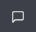

From there, you can change the status to 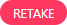 if you want that the Artist
performs some changes.

You can add a **checklist** to your comments.

You need to click on the **Add checklist** button, and the first item of the checklist appears.

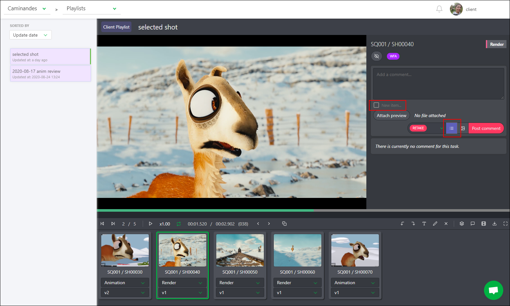

Type your comments, and hit **Enter** key to add another line to your checklist, or click again on **Add Checklist** button.

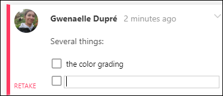